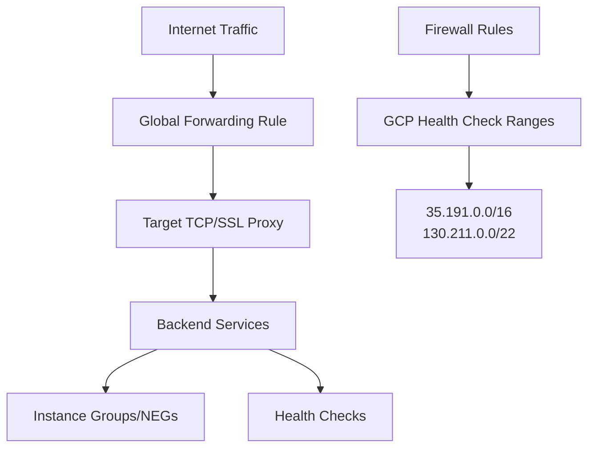

# Session 050: Creating External Proxy Network Load Balancer - Part 1

## Table of Contents
- [Overview](#overview)
- [Load Balancing Fundamentals](#load-balancing-fundamentals)
- [Proxy Network Load Balancer Overview](#proxy-network-load-balancer-overview)
- [Supported Backends and Types](#supported-backends-and-types)
- [Architecture Deep Dive](#architecture-deep-dive)
- [Key Features](#key-features)
- [Demo: Creating SSL Proxy Load Balancer](#demo-creating-ssl-proxy-load-balancer)
- [Demo: Creating TCP Proxy Load Balancer](#demo-creating-tcp-proxy-load-balancer)
- [Firewall Rules Configuration](#firewall-rules-configuration)
- [Monitoring and Health Checks](#monitoring-and-health-checks)
- [Summary](#summary)

## Overview

This session focuses on Layer 4 proxy Network Load Balancers in Google Cloud Platform (GCP), specifically external proxy load balancers that operate at the Transport layer (Layer 4) of the OSI model. Unlike Application Load Balancers that work at Layer 7, these load balancers distribute TCP and UDP traffic while maintaining connection persistence. The video demonstrates the creation and configuration of both SSL Proxy and TCP Proxy load balancers, including backend configuration, health checks, and firewall rules setup.

### Key Concepts/Deep Dive

#### Load Balancing Fundamentals

Load balancing is the practice of distributing network traffic across multiple servers to ensure high availability, scalability, and optimal resource utilization. In GCP, load balancers route user requests to the most suitable backend instance based on configured rules and health status.

**Core Components of Load Balancing:**
- **Routing Algorithms**: Round-robin, least connections, IP hash, etc.
- **Health Checks**: Continuous monitoring of backend instances
- **Session Persistence**: Maintaining user sessions with specific backends
- **Auto-scaling Integration**: Dynamic adjustment of capacity

**Layer 4 vs Layer 7 Load Balancing:**

| Aspect | Layer 4 Load Balancing | Layer 7 Load Balancing |
|--------|------------------------|------------------------|
| OSI Layer | Transport (TCP/UDP) | Application (HTTP/HTTPS) |
| Traffic Understanding | IP addresses and ports | Request content, headers |
| Performance | Higher throughput | Content-aware routing |
| Use Cases | Database connections, gaming | Web applications, API routing |

#### Proxy Network Load Balancer Overview

Proxy Network Load Balancers in GCP are Layer 4 load balancing solutions that terminate client connections and establish new connections to backend instances. This proxy mechanism provides enhanced security and traffic management capabilities.

**Two Primary Types:**
1. **SSL Proxy Load Balancer**: Terminates SSL/TLS connections while distributing TCP traffic
2. **TCP Proxy Load Balancer**: Distributes TCP traffic without SSL termination

**Key Characteristics:**
- Global distribution with anycast IP addresses
- Support for cross-region load balancing
- Premium tier networking requirements (regional versions available)
- Extensive backend compatibility (Compute Engine, GKE, hybrid environments)

### Supported Backends and Types

The external proxy Network Load Balancer supports various backend configurations:

**Primary Backend Types:**
- **Instance Groups**: Managed and unmanaged groups of VM instances
- **Zonal NEGs (Network Endpoint Groups)**: For GKE clusters and serverless backends
- **Hybrid Connectivity**: Support for other cloud providers and on-premises environments

**Backend Support Matrix:**

| Backend Type | TCP Proxy | SSL Proxy | Regional TCP | Internal TCP |
|--------------|-----------|-----------|--------------|--------------|  
| Instance Groups | ✅ | ✅ | ✅ | ✅ |
| Zonal NEGs | ✅ | ✅ | ✅ | ❌ |
| Serverless NEGs | ✅ | ❌ | ✅ | ❌ |
| Cloud Interconnect | ✅ | ❌ | ✅ | ❌ |
| Private Service Connect | ❌ | ❌ | ❌ | ❌ |

### Architecture Deep Dive

The architecture follows a hierarchical structure:



**Component Breakdown:**
1. **Global Forwarding Rule**: Defines the load balancer's IP and port configuration
2. **Target Proxy**: Handles traffic routing logic and SSL termination (for SSL proxy)
3. **Backend Services**: Define load balancing behavior and backend selection
4. **Health Checks**: Ensure backend availability and performance
5. **Firewall Rules**: Restrict access and allow health check traffic

### Key Features

#### Connectivity and Protocol Support
- **IPv4/IPv6 Dual Stack**: Full support for modern IP addressing
- **TCP Port Flexibility**: Configurable single port (1-65535) or HTTPS default
- **SSL/TLS Integration**: Certificate management, SSL policies, and custom profiles
- **Cloud Armor**: Advanced security through web application firewall integration

#### Geographic and Performance Features  
- **Regional Load Balancing**: Traffic routing to nearest healthy backends
- **Session Affinity**: Client IP-based persistence across requests
- **Connection Draining**: Graceful handling of existing connections during scaling
- **Load Balancing Policies**: Advanced algorithms beyond simple round-robin

## Demo: Creating SSL Proxy Load Balancer

This demo walks through creating a global SSL Proxy Load Balancer with multiple backend regions.

### Prerequisites
1. Two instance groups (us-central1 and us-east1) with SSL-enabled backends
2. Startup script for Apache web service on port 443:

```bash
#!/bin/bash
apt-get update
apt-get install -y apache2
hostname > /var/www/html/index.html
service apache2 start
```

### Step-by-Step Configuration

1. **Navigate to Load Balancing in GCP Console**
   - Go to Network Services → Load Balancing
   - Click "Create load balancer"

2. **Initial Configuration**
   - Network load balancer (not application)
   - Network Service Tier: Premium
   - Traffic type: Internet facing
   - Load balancer type: Multiple regions
   - Load balancer generation: Advanced (recommended over Classic)

3. **Backend Configuration**
   - Backend type: Instance group
   - Protocol: SSL
   - Named port: ssl (automatically maps to port 443)
   
   **Add Backend Services:**
   ```yaml
   # Backend Configuration
   - Backend: us-central1-instance-group
     Balancing mode: Utilization
     Port: 443
   - Backend: us-east1-instance-group  
     Balancing mode: Utilization
     Port: 443
   ```

4. **Health Check Setup**
   ```yaml
   # SSL Health Check Configuration
   name: ssl-health-check
   protocol: SSL
   port: 443
   check_interval: 10s  # Default
   timeout: 5s         # Default
   unhealthy_threshold: 2  # Default
   healthy_threshold: 2    # Default
   ```

5. **Advanced Backend Options**
   - Session affinity: None (or Client IP for persistence)
   - Connection draining timeout: 300 seconds
   - Enable logging: Yes (advanced feature)
   - Load balancing policy: Round Robin (default) or Least requests

6. **Frontend Configuration**
   ```yaml
   # Frontend Configuration
   name: ssl-frontend
   protocol: SSL
   network_tier: Premium
   ip_version: IPv4
   ip_address: [Reserved static IP]
   port: 443
   certificate: [SSL certificate]
   ssl_policy: [Custom or default]
   proxy_protocol: Off
   ```

7. **Firewall Rules Creation**
   ```yaml
   # Health Check Firewall Rules
   name: allow-health-checks
   network: default
   priority: 1000
   direction: Ingress
   action: Allow
   target: all-instances-in-network
   source_ranges:
     - 35.191.0.0/16
     - 130.211.0.0/22
   protocols: tcp:443
   ```

8. **Verification Steps**
   ```bash
   # Test from client VM
   curl https://[load-balancer-domain-or-ip]:443
   # Should return hostname of backend instance
   ```

## Demo: Creating TCP Proxy Load Balancer  

This demo demonstrates TCP Proxy Load Balancer configuration for non-SSL TCP traffic.

### Prerequisites
1. Instance groups configured for TCP port 110
2. Startup script for Apache on port 110:

```bash
#!/bin/bash
apt-get update  
apt-get install -y apache2
echo "Listen 110" >> /etc/apache2/ports.conf
hostname > /var/www/html/index.html
service apache2 start
```

### Configuration Steps

**Backend Setup:**
```yaml
# TCP Backend Configuration
- Backend type: Instance group  
- Protocol: TCP
- Named port: tcp (port 110)
- Balancing mode: Utilization
- Health check: TCP on port 110
```

**Frontend Setup:**
```yaml
# TCP Frontend Configuration  
name: tcp-frontend
protocol: TCP
network_tier: Premium  
ip_version: IPv4
port: 110
proxy_protocol: Off
```

**Testing Commands:**
```bash
# From test VM
curl -v http://[load-balancer-ip]:110
# Expect backend hostname response
```

## Firewall Rules Configuration

Critical for load balancer operation and security:

**Health Check Ranges (Google Cloud):**
- `35.191.0.0/16`  
- `130.211.0.0/22`

**Key Considerations:**
- Rules must allow health check traffic to backend ports
- Traffic source ranges are Google-managed and change over time
- Separate rules may be needed for different load balancer ports
- Target all instances or use specific tags for security

## Monitoring and Health Checks

**Health Check Configuration:**
- Protocol matching backend service (TCP/SSL)
- Appropriate port numbers
- Timeout and interval settings based on application response times

**Advanced Monitoring:**
- Backend instance health status in GCP Console
- Load balancer metrics and logs (available in Advanced tier)
- Traffic distribution verification through backend responses

## Summary

### Key Takeaways

```diff
+ Layer 4 Proxy Load Balancers terminate connections and create new ones to backends, unlike Layer 7 Application Load Balancers
+ Supports global distribution with anycast IP addresses, routing traffic to nearest healthy backends
+ Premium tier networking required for global external load balancers
+ Backend compatibility includes Compute Engine instance groups, GKE clusters, and hybrid environments
+ Advanced features like logging and custom load balancing policies available in Advanced tier
+ Firewall rules must permit specific GCP health check ranges to enable backend monitoring
- Classic tier lacks advanced features like custom logging and load balancing policies  
- Preview status means not suitable for production environments
! Always test firewall configurations before expecting health checks to pass
```

### Quick Reference

**SSL Proxy Load Balancer Setup:**
```bash
# Basic gcloud command structure
gcloud compute ssl-certificates create CERT_NAME --certificate CERT_FILE --private-key KEY_FILE
gcloud compute target-ssl-proxies create PROXY_NAME --ssl-certificates CERT_NAME --backend-services BACKEND_NAMES
gcloud compute forwarding-rules create RULE_NAME --target-ssl-proxy PROXY_NAME --ports 443 --global
```

**TCP Proxy Load Balancer Setup:**
```bash  
gcloud compute target-tcp-proxies create PROXY_NAME --backend-services BACKEND_NAMES
gcloud compute forwarding-rules create RULE_NAME --target-tcp-proxy PROXY_NAME --ports 110 --global
```

**Essential Firewall Rules:**
- Allow `35.191.0.0/16` and `130.211.0.0/22` for health check traffic
- Specify exact ports (e.g., 443 for SSL, 110 for custom TCP)

### Expert Insight

**Real-world Application:**
Proxy Network Load Balancers excel in high-throughput scenarios like gaming servers, database connection pooling, and TCP-based APIs where Layer 7 analysis isn't required. The global anycast IP ensures minimal latency by routing to the closest healthy backend, ideal for worldwide distributed applications.

**Expert Path:**  
Master load balancer selection by understanding your traffic patterns:
- Use TCP Proxy for pure Layer 4 needs (no SSL termination required)
- Choose SSL Proxy when you need global SSL termination and Layer 4 distribution
- Consider regional load balancers for reduced costs when global distribution isn't needed
- Implement comprehensive health checks reflecting your application's true health metrics

**Common Pitfalls:**
- Forgetting firewall rules for health check ranges causes all backends to appear unhealthy
- Exceeding backend capacity without proper auto-scaling configuration
- Not accounting for SSL certificate renewal in automation pipelines
- Mixing advanced features without understanding implications (logging costs, policy complexity)
- Assuming classic and advanced tiers are fully compatible - always prefer advanced tier for new deployments
