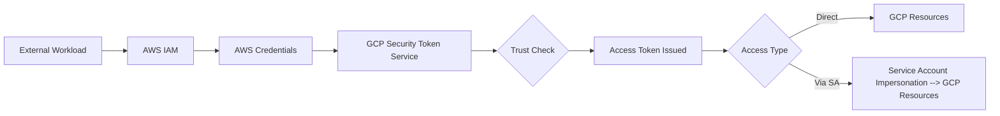

# Session 61: Working with Workload Identity Federation GCP with AWS - Part 1

<details open>
<summary><b>Working with Workload Identity Federation GCP with AWS - Part 1 (KK-CS45-script-v3)</b></summary>

## Table of Contents
- [Overview](#overview)
- [What is Workload Identity Federation?](#what-is-workload-identity-federation)
- [Problems with Service Account Keys](#problems-with-service-account-keys)
- [How Workload Identity Federation Works](#how-workload-identity-federation-works)
- [Setting Up Workload Identity Federation](#setting-up-workload-identity-federation)
- [Creating Identity Pools](#creating-identity-pools)
- [Configuring AWS Provider](#configuring-aws-provider)
- [Granting Access to Resources](#granting-access-to-resources)
- [Direct Resource Access](#direct-resource-access)
- [Service Account Impersonation](#service-account-impersonation)
- [Demo: Hands-on Implementation](#demo-hands-on-implementation)
- [Summary](#summary)

## Overview
Workload Identity Federation (WIF) enables secure access to Google Cloud resources from external workload identities without using service account keys. This session demonstrates WIF with AWS workloads, showing both direct resource access and service account impersonation patterns. The main objectives are to eliminate credential management risks while maintaining security and providing granular access control.

## What is Workload Identity Federation?
Workload Identity Federation provides a keyless authentication mechanism for calling Google Cloud APIs from external workloads. It uses federated identities instead of service account keys to authenticate and authorize access to Google Cloud resources.

### Key Benefits
- **Enhanced Security**: Eliminates risks associated with long-lived service account keys
- **Multi-cloud Support**: Works with AWS, GitHub, GitLab, and any OpenID Connect or SAML identity provider
- **Granular Control**: Enables precise access control based on workload identity attributes
- **Principal Verification**: Ensures requests come from authenticated, trusted workloads

## Problems with Service Account Keys
Traditional service account keys present significant security risks:

- **No Source Verification**: Cannot authenticate that requests originate from intended applications
- **Expiration Issues**: Keys don't expire and lack tracking capabilities
- **Broad Exposure Risk**: If compromised, provide unrestricted access to resources
- **Management Complexity**: Difficult to control and rotate credentials across distributed applications

## How Workload Identity Federation Works

### Authentication Flow
1. **Identity Provider Authentication**: Workload authenticates with its native identity provider (e.g., AWS IAM)
2. **Credential Exchange**: Workloads receive identity provider credentials
3. **STS Exchange**: Credentials are exchanged with Google Cloud Security Token Service for short-lived GCP access tokens
4. **Resource Access**: Token enables access to Google Cloud resources directly or via service account impersonation

### Security Model


## Setting Up Workload Identity Federation

### Prerequisites
- Google Cloud Project with IAM permissions
- AWS account with EC2 instances or IAM roles
- Google Cloud SDK installed on workloads

## Creating Identity Pools

Workload Identity Pools organize and manage external identities, establishing trust relationships between identity providers and GCP projects.

### Pool Creation Steps
1. Navigate to IAM & Admin → Workload Identity Federation
2. Click "Create Pool"
3. Provide pool name and description
4. Enable/disable pool state
5. Continue to provider configuration

### Provider Configuration
For AWS provider:
- Select "AWS" as provider type
- Enter provider display name
- Provide your 12-digit AWS Account ID
- Configure attribute mappings

### Attribute Mappings
Attribute mappings help verify workload identity by extracting claims from IDP tokens:

```json
{
  "AWS Role": "aws_role",
  "AWS Instance ID": "aws_instance_id", 
  "AWS Username": "aws_username"
}
```

## Configuring AWS Provider

### Trust Configuration
The configuration establishes one-way trust between AWS and GCP:

- GCP trusts AWS as an identity provider
- AWS account ID serves as trust anchor
- Attribute conditions can limit access scope

### Attribute Conditions
Optional CEL expressions for fine-grained control:

```cel
// Allow only specific instance
attribute.aws_instance_id == "i-1234567890abcdef0"

// Allow only specific role
attribute.aws_role == "arn:aws:iam::123456789012:role/MyRole"
```

## Granting Access to Resources

### Two Access Patterns

1. **Direct Resource Access**: Grant permission to external identities directly
2. **Service Account Impersonation**: Workloads impersonate GCP service accounts

### Principal Format Examples

#### Direct Access
```
principal://iam.googleapis.com/projects/PROJECT_NUMBER/locations/global/workloadIdentityPools/POOL_NAME/subject/EXTERNAL_ID
```

#### Service Account Impersonation
```
principal://iam.googleapis.com/projects/PROJECT_NUMBER/locations/global/workloadIdentityPools/POOL_NAME/subject/EXTERNAL_ID
```

## Direct Resource Access

### IAM Policy Grant
Assign roles directly to workload identities using IAM policies:

```yaml
resource: "projects/YOUR_PROJECT"
policy:
  bindings:
  - role: "roles/compute.admin"
    members:
    - "principal://iam.googleapis.com/projects/PROJECT_NUMBER/locations/global/workloadIdentityPools/aws-pool/attribute.aws_role/MY_ROLE"
```

### Download Configuration File
After granting access, download the workload identity configuration:

```json
{
  "type": "external_account",
  "audience": "//iam.googleapis.com/projects/PROJECT_NUMBER/locations/global/workloadIdentityPools/aws-pool/providers/aws-provider",
  "subject_token_type": "urn:ietf:params:aws:token-type:aws4_request",
  "token_url": "https://sts.googleapis.com/v1/token",
  "credential_source": {
    "environment_id": "aws1",
    "region_url": "http://169.254.169.254/latest/meta-data/placement/availability-zone",
    "url": "http://169.254.169.254/latest/meta-data/iam/security-credentials",
    "regional_cred_verification_url": "https://sts.{region}.amazonaws.com?Action=GetCallerIdentity&Version=2011-06-15"
  }
}
```

### Authentication Commands

```bash
# Authenticate using workload identity
gcloud auth login --cred-file=credential.json

# Set project
gcloud config set project YOUR_PROJECT_ID

# Test access
gcloud compute instances list
gcloud compute networks list
```

## Service Account Impersonation

### Setup Steps
1. Create workload identity pool grant for service account
2. Assign Workload Identity User role to external identities
3. Provide service account permissions via IAM policies
4. Generate new configuration file for impersonation

### Configuration File Changes
When using service account impersonation, the file includes:

```json
{
  "type": "external_account",
  "audience": "//iam.googleapis.com/projects/PROJECT_NUMBER/locations/global/workloadIdentityPools/aws-pool/providers/aws-provider",
  "subject_token_type": "urn:ietf:params:aws:token-type:aws4_request", 
  "token_url": "https://sts.googleapis.com/v1/token",
  "service_account_impersonation_url": "https://iamcredentials.googleapis.com/v1/projects/-/serviceAccounts/test-service-account@your-project.iam.gserviceaccount.com:generateAccessToken",
  "credential_source": {
    "environment_id": "aws1",
    "region_url": "http://169.254.169.254/latest/meta-data/placement/availability-zone", 
    "url": "http://169.254.169.254/latest/meta-data/iam/security-credentials",
    "regional_cred_verification_url": "https://sts.{region}.amazonaws.com?Action=GetCallerIdentity&Version=2011-06-15"
  }
}
```

### Required Roles
```yaml
# Allow impersonation of service account
serviceAccount:
  - role: "roles/iam.workloadIdentityUser"
    members:
    - "principal://iam.googleapis.com/projects/PROJECT_NUMBER/locations/global/workloadIdentityPools/aws-pool/attribute.aws_role/MY_ROLE"

# Permissions for GCS access
serviceAccount:
  - role: "roles/storage.admin" 
    members:
    - "serviceAccount:test-service-account@your-project.iam.gserviceaccount.com"
```

## Demo: Hands-on Implementation

### Lab Environment Setup

#### AWS Resources Created
- EC2 instance "my-vm1" with IAM role "ecs-role"
- EC2 instance "my-vm2" without assigned role
- IAM role with required AWS permissions

#### GCP Resources Created  
- Workload identity pool "aws-pool"
- AWS provider configuration with account ID
- Attribute mappings for role and instance filters

### Direct Resource Access Demo

#### IAM Policy Assignment
```yaml
# Grant compute admin to specific role
role: "roles/compute.admin"
principals:
  - "principal://iam.googleapis.com/projects/[PROJECT_NUMBER]/locations/global/workloadIdentityPools/aws-pool/attribute.aws_role/ecs-role"
  
role: "roles/compute.networkAdmin" 
principals:
  - "principal://iam.googleapis.com/projects/[PROJECT_NUMBER]/locations/global/workloadIdentityPools/aws-pool/attribute.aws_role/ecs-role"
```

#### Testing Access

```bash
# On my-vm1 (with role assigned)
gcloud auth login --cred-file=credential.json

# Set project context
gcloud config set project your-project-id

# Verify access
gcloud compute instances list  # SUCCESS
gcloud compute networks list   # SUCCESS
```

```bash
# On my-vm2 (without role assignment)  
gcloud auth login --cred-file=credential.json

# Attempt access
gcloud compute instances list  # ACCESS DENIED
```

### Service Account Impersonation Demo

#### Setup Service Account Impersonation
1. Grant service account impersonation permission
2. Assign Workload Identity User role 
3. Download new configuration file

#### Test Commands

```bash
# Re-authenticate with impersonation config
gcloud auth login --cred-file=impersonation-credential.json

# Verify service account context
gcloud config list  # Shows test-service-account

# Test compute permissions
gcloud compute instances list  # SUCCESS

# Test storage access after granting permissions
gsutil ls  # SUCCESS - shows buckets
```

### Troubleshooting Common Issues

#### Instance Metadata Error
> Error: unable to configure AWS region

**Solution**: Modify EC2 instance metadata options
- Navigate to EC2 → Instances → Actions → Instance Settings → Modify Instance Metadata
- Change "Instance Metadata service" from "Required" to "Optional"

#### Authentication Flow Errors  
```bash
# Check metadata service accessibility
curl http://169.254.169.254/latest/meta-data/

# Verify IAM role assignment
curl http://169.254.169.254/latest/meta-data/iam/security-credentials/
```

## Summary

### Key Takeaways
```diff
+ ELIMINATES SERVICE ACCOUNT KEYS: No more long-lived credentials to manage or secure
+ ENHANCES SECURITY: Verifies request origin and provides short-lived tokens 
+ MULTI-CLOUD CAPABLE: Works across different cloud providers and systems
+ FLEXIBLE ACCESS PATTERNS: Direct resource access or service account impersonation
- REQUIRES PROPER CONFIGURATION: Identity pools and attribute mappings must be configured correctly
- DEPENDS ON EXTERNAL IDP: Trust model relies on external identity provider reliability
! ATTRIBUTE-BASED CONTROL: Use granular attributes for fine-grained access control
```

### Quick Reference

#### Key Commands
```bash
# Authenticate workload identity
gcloud auth login --cred-file=credential.json

# Set GCP project  
gcloud config set project PROJECT_ID

# Test compute access
gcloud compute instances list

# Test storage access  
gsutil ls
```

#### Principal Format Templates
```yaml
# Direct resource access
principal://iam.googleapis.com/projects/PROJECT_NUMBER/locations/global/workloadIdentityPools/POOL_NAME/attribute.ATTRIBUTE_NAME/ATTRIBUTE_VALUE

# Service account impersonation  
principal://iam.googleapis.com/projects/PROJECT_NUMBER/locations/global/workloadIdentityPools/POOL_NAME/subject/SUBJECT_ID
```

### Expert Insight

#### **Real-world Application**
Workload Identity Federation excels in multi-cloud architectures where applications need to access resources across different cloud providers. Common use cases include:
- CI/CD pipelines running on AWS but deploying to GCP
- Legacy applications migrating to GCP with zero credential changes
- Multi-cloud data pipelines accessing centralized GCP services

#### **Expert Path**
Master WIF by focusing on these advanced areas:
1. **Fine-grained Attribute Mapping**: Use complex CEL expressions and multiple attributes
2. **Custom Identity Providers**: Implement WIF with GitHub Actions or custom OIDC providers  
3. **Service Account Chaining**: Combine WIF with service account delegation patterns
4. **Conditional Access**: Implement time-based and context-aware access policies

#### **Common Pitfalls**
- **Incorrect Attribute Configuration**: Always verify attribute mapping values against actual tokens
- **Missing Workload Identity User Role**: Service account impersonation requires this IAM binding
- **Instance Metadata Service Issues**: Configure AWS instances to allow metadata access from containers
- **Role Arn Format Issues**: AWS role ARNs must use the correct format with account ID and role name
- **Token Expiration**: STS tokens have short lifetimes requiring automatic renewal

</details>
