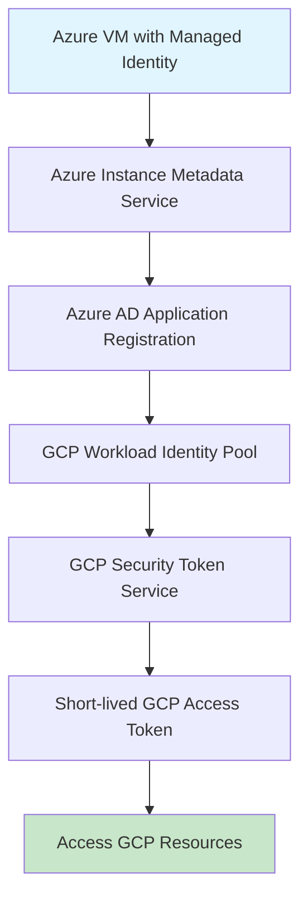

<details open>
<summary><b>Session 62: Working with Workload Identity Federation GCP with Azure - Part 2 (KK-CS45-script-v3)</b></summary>

# Session 62: Working with Workload Identity Federation GCP with Azure - Part 2

## Table of Contents
- [Overview](#overview)
- [Key Concepts and Deep Dive](#key-concepts-and-deep-dive)
  - [Workload Identity Federation vs Service Account Keys](#workload-identity-federation-vs-service-account-keys)
  - [Workload Identity Pool Components](#workload-identity-pool-components)
  - [Azure Integration Architecture](#azure-integration-architecture)
  - [Managed Identities in Azure](#managed-identities-in-azure)
- [Lab Demo: Direct Resource Access](#lab-demo-direct-resource-access)
- [Lab Demo: Service Account Impersonation](#lab-demo-service-account-impersonation)
- [Configuration Blocks](#configuration-blocks)
- [Summary](#summary)

## Overview

This session demonstrates how to configure Workload Identity Federation between Google Cloud Platform (GCP) and Azure, enabling workloads running on Azure to securely access GCP resources without using long-lived service account keys. The session covers both direct access to GCP resources and service account impersonation approaches, with hands-on configuration steps for Azure application registration, managed identities, and workload identity pool setup.

**Learning Objectives:**
- Understand the risks of service account keys and benefits of Workload Identity Federation
- Configure Azure application registration for workload identity federation
- Create and configure workload identity pools with Azure OpenID Connect
- Implement both direct access and service account impersonation patterns
- Attach managed identities to Azure VMs for federated authentication

## Key Concepts and Deep Dive

### Workload Identity Federation vs Service Account Keys

Workload Identity Federation eliminates the security risk associated with managing service account keys by using short-lived tokens instead of long-lived credentials.

**Service Account Key Security Risks:**
- Service account keys are powerful long-lived credentials
- Challenging to rotate and secure properly across multi-cloud environments
- Can become compromised and expose GCP resources if not managed correctly

**Workload Identity Federation Benefits:**
- Uses short-lived tokens that expire automatically
- Eliminates credential storage and rotation concerns
- Enables cross-cloud authentication without key management overhead
- Supports multiple identity providers (AWS, Azure, SAML, OpenID Connect)

### Workload Identity Pool Components

A workload identity pool acts as a trust boundary for external identities, validating credentials from external identity providers before issuing GCP tokens.

**Pool Configuration Elements:**
- **Pool Name**: Descriptive identifier for the federation configuration
- **Identity Provider**: External platform (Azure, AWS, etc.) providing credentials
- **Issuer URL**: Endpoint from which identity provider issues tokens
- **Audience**: Application ID URI that specifies intended recipients of tokens
- **Attributes**: Claims from external identity provider used for IAM conditions

**Provider-Specific Configuration:**
For Azure integration using OpenID Connect:
- Issuer URL: `https://login.microsoftonline.com/{tenant-id}/v2.0`
- Audience: Application ID URI registered in Azure AD
- Supported Attribute: `assertion.subject` (contains managed identity principal)

### Azure Integration Architecture

The federation flow between Azure and GCP involves several components working together to enable secure cross-cloud access.



**Authentication Flow:**
1. Azure VM requests access to GCP resources
2. VM uses managed identity to request token from Azure Instance Metadata Service
3. Azure validates managed identity and issues credential containing subject claim
4. Workload identity pool validates Azure credentials against configured provider settings
5. Upon validation, GCP Security Token Service issues short-lived access token
6. VM can now access GCP resources or impersonate service accounts

### Managed Identities in Azure

Managed identities eliminate the need for developers to manage credentials by providing Azure resources with an automatically managed identity in Azure Active Directory.

**Key Characteristics:**
- Two types: System-assigned (tied to resource lifecycle) and User-assigned (independent resources)
- Created per VM instance and automatically managed by Azure
- Used by applications to request access tokens from Azure Instance Metadata Service
- Principal subject in JWT tokens exchanged with GCP for federation

**Azure AD Application Registration:**
- Required for workload identity federation with GCP
- Provides Application ID URI used as audience in OpenID Connect flow
- Enables Azure AD to issue tokens that can be validated by GCP workload identity pools

## Lab Demo: Direct Resource Access

This demonstration shows how to configure direct access to GCP resources from an Azure VM using workload identity federation.

### Step 1: Create Workload Identity Pool
```bash
# Create pool in GCP Console
Name: azure-wif-pool
Description: Workload Identity Federation with Azure
Enabled: true
```

### Step 2: Configure Azure OpenID Connect Provider
```yaml
Provider Name: azure-oidc-provider
Issuer URL: https://login.microsoftonline.com/{tenant-id}/v2.0
Allowed Audiences: https://api://{application-id-uri}
Attribute Mapping: google.subject=assertion.subject
```

### Step 3: Create Azure AD Application Registration
1. Navigate to Azure App Registrations
2. Create new registration: `wif-application`
3. Set supported account types: Single tenant
4. Add Application ID URI: `api://wif-app-uri`

### Step 4: Create Azure Managed Identity
```bash
# In Azure Portal
Resource: Resource Group (West US)
Name: wif-managed-identity
Type: User-assigned managed identity
```

### Step 5: Attach Managed Identity to VM
```bash
# In Azure VM configuration
Identity > User assigned > Add managed identity
Select: wif-managed-identity
```

### Step 6: Grant IAM Permissions
```bash
# In GCP Console IAM
Principal: wif-managed-identity-subject
Role: Compute Admin
```

### Step 7: Download and Configure Credentials
```bash
# Download config file from GCP workload identity pool
# Content structure:
{
  "type": "external_account",
  "audience": "//iam.googleapis.com/projects/project-id/locations/global/workloadIdentityPools/azure-wif-pool/providers/azure-oidc-provider",
  "subject_token_type": "urn:ietf:params:oauth:token-type:jwt",
  "token_url": "https://sts.googleapis.com/v1/token",
  "credential_source": {
    "url": "http://169.254.169.254/metadata/identity/oauth2/token",
    "headers": {
      "Metadata": "true"
    },
    "format": {
      "type": "json",
      "subject_token_field_name": "access_token"
    }
  }
}
```

### Step 8: Authenticate and Test Access
```bash
# Install gcloud CLI on Azure VM
# Create credentials file
cat > credentials.json << EOF
[downloaded-config-content]
EOF

# Authenticate
gcloud auth login --cred-file=credentials.json

# Verify authentication
gcloud config set project your-project-id
gcloud compute networks list
```

## Lab Demo: Service Account Impersonation

This approach uses service account impersonation instead of direct resource permissions, providing additional security layers.

### Step 1: Configure Service Account Impersonation
```bash
# In GCP Workload Identity Pool
Grant access > Service account impersonation
Service account: test-service-account
Attribute condition: attribute.subject==managed-identity-principal
```

### Step 2: Create Workload Identity User Role
```bash
# Grant workload identity user role to service account
gcloud iam service-accounts add-iam-policy-binding test-service-account@project-id.iam.gserviceaccount.com \
    --role roles/iam.workloadIdentityUser \
    --member "principal://iam.googleapis.com/projects/project-id/locations/global/workloadIdentityPools/azure-wif-pool/subject/managed-identity-principal"
```

### Step 3: Grant permissions to Service Account
```bash
# Grant required roles to service account
gcloud projects add-iam-policy-binding project-id \
    --member "serviceAccount:test-service-account@project-id.iam.gserviceaccount.com" \
    --role "roles/compute.admin"
```

### Step 4: Download Configuration for Impersonation
```bash
# Download config from workload identity pool
# Updated config content:
{
  "type": "external_account",
  "audience": "//iam.googleapis.com/projects/project-id/locations/global/workloadIdentityPools/azure-wif-pool/providers/azure-oidc-provider",
  "subject_token_type": "urn:ietf:params:oauth:token-type:jwt",
  "token_url": "https://sts.googleapis.com/v1/token",
  "service_account_impersonation_url": "https://iamcredentials.googleapis.com/v1/projects/-/serviceAccounts/test-service-account@project-id.iam.gserviceaccount.com:generateAccessToken",
  "credential_source": {
    "url": "http://169.254.169.254/metadata/identity/oauth2/token",
    "headers": {
      "Metadata": "true"
    },
    "format": {
      "type": "json",
      "subject_token_field_name": "access_token"
    }
  }
}
```

### Step 5: Verify Impersonation Authentication
```bash
# Authenticate and verify impersonation
gcloud auth login --cred-file=credentials.json

# Check authenticated account
gcloud config list
# Should show: test-service-account@project-id.iam.gserviceaccount.com

# Test permissions
gcloud compute networks list
```

## Configuration Blocks

### Azure Application Registration PowerShell Script
```powershell
# Create Azure AD Application Registration
$applicationName = "wif-application"
$appRegistration = New-AzADApplication -DisplayName $applicationName

# Set Application ID URI
$applicationIdUri = "api://wif-app-uri"
Update-AzADApplication -ObjectId $appRegistration.Id -IdentifierUri $applicationIdUri

# Get Tenant ID for issuer URL
$tenantId = (Get-AzContext).Tenant.Id
$issuerUrl = "https://login.microsoftonline.com/$tenantId/v2.0"
```

### GCP Workload Identity Pool Terraform
```hcl
resource "google_iam_workload_identity_pool" "azure_pool" {
  workload_identity_pool_id = "azure-wif-pool"
  display_name              = "Azure Workload Identity Pool"
  description               = "Federation with Azure managed identities"
  disabled                  = false
}

resource "google_iam_workload_identity_pool_provider" "azure_provider" {
  workload_identity_pool_id          = google_iam_workload_identity_pool.azure_pool.workload_identity_pool_id
  workload_identity_pool_provider_id = "azure-oidc-provider"
  display_name                       = "Azure OIDC Provider"
  
  oidc {
    issuer_uri        = "https://login.microsoftonline.com/${var.azure_tenant_id}/v2.0"
    allowed_audiences = ["api://wif-app-uri"]
  }
  
  attribute_mapping {
    "google.subject" = "assertion.subject"
  }
}

resource "google_service_account_iam_binding" "workload_identity_user" {
  service_account_id = google_service_account.test_service_account.name
  role               = "roles/iam.workloadIdentityUser"
  members            = ["principal://iam.googleapis.com/projects/${var.project_id}/locations/global/workloadIdentityPools/${google_iam_workload_identity_pool.azure_pool.workload_identity_pool_id}/subject/${var.managed_identity_principal}"]
}
```

### Bash Environment Setup
```bash
#!/bin/bash
# WIF Configuration Script for Azure

# Download GCP credentials config
curl -H "Metadata-Flavor: Google" \
     "http://metadata.google.internal/computeMetadata/v1/instance/service-accounts/default/identity?audience=YOUR_AUDIENCE&format=full" \
     -o /etc/gcp/credentials.json

# Set environment variables
export GOOGLE_APPLICATION_CREDENTIALS="/etc/gcp/credentials.json"
export CLOUDSDK_AUTH_CREDENTIAL_FILE_OVERRIDE="/etc/gcp/credentials.json"

# Authenticate gcloud
gcloud auth login --cred-file=/etc/gcp/credentials.json
gcloud config set project YOUR_PROJECT_ID

echo "Workload Identity Federation configured successfully"
```

## Summary

### Key Takeaways
```diff
+ Simplified credential management across multi-cloud environments
+ Enhanced security through short-lived tokens vs long-lived keys
+ Native integration with Azure managed identities and GCP IAM
+ Support for both direct resource access and service account impersonation
+ Elimination of service account key rotation and distribution challenges
- More complex initial setup compared to AWS federation
- Requires Azure AD application registration and managed identity configuration
```

### Quick Reference

**Azure Setup Commands:**
```bash
# Create managed identity
az identity create --name wif-managed-identity --resource-group myRG

# Assign managed identity to VM
az vm identity assign --resource-group myRG --name myVM --identities wif-managed-identity
```

**GCP Authentication:**
```bash
# Authenticate with workload identity
gcloud auth login --cred-file=credentials.json

# Verify authentication
gcloud config list
```

**Common Issues:**
- Ensure Application ID URI matches allowed audiences
- Verify managed identity is attached to VM
- Check correct tenant ID in issuer URL
- Confirm service account has workloadIdentityUser role for impersonation

### Expert Insight

**Real-world Application:**
In production multi-cloud deployments, Workload Identity Federation enables seamless integration between Azure Kubernetes Service (AKS) workloads and GCP services without credential management overhead. Teams can implement least-privilege access by mapping Azure managed identities to specific GCP service accounts with granular IAM roles.

**Expert Path:**
Master the advanced attribute conditions feature to create sophisticated access policies based on Azure metadata like subscription ID, resource group, or VM tags. Implement automated deployment pipelines that configure federation as part of infrastructure-as-code using Terraform or Azure Resource Manager templates.

**Common Pitfalls:**
- Forgetting to grant workloadIdentityUser role to service accounts
- Mismatched audience configuration between Azure app registration and GCP provider
- Using incorrect issuer URL format without v2.0 suffix
- Attempting to use federation with Azure system-assigned identities in multi-subscription scenarios

</details>
