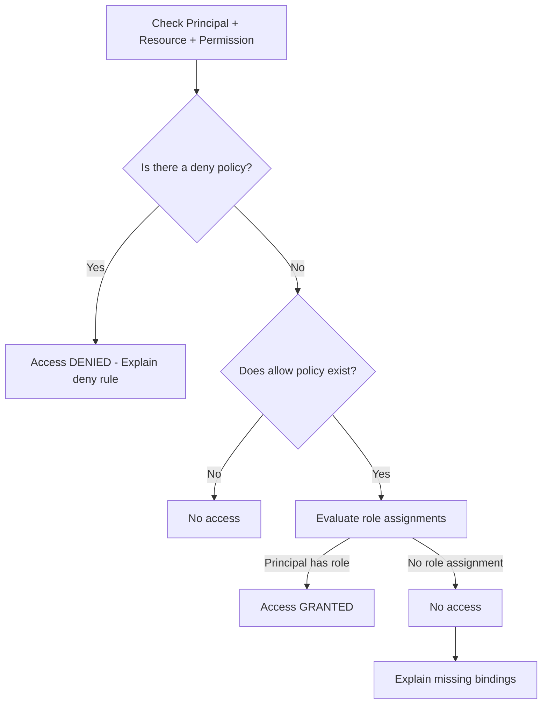

<details open>
<summary><b>066-Policy-Troubleshooter-GCP (KK-CS45-script-v3)</b></summary>

# Session 066: Policy Troubleshooter in GCP

## Table of Contents
- [Overview](#overview)
- [Key Concepts in IAM Policy Troubleshooter](#key-concepts-in-iam-policy-troubleshooter)
- [Permissions Required](#permissions-required)
- [Using Policy Troubleshooter in Console](#using-policy-troubleshooter-in-console)
- [Demonstration: Allow and Deny Policies](#demonstration-allow-and-deny-policies)
- [Checking Multiple Permissions](#checking-multiple-permissions)
- [Limitations](#limitations)
- [Summary](#summary)

## Overview

Policy Troubleshooter is a critical component of GCP's Policy Intelligence suite that helps administrators diagnose why a user has (or doesn't have) access to specific resources or API permissions. Unlike Policy Analyzer (which focuses only on allow policies), Policy Troubleshooter examines both allow and deny policies, providing comprehensive visibility into access control decisions. It evaluates a given principal (user email), resource, and permission to determine access status and explain the reasoning behind it.

This service is essential for troubleshooting complex IAM scenarios where traditional methods fail to provide clear answers about resource access patterns.

## Key Concepts in IAM Policy Troubleshooter

### Why Policy Troubleshooter Exists

In complex GCP environments with hierarchical IAM policies (Organization → Folder → Project), determining effective permissions for a principal can be challenging. Policy Troubleshooter automates this analysis by:

- Examining all applicable allow and deny policies across the hierarchy
- Identifying which policies grant or deny specific permissions
- Explaining the evaluation logic step-by-step

### Allow vs. Deny Policies in Context

**Allow Policies** (covered by Policy Analyzer):
- Grant permissions to principals
- Evaluate from least restrictive (resource) to most restrictive (organization) level
- Use conditions for fine-grained control

**Deny Policies** (unique to Policy Troubleshooter analysis):
- Override allow policies with higher precedence
- Take effect before allow policy evaluation
- Always explicit: if a deny policy matches, access is denied regardless of allow granted earlier

```diff
+ Understanding Precedence: Deny policies have absolute priority over allow policies
- Common Misunderstanding: Allow policies alone can grant access (deny policies can block it)
! Security Best Practice: Use deny policies sparingly and for high-value resources only
```

### Policy Evaluation Flow

Policy Troubleshooter evaluates policies in this order:
1. **Deny Rules**: Check for matching deny policies first
2. **Allow Rules**: If no denies apply, evaluate allow policies
3. **Role Bindings**: Check if principal is directly or indirectly assigned required roles
4. **Conditional Rules**: Evaluate any conditions attached to policies



### Scope Levels Supported

Policy Troubleshooter supports checking access at different organizational levels:

- **Organization Level**: Checks policies across entire organization hierarchy
- **Folder Level**: Evaluates within a specific folder and its descendants
- **Project Level**: Limited to single project scope

The scope selection affects which policies are included in the evaluation.

## Permissions Required

To use Policy Troubleshooter, the caller needs specific IAM permissions:

### Console/UI Access
- `iam.securityReviewer` - Required to examine policy bindings and access
- `roles/deny.reviewer` - Required to inspect deny policies specifically

### CLI Access
- `roles/service.userConsumer` - Required for CLI operations

```diff
+ Security Note: These roles grant read-only access to policy evaluation, not modification privileges
! Access Control: Ensure troubleshooters only get necessary reviewer roles
```

## Using Policy Troubleshooter in Console

### Step-by-Step Console Usage

1. **Navigate to Policy Troubleshooter**:
   - Go to GCP Console → Security → Policy Troubleshooter

2. **Provide Principal Information**:
   - Enter the user's email address
   - This is the identity to evaluate access for

3. **Select Resource**:
   - Click "Browse" to select target resource
   - Supported scopes:
     - Organization
     - Folder  
     - Project
   - Filter by project/folder if needed to narrow scope

4. **Specify Permissions**:
   - Choose individual permissions (e.g., `storage.buckets.delete`)
   - Add multiple permissions for batch evaluation
   - Use predefined permission groups or input custom permissions

5. **Run Evaluation**:
   - Click "Check Access"
   - Results show:
     - Access status (Granted/Denied)
     - Applicable allow policies
     - Applicable deny policies
     - Role bindings affecting access

### Sample Console Workflow for Storage Bucket

```bash
# Example evaluation setup (conceptual, not CLI syntax):
Principal: user@example.com
Resource: projects/my-project/buckets/my-bucket
Permission: storage.buckets.delete
Scope: Project my-project
```

## Demonstration: Allow and Deny Policies

### Testing Allow Policy First

After assigning `roles/storage.admin` to test principal on a project:

- Policy Troubleshooter confirms access granted
- Shows allow policies (role bindings from project level)
- Explains role contains necessary `storage.buckets.delete` permission
- No deny policies blocking access

**Example Output**:
```
Access: GRANTED
Allow Policies Applied: Project "first-project" → roles/storage.admin, roles/storage.objectAdmin
No Deny Policies: ✓ No blocking rules found
```

### Introducing Deny Policy for Override

Created deny policy denying `storage.buckets.delete` for test principal:

```yaml
name: deny-storage-delete
attachmentPoint: projects/my-project
rules:
- principals: 
  - principal: user:test-user@example.com
  permissions:
  - storage.buckets.delete
  denyAll: true
```

**CLI Application**:
```bash
gcloud iam policies create deny-storage-delete \
  --attachment-point=projects/my-project \
  --kind=deny \
  --policy-file=deny-policy.yaml
```

### Post-Deny Evaluation Results

- Access now shows as **DENIED**
- Display both allow (granted) and deny (blocking) policies
- Explain deny rule takes precedence over allow grants

**Key Insight**: Even with `storage.admin` role (which normally allows bucket deletion), the deny policy overrides it completely.

## Checking Multiple Permissions

Policy Troubleshooter supports evaluating multiple permissions simultaneously:

### Example: Checking Both Delete and Create Permissions

```bash
Permissions to Check:
1. storage.buckets.delete
2. storage.objects.create
```

**Results Breakdown**:
- `storage.buckets.delete`: **DENIED** (blocked by deny policy)
- `storage.objects.create`: **GRANTED** (allow policy applies, no deny rule)

This demonstrates granular permission analysis across different resource operations.

## Limitations

Policy Troubleshooter **does not cover**:

- Cloud Storage ACLs (Access Control Lists)
- VPC Service Controls configurations
- Legacy IAM policies outside the IAM framework
- Cross-service entitlements

```diff
! Limitation Alert: For Cloud Storage ACL issues, use gsutil or storage API directly
- Don't rely on Policy Troubleshooter for VPC Service Control debugging
! Best Practice: Combine Policy Troubleshooter results with service-specific tools for complete access analysis
```

## Summary

### Key Takeaways

```diff
+ Essential Tool: Policy Troubleshooter is the definitive way to understand access decisions in GCP IAM
+ Deny-first Evaluation: Deny policies override allow policies with absolute precedence
+ Hierarchical Analysis: Checks policies across organization, folder, and project levels
+ Available Interfaces: Console (easiest), CLI, and API access options
- Permissions Required: Need iam.securityReviewer and roles/deny.reviewer roles
- No ACL Coverage: Doesn't diagnose Cloud Storage ACL or VPC Service Control issues
+ Read-Only: Only analyzes policies, doesn't modify them
! Real-world Application: Use when users report unexpected access issues despite visible role grants
```

### Quick Reference

**Common Troubleshooting Commands**:
```bash
# Create deny policy (example)
gcloud iam policies create deny-policy-name \
  --kind=deny \
  --attachment-point=project-id \
  --policy-file=policy.yaml
```

**Required Permissions Checklist**:
- `iam.securityReviewer` → Allow policy analysis
- `roles/deny.reviewer` → Deny policy inspection  
- `roles/service.userConsumer` → CLI operations

**Evaluation Levels**:
- Organization: Full hierarchy check
- Folder: Folder and descendants
- Project: Single project scope

### Expert Insight

#### Real-world Application
In enterprise environments, Policy Troubleshooter is crucial for:
- Auditing privileged user access before code deployments
- Investigating security incidents where "impossible" accesses occur
- Validating zero-trust implementations across multi-cloud setups
- Compliance auditing of resource access patterns

#### Expert Path to Mastery
1. **Understand IAM Hierarchy Flow**: Study policy inheritance from org→folder→project
2. **Master Deny Policies**: Learn deny rule creation syntax and attachment points
3. **Integrate with Automation**: Build scripts using Policy Troubleshooter APIs
4. **Combine with Analytics**: Use alongside IAM Audit Logs for historical access pattern analysis
5. **Practice Hierarchical Debugging**: Set up nested folder/project structures to practice scope isolation

#### Common Pitfalls
- **Assuming Allow = Access**: Deny policies can silently block even explicit allows
- **Wrong Scope Selection**: Organization scope may show unintended policies from other projects
- **IAM Propagation Delay**: Policy changes take 1-2 minutes to reflect in troubleshooter
- **Group Membership Ignored**: Troubleshooter evaluates individual principals, not group memberships (use `iam.serviceAccountUser` role considerations carefully)
- **Over-reliance on Single Tool**: Combine with Policy Analyzer, IAM recommender, and audit logs for comprehensive analysis

> [!TIP]
> Start with console interface for familiarity, then transition to CLI for automated checks in deployment pipelines.

> [!NOTE]  
> The video transcript contained several spelling corrections: "trbl shooter" → "Troubleshooter", "principle" → "principal" throughout, "exess" → "access", "inteligence" → "Intelligence", "orghe" → "Organization".

</details>
