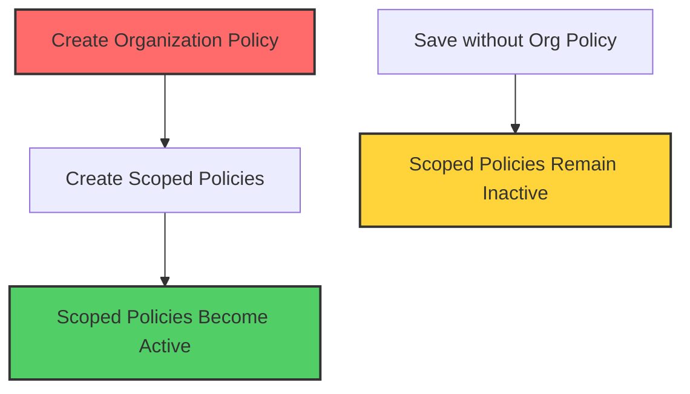

Session 75: VPC Service Controls With Scoped Policies GCP Part 5

<details open>
<summary><b>VPC Service Controls With Scoped Policies GCP Part 5 (KK-CS45-script-v3)</b></summary>

## Table of Contents
- [Overview](#overview)
- [Key Concepts and Deep Dive](#key-concepts-and-deep-dive)
  - [Scoped Policies vs Organization Policies](#scoped-policies-vs-organization-policies)
  - [Policy Hierarchy Requirements](#policy-hierarchy-requirements)
  - [Access Levels Visibility](#access-levels-visibility)
  - [Service Parameter Restrictions](#service-parameter-restrictions)
  - [Project Membership Rules](#project-membership-rules)
- [Lab Demos](#lab-demos)
  - [Creating Scoped Policies](#creating-scoped-policies)
  - [Setting Up Service Parameters](#setting-up-service-parameters)
  - [Demonstrating Policy Activation](#demonstrating-policy-activation)
- [Summary](#summary)
  - [Key Takeaways](#key-takeaways)
  - [Quick Reference](#quick-reference)
  - [Expert Insight](#expert-insight)

## Overview
This session covers scoped policies in VPC Service Controls (VPC-SC), explaining how to create fine-grained access policies that apply to specific folders or projects rather than entire organizations. The instructor demonstrates creating scoped policies, managing access levels within scopes, and critical limitations around project membership. Key emphasis is placed on the prerequisite of having an organization-level policy for scoped policies to function effectively.

## Key Concepts and Deep Dive

### Scoped Policies vs Organization Policies
Scoped policies provide granular control by applying VPC Service Controls to specific resources within your Google Cloud organization. Unlike organization policies that affect all resources under the organization root, scoped policies operate at the folder or project level.

> [!IMPORTANT]
> Scoped policies only restrict resources within their defined boundary and cannot secure resources outside their scope. For example, a policy scoped to an engineering folder cannot protect resources in the human resources folder.

### Policy Hierarchy Requirements
A critical prerequisite for scoped policies to function is the existence of an organization-level policy. Without this foundation, any scoped policies created will not activate, even when properly configured.



The system allows multiple scoped policies different levels, but maintains only one organization-level access policy.

### Access Levels Visibility
Access levels defined within scoped policies are strictly scoped and visible only within their policy boundary. This provides precise access control while preventing access level bleed between different organizational segments.

Key behaviors:
- Access levels created at the organization level are not visible in scoped policies
- Access levels created within a scoped policy (folder/project) are only available within that scope
- This isolation ensures that access controls remain predictable and secure

### Service Parameter Restrictions
Each policy can contain only one scope definition, limiting flexibility at the policy level. However, this design choice enables more granular security management by requiring separate policies for different organizational segments.

### Project Membership Rules
Projects can only belong to one service perimeter across all policies, preventing overlapping security boundaries and ensuring clear resource assignment.

> [!NOTE]
> This membership limitation means careful planning is required when organizing your VPC Service Controls implementation. A project added to one service perimeter cannot be included in another perimeter, whether at the organization, folder, or project level.

## Lab Demos

### Creating Scoped Policies
The demonstration shows creating scoped policies through the Google Cloud Console's VPC Service Controls interface:

1. Navigate to VPC Service Controls in the Cloud Console
2. Click "Create Policy" 
3. Provide a descriptive policy title
4. Select scope by choosing specific folders or projects
5. Optionally assign policy administrators
6. Create the access policy

The interface distinguishes between organization policies (no scope selected) and scoped policies (folder or project selected).

### Setting Up Service Parameters
Service parameters define which Google Cloud services and resources to protect within the scoped policy:

1. Select the scoped policy from the dropdown
2. Click "New Parameter"
3. Define secure project boundaries
4. Add resources to protect (limited to projects within the policy scope)
5. Configure specific API services (e.g., Cloud Storage API)
6. Create the service parameter

The system validates that selected resources exist within the policy's defined scope, preventing invalid configurations.

### Demonstrating Policy Activation
The demo illustrates the critical requirement of an organization-level policy:

**Without Organization Policy:**
- Scoped policy created successfully
- Service parameter configured correctly 
- VPC Service Controls remain inactive
- Protected resources (e.g., Cloud Storage buckets) continue accessible

**With Organization Policy:**
- Organization-level policy deployed
- Scoped policies activate automatically
- Service parameters become effective
- Protected resources become inaccessible per policy rules

This demonstrates the mandatory dependency hierarchy in VPC Service Controls implementation.

## Summary

### Key Takeaways
```diff
+ Always create an organization-level access policy first to enable scoped policies to function

+ Scoped policies apply VPC Service Controls restrictions only within their defined scope (folder or project)

+ Access levels created within scoped policies are visible only within that policy's boundary

+ Projects can only belong to one service perimeter across all policies

+ Each policy can contain only one scope definition, but you can create multiple policies for different organizational levels

- Trying to add a project already secured by one policy to another policy will result in creation failure

- Organization-level access policies are limited to one per organization
```

### Quick Reference

**Creating Scoped Policies:**
```bash
# Via gcloud (conceptual - use Console for actual creation)
# 1. Ensure organization policy exists
# 2. Create scoped access policy at folder/project level
# 3. Create service perimeter with protected resources
# 4. Verify policy activation
```

**Key Validation Steps:**
- Check that organization-level access policy exists
- Confirm protected resources are within policy scope
- Verify projects aren't already members of other perimeters
- Test policy effectiveness by attempting restricted actions

**Access Level Scoping:**
- Organization-level: Available across entire organization
- Folder-level: Visible only within that folder's policies  
- Project-level: Scopes to specific project policies

### Expert Insight

**Real-world Application:**
In enterprise environments with multiple business units, implement scoped policies to isolate sensitive resources while maintaining organization-wide controls. For example, create separate scoped policies for development, staging, and production environments within different folders, ensuring strict separation while benefiting from organization-level security foundations. This approach enables teams to manage their own security boundaries while staying within corporate compliance frameworks.

**Expert Path:**
Progress by mastering policy precedence rules and implementing automated policy validation. Learn to use gcloud commands for programmatic policy management and integrate with Infrastructure as Code tools like Terraform. Study policy debugging techniques using Cloud Logging and Audit Logs to identify access denials and policy conflicts. Advanced practitioners should understand policy bridge service perimeters for implementing cross-organization resource sharing.

**Common Pitfalls:**
1. **Missing Organization Policy:** Teams often create scoped policies without realizing the organization-level prerequisite, leading to policies that appear configured but remain inactive.
2. **Project Membership Conflicts:** Attempting to add projects to multiple perimeters results in unclear error messages; audit existing perimeter assignments before creating new policies.
3. **Access Level Confusion:** Creating access levels in the wrong scope results in policies without expected controls; always verify access level visibility matches intended security boundaries.
4. **Scope Ambiguity:** Failing to clarify whether a policy is organization-level or scoped leads to unexpected behavior; make scope selection explicit during creation.

</details>
