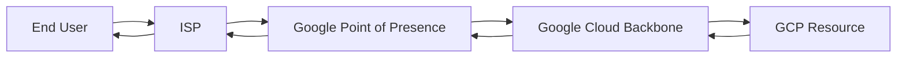
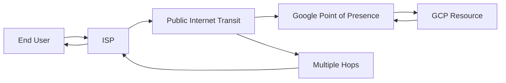
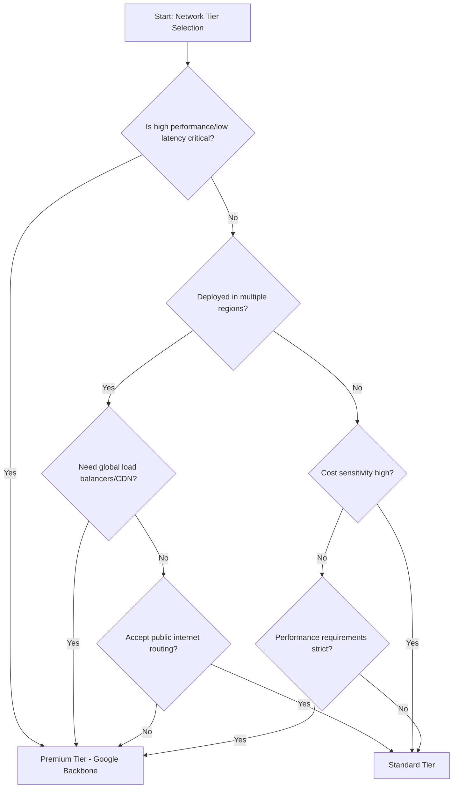

# Session 078: Network-Tiers-GCP

<details open>
<summary><b>Network-Tiers-GCP (KK-CS45-script-v3)</b></summary>

## Table of Contents
- [Overview](#overview)
- [Key Concepts/Deep Dive](#key-conceptsdeep-dive)
  - [Network Tiers Overview](#network-tiers-overview)
  - [Premium Tier Routing](#premium-tier-routing)
  - [Standard Tier Routing](#standard-tier-routing)
  - [Security Considerations](#security-considerations)
  - [Networking Features](#networking-features)
  - [Pricing Comparison](#pricing-comparison)
  - [Use Cases and Decision Flowchart](#use-cases-and-decision-flowchart)
- [Lab Demos](#lab-demos)
  - [Network Tier Configuration in GCP Console](#network-tier-configuration-in-gcp-console)
  - [VM Creation with Different Tiers](#vm-creation-with-different-tiers)
  - [Traffic Flow Analysis with Traceroute](#traffic-flow-analysis-with-traceroute)
  - [Network Tier Migration](#network-tier-migration)
- [Summary](#summary)
  - [Key Takeaways](#key-takeaways)
  - [Quick Reference](#quick-reference)
  - [Expert Insight](#expert-insight)

## Overview
This session explores Google Cloud Platform's (GCP) network tiers, focusing on Premium and Standard tiers available when creating VMs, load balancers, and other resources. The video covers the fundamental differences in routing, security, feature support, and pricing between these tiers. Through practical demonstrations, it shows how network tier selection impacts traffic latency and performance, helping viewers determine the optimal tier for their specific use cases and budget constraints.

## Key Concepts/Deep Dive

### Network Tiers Overview
Network tiers in GCP determine how external traffic reaches your applications and resources. Originally, only Premium tier existed, but Google added Standard tier as a cost-effective alternative.

**Key Characteristics:**
- **Premium Tier**: Enterprise-grade networking with Google Cloud backbone routing
- **Standard Tier**: Budget-friendly option using public internet routing
- Both tiers are automatically available for selection in the GCP console

### Premium Tier Routing
Premium tier routes traffic exclusively within Google's private cloud network infrastructure.

**Traffic Flow Characteristics:**
- Traffic travels only within Google Cloud Network
- Never traverses the public internet
- Utilizes Google's extensive, highly reliable backbone network
- Features multiple points of presence (PoPs) globally
- Designed with redundant pathways to handle network failures

**Routing Path:**


**Performance Advantages:**
- Lower latency due to fewer network hops
- Higher reliability through Google's managed infrastructure
- Better quality of service guarantees
- Optimized for global, multi-region deployments

### Standard Tier Routing
Standard tier leverages public internet service providers for routing, offering a cost-effective alternative.

**Traffic Flow Characteristics:**
- Routes through internet service provider (ISP) transit networks
- Utilizes public internet infrastructure
- Subject to ISP performance variations
- Includes 200GB free egress per month per region across all projects

**Routing Path:**


**Performance Considerations:**
- Higher latency due to additional network hops
- Variable reliability depending on ISP performance
- Sensitive to internet congestion and routing inefficiencies
- Still provides better performance than some competitor cloud providers

### Security Considerations
Both tiers maintain strong security profiles, but with different trust models.

**Premium Tier Security:**
- Protected by Google Cloud backbone security measures
- Traffic remains within Google's controlled network perimeter
- Comparable security levels to other major cloud providers
- Reduced exposure to public internet vulnerabilities

**Standard Tier Security:**
```diff
+ Equivalent security to other cloud providers
- Uses public internet routing
- Subject to ISP security measures
- Potential exposure to internet-based threats
```

> [!IMPORTANT]
> Both tiers provide robust security, but Premium tier offers additional protection through Google's private network isolation.

### Networking Features
Network tiers differ significantly in supported features.

| Feature | Premium Tier | Standard Tier |
|---------|-------------|---------------|
| Regional Load Balancers | ✅ | ✅ |
| Global Load Balancers | ✅ | ❌ |
| Global External IPs | ✅ | ❌ |
| HTTP(S) Load Balancing | ✅ | ✅ |
| TCP/UDP Load Balancing | ✅ | ✅ |
| Network Load Balancing | ❌ | ✅ |
| SSL Proxy Load Balancing | ✅ | ❌ |
| TCP Proxy Load Balancing | ✅ | ❌ |
| Cloud CDN Integration | ✅ | ❌ |
| IPv4 and IPv6 Support | Full | Limited |
| Cross-region Traffic | Optimized via backbone | Via public internet |

**Premium Tier Capabilities:**
- Supports all GCP networking features
- Enables global load balancing and CDN integration
- Full IPv4 and IPv6 support for both regional and global scopes

**Standard Tier Limitations:**
- Limited to foundational networking features
- No support for global load balancers or SSL/TCP proxies
- No Cloud CDN integration
- Regional-only external IP addresses

### Pricing Comparison
Pricing structures differ significantly between tiers.

**Premium Tier Pricing:**
- Higher cost per GB of egress traffic
- 99.99% SLA availability
- Premium pricing comparable to other major cloud providers

**Standard Tier Pricing:**
- More cost-effective than Premium
- 99.9% SLA availability  
- Includes 200GB free egress per month per region
- Lower total cost of ownership for budget-constrained deployments

**Cost Comparison Table:**
| Metric | Premium | Standard |
|--------|---------|----------|
| SLA | 99.99% | 99.9% |
| Free Tier | None | 200GB/month/region |
| Relative Cost | Higher | Lower |
| Value Prop | Performance/Premium features | Cost optimization |

### Use Cases and Decision Flowchart
Tier selection depends on organizational requirements, budget, and performance needs.

**Premium Tier Use Cases:**
- Enterprises with global user bases requiring low latency
- Mission-critical applications needing high performance
- Services requiring global load balancing or CDN
- Applications with strict uptime and performance SLAs
- Workloads spanning multiple regions with Google's backbone routing

**Standard Tier Use Cases:**
- Single-region deployments with budget constraints
- Non-critical workloads where cost is primary concern
- Applications tolerant of variable performance
- Development and testing environments
- Services not requiring global networking features

**Decision Flowchart:**


## Lab Demos

### Network Tier Configuration in GCP Console

**Reserve External Static IP Addresses:**
1. Navigate to GCP Console > VPC network > External IP addresses
2. Click "Reserve" (don't complete reservation)
3. Observe two network tier options:
   - Premium Tier (recommended, default)
   - Standard Tier (cost-effective alternative)

**Configure Project Default Network Tier:**
1. Go to VPC network settings
2. Click "Change" next to Project default network tier
3. Select from available options (Premium recommended)

### VM Creation with Different Tiers

**Create Standard Tier VM:**
```bash
# GCP Console Steps:
# 1. Go to Compute Engine > VM instances
# 2. Click "Create instance"
# 3. Configure basic settings (name: standard-ip)
# 4. In "Networking" section:
#    - Expand "Network interfaces"
#    - Select "Standard" from Network tier dropdown
# 5. Click "Create"
```

**Create Premium Tier VM:**
```bash
# GCP Console Steps:
# 1. Go to Compute Engine > VM instances  
# 2. Click "Create instance"
# 3. Configure basic settings (name: premium-ip)
# 4. In "Networking" section:
#    - Network tier defaults to "Premium"
# 5. Click "Create"
```

### Traffic Flow Analysis with Traceroute

**Compare Hops Between Tiers:**
```bash
# Standard Tier Traceroute (from Linux/Mac terminal)
traceroute [STANDARD_VM_EXTERNAL_IP]

# Premium Tier Traceroute (from Linux/Mac terminal)  
traceroute [PREMIUM_VM_EXTERNAL_IP]
```

**Expected Results:**
- **Standard Tier**: ~15+ hops through multiple international routers
- **Premium Tier**: ~5 hops directly through Google infrastructure

**Routing Pattern Examples:**
```
# Standard Tier Route:
Client → ISP → Chennai → Mumbai → London → New York → Chicago → Google PoP → GCP VM

# Premium Tier Route:  
Client → ISP → Google PoP → Google Backbone → GCP VM
```

### Network Tier Migration

**Important Migration Considerations:**
```yaml
# Critical points:
- IP addresses will change automatically
- DNS records must be updated
- Expect potential service downtime
- Cannot migrate between regions using same tier
- Separate IP pools maintained per tier and region
```

**Migration Process:**
1. Create new resource with desired network tier
2. Update DNS records with new IP address
3. Verify traffic flow with traceroute
4. Remove old resource after confirming functionality

## Summary

### Key Takeaways

```diff
+ Premium Tier routes exclusively through Google Cloud backbone for minimum latency and maximum performance
- Standard Tier uses public internet routing with higher hop counts but lower costs
+ Premium Tier supports all GCP networking features including global load balancers and CDN
- Standard Tier supports only foundational features with 200GB free egress per region
+ IP addresses change automatically when migrating between tiers
! Both tiers maintain comparable security to other major cloud providers
+ Choose Premium for mission-critical, global, or high-performance workloads
- Choose Standard for cost-sensitive, single-region, or non-critical deployments
```

### Quick Reference

**Network Tier Comparison:**
| Aspect | Premium | Standard |
|--------|---------|----------|
| Latency | Lower | Higher |
| Cost | Higher | Lower |
| Features | All GCP networking | Basic only |
| Free Tier | None | 200GB/month/region |
| SLA | 99.99% | 99.9% |

**Common Commands:**
```bash
# Check current network tier
gcloud compute addresses list --filter="name:[ADDRESS_NAME]"

# Create VM with specific tier
gcloud compute instances create [VM_NAME] --network-tier=[PREMIUM|STANDARD]

# Traceroute analysis
traceroute [EXTERNAL_IP]
```

### Expert Insight

**Real-world Application:**
In production environments, Premium tier is essential for global e-commerce platforms requiring sub-second response times, while Standard tier works well for cost-optimized batch processing systems deployed in single regions. Financial services always opt for Premium tier due to strict latency and security requirements, whereas content delivery networks leverage Premium tier for CDN integration.

**Expert Path:**
Start with Standard tier for proof-of-concepts and development environments to understand performance requirements. Use comprehensive monitoring (Cloud Monitoring, network telemetry) to gather latency and throughput metrics before scaling to Premium tier. Master global load balancer configurations and CDN integration for advanced Premium tier use cases.

**Common Pitfalls:**
- Assuming Standard tier provides equivalent global performance
- Migrating tiers without updating DNS records (causes downtime)
- Underestimating the 200GB Standard tier free limit for multi-region deployments
- Choosing wrong tier due to upfront costs without performance testing
- Ignoring load balancer tier limitations when upgrading from Standard to Premium

</details>
