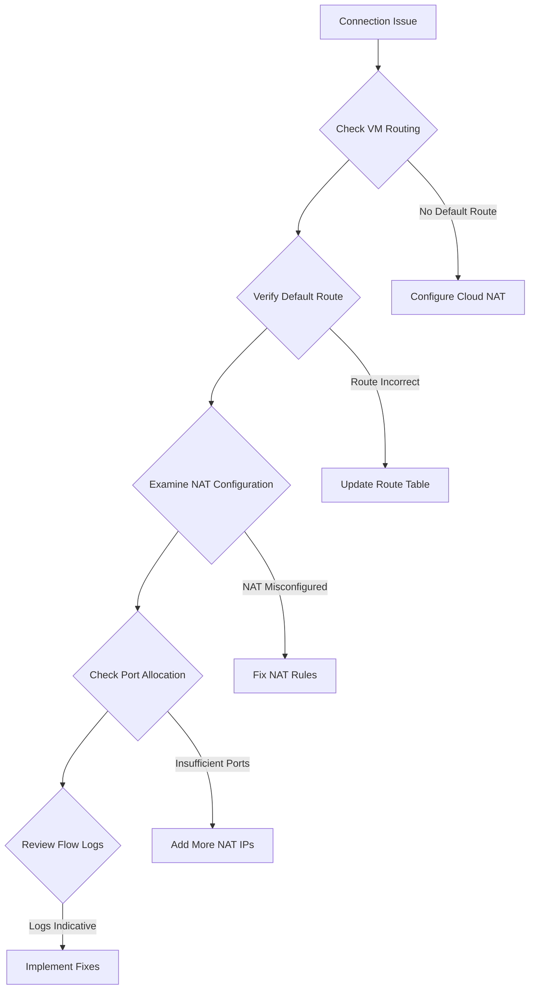

<details open>
<summary><b>081 NAT Rules in Cloud NAT GCP Part 2 (KK-CS45-script-v3)</b></summary>

# Session 081: NAT Rules in Cloud NAT GCP Part 2

## Table of Contents
- [Overview](#overview)
- [NAT Addresses](#nat-addresses)
  - [Address Allocation Modes](#address-allocation-modes)
  - [IP Address Ranges](#ip-address-ranges)
- [NAT Mapping](#nat-mapping)
  - [Static vs Dynamic Port Allocation](#static-vs-dynamic-port-allocation)
  - [Endpoint Independence](#endpoint-independence)
  - [NAT Mapping Table](#nat-mapping-table)
  - [Timeouts](#timeouts)
- [NAT Rules Configuration](#nat-rules-configuration)
- [Logging and Monitoring](#logging-and-monitoring)
- [Troubleshooting NAT Issues](#troubleshooting-nat-issues)
- [Lab Demo: Configure NAT with Rules and Logging](#lab-demo-configure-nat-with-rules-and-logging)
- [Summary](#summary)

## Overview

This session dives deeper into Cloud NAT (Network Address Translation) in Google Cloud Platform, focusing on NAT rules, addresses, and mapping mechanisms. Building on the previous session, we explore how Cloud NAT manages IP address translation for outbound connections from private VMs to the internet, with emphasis on configuration options, port allocation strategies, and operational best practices.

NAT serves as a critical component for secure outbound internet access from private subnets while maintaining inbound traffic blocking. The session covers advanced configuration including manual vs automatic address allocation, endpoint mapping, timeout management, and comprehensive logging strategies.

## NAT Addresses

NAT addresses are the public IP addresses that Cloud NAT uses to translate outbound traffic from private VMs. These addresses are allocated from Google Cloud's pool and can be managed manually or automatically.

### Address Allocation Modes

Cloud NAT offers two primary modes for managing public IP addresses:

#### Automatic Allocation
- **Description**: GCP automatically provisions and manages NAT IP addresses
- **Benefits**: 
  - Zero configuration overhead
  - Automatic scaling as traffic demands change
  - GCP handles address lifecycle management
- **Limitations**:
  - Cannot specify exact IP addresses
  - May incur additional costs if many addresses are needed

#### Manual Allocation
- **Description**: Administrator explicitly reserves static IP addresses for NAT
- **Benefits**:
  - Predictable IP addresses for security policies
  - Better cost control
  - Consistent IPs for services requiring fixed endpoints
- **Use Cases**:
  - Services with IP-based access controls
  - Cost optimization for predictable traffic

> [!NOTE]
> When using manual allocation, you must pre-reserve the static external IP addresses in your project before configuring NAT.

### IP Address Ranges

Cloud NAT distinguishes between **primary** and **secondary** IP ranges:

- **Primary Range**: Main IP subnet assigned to VM network interfaces
- **Secondary Range**: Alias IP ranges used for specialized services like Kubernetes pods

Both ranges can be configured for NAT translation, providing flexibility for complex network architectures.

## NAT Mapping

NAT mapping is the core mechanism that translates internal private IP addresses to external public IP addresses and ports.

### Static vs Dynamic Port Allocation

Cloud NAT offers configurable port allocation strategies:

#### Static Port Allocation
```yaml
nat:
  sourceSubnetworkIPRangesToNat: ALL_SUBNETWORKS_ALL_IP_RANGES
  minPortsPerVm: 32  # Minimum ports per VM
```

- **Strategy**: Allocates 1 port per VM instance from a contiguous port block
- **Benefits**:
  - Predictable port usage
  - Easier security rule creation
  - Consistent external port assignment
- **Requirements**: Minimum 32 ports per VM, configurable up to 65536
- **Characteristics**:
  - All connections from a VM use the same port range
  - First packet determines port allocation for the VM

#### Dynamic Port Allocation
```yaml
nat:
  sourceSubnetworkIPRangesToNat: ALL_SUBNETWORKS_ALL_IP_RANGES
  minPortsPerVm: 64  # Higher minimum for dynamic allocation
```

- **Strategy**: Dynamically allocates ports per connection rather than per VM
- **Benefits**:
  - Better port utilization efficiency
  - Supports higher connection density
  - More flexible resource allocation
- **Characteristics**:
  - Each connection gets unique port assignment
  - Ports are allocated on-demand

### Endpoint Independence

Endpoint independence allows different destination endpoints to receive connections from different source NAT IPs:

```bash
# Example connection patterns
VM1 -> Service A: NAT_IP_1:PORT_X
VM1 -> Service B: NAT_IP_2:PORT_Y
```

This feature enhances security by distributing traffic across multiple IP addresses and prevents services from correlating traffic patterns based on source IPs.

### NAT Mapping Table

The NAT mapping table maintains active translation records:

| Internal IP:Port | External IP:Port | Destination | Protocol | Timeout |
|------------------|------------------|-------------|----------|---------|
| 10.0.1.10:8080  | 35.202.x.x:443   | api.google.com:443 | TCP     | 4h     |
| 10.0.2.15:443   | 35.202.y.y:8080  | web.example.com:80  | TCP     | 2h     |
| 10.0.1.5:53     | 35.202.z.z:12345 | 8.8.8.8:53        | UDP     | 30s    |

### Timeouts

Cloud NAT implements intelligent timeout mechanisms:

- **UDP Mappings**: 30 seconds (default)
- **TCP Established Connections**: 4 hours (24,000 seconds)
- **TCP Transit Connections**: 60 seconds (new connection states)
- **ICMP Mappings**: 30 seconds

```bash
# Configure custom timeouts via gcloud
gcloud compute routers nats update nat-name \
  --router=router-name \
  --region=region \
  --udp-idle-timeout=30 \
  --tcp-established-idle-timeout=2400 \
  --tcp-transitory-idle-timeout=60 \
  --icmp-idle-timeout=30
```

## NAT Rules Configuration

NAT rules define which traffic gets translated by the NAT gateway:

```yaml
# NAT Configuration with Rules
kind: compute#router
router:
  nats:
  - name: nat-config
    natIpAllocateOption: AUTO_ONLY  # or MANUAL_ONLY
    sourceSubnetworkIPRangesToNat: ALL_SUBNETWORKS_ALL_IP_RANGES
    # Additional rules can be configured via subnetworkIPRangesToNat
    subnetworkIPRangesToNat:
    - name: subnet-1
      sourceIPRangesToNat: ALL_IP_RANGES
    - name: subnet-2
      sourceIPRangesToNat: PRIMARY_IP_RANGE
```

Key configuration considerations:
- **Selective NAT**: Configure specific subnets or IP ranges for NAT
- **Port Allocation**: Balance between port efficiency and predictability
- **Logging**: Enable Flow Logs for troubleshooting

## Logging and Monitoring

Cloud NAT provides comprehensive logging capabilities:

### Flow Logs
```bash
gcloud compute routers nats update nat-name \
  --router=router-name \
  --region=region \
  --enable-logging
```

Flow logs capture:
- Source/destination IPs and ports
- Protocol information
- NAT mapping details
- Timestamp data
- Connection states

### Cloud Logging Integration
```yaml
# Export to BigQuery for analysis
resource.type="nat_gateway"
logName="projects/project/logs/compute.googleapis.com%2Fnat_gateway"
```

Monitor key metrics:
- Active NAT mappings
- Port utilization percentage
- Connection counts
- Error rates

## Troubleshooting NAT Issues

Common issues and diagnostic approaches:

> [!IMPORTANT]
> Always verify network configuration before troubleshooting NAT-specific issues.

```bash
# Common troubleshooting commands
gcloud compute routers nats describe nat-name --router=router-name --region=region

# Check VM network configuration
gcloud compute instances describe vm-name --zone=zone --format="get(networkInterfaces[0].networkIP)"

# Verify firewall rules
gcloud compute firewall-rules list --filter="direction=EGRESS"
```

### Common Pitfalls
- **Out-of-Ports Error**: Insufficient NAT IP allocation for traffic volume
- **Firewall Conflicts**: Cloud NAT operates independently of VPC firewall rules
- **Routing Issues**: Default route (0.0.0.0/0) must point to Cloud NAT gateway
- **Subnet Configuration**: Private subnets require proper next-hop configuration

### Diagnostic Flow


## Lab Demo: Configure NAT with Rules and Logging

### Prerequisites
- Google Cloud Project with billing enabled
- Private VPC network with subnets
- VM instances in private subnets

### Step-by-Step Configuration

#### 1. Create NAT Gateway with Rules
```bash
# Create Cloud Router
gcloud compute routers create nat-router \
  --network=vpc-network \
  --region=us-central1

# Configure NAT with specific rules
gcloud compute routers nats create nat-config \
  --router=nat-router \
  --region=us-central1 \
  --auto-allocate-nat-external-ips \
  --nat-all-subnet-ip-ranges \
  --enable-logging \
  --min-ports-per-vm=64
```

#### 2. Configure Selective NAT for Specific Subnets
```bash
# Add selective NAT rule
gcloud compute routers nats rules create RULE_1 \
  --router=nat-router \
  --nat=nat-config \
  --region=us-central1 \
  --match="destination.ip != '10.0.0.0/8'" \
  --source-nat-active-ips=10.0.0.0/24 \
  --action=NAT
```

#### 3. Enable Enhanced Logging
```bash
# Update NAT with full logging
gcloud compute routers nats update nat-config \
  --router=nat-router \
  --region=us-central1 \
  --enable-logging \
  --log-filter="INCLUDE_ALL"
```

#### 4. Test NAT Connectivity
```bash
# From VM instance, test outbound connectivity
curl -v google.com

# Verify NAT IP translation
curl ifconfig.me
```

#### 5. Monitor and Verify Configuration
```bash
# Check NAT status
gcloud compute routers nats list --router=nat-router --region=us-central1

# View active mappings (requires logging enabled)
gcloud logging read "resource.type=nat_gateway" --limit=10
```

### Expected Results
- Successful outbound connections from private VMs
- NAT IP addresses visible in destination logs
- Comprehensive flow logs in Cloud Logging
- No connectivity failures for internet-bound traffic

## Summary

### Key Takeaways

```diff
+ Cloud NAT enables secure outbound internet access for private VMs
+ Static port allocation provides predictable resource usage
+ Dynamic port allocation optimizes resource efficiency
+ Endpoint independence enhances traffic distribution and security
+ Comprehensive logging is essential for troubleshooting and compliance
- Manual address allocation requires pre-reserved static IPs
- Port exhaustion can occur without proper monitoring
- TCP timeouts default to 4 hours for established connections
```

### Quick Reference

| Command | Purpose |
|---------|---------|
| `gcloud compute routers nats create` | Create NAT gateway |
| `gcloud compute routers nats update` | Modify NAT configuration |
| `gcloud compute routers nats describe` | View NAT status |
| `gcloud logging read "resource.type=nat_gateway"` | View NAT flow logs |

```yaml
# Basic NAT Configuration
nat:
  name: nat-gateway
  natIpAllocateOption: AUTO_ONLY
  sourceSubnetworkIPRangesToNat: ALL_SUBNETWORKS_ALL_IP_RANGES
  minPortsPerVm: 64
  enableDynamicPortAllocation: true
  enableEndpointIndependentMapping: true
  enableLogging: true
```

### Expert Insight

**Real-world Application**: In production environments, Cloud NAT is commonly used for container orchestration platforms like GKE, where pods in private clusters need internet access for updates, logging, and external API calls without requiring public IPs.

**Expert Path**: Master NAT by understanding the relationship between TCP connection states and timeout values. Focus on resource optimization through proper port allocation strategies and implement comprehensive monitoring dashboards using Cloud Monitoring and BigQuery.

**Common Pitfalls**: 
- Forgetting to configure default routes in private subnets
- Under-allocating NAT ports leading to connectivity issues during traffic spikes
- Not enabling logging initially, making troubleshooting difficult
- Misconfiguring firewall rules assuming they control outbound NAT traffic

</details>
