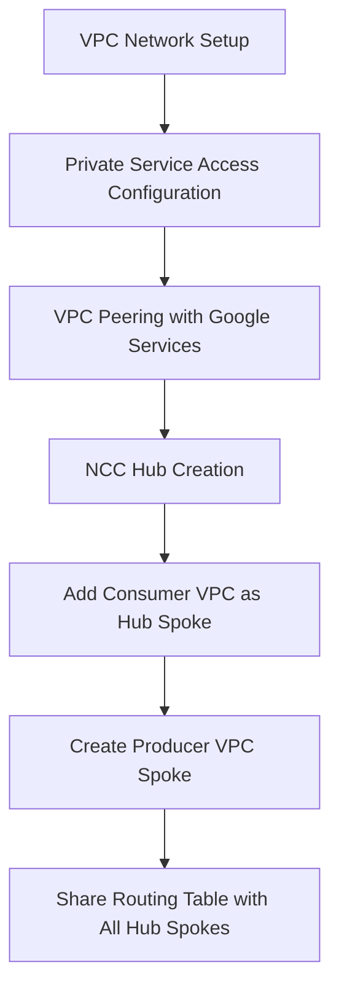

# Session 84: Producer VPC Spokes in NCC GCP Preview

<details open>
<summary><b>Producer VPC Spokes in NCC GCP Preview (KK-CS45-script-v3)</b></summary>

## Table of Contents

- [Overview](#overview)
- [Overview](#overview)
- [Key Concepts and Deep Dive](#key-concepts-and-deep-dive)
  - [Producer VPC Spokes Fundamentals](#producer-vpc-spokes-fundamentals)
  - [Private Service Access and VPC Peering](#private-service-access-and-vpc-peering)
  - [Network Connectivity Center Hub Setup](#network-connectivity-center-hub-setup)
  - [Consumer and Producer VPC Spoke Creation](#consumer-and-producer-vpc-spoke-creation)
  - [Connectivity and Routing](#connectivity-and-routing)
  - [Unique Properties and Exceptions](#unique-properties-and-exceptions)
  - [IP Range Management](#ip-range-management)
- [Lab Demo: Hands-On Setup](#lab-demo-hands-on-setup)
- [Summary](#summary)
  - [Key Takeaways](#key-takeaways)
  - [Quick Reference](#quick-reference)
  - [Expert Insight](#expert-insight)

## Overview

Producer VPC Spokes in Google Cloud's Network Connectivity Center (NCC) enable sharing of managed services deployed in Google's internal VPC networks with other VPC networks via private IP connectivity. This feature, currently in preview, allows services like Cloud SQL and Filestore to be accessible from multiple VPC networks across different projects and organizations through an NCC Hub, without requiring public IP exposure or VPN tunnels.

The core concept involves creating a private service access connection, establishing VPC peering, and then configuring NCC spokes in a specific order: first the consumer VPC as a spoke, then the producer VPC (Google's internal network) as a producer VPC spoke.

## Key Concepts and Deep Dive

### Producer VPC Spokes Fundamentals

Producer VPC Spokes allow Google-managed services to be made reachable by other networks in an NCC Hub. When you have a VPC Network that consumes services from a producer network through VPC Network peering, you can use NCC to share those services with additional VPC networks.

**Key Process Flow:**


### Private Service Access and VPC Peering

Private Service Access creates allocated IP ranges in your VPC and establishes a VPC peering connection between your project VPC and Google's service VPC network.

**Configuration Steps:**
1. Allocate IP ranges for private service access (minimum /24 required)
2. Create private service connection with Google APIs
3. Automatic creation of VPC peering between your VPC and Google's service network

**Allocated IP Ranges:**
```yaml
# Example allocation
- name: sql1
  prefix: /24 (custom range)
- name: sql2 
  prefix: /24 (automatic allocation)
```

### Network Connectivity Center Hub Setup

NCC Hubs support mesh topology for producer VPC spokes, with required topology groups (Center for producer spokes, Center for consumer spokes unless configured for Star topology).

**Hub Creation:**
```yaml
hub_name: mhub
topology: mesh
groups:
  - center  # For producer and consumer spokes
```

**Supported Topologies:**
- Mesh: Single default group
- Star: Two groups (Edge and Center)

### Consumer and Producer VPC Spoke Creation

**Critical Dependencies:**
- Consumer VPC must already have private service access configured
- Consumer VPC must be added as a VPC spoke before creating producer VPC spoke
- Both spoke resources must belong to the same Hub group

**Creation Order:**
1. Create NCC Hub
2. Add consumer VPC as VPC Spoke
3. Create producer VPC spoke referencing the consumer VPC spoke and peering connection name

**Spoke Configuration:**
```yaml
# Consumer VPC Spoke
type: vpc_network
hub: mhub
vpc_network: consumer-project-vpc1
region: global
auto_accept: true

# Producer VPC Spoke  
type: producer_vpc_network
hub: mhub
name: my-sql-producer
consumer_spoke: consumer-project-vpc1  # Reference to consumer spoke
peering_connection: servicenetworking-googleapis.com  # Peering connection name
```

### Connectivity and Routing

**Routing Behavior:**
- Producer VPC spokes export only subnet routes (not dynamic routes)
- Routes are shared via the NCC Hub's route table
- Connectivity established through existing VPC peering connections

**Traffic Flow:**
- Other spoke networks communicate via NCC Hub routing
- Producer and consumer VPCs maintain their original peering connection
- Multiple producer VPC spokes cannot communicate directly with each other

### Unique Properties and Exceptions

**Connectivity Patterns:**
- Producer VPC spokes cannot establish direct connectivity with each other
- Producer and consumer VPC networks communicate via original peering connection
- All other connectivity flows through the NCC Hub

**Service Compatibility:**
- Works with services that use private service access (Cloud SQL, Filestore, etc.)
- Services relying on dynamic routes are not supported

### IP Range Management

**Critical Considerations:**
- NCC doesn't validate IP range overlaps
- Ensure allocated private service access ranges don't conflict with VPC spoke subnets
- Conflicts may prevent service resource creation

**Overlapping Prevention:**
```diff
+ Allocate private service access ranges BEFORE adding VPC spokes to hub
- Add spoke subnets that overlap with existing private service access ranges
```

**Troubleshooting Overlaps:**
- Expand or modify allocated IP ranges if conflicts occur
- Remove conflicting spoke subnets from hub
- Regenerate automatic IP allocations if needed

## Lab Demo: Hands-On Setup

### Prerequisites
```bash
# Enable required APIs
gcloud services enable servicenetworking.googleapis.com
gcloud services enable sqladmin.googleapis.com
```

### Step 1: Private Service Access Configuration
```bash
# Allocate IP ranges for private service access
gcloud compute addresses create google-managed-services-default \
  --global \
  --purpose=VPC_PEERING \
  --addresses=192.168.0.0 \
  --prefix-length=24 \
  --network=projects/PROJECT_ID/global/networks/VPC_NETWORK \
  --description="Peering range for Google services"
```

### Step 2: Create Service Connection
```bash
# Enable private service connection for Google APIs
gcloud services vpc-peerings connect \
  --service=servicenetworking.googleapis.com \
  --ranges=google-managed-services-default \
  --network=VPC_NETWORK \
  --project=PROJECT_ID
```

### Step 3: Create Cloud SQL Instance with Private IP
```bash
gcloud sql instances create mysql-instance \
  --database-version=MYSQL_8_0 \
  --cpu=2 \
  --memory=8GiB \
  --region=REGION \
  --network=projects/PROJECT_ID/global/networks/VPC_NETWORK \
  --no-assign-ip \
  --allocated-ip-range-name=google-managed-services-default
```

### Step 4: Create NCC Hub
```bash
# Create NCC Hub with mesh topology
gcloud network-connectivity hubs create mhub \
  --description="Hub for producer VPC spokes demo" \
  --labels=environment=test
```

### Step 5: Add Consumer VPC as Hub Spoke
```bash
# Add consumer VPC as spoke
gcloud network-connectivity spokes create consumer-spoke \
  --hub=mhub \
  --description="Consumer VPC Network" \
  --vpc-network=projects/PROJECT_ID/global/networks/VPC_NETWORK \
  --region=global
```

### Step 6: Create Producer VPC Spoke
```bash
# Create producer VPC spoke
gcloud network-connectivity spokes create producer-spoke \
  --hub=mhub \
  --description="Producer VPC for managed services" \
  --producer-vpc-network \
  --producer-vpc-spoke=consumer-spoke \
  --region=global
```

### Step 7: Add Additional VPCs as Spokes
```bash
# Add another VPC network as spoke
gcloud network-connectivity spokes create additional-spoke \
  --hub=mhub \
  --description="Additional VPC Network" \
  --vpc-network=projects/OTHER_PROJECT/global/networks/OTHER_VPC \
  --region=global
```

### Verification Commands
```bash
# Check hub status
gcloud network-connectivity hubs describe mhub

# List all spokes
gcloud network-connectivity spokes list --hub=mhub

# Verify routes
gcloud network-connectivity hubs routes list --hub=mhub --region=global

# Test connectivity (from a VM in connected VPC)
mysql -h PRIVATE_IP -u root -p
```

## Summary

### Key Takeaways

```diff
+ Producer VPC Spokes enable sharing Google-managed services across multiple VPCs through NCC Hub
+ Requires existing private service access and VPC peering before NCC configuration
+ Consumer VPC must be added as spoke BEFORE creating producer VPC spoke
+ Supports mesh and star topologies with specific group requirements
+ Maintains original service connectivity through peering while adding NCC Hub routing
+ Prevents direct connectivity between multiple producer VPC spokes
- Does not support services relying on dynamic routes
- Cannot establish direct producer-to-producer connectivity
```

### Quick Reference

**Service Enablement:**
```bash
# Enable Service Networking API
gcloud services enable servicenetworking.googleapis.com
```

**Private IP Allocation Ranges:**
- Custom ranges: Specify /24 minimum
- Automatic ranges: Generated by Google

**NCC Hub Groups:**
- Mesh: Single `default` group
- Star: `edge` and `center` groups (producer/consumer must be in same group)

**Connectivity Rules:**
- Producer ↔ Consumer: Direct peering maintained
- Consumer ↔ Other VPCs: Via NCC Hub routing
- Producer ↔ Producer: Not supported

**Common Errors:**
- "Producer VPC spoke requires consumer VPC spoke first"
- IP range overlaps preventing service creation
- Topology group mismatches

### Expert Insight

**Real-world Application**: In enterprise environments, producer VPC spokes enable centralized management of database services accessible from development, staging, and production VPCs across different departments or even organizations, while maintaining security through private IP connectivity.

**Expert Path**: Master NCC topology planning - evaluate your network architecture early to choose between mesh (full connectivity) and star (centralized control) topologies. Understand IP range planning as a critical factor for avoiding service outages during hub scaling.

**Common Pitfalls**: 
- Forgetting the creation order dependency between consumer and producer spokes
- Ignoring IP range overlaps that can cause service deployment failures
- Assuming producer VPC spokes provide the same connectivity patterns as regular VPC spokes

</details>
