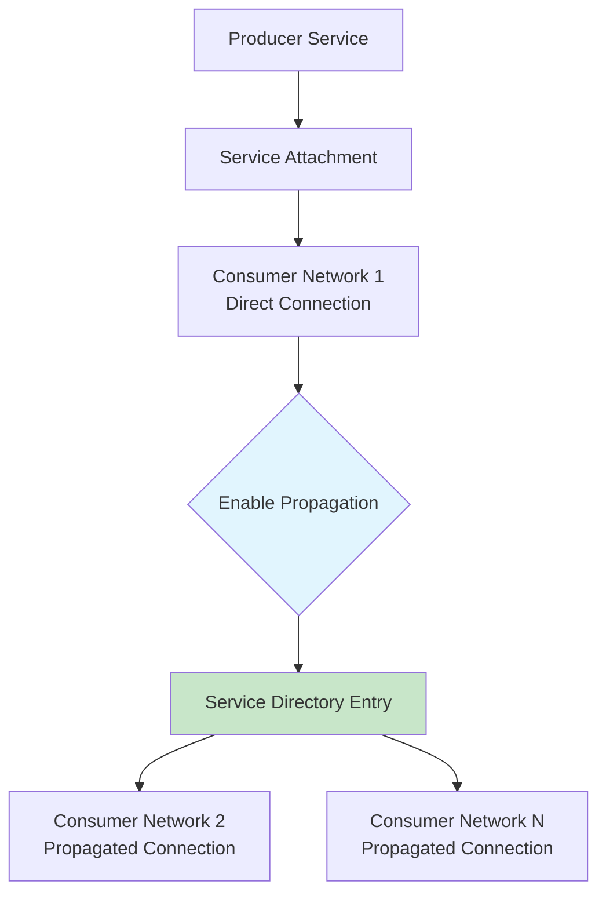
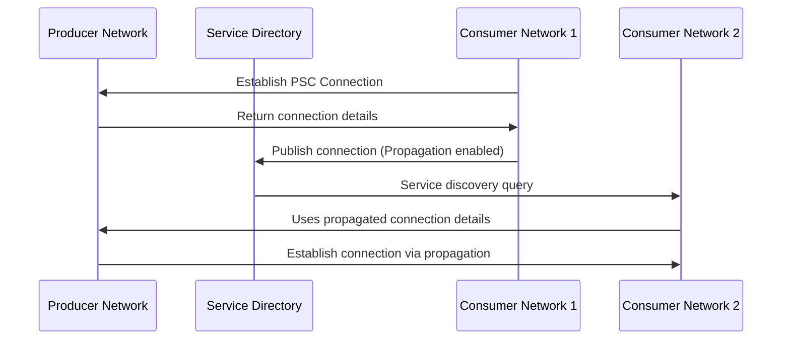

# Session 85: Private Service Connect Connection Propagation in Google Cloud - Part 4

<details open>
<summary><b>085-Private-Service-Connect-Connection-Propagation-in-GCP-Google-Cloud-Part-4 (KK-CS45-script-v3)</b></summary>

## Table of Contents
- [Overview](#overview)
- [Key Concepts and Deep Dive](#key-concepts-and-deep-dive)
  - [Private Service Connect Fundamentals](#private-service-connect-fundamentals)
  - [Connection Propagation Mechanism](#connection-propagation-mechanism)
  - [Publishing to Service Directory](#publishing-to-service-directory)
  - [Consumer Network Configuration](#consumer-network-configuration)
  - [Propagation Flow Scenario](#propagation-flow-scenario)
- [Lab Demo: Setting Up Connection Propagation](#lab-demo-setting-up-connection-propagation)
- [Summary](#summary)

## Overview

Private Service Connect (PSC) connection propagation (Part 4) focuses on advanced networking capabilities that enable private service consumption across distributed Google Cloud environments. This module explores how connections established through service attachments can be propagated and made discoverable to other consumer networks through Service Directory integration.

### Key Learning Objectives
- Understand connection propagation mechanics
- Master Service Directory integration
- Configure cross-network service discovery
- Implement advanced producer-consumer relationships

## Key Concepts and Deep Dive

### Private Service Connect Fundamentals

Private Service Connect enables private IP connectivity between:
- Service producers (GKE, Cloud Load Balancing, etc.)
- Service consumers (Compute Engine, GKE pods, Cloud Run)

**Key Benefits:**
- Eliminates need for VPC peering or VPN
- Maintains private connectivity across projects
- Supports global load balancing for regional services

### Connection Propagation Mechanism

Connection propagation allows a PSC consumer network to **republish** its connection to a producer service, making that service discoverable to other consumer networks.

**Propagation Components:**
- **Source Consumer Network**: Original PSC consumer that establishes connection
- **Target Consumer Networks**: Secondary networks that can leverage propagated connections
- **Service Directory**: Central registry for service discovery

### Publishing to Service Directory

When connection propagation is enabled, consumer connections are automatically published to Service Directory, enabling:



**Publishing Process:**
1. Consumer establishes PSC connection to producer
2. Propagation flag is enabled on service attachment
3. Connection details are registered in Service Directory
4. Other networks can discover and connect using propagated entry

### Consumer Network Configuration

**Propagation Configuration Options:**

```yaml
# Service Attachment Configuration with Propagation
apiVersion: networking.gke.io/v1beta1
kind: ServiceAttachment
metadata:
  name: propagated-service-attachment
  namespace: default
spec:
  connectionPreference: ACCEPT_AUTOMATIC
  propagateConnection: true  # Enable propagation
  natSubnets:
  - subnet1
  - subnet2
  resourceRef:
    kind: LoadBalancer
    name: producer-load-balancer
```

**Propagation Settings:**
- `propagateConnection: true` - Enables connection sharing
- Only works with `ACCEPT_AUTOMATIC` preference
- Requires NAT subnets for IP address management

### Propagation Flow Scenario

**Complete Propagation Workflow:**



**Important Constraints:**
- Only one level of propagation supported
- Cannot propagate from an already-propagated connection
- All consumer networks must be in same project/region as producer
- Propagation respects producer-side access controls

## Lab Demo: Setting Up Connection Propagation

### Prerequisites
- GCP project with VPC networks
- Producer service (Load Balancer or GKE service)
- Multiple consumer VPC networks

### Step 1: Create Producer Resources

```bash
# Create a producer VPC network
gcloud compute networks create producer-vpc \
  --subnet-mode=custom

# Create subnet for producer
gcloud compute networks subnets create producer-subnet \
  --network=producer-vpc \
  --region=us-central1 \
  --range=10.0.0.0/24

# Create a backend service (simplified example)
gcloud compute backend-services create producer-backend \
  --load-balancing-scheme=INTERNAL \
  --protocol=TCP \
  --region=us-central1
```

### Step 2: Create Service Attachment with Propagation

```bash
# Create service attachment with propagation enabled
gcloud compute service-attachments create propagated-attachment \
  --region=us-central1 \
  --producer-forwarding-rule=producer-forwarding-rule \
  --connection-preference=ACCEPT_AUTOMATIC \
  --enable-connection-propagation \
  --nat-subnets=producer-subnet
```

### Step 3: Configure Consumer Network 1 (Primary Consumer)

```bash
# Create consumer VPC
gcloud compute networks create consumer1-vpc

# Create consumer subnet
gcloud compute networks subnets create consumer1-subnet \
  --network=consumer1-vpc \
  --region=us-central1 \
  --range=10.1.0.0/24

# Connect to service attachment
gcloud compute forwarding-rules create consumer1-connection \
  --region=us-central1 \
  --network=consumer1-vpc \
  --address=10.1.0.10 \
  --target-service-attachment=projects/PROJECT/regions/us-central1/serviceAttachments/propagated-attachment
```

### Step 4: Verify Propagation to Service Directory

```bash
# Check service directory entries
gcloud service-directory services list \
  --namespace=servicedirectory.googleapis.com

# View propagated connection details
gcloud service-directory services describe SERVICE_NAME \
  --namespace=servicedirectory.googleapis.com
```

### Step 5: Configure Consumer Network 2 (Using Propagation)

```bash
# Create second consumer VPC
gcloud compute networks create consumer2-vpc

# Create consumer subnet
gcloud compute networks subnets create consumer2-subnet \
  --network=consumer2-vpc \
  --region=us-central1 \
  --range=10.2.0.0/24

# Discover service via Service Directory and connect
# Use the propagated service directory entry to establish connection
```

## Summary

### Key Takeaways

```diff
+ ENABLED PROPAGATION: Allows secondary consumers to connect using published connection details
+ SERVICE DIRECTORY PUBLISHING: Automatic registration when propagation is enabled
+ CROSS-NETWORK DISCOVERY: Leverages Service Directory for service discovery
+ SIMPLIFIED SERVICE SHARING: Reduces complexity of multi-consumer scenarios
- SINGLE-LEVEL ONLY: Cannot propagate from already-propagated connections
- REGIONAL CONSTRAINTS: All networks typically in same region as producer
- ACCESS CONTROL CONSIDERATIONS: Propagation respects producer-side restrictions
! MONITORING REQUIRED: Track connection usage across propagated networks
```

### Quick Reference

**Enable Propagation on Service Attachment:**
```bash
gcloud compute service-attachments create ATTACHMENT_NAME \
  --enable-connection-propagation \
  --connection-preference=ACCEPT_AUTOMATIC
```

**View Propagated Services:**
```bash
gcloud service-directory services list \
  --namespace=servicedirectory.googleapis.com
```

**Common Service Attachment Flags:**
- `--enable-connection-propagation` - Enable sharing
- `--connection-preference=ACCEPT_AUTOMATIC` - Required for propagation
- `--nat-subnets=SUBNET_LIST` - IP address management

### Expert Insight

#### Real-world Application
In enterprise environments, connection propagation enables cost-effective service sharing across multiple departments while maintaining security boundaries. Teams can deploy shared services once and allow controlled access through propagation, eliminating redundant network configurations.

#### Expert Path
- Master Service Directory IAM policies for fine-grained access control
- Understand VPC Service Controls integration with propagated connections
- Explore hybrid cloud scenarios using propagation
- Monitor network traffic patterns across propagated connections

#### Common Pitfalls
- Forgetting regional constraints when designing multi-region architectures
- Misconfiguring NAT subnets leading to IP exhaustion
- Not implementing proper Service Directory namespace organization
- Overlooking producer-side access controls that can block propagation

> [!IMPORTANT]
> Always verify Service Directory permissions before enabling connection propagation to ensure proper access control.

> [!NOTE]
> Connection propagation works best in controlled environments with clear service ownership and network governance policies.

</details>
