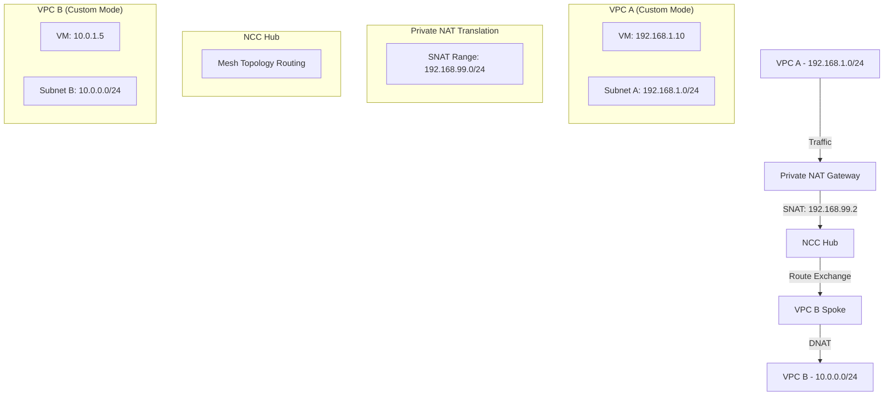

# Session 088: Private NAT GCP Part 1

<details open>
<summary><b>088: Private NAT GCP Part 1 (KK-CS45-script-v3)</b></summary>

## Table of Contents
- [Overview](#overview)
- [Key Concepts and Deep Dive](#key-concepts-and-deep-dive)
  - [Private NAT vs Public NAT](#private-nat-vs-public-nat)
  - [Network Address Translation (NAT) Fundamentals](#network-address-translation-nat-fundamentals)
  - [Private NAT Architecture and Operation](#private-nat-architecture-and-operation)
  - [Network Connectivity Center Integration](#network-connectivity-center-integration)
  - [Overlapping Subnets Challenge](#overlapping-subnets-challenge)
- [Lab Demonstration](#lab-demonstration)
  - [Setup Prerequisites](#setup-prerequisites)
  - [Creating NCC Hub for Private NAT](#creating-ncc-hub-for-private-nat)
  - [Handling Overlapping Subnets](#handling-overlapping-subnets)
  - [Private NAT Configuration](#private-nat-configuration)
  - [Verification and Testing](#verification-and-testing)
- [Summary](#summary)

## Overview

Cloud NAT (Network Address Translation) in Google Cloud Platform (GCP) provides outbound connectivity for virtual machine instances in a VPC network. This session focuses on **Private NAT**, which enables outbound traffic to other VPC networks, on-premises networks, or other cloud provider networks through Network Connectivity Center (NCC) spokes. Unlike Public NAT, Private NAT does not allow direct internet access but enables controlled outbound connectivity to managed networks.

> [!IMPORTANT]
> Private NAT is essential when you need to connect VPC networks with overlapping subnet ranges through Network Connectivity Center, where traditional VPC peering fails due to IP conflicts.

## Key Concepts and Deep Dive

### Private NAT vs Public NAT

NAT gateways in GCP come in two primary types with distinct purposes:

| Feature | Public NAT | Private NAT |
|---------|------------|-------------|
| **Traffic Direction** | Outbound to internet | Outbound to VPC networks/on-prem/other clouds |
| **Connection Initiation** | Outbound (and responses) | Outbound only (responses only) |
| **Supported Protocols** | All (TCP, UDP, ICMP) | TCP and UDP only |
| **VPC Mode** | Custom and auto mode | Custom mode VPCs only |
| **Source IP Translation** | External IP (NAT IP) | Private IP range |

**Public NAT** translates outbound traffic from private IP addresses to public IP addresses for internet access. **Private NAT** translates outbound traffic from one private IP range to another private IP range, specifically:

- VPC networks within the same organization
- On-premises networks connected via Cloud VPN or Interconnect  
- Other cloud provider networks connected through NCC

### Network Address Translation (NAT) Fundamentals

#### Source NAT (SNAT)
When an outbound packet leaves the source network:
- **Source IP Address**: Changed from original private IP to a translated private IP
- **Source Port**: May be changed (PAT - Port Address Translation)
- Response packets use **Destination NAT (DNAT)** to translate traffic back

```bash
# Example SNAT operation
Original Packet: SRC=192.168.1.10:12345 → DST=10.0.0.5:80
NATed Packet:   SRC=192.168.99.2:54321 → DST=10.0.0.5:80
```

#### Destination NAT (DNAT)
For inbound responses:
- **Destination IP Address**: Changed back to original private IP
- **Destination Port**: Changed back to original port
- Ensures return traffic reaches the correct source VM

### Private NAT Architecture and Operation

Each Cloud NAT Gateway for Private NAT:
- Associates with exactly **one VPC network** and **one region**
- Requires a **Cloud Router** for route management
- Performs **SNAT** on outgoing traffic from source endpoints
- Performs **DNAT** on established response packets
- **Does NOT** allow new inbound connections from translated networks

#### Private NAT Limitations

> [!NOTE]
> Private NAT is unidirectional by design, supporting only outbound traffic and established inbound responses.

**Technical Restrictions:**
- **Custom mode VPCs only**: Auto-mode VPC networks are not supported
- **Outbound connections only**: No inbound connection initiation from translated networks
- **TCP/UDP only**: ICMP traffic (including ping) is blocked
- **Full subnet translation**: Cannot select specific primary/secondary ranges
- **Non-overlapping destinations**: Cannot reach overlapping subnet ranges

### Network Connectivity Center Integration

Network Connectivity Center (NCC) enables **mesh topology** connectivity between VPC networks through:
- **Hub-Spoke architecture**: Centralized hub manages connectivity
- **Dynamic routing**: Routes automatically exchanged between spokes
- **Cross-project support**: Connect VPCs across different GCP projects

Private NAT integrates with NCC to resolve overlapping subnet conflicts:



### Overlapping Subnets Challenge

**Problem Statement:**
VPC Peering and traditional NCC connections fail when subnet ranges overlap between VPC networks.

```bash
# Example Overlapping Configuration
# VPC A Subnet: 192.168.1.0/24
# VPC B Subnet: 192.168.1.0/24
# Result: Cannot establish direct peering - route ambiguity
```

**Solution Approach:**
1. **Exclude overlapping ranges** from NCC route export
2. **Isolate overlapping subnets** in their respective VPCs  
3. **Use Private NAT** to translate traffic from overlapping ranges
4. **Enable indirect connectivity** through NAT translation

## Lab Demonstration

### Setup Prerequisites

**Two VPC Networks with Overlapping Subnets:**

```yaml
# Project 1 VPC
vpc-3:
  subnets:
    - subnet-1: 192.168.0.0/24  # Overlapping range
    - subnet-2: 192.168.2.0/24  # Non-overlapping
    - subnet-3: 192.168.4.0/24  # Non-overlapping
    
# Project 2 VPC  
vpc-2:
  subnets:
    - subnet-1: 192.168.0.0/24  # Overlapping range
    - subnet-2: 192.168.6.0/24  # Non-overlapping
```

### Creating NCC Hub for Private NAT

#### Step 1: Create NCC Hub with Mesh Topology
```bash
# Cloud Console Navigation
# 1. Go to Network Connectivity Center
# 2. Click "Create Hub"
# 3. Configure basic settings:

Hub Name: private-hub
Topology: Mesh
Description: NCC Hub for Private NAT connectivity
```

#### Step 2: Add VPC Spokes with Exclude Filters
```bash
# First VPC (Project 1)
# Configuration:

Hub ID: [Target Hub Project ID]
Spoke Name: vpc-3-spoke
VPC Network: vpc-3
Region: asia-south1
Exclude Routes:     # Critical for overlapping subnets
  - IP Range: 192.168.0.0/24
```

```bash
# Second VPC (Project 2) 
# Configuration:

Hub ID: [Target Hub Project ID] 
Spoke Name: vpc-2-spoke
VPC Network: vpc-2
Region: asia-south1
Exclude Routes:     # Critical for overlapping subnets
  - IP Range: 192.168.0.0/24
```

#### Step 3: Verify Route Table
```bash
# Check Exported Routes
# NCC Hub → Routes → Select Region → Verify Exclusions:
# ✅ Routes present: 192.168.2.0/24, 192.168.4.0/24, 192.168.6.0/24  
# ❌ Routes absent: 192.168.0.0/24 (excluded from both spokes)
```

### Handling Overlapping Subnets

**Problem Resolution Strategy:**

1. **Identify Overlapping Ranges**: Scan all connected VPCs for IP conflicts
2. **Apply Exclude Filters**: Prevent route advertisement for conflicting ranges
3. **Test Isolation**: Verify overlapping subnets remain unreachable via NCC
4. **Deploy Private NAT Gateway**: Enable selective outbound connectivity

### Private NAT Configuration

#### Step 1: Create NAT Gateway
```bash
# Cloud NAT Configuration
# 1. Navigate to Cloud NAT
# 2. Click "Get started"

NAT Gateway Name: private-nat
Network: vpc-3  # Source VPC
Region: asia-south1
Cloud Router: [existing/create new]
```

#### Step 2: Configure Source Endpoints
```bash
# Source NAT Configuration
# NAT Type: Private
# Source Endpoint Configuration:

Subnet Selection: Custom
Selected Subnets:
  - 192.168.0.0/24  # Overlapping subnet requiring connectivity

# Key Setting: Only overlapping subnet can use NAT
```

#### Step 3: Add Private NAT Rule
```bash
# NAT Rule Configuration
# Rule Number: 100
# Connectivity Type: Network Connectivity Center
# NCC Hub: private-hub

# Create Private NAT Subnet:
Name: private-nat-range  
IP Range: 192.168.99.0/24  # Translation range for SNAT/DNAT
```

### Verification and Testing

#### Test 1: Basic Connectivity
```bash
# Test from Source VM (192.168.0.10) in overlapping subnet:
curl http://10.0.1.5:80
# Expected: ✅ Success (response received)

# Test from Target VM (10.0.1.5) in non-overlapping subnet:
curl http://192.168.0.10:80  
# Expected: ❌ Fail (inbound connections blocked)
```

#### Test 2: Protocol Restrictions
```bash
# ICMP Test (Ping) - Should Fail:
ping 10.0.1.5
# Expected: ❌ No response (ICMP not supported)

# TCP Probe from target (inbound attempt) - Should Fail:
telnet 192.168.0.10 80
# Expected: ❌ Connection refused
```

#### Test 3: Source IP Translation Verification
```bash
# Capture traffic on destination VM:
sudo tcpdump -i any -p 80

# Initiate request from source VM:
curl http://10.0.1.5:80

# tcpdump output should show:
# Source IP: 192.168.99.2 (NAT translation range)
# Return traffic: Source IP: 10.0.1.5, Destination: 192.168.99.2
```

## Summary

### Key Takeaways

```diff
+ Private NAT enables outbound connectivity from VPC networks through Network Connectivity Center
+ Essential solution for overlapping subnet ranges where VPC peering fails
+ Performs SNAT (Source NAT) and DNAT (Destination NAT) for traffic translation
+ Integrates with NCC Hub-Spoke architecture for multi-VPC connectivity
+ Requires custom mode VPC networks and Cloud Router association
+ Supports only TCP/UDP protocols (no ICMP/ping functionality)

- Outbound connections only - no inbound connection initiation allowed
- Cannot use with auto-mode VPC networks
- Prohibits access to overlapping subnet ranges even with NAT
- Requires exclude filters in NCC spokes for conflicting ranges
- Translation applies to entire subnets, not individual IP ranges
```

### Quick Reference

**Creating Private NCC Hub:**
```bash
# Basic Hub Setup
Topology: Mesh
Name: private-hub
Project: [target-project-id]
```

**NAT Gateway Configuration:**
```bash
# Essential Parameters
NAT Type: Private
Network: [custom-vpc-name] 
Subnet: [overlapping-subnet-range]
NAT IP Range: [192.168.99.0/24]
Cloud Router: [existing-router-name]
```

**Traffic Verification Commands:**
```bash
# Test TCP connectivity
curl http://[destination-vm-ip]:80

# Monitor translated traffic  
sudo tcpdump -i any port 80 and host [nat-ip-range]
```

**NCC Spoke Exclude Configuration:**
```yaml
spoke_filters:
  exclude_ranges:
    - 192.168.0.0/24  # Overlapping subnet
```

### Expert Insight

#### Real-world Application
In enterprise environments, Private NAT combined with NCC serves critical connectivity needs:
- **Multi-cloud integration** between GCP, AWS, and Azure networks
- **On-premises connectivity** for hybrid cloud architectures  
- **VPC segmentation** enabling secure inter-VPC communication
- **Mergers and acquisitions** connecting isolated VPC infrastructures

#### Expert Path
**Master this technology by:**
1. **Understanding NAT limitations** and design constraints
2. **Practicing NCC Hub administration** with complex spoke configurations
3. **Implementing monitoring and logging** for NAT gateway operations
4. **Designing hybrid network topologies** incorporating Private NAT
5. **Automating deployments** using Terraform/Cloud Deployment Manager
6. **Certifying GCP network expertise** (Associate/Professional Cloud Network Engineer)

#### Common Pitfalls
- **Forgetting exclude filters**: Causes NCC connection failures with overlapping subnets
- **Using auto-mode VPCs**: Private NAT requires custom mode networks only
- **Attempting ICMP connectivity**: Private NAT blocks all non-TCP/UDP traffic
- **Neglecting Cloud Router**: Required for Private NAT gateway functionality
- **Expecting bidirectional communication**: Private NAT is outbound-only by design
- **Overlooking subnet selection**: NAT applies to entire specified subnets, not individual VMs

</details>
