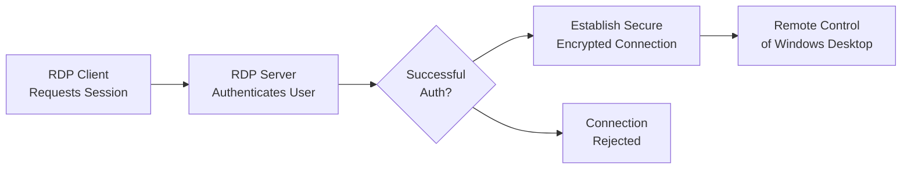

# Session 089: RDP (Remote Desktop Protocol) in Google Cloud

<details open>
<summary><b>Session 089: RDP (Remote Desktop Protocol) in Google Cloud (KK-CS45-script-v3)</b></summary>

## Table of Contents
- [Overview](#overview)
- [What is RDP?](#what-is-rdp)
- [How RDP Works](#how-rdp-works)
- [Connecting to Windows VMs in Google Cloud](#connecting-to-windows-vms-in-google-cloud)
  - [Using Public IP](#using-public-ip)
  - [Using Private IP](#using-private-ip)
  - [Using Identity-Aware Proxy (IAP)](#using-identity-aware-proxy-iap)
  - [Using Chrome Remote Desktop](#using-chrome-remote-desktop)
- [Lab Demo: Creating and Connecting to Windows VM](#lab-demo-creating-and-connecting-to-windows-vm)
  - [Creating Windows VM](#creating-windows-vm)
  - [Connecting via RDP with Public IP](#connecting-via-rdp-with-public-ip)
  - [Firewall Configuration](#firewall-configuration)
  - [Removing Public IP and Using IAP Desktop](#removing-public-ip-and-using-iap-desktop)
  - [Setting up Chrome Remote Desktop](#setting-up-chrome-remote-desktop)
- [Summary](#summary)
  - [Key Takeaways](#key-takeaways)
  - [Quick Reference](#quick-reference)
  - [Expert Insight](#expert-insight)

## Overview
This session provides an in-depth explanation of RDP (Remote Desktop Protocol) and its application within Google Cloud Platform (GCP), specifically for connecting to Windows Virtual Machines (VMs). The presenter covers the fundamentals of RDP, different connection methods available in GCP, security considerations, and includes a comprehensive lab demonstration showing how to set up and connect to a Windows VM using various approaches including RDP client, IAP Desktop, and Chrome Remote Desktop.

## What is RDP?
RDP (Remote Desktop Protocol) is a proprietary protocol developed by Microsoft that enables users to remotely access and control Windows computers and servers over a network connection. As an alternative to SSH for Linux systems, RDP provides a graphical user interface (GUI) that allows users to interact with remote Windows systems as if they were physically present locally.

### Key Features of RDP
- **Remote Access**: Control Windows machines from anywhere with proper credentials
- **Secure Connection**: Uses encryption to protect data in transit
- **Multi-user Support**: Allows multiple remote users on licensed Windows Server editions
- **File and Clipboard Sharing**: Transfer files and copy-paste content between local and remote systems

> [!NOTE]
> RDP operates on TCP port 3389 by default, which must be allowed through firewall rules for successful connections.

## How RDP Works
When a user initiates an RDP session:

1. **RDP Client Request**: User starts an RDP client (like Microsoft Remote Desktop on Windows - accessed via Win+R → MSTSC)
2. **Authentication**: RDP server processes the request and authenticates the user with username/password
3. **Secure Connection**: Upon successful authentication, a secure encrypted connection is established
4. **Remote Control**: User gains graphical remote control of the Windows desktop



## Connecting to Windows VMs in Google Cloud
Google Cloud Platform provides multiple methods to connect to Windows VMs depending on their network configuration and your location/access requirements.

### Using Public IP
When a Windows VM has a public IP address assigned:

- **RDP Client**: Open RDP client → Enter public IP and port 3389
- **Google Cloud Console**: Use built-in RDP button (downloads .rdp file) or "Set Windows Password" for credential generation
- **Cloud Shell**: Use `gcloud` commands to generate/reset passwords

> [!IMPORTANT]
> Public IP connections require proper firewall rules allowing RDP traffic from your specific IP range (not 0.0.0.0/0 for security).

### Using Private IP
Windows VMs without public IPs can be accessed:

- **Corporate VPN**: Connect from on-premises networks via VPN or Cloud Interconnect
- **Requires proper network routing and firewall rules**

### Using Identity-Aware Proxy (IAP)
IAP provides secure access without exposing VMs to public internet:

- **IAP Desktop** (for Windows/Mac): Download from Google Cloud, sign in, select project/VM
- **G-Cloud CLI + RDP Client** (for Linux/Mac): `gcloud compute start-iap-tunnel` creates secure tunnel

> [!NOTE]
> IAP requires specific IAM roles like "IAP-secured Tunnel User" and firewall rules allowing traffic from IAP's IP ranges (35.235.240.0/20).

### Using Chrome Remote Desktop
An alternative remote access solution:

- **Installation Required**: Software must be installed on the Windows VM (not pre-installed)
- **Secure Access**: Provides remote desktop access with PIN-based authentication
- **Network Requirements**: Requires outbound internet connectivity (use Cloud NAT for private IPs)
- **Multi-platform Support**: Works across different operating systems

> [!WARNING]
> Chrome Remote Desktop may pose security risks if used over public internet with unpatched systems or malware-infected devices.

## Lab Demo: Creating and Connecting to Windows VM

### Creating Windows VM
```bash
# GCP Console navigation:
# Compute Engine > VM instances > Create Instance
gcloud compute instances create windows-vm \
    --image-family=windows-server-2022-dc-core-v20240115 \
    --image-project=windows-cloud \
    --machine-type=n2-standard-4 \
    --boot-disk-size=50GB \
    --tags=rdp-enabled \
    --network-tier=PREMIUM
```

**Key Configuration**:
- OS: Windows Server 2022 (Data Center edition)
- Licensing: Included with Windows images (additional compute costs)
- Network: Assign external IP for initial setup (remove for security after configuration)

### Connecting via RDP with Public IP
```bash
# Generate/reset Windows password
gcloud compute reset-windows-password windows-vm --zone=us-central1-a

# Alternative: Set Windows password via GCP Console
# VM Instances > [instance] > Set Windows password
```

**RDP Connection Steps**:
1. Download .rdp file from GCP Console or use native RDP client
2. Enter public IP address
3. Provide username and auto-generated password
4. Accept certificate warnings
5. Successfully connect to Windows desktop

### Firewall Configuration
```bash
# Default GCP RDP firewall rule (restrict for security)
gcloud compute firewall-rules create allow-rdp-restricted \
    --allow=tcp:3389 \
    --source-ranges=YOUR_SPECIFIC_IP_RANGE \
    --target-tags=rdp-enabled \
    --description="Restrict RDP access to specific IPs"
```

> [!IMPORTANT]
> Never keep default "allow all (0.0.0.0/0)" for RDP port 3389. Always restrict to specific trusted IP ranges.

### Removing Public IP and Using IAP Desktop
```bash
# Remove external IP
gcloud compute instances delete-access-config windows-vm --zone=us-central1-a

# Enable IAP Desktop connection (after installing client)
# IAP Desktop Client > Sign in > Select project > Choose VM > Connect
# Enter Windows credentials when prompted
```

**IAP Desktop Benefits**:
- No public IP exposure required
- Secure tunnel through IAP
- Single pane of glass management
- Supports both Windows and Linux VMs

### Setting up Chrome Remote Desktop
```powershell
# Run PowerShell commands on Windows VM via RDP:
# Install Chrome Remote Desktop (requires internet access)
Set-ExecutionPolicy RemoteSigned -Scope Process -Force
$installScript = Invoke-WebRequest -Uri 'https://dl.google.com/dl/chrome-remote-desktop/chromeremotedesktophost.msi' -OutFile "$env:TEMP\crd.msi"
Start-Process -FilePath msiexec.exe -ArgumentList "/i $env:TEMP\crd.msi /quiet /norestart"

# Configure remote access
# 1. Open Chrome Remote Desktop setup page
# 2. Choose "Set up another computer"
# 3. Authorize and set 6+ digit PIN
# 4. Enable remote access on target computer

# Enable Cloud NAT for outbound connectivity (private IP scenario)
gcloud compute routers nats create windows-nat \
    --router=windows-router \
    --region=us-central1 \
    --nat-all-subnet-ip-ranges \
    --nat-external-ip-pool=windows-nat-external-ip
```

## Summary

### Key Takeaways
```diff
+ RDP enables secure remote graphical access to Windows systems
+ GCP provides multiple connection methods: Public IP, IAP, Chrome Remote Desktop
+ Always restrict firewall rules to specific IP ranges for RDP traffic
+ IAP and Chrome Remote Desktop work with private IPs (no public exposure)
+ Windows licensing costs are additional to compute instance charges
- Never use RDP over public internet with broad firewall rules (0.0.0.0/0)
- Chrome Remote Desktop requires manual installation and PIN authentication
- Public IP removal eliminates direct RDP access (use alternatives)
```

### Quick Reference
**Default RDP Port**: 3389/TCP

**Common RDP Clients**:
- Windows: `mstsc.exe` (search "Remote Desktop Connection")
- Mac: Microsoft Remote Desktop app from App Store
- Linux: `remmina` or `rdesktop` CLI tools

**GCP Commands**:
- Set Windows password: `gcloud compute reset-windows-password [INSTANCE]`
- Create firewall rule: `gcloud compute firewall-rules create allow-rdp --allow=tcp:3389 --source-ranges=[IP_RANGE]`

**IAP IP Ranges**: 35.235.240.0/20

### Expert Insight

#### Real-world Application
Organizations typically use private IP configurations with IAP for Windows server management. Chrome Remote Desktop is commonly deployed via golden images in enterprise environments where administrators need occasional console access. Public IP setups are reserved for development/test scenarios or when corporate VPN provides secure connectivity.

#### Expert Path
Start with IAP Desktop for centralized VM management across projects. Learn Cloud Identity-Aware Proxy IAM roles for granular access control. Master Cloud NAT configuration for private VM outbound connectivity. Study Windows security baselines and Group Policy for hardening RDP configurations in production environments.

#### Common Pitfalls
- Leaving RDP port open to all IP addresses (0.0.0.0/0)
- Using weak or unchanged auto-generated passwords
- Assuming Chrome Remote Desktop works without Cloud NAT on private IPs
- Forgetting that IAP requires specific IAM permissions
- Ignoring Windows license costs when calculating total VM expenses

</details>
