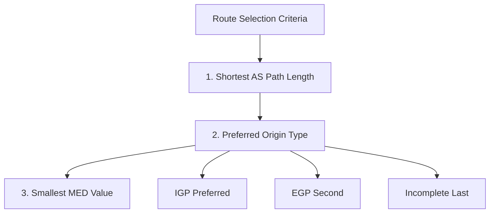
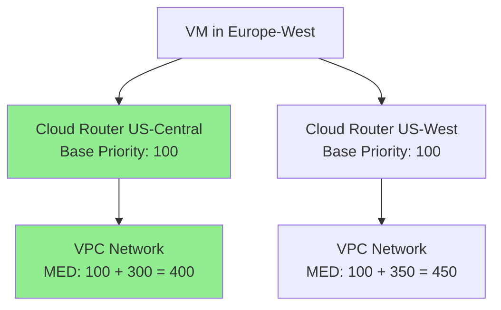

<details open>
<summary><b>092-Cloud-Router-with-MED-in-GCP-Google-Cloud-Part-3 (KK-CS45-script-v3)</b></summary>

# Session 92: Cloud Router with MED in GCP - Part 3

## Table of Contents
- [Overview](#overview)
- [BGP Route Selection Process in Legacy Mode](#bgp-route-selection-process-in-legacy-mode)
- [Multi-Exit Discriminator (MED)](#multi-exit-discriminator-med)
- [Base Advertise Priority Configuration](#base-advertise-priority-configuration)
- [Region-to-Region Cost Considerations](#region-to-region-cost-considerations)
- [Cloud Router Configuration Examples](#cloud-router-configuration-examples)
- [Summary](#summary)

## Overview
This session explores BGP route selection mechanisms in Google Cloud's legacy mode VPC networking, with a focus on Multi-Exit Discriminator (MED) values for controlling active/passive tunnel configurations. The video demonstrates how cloud router base advertise priorities and regional costs influence routing decisions, enabling network architects to create primary/secondary tunnel topologies.

## BGP Route Selection Process in Legacy Mode

### Route Selection Criteria Hierarchy

BGP route selection in legacy mode follows a specific hierarchy when multiple paths exist:



#### 1. Shortest AS Path Length
- BGP compares AS path lengths across available routes
- Routes with shorter AS paths are preferred
- After sorting shortest to longest, routes with longer paths are removed from consideration
- Example: Route with AS path `64513 64513` loses to route with single `64513`

#### 2. Preferred Origin Type
Origin types determine route preference when AS paths are equal:

- **IGP (Interior Gateway Protocol)**: Highest preference
- **EGP (Exterior Gateway Protocol)**: Middle preference  
- **Incomplete**: Lowest preference

If at least one next-hop has IGP origin, all EGP and incomplete routes are eliminated.

#### 3. Smallest MED Value
MED enables active/passive tunnel configurations by influencing route priority.

### MED Calculation Formula
```
Total Route Priority = Base Advertise Priority + Region-to-Region Cost
```

## Multi-Exit Discriminator (MED)

### Core Concepts

**Multi-Exit Discriminator (MED)** is a BGP path attribute used to discriminate among multiple exit points to a neighboring autonomous system. Lower MED values indicate preferred paths.

### Key MED Behaviors in Google Cloud

> [!IMPORTANT]
> MED values in Cloud Router determine route prioritization for outbound traffic from VPC to on-premises networks.

- **Base Priority Range**: 0-65535, where 0 is highest priority
- **Default Value**: 100
- **Purpose**: Create active/active or active/passive network topologies

### Active/Passive Tunnel Configuration

```bash
# Example: Configure primary tunnel (low MED)
gcloud compute routers update-bgp-peer ROUTER_NAME \
    --peer-name=PRIMARY_PEER \
    --advertised-route-priority=100

# Example: Configure backup tunnel (high MED)  
gcloud compute routers update-bgp-peer ROUTER_NAME \
    --peer-name=BACKUP_PEER \
    --advertised-route-priority=1000
```

## Base Advertise Priority Configuration

### Configuration Steps

1. Navigate to Cloud Router in Google Cloud Console
2. Edit BGP session
3. Set **Advertised Route Priority** value
4. Lower values = higher priority = preferred routes

### Priority Recommendations

| Scenario | Base Priority Range | Use Case |
|----------|-------------------|----------|
| Same Region | 0-200 | Standard intra-region routing |
| Cross-Region | 201+ | Inter-region routing with automatic costs |
| Backup Routes | 10201+ | Force routes to be secondary/backup only |

> [!NOTE]
> Base priorities above regional costs may cause unintended traffic routing. Google's automatic region-to-region costs start at 201, so cloud router priorities should typically remain under 200 within the same region.

## Region-to-Region Cost Considerations

### Automatic Cost Assignment

Google Cloud automatically assigns region-to-region costs based on:
- Geographic distance between regions
- Network latency factors
- Bandwidth characteristics

### Cost Examples
- US-Central ↔️ Europe-West: ~300-350 cost units
- US-Central ↔️ Asia-South: ~450-500 cost units

### Total MED Calculation
```
MED = Router Base Priority + Regional Transfer Cost
```

**Priority Matrix Example:**
| Source Region | Destination | Base Priority | Regional Cost | Total MED | Preference |
|----------------|-------------|---------------|---------------|-----------|------------|
| US-Central | Europe-West | 100 | 300 | 400 | Primary |
| US-West | Europe-West | 100 | 350 | 450 | Secondary |

## Cloud Router Configuration Examples

### Primary/Secondary Tunnel Setup

```yaml
# Cloud Router in Primary Region (US-Central)
bgp:
  peers:
  - name: primary-tunnel
    advertised-route-priority: 100  # Preferred path
  - name: backup-tunnel  
    advertised-route-priority: 200  # Backup path

# Routes learned by secondary router show increased priority
learned_routes:
  - prefix: 10.0.0.0/24
    med: 100  # Primary: 100 + 0 = 100
    med: 200  # Backup: 200 + 0 = 200
```

### Route Suppression Behavior

When higher-priority routes exist, lower-priority routes become **suppressed** but remain available for failover:

```diff
Routes Table:
+ Active Route: MED 100 (Primary tunnel)
- Suppressed Route: MED 200 (Backup tunnel)
  Custom route suppressed by higher priority route
```

### Cross-Region Route Selection



**Result**: Traffic prefers CR1 → VPC1 due to lower total MED (400 vs 450)

## Summary

### Key Takeaways

```diff
+ MED (Multi-Exit Discriminator) enables active/passive VPN tunnel configurations in Google Cloud
+ BGP route selection: AS Path Length → Origin Type → MED Value → Other attributes
+ Base advertise priority + regional transfer costs = total route priority/MED
+ Lower MED values indicate preferred routes for outbound traffic
+ Cross-region costs automatically added; keep base priorities < 201 to avoid routing surprises
- Misconfigured priorities can cause unintended traffic routing between regions
```

### Quick Reference

**BGP Route Selection Order (Legacy Mode):**
1. Shortest AS path length
2. Preferred origin: IGP > EGP > Incomplete
3. Smallest MED value
4. Additional BGP attributes...

**Common Configurations:**
- Default base priority: 100
- Regional priorities: 0-200 (recommended)
- Backup routes: 10201+ (ensures secondary status)
- Regional costs: 201+ (Google-managed)

### Expert Insight

**Real-world Application**: Use MED values to create cost-effective disaster recovery architectures where primary tunnels handle production traffic and backup tunnels provide failover capacity, optimizing both performance and cost.

**Expert Path**: Master MED interactions with BGP route policies and AS path prepending for complex multi-region architectures. Understand how Google Cloud's regional cost algorithms affect global routing decisions.

**Common Pitfalls**: 
- Setting base priorities >200 in single regions can inadvertently prefer cross-region routes
- Assuming MED works identically to on-premises BGP without accounting for automated regional cost additions
- Forgetting that suppressed routes remain viable for failover scenarios
</details>
