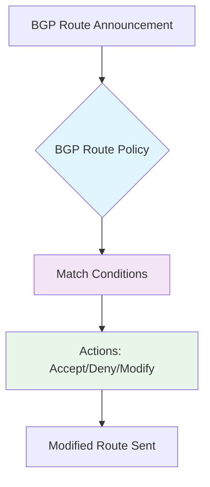
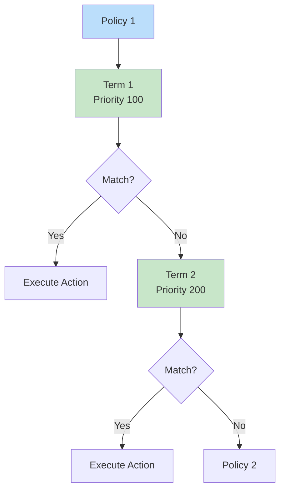

# Session 095: BGP Route Policies in Cloud Router - GCP Part 6

<details open>
<summary><b>095-BGP-Route-Policies-in-Cloud-Router-GCP-Part-6 (KK-CS45-script-v3)</b></summary>

## Table of Contents
- [Introduction to BGP Route Policies](#introduction-to-bgp-route-policies)
- [How BGP Route Policies Work](#how-bgp-route-policies-work)
- [Key Concepts and Terminology](#key-concepts-and-terminology)
- [Policy Structure and Evaluation](#policy-structure-and-evaluation)
- [Import vs Export Policies](#import-vs-export-policies)
- [Use Cases and Benefits](#use-cases-and-benefits)
- [Implementation Demo](#implementation-demo)
- [Summary](#summary)

## Introduction to BGP Route Policies

### Overview
BGP Route Policies in Google Cloud Platform (GCP) Cloud Router allow you to define rules for filtering, modifying, or controlling BGP routes. These policies help manage how routes flow between your VPC network and external networks connected via VPN, Cloud Interconnect, or Direct Peering.

### Key Concepts and Terminology

#### BGP Route Policies Basics
BGP (Border Gateway Protocol) route policies act as traffic controllers for routing announcements. They use **Common Expression Language (CEL)** to define complex matching and modification rules.



#### Important Limitations
> [!IMPORTANT]
> BGP Route Policies are **NOT supported** for custom learned routes. They work exclusively with subnet routes and BGP routes.

```yaml
# Supported route types:
  - subnet-routes: ✓
  - bgp-routes: ✓  
  - custom-learned-routes: ✗ (Not supported)
```

## How BGP Route Policies Work

### Policy Structure and Evaluation

#### Policy Components
- **Terms**: Ordered list of rules with different priorities
- **Conditions**: Match criteria (destination IP, source, etc.)
- **Actions**: Accept, Deny, Next term, or route modifications

#### Policy Evaluation Order


#### Route Processing Rules
| Rule | Behavior |
|------|----------|
| **Evaluation Order** | Terms evaluated in priority order (lowest number first) |
| **Action Types** | Accept, Deny, Next (continue evaluation) |
| **Modification Scope** | Subsequent terms can modify routes changed by previous terms |
| **Default Behavior** | Routes not explicitly dropped are accepted |

### Import vs Export Policies

#### Import Policies (Inbound Routes)
- Applied to routes being **learned** from external networks
- Controls which routes are accepted into your VPC routing table
- Example: Filter unwanted or specific routes

#### Export Policies (Outbound Routes)  
- Applied to routes being **advertised** to external networks
- Controls which routes are shared with peers
- Example: Hide internal subnets or modify route attributes

> [!NOTE]
> - One policy per direction (separate policies for import/export)
- Multiple BGP sessions can use the same policy
- Cannot apply same policy to both import and export simultaneously

## Use Cases and Benefits

### Route Filtering and Control
```yaml
# Example: Block specific subnet from being learned
import-policy:
  terms:
    - priority: 100
      match:
        destination: "192.168.1.0/24"
      action: "drop"
```

### Traffic Engineering with MED
**MED (Multi-Exit Discriminator)**: Influences path selection by making routes more or less preferable.

```yaml
# Make route less preferred (backup path)
export-policy:
  terms:
    - priority: 100
      match:
        destination: "10.0.0.0/24"  
      action:
        set-med: 2000  # Higher MED = Less preferred
```

### Path Prepending (AS Path Manipulation)
Modify AS path to make routes appear less attractive to traffic:
- Prepend AS numbers to make path longer
- Influences inbound traffic flow (from peer to you)

```yaml
# Traffic Engineering Example
export-policy:
  terms:
    - priority: 100
      action:
        prepend-as-path: "64512"  # 3x times makes path less preferred
```

## Implementation Demo

### Creating BGP Route Policies

#### Step 1: Create the Policy
```bash
gcloud compute routers add-route-policy first-project-router \
  --policy-name my-import-policy \
  --kind import \
  --region asia-south1
```

#### Step 2: Add Policy Terms
```bash
gcloud compute routers add-route-policy-term first-project-router \
  --policy-name my-import-policy \
  --region asia-south1 \
  --priority 100 \
  --match-destination "192.168.1.0/24" \
  --action drop
```

#### Step 3: Attach to BGP Session
```bash
gcloud compute routers update-bgp-peer first-project-router \
  --peer-name first-project-second-session \
  --region asia-south1 \
  --import-route-policies my-import-policy
```

### Demo Results Verification

**Before Route Policy:**
- Routes learned: 192.168.1.0/24 and 192.168.2.0/24
- Traffic flowed via both tunnels using ECMP

**After Import Policy (Drop 192.168.1.0/24):**
- Routes learned: Only 192.168.2.0/24
- Traffic redirected to tunnel advertising the allowed route

**After MED Modification:**
```diff
# Original MED value: 558 (both routes equal)
# After applying MED 2000 to one route:
- Route 1 MED: 558 (preferred)
+ Route 2 MED: 2000 (backup/less preferred)
```

### Common Configuration Examples

```yaml
# Complete import policy example
import-policy:
  name: block-192-168-1
  terms:
    - priority: 100
      match:
        destination: "192.168.1.0/24"
      action: drop
    - priority: 200  # Default accept all others
      action: accept

# Export policy with MED manipulation
export-policy:
  name: traffic-engineering-med
  terms:
    - priority: 100
      match:
        destination: "10.0.0.0/24"
      action:
        set-med: 2000
        
# Export policy with route filtering
export-policy:
  name: hide-internal-routes
  terms:
    - priority: 100
      match:
        destination: "10.10.0.0/24"
      action: drop
```

## Summary

### Key Takeaways
```diff
+ BGP Route Policies provide granular control over route advertisement and acceptance
+ Use import policies for inbound route filtering (learning routes)
+ Use export policies for outbound route control (advertising routes)
+ MED manipulation helps with traffic engineering and path preference
+ Policies are applied per BGP session direction (import/export)
+ Common Expression Language (CEL) enables complex matching rules
- BGP Route Policies do NOT work with custom learned routes
- Only subnet and BGP routes are supported
- One policy per direction (cannot use same policy for import and export)
```

### Quick Reference
| Command | Purpose |
|---------|---------|
| `gcloud compute routers add-route-policy` | Create new BGP route policy |
| `gcloud compute routers add-route-policy-term` | Add term to existing policy |
| `gcloud compute routers update-bgp-peer` | Attach/detach policy from BGP session |
| `gcloud compute routers remove-route-policy-term` | Remove term from policy |

**Important Attributes:**
- `destination`: Match IP prefixes
- `communities`: Match BGP communities
- `as-path`: Match AS path patterns
- Actions: `accept`, `drop`, `next`, `set-med`, `prepend-as-path`

### Expert Insight

#### **Real-world Application**
In production environments, BGP route policies are crucial for:
- **Multi-cloud connectivity**: Controlling which routes are exchanged between GCP and on-premises or other cloud providers
- **Traffic engineering**: Directing traffic through preferred paths using MED manipulation
- **Security**: Blocking unwanted route advertisements that could cause routing loops

#### **Expert Path**
1. **Start with route filters**: Begin with accepting all routes, then selectively filter out unwanted ones
2. **Test thoroughly**: Complex policies can create routing blackholes - always test in non-production first
3. **Monitor route changes**: Use Cloud Router logs to verify policy effects
4. **Combine with other features**: Use with VPC Service Controls and Cloud Armor for comprehensive network security

#### **Common Pitfalls**
- **Forgetting policy application**: Policies only take effect after attaching to BGP sessions
- **Multiple policy management**: When attaching multiple policies, specify all policy names or existing ones get removed  
- **MED value ranges**: MED values should be consistent across peers for proper traffic engineering
- **Route evaluation limits**: Each route is evaluated exactly once per term - avoid infinite loops
- **Fail open behavior**: By default, unmatched routes are accepted - add explicit drop terms for fail-closed behavior

> [!NOTE]
> Always test BGP policies in a lab environment before deploying to production. Route changes can cause service disruptions if misconfigured.

</details>
