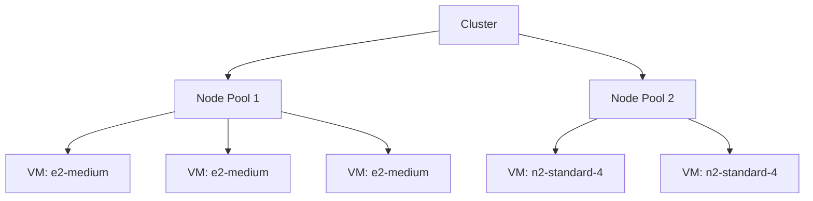

# Session 012: How to Create Kubernetes Cluster on GCP

<details open>
<summary><b>How to Create Kubernetes Cluster on GCP (KK-CS45-script-v2)</b></summary>

## Table of Contents
- [Overview](#overview)
- [Key Concepts](#key-concepts)
  - [Kubernetes Clusters](#kubernetes-clusters)
  - [GKE Modes: Standard vs Autopilot](#gke-modes-standard-vs-autopilot)
  - [Node Pools and Nodes](#node-pools-and-nodes)
  - [Kubernetes Control Plane](#kubernetes-control-plane)
- [Lab Demo: Creating Kubernetes Cluster on GCP](#lab-demo-creating-kubernetes-cluster-on-gcp)
  - [Step 1: Access GKE Console](#step-1-access-gke-console)
  - [Step 2: Choose Cluster Mode](#step-2-choose-cluster-mode)
  - [Step 3: Configure Basic Settings](#step-3-configure-basic-settings)
  - [Step 4: Node Pool Configuration](#step-4-node-pool-configuration)
  - [Step 5: Create and Monitor](#step-5-create-and-monitor)
- [Summary](#summary)

## Overview

This session demonstrates how to create Kubernetes clusters on Google Cloud Platform using Google Kubernetes Engine (GKE). We'll explore the differences between Autopilot and Standard modes, understand node configuration options, and walk through the complete cluster creation process. The focus is on practical implementation while covering key Kubernetes concepts for cloud-native deployments.

> [!NOTE]
> GKE simplifies Kubernetes cluster management by abstracting the underlying infrastructure while providing enterprise-grade features and auto-scaling capabilities.

## Key Concepts

### Kubernetes Clusters

A Kubernetes cluster consists of a control plane and worker nodes. The control plane manages the cluster state and schedules workloads, while worker nodes run the actual application containers.

**Key Components:**
- **Control Plane**: Manages cluster state, scheduling, and API server
- **Worker Nodes**: Run application containers in pods
- **Node Pools**: Groups of worker nodes with similar configurations

### GKE Modes: Standard vs Autopilot

GKE offers two modes for cluster creation:

#### Autopilot Mode
```yaml
autopilot:
  enabled: true
  features:
    - auto-scaling
    - managed-node-upgrades
    - security-policies
```
- **Pros**: Fully managed operations, automatic scaling and upgrades
- **Cons**: Higher cost, less customizability
- **Use Case**: Production workloads requiring high availability

#### Standard Mode
```yaml
standard:
  enabled: true
  customization:
    - node-pools
    - machine-types
    - networking
```
- **Pros**: Full control over node configuration and cost optimization
- **Cons**: Manual management of upgrades and scaling
- **Use Case**: Development environments or cost-sensitive production

> [!IMPORTANT]
> Choose Autopilot for simplicity and Standard mode when you need precise control over infrastructure costs and configurations.

### Node Pools and Nodes

Node pools define groups of worker nodes with identical configurations.

**Node Pool Configuration:**
- **Machine Type**: e.g., `e2-medium`, `n2-standard-4`
- **Disk Size**: Boot disk and additional storage
- **Preemptible VMs**: Cost-effective, short-lived instances



### Kubernetes Control Plane

The control plane components include:
- **API Server**: REST API for cluster interaction
- **Scheduler**: Assigns workloads to nodes
- **Controller Manager**: Maintains desired cluster state

**Version Channels:**
- **Rapid**: Latest features, frequent updates
- **Regular**: Balanced stability and features
- **Stable**: Maximum stability, conservative updates

## Lab Demo: Creating Kubernetes Cluster on GCP

This hands-on demo walks through creating a Kubernetes cluster using GKE's console.

### Step 1: Access GKE Console

1. Navigate to Google Cloud Console
2. Search for "Kubernetes Engine"
3. Click "Create cluster"

### Step 2: Choose Cluster Mode

```bash
# Command line equivalent for cluster creation
gcloud container clusters create my-cluster \
    --zone us-central1-a \
    --cluster-version=1.27.5-gke.200
```

For Autopilot mode:
- Higher cost but fully managed
- Perfect for production workloads
- Automatic node pool management

For Standard mode:
- Manual configuration required
- Cost-effective for development
- Full control over infrastructure

### Step 3: Configure Basic Settings

**Cluster Name**: Choose a descriptive identifier (e.g., `production-cluster`)

**Region Selection**:
- Choose region based on latency and compliance requirements
- Consider cross-region replication for high availability

**Kubernetes Version**:
```bash
# Check available versions
gcloud container get-server-config --zone=us-central1-a

# Available channels:
# - REGULAR: Stable releases
# - RAPID: Latest features
# - STABLE: Conservative updates
```

> [!NOTE]
> Use Stable channel for production environments to minimize unexpected disruptions from frequent updates.

### Step 4: Node Pool Configuration

**Node Count Options**:
- **Fixed Size**: Specify exact number of nodes
- **Auto-scaling**: Define min/max node count

```yaml
nodePools:
  - name: default-pool
    initialNodeCount: 2
    config:
      machineType: e2-medium
      diskSizeGb: 100
      preemptible: false
    autoscaling:
      enabled: true
      minNodeCount: 1
      maxNodeCount: 10
```

**Machine Type Selection**:
| Machine Type | vCPU | Memory | Use Case |
|--------------|------|--------|----------|
| e2-micro | 0.2 | 1GB | Light workloads |
| e2-small | 0.5 | 2GB | Development |
| e2-medium | 1 | 4GB | General purpose |
| n2-standard-4 | 4 | 16GB | CPU-intensive |

**Preemptible VMs**:
- Cost savings up to 80%
- May be terminated with short notice
- Best for batch processing and fault-tolerant workloads

### Step 5: Create and Monitor

1. Click "Create" button
2. Wait approximately 5 minutes for cluster creation
3. Verify cluster appears in the GKE dashboard

```bash
# Connect to cluster
gcloud container clusters get-credentials my-cluster --zone us-central1-a

# Verify connection
kubectl get nodes
```

**Expected Output:**
```
NAME                                        STATUS   ROLES    AGE   VERSION
gke-my-cluster-default-pool-abc123   Ready    <none>   5m    v1.27.5-gke.200
gke-my-cluster-default-pool-def456   Ready    <none>   5m    v1.27.5-gke.200
```

> [!IMPORTANT]
> Default cluster includes 1 control plane node (managed by GKE) and 2-3 worker nodes. Control plane is not visible in Compute Engine.

## Summary

### Key Takeaways
```diff
+ GKE provides two modes: Autopilot (fully managed) and Standard (manual control)
+ Node pools allow grouping nodes with similar configurations
+ Autoscaling automatically adjusts node count based on workload
+ Preemptible VMs reduce costs for fault-tolerant applications
+ Kubernetes version selection impacts stability vs features
+ Control plane is managed by Google, nodes run application workloads
+ Cluster creation takes approximately 5 minutes
+ Use Cloud Shell or SDK for programmatic cluster management
```

### Quick Reference

**Create GKE Cluster (Standard)**:
```bash
gcloud container clusters create my-cluster \
    --zone=us-central1-a \
    --cluster-version=1.27.5-gke.200 \
    --num-nodes=2 \
    --machine-type=e2-medium
```

**Connect to Cluster**:
```bash
gcloud container clusters get-credentials my-cluster --zone=us-central1-a
kubectl get nodes
```

**Common GKE Commands**:
- `gcloud container clusters list` - List all clusters
- `kubectl get pods -A` - View running pods
- `gcloud container clusters delete my-cluster` - Remove cluster

### Expert Insight

**Real-world Application**: GKE clusters are ideal for containerized applications requiring high availability. Use Autopilot mode for teams focusing on application development rather than infrastructure management, and Standard mode for organizations needing fine-grained control over costs and performance.

**Expert Path**: Master advanced GKE features like:
- Multi-cluster architectures with GKE Hub
- Workload Identity for secure service access
- Network Policy configuration for microsegmentation
- Integration with Cloud Load Balancing and Istio service mesh

Master cluster upgrades and node pool management. Practice with Google Cloud Free Tier to experiment safely.

**Common Pitfalls**:
```diff
- Not configuring backup policies for etcd data
- Oversizing nodes "just in case" (use autoscaling instead)
- Forgetting to set resource limits on pods
- Using preemptible VMs for stateful workloads
- Ignoring network egress costs in multi-region deployments
- Not monitoring cluster resource utilization
- Over-relying on single-zone deployments for production
```

</details>