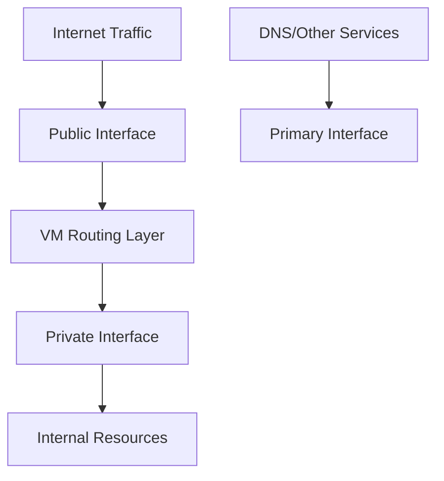

# Session 024: Multi-NIC VM GCP

<details open>
<summary><b>Multi-NIC VM GCP (KK-CS45-script-v2)</b></summary>

## Table of Contents
- [Overview](#overview)
- [Key Concepts and Deep Dive](#key-concepts-and-deep-dive)
  - [Multi-Network Interface Fundamentals](#multi-network-interface-fundamentals)
  - [Use Cases and Scenarios](#use-cases-and-scenarios)
  - [Configuration and Limitations](#configuration-and-limitations)
  - [Network Interface Naming and DNS](#network-interface-naming-and-dns)
  - [IP Forwarding and Routing](#ip-forwarding-and-routing)
  - [Policy Routing Implementation](#policy-routing-implementation)
  - [Firewall Rules Behavior](#firewall-rules-behavior)
- [Lab Demos](#lab-demos)
  - [Creating Multi-NIC VM Instance](#creating-multi-nic-vm-instance)
  - [Network Interface Verification](#network-interface-verification)
  - [Traffic Routing and Pinging](#traffic-routing-and-pinging)
  - [Policy Routing Configuration](#policy-routing-configuration)
  - [Firewall Rule Testing](#firewall-rule-testing)
- [Summary](#summary)

## Overview

Multi-network interface (Multi-NIC) VMs in Google Cloud Platform (GCP) enable a single virtual machine instance to connect to multiple Virtual Private Cloud (VPC) networks simultaneously. This provides enhanced flexibility for network isolation, traffic separation, and advanced networking scenarios. The session demonstrates the configuration, limitations, routing considerations, and practical implementation of multi-NIC VMs using real GCP console examples.

### Key Concepts and Deep Dive

#### Multi-Network Interface Fundamentals

A multi-network interface VM allows connection to multiple VPC networks where each network interface belongs to a different VPC:

- **Primary Interface**: The first network interface (nic0) serves as the primary interface for the VM
- **Secondary Interfaces**: Additional interfaces (nic1, nic2, etc.) provide connectivity to secondary VPC networks
- All VPC networks must belong to the same GCP project unless shared VPC is enabled
- Each interface can have its own IP addressing scheme and external IP assignment

```bash
# Example interface naming convention
ens4 - Primary interface (nic0)
ens5 - Secondary interface (nic1)
ens6 - Secondary interface (nic2)
```

#### Use Cases and Scenarios

##### Network and Security Functions

Multi-NIC VMs are commonly used for network appliances such as:

- **Load Balancers**: Distribute traffic across multiple networks
- **Proxies**: Route and filter traffic between networks
- **Network Security Appliances**: Inspect and secure traffic at network boundaries

##### Traffic Isolation and Segmentation

One of the primary use cases involves separating public and private traffic:

- **Public Interface**: Handles inbound internet traffic
- **Private Interface**: Communicates with internal resources (databases, storage)
- Traffic flows through the public interface, gets routed within the VM, then forwarded to private interfaces for backend communication



#### Configuration and Limitations

Multi-NIC VMs have specific configuration requirements and limitations:

| Aspect | Details |
|--------|---------|
| Creation Time | Interfaces can only be configured during VM creation |
| Modification | Cannot add/remove interfaces from existing VMs |
| Minimum Interfaces | 1 (default) |
| Maximum Interfaces | Up to 8, CPU-dependent |
| CPU Requirements | 2 CPUs = max 2 interfaces<br>4 CPUs = max 4 interfaces<br>8 CPUs = max 8 interfaces<br>6 CPUs = max 6 interfaces |

> [!IMPORTANT]
> The number of interfaces is strictly tied to vCPU count. Attempting to create VMs with more interfaces than CPUs allow will result in creation failure with error: "too many network interfaces"

#### Network Interface Naming and DNS

Network interfaces are sequentially numbered and assigned names:

- **nic0**: Primary interface (ens4 in Linux)
- **nic1**: Secondary interface (ens5 in Linux)
- **nic2**: Secondary interface (ens6 in Linux)

**Critical DNS Behavior**:
- Internal DNS queries using the instance hostname **always resolve to the primary interface (nic0)**
- Secondary interfaces cannot perform hostname-based internal DNS resolution
- This behavior cannot be modified and is inherent to GCP's network stack

> [!NOTE]
> Always design applications and scripts to use IP addresses or external DNS for secondary interfaces, as hostname resolution will consistently route to nic0.

#### IP Forwarding and Routing

IP forwarding is a crucial concept in multi-NIC scenarios:

- **VM-Level Configuration**: IP forwarding is enabled at the VM level, not per interface
- **Scope**: Applies to all network interfaces on the VM
- **Implication**: VM can forward traffic between different VPC networks connected via multiple interfaces

```bash
# IP forwarding setting in GCP console
# (Enabled during VM creation or via API)
ip_forwarding: true  # VM-level setting
```

#### Policy Routing Implementation

Policy routing enables secondary interfaces to communicate outside their subnet range:

**Problem**: Secondary interfaces can only communicate within their assigned subnet range without additional configuration
**Solution**: Configure specific routes for external communication

```bash
# Example policy routing command
sudo route add -net 8.8.4.4 netmask 255.255.255.255 gw 192.168.5.1 dev ens5

# Verify route configuration
ip route show
# Output will show specific route for target IP via secondary interface gateway
```

**Route Components**:
- **Target Network**: IP address range or specific IP (e.g., 8.8.4.4)
- **Gateway**: Subnet gateway of the secondary interface (e.g., 192.168.5.1)
- **Device**: Network interface name (e.g., ens5 for nic1)

> [!WARNING]
> Without policy routing, secondary interfaces are limited to their subnet range communication only.

#### Firewall Rules Behavior

Firewall rules in multi-NIC environments have specific behavior patterns:

**Rule Scope**: Firewall rules apply at the **VPC network level**, not at the VM or interface level

**Key Implications**:
- A firewall rule in one VPC affects all interfaces connected to that VPC
- To control traffic on a specific interface, create firewall rules in each respective VPC
- Rules apply to the entire VPC, affecting all VMs and interfaces within that network

```bash
# Example: Firewall rule blocks ICMP from specific source
# Applied to "default" VPC - affects nic0 interface
# To block traffic on nic1, create identical rule in nic1's VPC
```

### Lab Demos

#### Creating Multi-NIC VM Instance

**Preparation**:
1. Create multiple VPC networks in the same GCP project
2. Each VPC should have subnets in the same region

**VM Creation Steps**:
1. Navigate to GCP Compute Engine console
2. Click "Create Instance"
3. Configure basic settings (name, region: asia-south1-mumbai)
4. Select machine type with appropriate CPU count (minimum 4 CPUs for 3 interfaces)
5. Proceed to "Networking" section
6. First interface is automatically created (nic0)
7. Click "Add another network interface" for additional interfaces
8. Select different VPC networks for each interface
9. Configure external IP options per interface
10. Create the VM

**Machine Type Configuration**:
- 2 CPUs: Maximum 2 interfaces
- 4 CPUs: Maximum 4 interfaces
- 8 CPUs: Maximum 8 interfaces

#### Network Interface Verification

**Console Verification**:
- Check VM details page shows multiple internal IPs
- Verify external IP assignments match configuration
- Confirm VPC network assignments for each interface

**SSH Verification**:
```bash
# View all network interfaces
ip addr show

# Output example:
# ens4: Primary interface (nic0) - 10.142.0.2/32
# ens5: Secondary interface (nic1) - 192.168.5.7/32
# ens6: Secondary interface (nic2) - 10.128.0.2/32
```

#### Traffic Routing and Pinging

**Primary Interface Testing**:
```bash
# Ping external IP from primary interface (works by default)
ping 8.8.8.8
# Success - uses nic0 routing table
```

**Secondary Interface Testing Without Routing**:
```bash
# Attempt to ping external IP from secondary interface
ping -I ens5 8.8.8.8
# Fails - no route configured for external communication
```

#### Policy Routing Configuration

**Route Addition for Secondary Interface**:
```bash
# Add route for external IP via secondary interface
sudo route add -net 8.8.4.4 netmask 255.255.255.255 gw 192.168.5.1 dev ens5

# Verify route
ip route show
# Shows: 8.8.4.4 via 192.168.5.1 dev ens5
```

**Testing Policy Routing**:
```bash
# Ping target IP via secondary interface
ping 8.8.4.4
# Success - uses configured route via ens5
```

#### Firewall Rule Testing

**Creating Targeted Firewall Rules**:
1. Navigate to VPC Network > Firewall
2. Create ingress deny rule for ICMP protocol
3. Specify source IP range (single VM IP with /32)
4. Apply to specific VPC network

**Testing Firewall Impact**:
```bash
# Test from different VM in same VPC
ping [target-interface-IP]
# Blocked - firewall rule applied at VPC level
```

**Multi-VPC Rule Verification**:
- Rules affect interfaces in the same VPC
- Create separate rules for each VPC to control multiple interfaces
- Firewall rules are VPC-scoped, not interface-scoped

## Summary

### Key Takeaways

```diff
+ Multi-NIC VMs enable connection to multiple VPC networks simultaneously
+ Each interface belongs to different VPC, all in same project
+ Primary interface (nic0) handles hostname-based DNS resolution
+ Secondary interfaces require policy routing for external communication
+ CPU count determines maximum number of allowed interfaces
+ IP forwarding enabled at VM level, applies to all interfaces
+ Firewall rules operate at VPC level, affecting all interfaces in that VPC
- Interfaces can only be configured during VM creation
- Cannot add/remove interfaces from existing VMs
- Internal DNS queries always resolve to primary interface
```

### Quick Reference

#### Interface Limits by CPU
| CPUs | Max Interfaces |
|------|----------------|
| 2 | 2 |
| 4 | 4 |
| 6 | 6 |
| 8 | 8 |

#### Policy Routing Commands
```bash
# Add route for secondary interface
sudo route add -net [target-ip] netmask 255.255.255.255 gw [subnet-gateway] dev [interface]

# Check configured routes
ip route show
```

#### Interface Naming (Linux)
- ens4: nic0 (Primary)
- ens5: nic1 (Secondary)
- ens6: nic2 (Secondary)

### Expert Insight

#### Real-world Application
In enterprise environments, multi-NIC VMs are commonly used for:
- **Security appliances**: Deep packet inspection between public/private traffic
- **Load balancing**: Distributing traffic across isolated network segments
- **Multi-tenant environments**: Providing network isolation between different business units
- **Legacy system integration**: Connecting existing networks while maintaining separation

#### Expert Path
1. **Start with Planning**: Map out all required network connections and traffic flows
2. **CPU Sizing**: Calculate required vCPU based on interface count needs
3. **IP Planning**: Design comprehensive IP addressing scheme across multiple VPCs
4. **Routing Strategy**: Implement policy-based routing for complex traffic requirements
5. **Security Design**: Understand VPC-scoped firewall implications
6. **Monitoring**: Implement network monitoring for all interfaces independently

#### Common Pitfalls
- **Overlooking CPU Requirements**: Attempting more interfaces than CPUs allow
- **Forget Policy Routing**: Secondary interfaces limited to subnet communication without routes
- **DNS Resolution Errors**: Using hostnames instead of IPs for secondary interface connections
- **Firewall Misconfiguration**: Expecting VM-level rules instead of VPC-level application
- **Shared VPC Assumptions**: Attempting cross-project interfaces without proper shared VPC setup
- **Traffic Isolation Failure**: Not accounting for routing table complexity in multi-interface scenarios

</details>