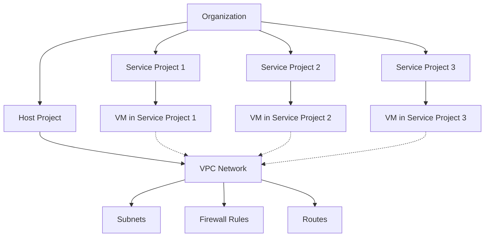

# Session 25: Creating Shared VPC in GCP

<details open>
<summary><b>Creating Shared VPC in GCP (KK-CS45-script-v2)</b></summary>

## Table of Contents
- [Overview](#overview)
- [Key Concepts](#key-concepts)
  - [What is Shared VPC?](#what-is-shared-vpc)
  - [Host vs Service Projects](#host-vs-service-projects)
  - [Architecture Overview](#architecture-overview)
  - [Sharing Options](#sharing-options)
  - [Permissions and Roles](#permissions-and-roles)
- [Lab Demo: Creating Shared VPC](#lab-demo-creating-shared-vpc)
  - [Enable Host Project](#enable-host-project)
  - [Configure Sharing Mode](#configure-sharing-mode)
  - [Attach Service Projects](#attach-service-projects)
  - [Individual Subnet Sharing](#individual-subnet-sharing)
  - [Project-Level Permissions](#project-level-permissions)
- [Summary](#summary)

## Overview

This session covers Google's Cloud Shared VPC functionality, which enables centralized networking management across multiple GCP projects within an organization. Shared VPC allows organizations to create a central VPC network in a "Host" project that can be consumed by other "Service" projects, providing better governance and reducing duplication of networking resources.

### Key Concepts

#### What is Shared VPC?

Shared VPC is a networking feature in Google Cloud Platform that allows you to share networking resources across multiple projects within an organization. This eliminates the need for each project to maintain its own VPC infrastructure, instead centralizing network management in a dedicated "host" project.



The main benefits include:
- **Centralized Management**: Network resources are managed by a dedicated networking team
- **Cost Optimization**: Eliminates duplicate networking components across projects
- **Security**: Centralized firewall and routing policies
- **Scalability**: Easy to add new projects to the shared network

#### Host vs Service Projects

| Concept | Host Project | Service Project |
|---------|-------------|-----------------|
| **Purpose** | Contains and manages shared VPC networks | Consumes resources from host project |
| **Relationship** | One-to-many (1 host can serve multiple service projects) | Many-to-one (1 service can only attach to 1 host) |
| **Responsibilities** | Network administration, subnet creation, firewall rules | Compute resources (VMs, Load Balancers) |
| **Permissions** | Full control over networking resources | Limited access based on assigned roles |
| **Hybrid Status** | Cannot be a service project simultaneously | Cannot be a host project simultaneously |

> **Important**: A project cannot be both a host project and a service project at the same time. A service project can only be attached to one host project.

#### Architecture Overview

Shared VPC creates a clear separation of responsibilities:

```diff
+ Networks reside in Host Project
+ Compute instances reside in Service Projects
+ Central networking team manages infrastructure
- Service project teams cannot modify network configuration
- All traffic routing controlled by host project policies
```

#### Sharing Options

You have two primary ways to configure VPC resource sharing:

| Sharing Mode | Scope | Permissions Required |
|--------------|--------|---------------------|
| **Share All Subnets** | Entire VPC and all subnets | Project-level IAM roles |
| **Individual Subnets** | Specific subnets only | Subnet-level IAM permissions |

**Resources that can be shared:**
- VPC networks
- Firewall rules
- Subnets
- Routes
- Private service connection configurations

#### Permissions and Roles

To access shared VPC resources, users need specific IAM roles:

**Minimum Required Role:**
- `Compute Network User` - Allows read-only access for network configurations

**Supported Roles (grant same privileges as Compute Network User):**
- `Owner`
- `Editor`
- `Compute Network Admin`
- `Compute Instance Admin (beta)`

> **Note**: The `Compute Network User` role must be granted either at the host project level (for all subnets) or at individual subnet levels (for specific subnets).

## Lab Demo: Creating Shared VPC

### Enable Host Project

1. Navigate to **VPC Networks > Shared VPC** in the GCP Console
2. Click **Enable Host Project**
3. Review and agree to the settings
4. Click **Save and Continue**

This enables the current project as a host project for shared VPC functionality.

### Configure Sharing Mode

Choose between two sharing modes:

**Option 1: Share All Subnets**
- Grants access to all subnets across all VPCs in the host project
- Requires project-level IAM permissions
- Recommended for organizations with centralized control

**Option 2: Individual Subnets**
- Allows granular control over specific subnets
- Requires subnet-level permissions
- Better for selective resource sharing

### Attach Service Projects

1. In the Shared VPC settings, navigate to **Attached Projects**
2. Click **Attach Project**
3. Add service project IDs that should access the shared resources
4. Configure IAM roles for users in service projects

```bash
# Example service project IDs
service-project-1
service-project-2
```

> **Important**: Users in service projects must have appropriate roles granted on the host project or selected subnets.

### Individual Subnet Sharing

For granular control:

1. Go to **VPC Networks > Shared VPC > Shared Subnets**
2. Select specific subnets to share
3. Add principals and assign the `Compute Network User` role
4. Save the configuration

### Project-Level Permissions

For broader access:

1. Go to **IAM & Admin > IAM** in the host project
2. Add members from service projects
3. Grant `Compute Network User` role (or equivalent)
4. Apply the changes

## VM Creation in Shared VPC

Once permissions are configured:

1. Switch to the service project
2. Navigate to **Compute Engine > VM Instances > Create Instance**
3. In the **Networking** section:
   - When creating VM instances, select "Networks shared with me"
   - Choose from available shared subnets
   - Verify the network interface configuration

```diff
+ Service projects will only see subnets available through shared VPC
- VMs cannot be created in regions where no shared subnets are available
! Ensure proper region selection based on shared subnet locations
```

### Detaching Service Projects

To remove a project from shared VPC:

1. Go to **Shared VPC > Attached Projects**
2. Select the service project to remove
3. Click **Detach**
4. Confirm that no resources are using shared network resources

> **Warning**: Detachment will fail if any VMs or load balancers are still using resources from the host project.

### Disabling Shared VPC

1. Go to **VPC Networks > Shared VPC**
2. Click **Disable**
3. Enter the project ID to confirm
4. All attached service projects will be automatically detached

## Summary

### Key Takeaways

```diff
+ Shared VPC enables centralized network management across multiple GCP projects
+ Host projects manage networking resources while service projects consume them
+ Choose sharing mode (all subnets vs. individual) based on governance requirements
+ Always assign appropriate IAM roles (minimum: Compute Network User) for access
+ Service projects can only attach to one host project at a time
- Ensure no resources are using shared networks before detaching projects
```

### Quick Reference

**Common Commands/Configurations:**

| Action | GCP Console Path | IAM Role Required |
|--------|------------------|-------------------|
| Enable Host Project | VPC Networks > Shared VPC | Organization Admin |
| Attach Service Project | Shared VPC > Attached Projects | VPC Network Admin |
| Grant Access | IAM & Admin > IAM | VPC Network Admin |
| Create VM in Shared VPC | Compute Engine > VM Instances | Compute Network User |

**Key Limitations:**
- 1 Service Project = 1 Host Project
- 1 Host Project = Multiple Service Projects
- Project cannot be both host and service simultaneously

### Expert Insight

**Real-world Application**: Use Shared VPC in enterprise environments where you need to enforce network security policies across department projects while allowing compute teams to deploy resources independently.

**Expert Path**: Start with individual subnet sharing for development environments, then move to full subnet sharing as your organization matures its networking governance practices.

**Common Pitfalls**:
- Forgetting to assign IAM roles for service project users
- Attempting to establish multiple host project relationships
- Not verifying resource cleanup before detaching projects
- Misunderstanding the difference between project-level and subnet-level permissions

</details>