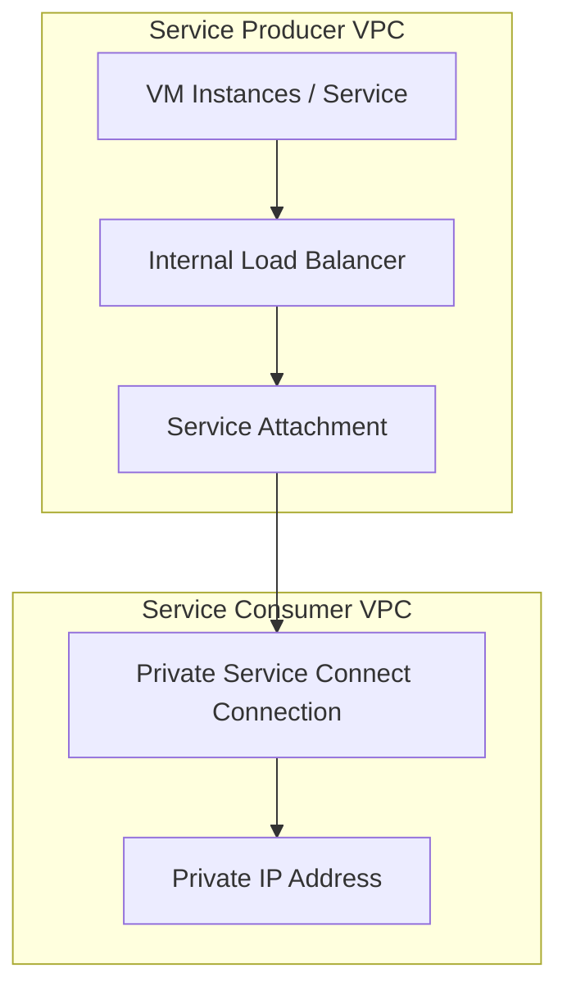
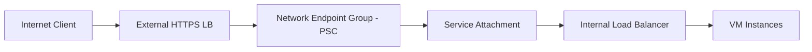

# Session 27: Creating Private Service Connect GCP in Hindi

<details open>
<summary><b>Session 27: Creating Private Service Connect GCP in Hindi (KK-CS45-script-v2)</b></summary>

## Table of Contents

- [Overview](#overview)
- [Understanding Private Service Connect in Google Cloud](#understanding-private-service-connect-in-google-cloud)
- [Key Architecture Components](#key-architecture-components)
- [Setting up Private Service Connect](#setting-up-private-service-connect)
- [Published Services and Google APIs](#published-services-and-google-apis)
- [Service Attachments and Consumer Connections](#service-attachments-and-consumer-connections)
- [Internet Access via PSC](#internet-access-via-psc)
- [Best Practices](#best-practices)
- [Summary](#summary)

## Overview

This session provides a comprehensive guide to creating and configuring Private Service Connect (PSC) in Google Cloud Platform. Private Service Connect enables secure, private connectivity between services across VPC networks without exposing endpoints to the public internet. The training demonstrates how to set up service publishers, create consumer connections, access Google APIs privately, and enable internet-facing access through load balancers.

Private Service Connect solves traditional connectivity challenges by providing secure service-to-service communication using Google's internal network backbone. The session covers both internal connectivity within GCP and options for external access through properly configured load balancers.

## Understanding Private Service Connect in Google Cloud

### Core Concepts

Private Service Connect (PSC) is a Google Cloud service that enables private connectivity between your VPC networks and Google Cloud services or other VPC networks. Unlike traditional service exposure through public IPs, PSC maintains privacy and security while providing low-latency connectivity.

### Key Benefits

- **Security First**: Services are accessible only through private IPs within authorized VPCs
- **Performance**: Traffic flows through Google's internal network infrastructure
- **Simplified Networking**: Eliminates complex VPN or peering configurations for many use cases
- **Multi-Project Support**: Enables secure connectivity across different Google Cloud projects

### Use Cases

1. **Microservices Architecture**: Private communication between services deployed in different VPCs
2. **Shared Services**: Providing access to common services like databases or APIs across business units
3. **Hybrid Cloud**: Secure access to Google Cloud services from on-premises infrastructure
4. **Multi-tenant Applications**: Isolated access to shared resources

## Key Architecture Components

Private Service Connect consists of several core components working together to provide private service connectivity.

### Service Producer

The producer side consists of:
- **VPC Network**: Contains the services to be exposed
- **internal Load Balancer**: Provides access to the backend services
- **Service Attachment**: The resource that exposes the load balancer privately



### Service Consumer

The consumer side includes:
- **Private Service Connect Connections**: Establish connectivity to published services
- **Network Endpoint Groups (NEGs)**: When accessing via external load balancers
- **DNS Resolution**: Automatic DNS setup for service discovery

### Connection Types

1. **Published Services**: Pre-published Google Cloud APIs (BigQuery, Storage, etc.)
2. **Custom Services**: User-created services through service attachments

## Setting up Private Service Connect

### Prerequisites

Before creating PSC connections, ensure:

- Active Google Cloud project with billing enabled
- VPC networks configured
- Appropriate IAM permissions (Compute Network Admin, Service Consumer Management roles)
- Reserved subnet ranges for PSC (purpose: PRIVATE_SERVICE_CONNECT)

### Step-by-Step: Creating Published Service Connections

**Step 1: Navigate to Network Services**

```bash
# In GCP Console: Network Services > Private Service Connect
# Select "Connected Endpoints"
# Click "Connect Endpoint"
```

**Step 2: Choose Target Service**

- Select "All Google APIs" for accessing Google Cloud APIs privately
- Provide endpoint name (e.g., "my-google-apis")

**Step 3: Configure Network Settings**

```yaml
# Network configuration
network: my-vpc
region: asia-south1
subnet: PRIVATE_SERVICE_CONNECT subnet
ipAddress: 192.168.6.2  # Reserved IP address
```

**Lab Demo: Google APIs Access**

1. Create PSC connection for Google APIs
2. Use curl to test connectivity from VM instances
3. Verify private DNS resolution

Commands demonstrated:
```bash
# Test connectivity to private endpoint
curl -k https://192.168.6.2

# Test DNS resolution
nslookup p.storage.googleapis.com

# Access Google Cloud Storage privately
gsutil -h 'Authorization: Bearer TOKEN' ls gs://bucket-name
```

### Service Directory Integration

PSC automatically creates:
- Private DNS zones
- Service directory entries
- DNS resolution for internal access

```bash
# Check DNS resolution
nslookup p.bigquery.googleapis.com
# Returns: 192.168.6.2 (or assigned private IP)
```

## Service Attachments and Consumer Connections

### Creating Service Attachments

Service attachments expose internal load balancers to other VPC networks.

**Step 1: Create Internal Load Balancer**

- Backend configuration pointing to VM instances
- No external IP allocation
- Health checks configured

```bash
gcloud compute backend-services create my-backend \
  --protocol=TCP \
  --region=asia-south1 \
  --health-checks=my-health-check

gcloud compute forwarding-rules create my-ilb \
  --region=asia-south1 \
  --load-balancing-scheme=INTERNAL \
  --network=my-vpc \
  --ports=80 \
  --backend-service=my-backend
```

**Step 2: Publish Service Attachment**

```bash
gcloud network-services service-attachments create my-service-attachment \
  --region=asia-south1 \
  --producer-forwarding-rule=my-ilb \
  --connection-preference=ACCEPT_AUTOMATIC \
  --nat-subnets=my-subnet \
  --description="Internal service access"
```

**Step 3: Create Consumer Connection**

```bash
gcloud network-services service-connection-policies create my-consumer-connection \
  --region=asia-south1 \
  --network=consumer-vpc \
  --service-attachment=my-service-attachment \
  --subnets=consumer-subnet
```

**Lab Demo: Cross-Project Service Access**

1. Create VMs in producer project with simple web server
2. Set up internal load balancer
3. Publish service attachment
4. Create consumer connection in separate project
5. Test connectivity between projects without VPC peering

### Connection Preferences

Service attachment connection policies:

| Preference | Description | Use Case |
|------------|-------------|----------|
| ACCEPT_AUTOMATIC | Auto-approve all requests | Open service sharing |
| ACCEPT_MANUAL | Manual approval required | Controlled access |
| PROJECT_BASED | Accept from specific projects | Restricted sharing |

### NAT and Source Network Address Translation

PSC automatically performs source NAT, ensuring traffic appears to originate from the service attachment rather than the actual source IP.

Repository configuration:
- Traffic from consumer → Producer VPC → SNAT → Internal LB → Backend instances

## Internet Access via PSC

### Architecture Overview

For external access through PSC:



### Creating External Load Balancers with PSC NEG

**Step 1: Create Network Endpoint Group for PSC**

```bash
gcloud compute network-endpoint-groups create my-psc-neg \
  --region=asia-south1 \
  --network-endpoint-type=PRIVATE_SERVICE_CONNECT \
  --psc-target-service=my-service-attachment \
  --network=my-vpc
```

**Step 2: Create External HTTPS Load Balancer**

- Backend service pointing to PSC NEG
- SSL certificate for secure access
- Global external IP allocation

**Step 3: Test Internet Access**

```bash
# Test from internet
curl -k https://EXTERNAL_IP

# Verify traffic routing through PSC
# Traffic flows: Client → ELB → PSC NEG → Service Attachment → ILB → VMs
```

### Hybrid Access Patterns

PSC enables both private and public access:

| Access Type | Configuration | Load Balancer Type |
|-------------|----------------|-------------------|
| Private Only | Consumer PSC connection | Internal LB only |
| Public Only | External LB with PSC NEG | External global LB |
| Hybrid | Both internal and external LBs | Multiple load balancers |

## Published Services and Google APIs

### Available Google APIs for PSC

Published services include:
- BigQuery API
- Cloud Storage API
- Pub/Sub API
- Cloud SQL API
- Spanner API
- Cloud Logging API
- Compute Engine API

### DNS Resolution Patterns

PSC creates private DNS zones for Google APIs:

```bash
# Traditional public access
bigquery.googleapis.com → Public IPs

# Private access via PSC
p.bigquery.googleapis.com → 192.168.6.2 (private IP)
```

### Access Methods

**Method 1: DNS Prefix**
```bash
# Use p. prefix for private access
curl https://p.bigquery.googleapis.com/v2/projects/project-id/jobs

# This resolves to private PSC endpoint
```

**Method 2: Direct IP**
```bash
# Use reserved private IP directly
curl https://192.168.6.2/v2/projects/project-id/jobs
```

## Best Practices

### Network Design

- Use dedicated subnets for PSC connections
- Reserve adequate IP ranges for scaling
- Implement proper firewall rules

### Security Considerations

- Use connection preference policies appropriately
- Monitor access patterns and connection health
- Implement VPC Service Controls for additional security layers

### Monitoring and Troubleshooting

**Essential Monitoring:**
- Connection state and health checks
- Traffic volume and error rates
- DNS resolution verification

**Common Issues:**

| Issue | Symptom | Solution |
|-------|---------|----------|
| Connection Pending | Approval required | Approve in service attachment |
| DNS Resolution Fail | Unable to resolve endpoints | Check private DNS zone configuration |
| Health Check Failures | Backend unreachable | Verify backend service configuration |

### Cost Optimization

- PSC itself is free, but load balancer usage may apply
- Optimize load balancer configurations
- Use appropriate connection preferences

## Monitoring and Management

### Cloud Monitoring Integration

PSC connections can be monitored through:
- Cloud Monitoring dashboards
- VPC flow logs
- Connection state alerts

### Management Commands

**Service Attachments**
```bash
# List service attachments
gcloud network-services service-attachments list --region=asia-south1

# Describe specific attachment
gcloud network-services service-attachments describe my-attachment \
  --region=asia-south1

# Update connection preference
gcloud network-services service-attachments update my-attachment \
  --region=asia-south1 \
  --connection-preference=ACCEPT_MANUAL
```

**Private Service Connect Connections**
```bash
# List connections
gcloud network-services service-connection-policies list

# Delete connection
gcloud network-services service-connection-policies delete my-connection \
  --region=asia-south1
```

### Audit and Compliance

- Cloud Audit Logs capture PSC operations
- Connection approvals and rejections are logged
- Regular review of access patterns recommended

## Summary

### Key Takeaways

```diff
+ Private Service Connect enables secure, private connectivity between Google Cloud services across VPC networks
+ Eliminates the need for public IP exposure while maintaining service accessibility
+ Supports both Google-published APIs and custom service attachments
+ Provides options for both internal private access and external internet access
+ Implements automatic NAT and DNS resolution for seamless integration
- Requires careful network planning and IP address management
- Connection approval workflows may introduce latency for new consumers
! Always verify IAM permissions and network configurations before deployment
```

### Quick Reference

**Essential Commands:**

Create PSC connection for Google APIs:
```bash
gcloud network-services service-connection-policies create my-google-apis \
  --region=asia-south1 \
  --network=my-vpc \
  --subnets=my-psc-subnet \
  --service-class=google-cloud-all-apis
```

Create service attachment:
```bash
gcloud network-services service-attachments create my-service \
  --region=asia-south1 \
  --producer-forwarding-rule=my-ilb \
  --connection-preference=ACCEPT_AUTOMATIC
```

Create NEG for external access:
```bash
gcloud compute network-endpoint-groups create my-psc-neg \
  --region=asia-south1 \
  --network-endpoint-type=PRIVATE_SERVICE_CONNECT \
  --psc-target-service=my-service-attachment
```

**Key Configuration Values:**
- Purpose: PRIVATE_SERVICE_CONNECT (subnet purpose)
- Region: Target deployment region
- Connection Preference: ACCEPT_AUTOMATIC/ACCEPT_MANUAL
- Protocol: TCP for most services

### Expert Insight

#### Real-world Application
Private Service Connect is essential for modern microservices architectures deployed across multiple projects and VPCs. Organizations can confidently expose internal APIs and services to authorized consumers without security compromises. The ability to access Google Cloud APIs privately is crucial for compliance requirements and cost optimization in hybrid cloud scenarios. PSC enables secure service meshes and shared service architectures that were previously challenging to implement securely.

#### Expert Path
Master PSC by first understanding VPC networking fundamentals, load balancing, and Google Cloud DNS. Practice creating service attachments and consumer connections through both console and CLI interfaces. Study monitoring and troubleshooting workflows, focusing on connection states, health checks, and DNS resolution. Explore advanced patterns like integration with Cloud Identity-Aware Proxy and service meshes. Participate in Google Cloud certification programs to deepen understanding of network security patterns.

#### Common Pitfalls
IAM permission mismatches frequently block setups - always verify roles before troubleshooting connectivity issues. IP address range conflicts cause silent connection failures, requiring careful subnet planning. Over-relying on automatic connection approval creates security risks in production environments. Neglecting monitoring leads to undetected service outages. Failing to understand NAT behavior can cause application compatibility issues. Underestimating DNS propagation times results in premature testing failures. Incorrect load balancer backend configurations prevent proper health checking.

</details>