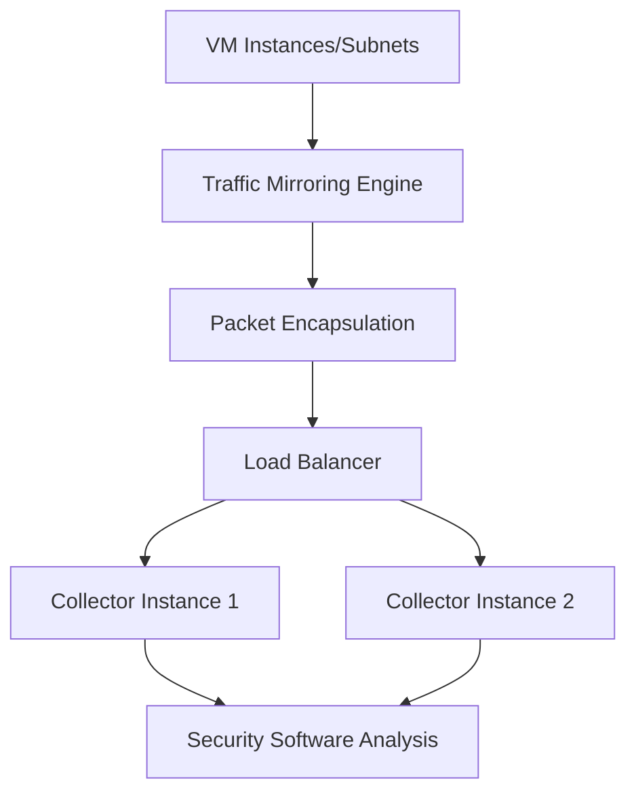

# Session 30: Creating Mirroring Policy GCP in Hindi

<details open>
<summary><b>Creating Mirroring Policy GCP (KK-CS45-script-v2)</b></summary>

## Table of Contents

- [Overview](#overview)
- [Key Concepts and Deep Dive](#key-concepts-and-deep-dive)
  - [What is Packet Mirroring?](#what-is-packet-mirroring)
  - [Use Cases and Benefits](#use-cases-and-benefits)
  - [How Packet Mirroring Works](#how-packet-mirroring-works)
  - [Mirroring Policy Scoping](#mirroring-policy-scoping)
  - [Filters and Mirroring Modes](#filters-and-mirroring-modes)
- [Prerequisites](#prerequisites)
- [Lab Demo: Creating Packet Mirroring Policy](#lab-demo-creating-packet-mirroring-policy)
  - [Step 1: Create Collector Destination Group](#step-1-create-collector-destination-group)
  - [Step 2: Create Load Balancer for Collector](#step-2-create-load-balancer-for-collector)
  - [Step 3: Create Packet Mirroring Policy](#step-3-create-packet-mirroring-policy)
  - [Step 4: Testing the Mirroring Policy](#step-4-testing-the-mirroring-policy)
  - [Step 5: Editing and Filtering Traffic](#step-5-editing-and-filtering-traffic)
  - [Cross-Project Mirroring](#cross-project-mirroring)
- [Summary](#summary)

## Overview

This session covers Google Cloud Platform's (GCP) Packet Mirroring feature, which allows you to capture and replicate network traffic flowing through virtual machines (VMs) or subnets for analysis purposes. The session demonstrates how to create mirroring policies in GCP, including setting up collectors, configuring load balancers, and implementing filters. Through hands-on demos, you'll learn to mirror traffic across single and multiple projects, understand security implications, and test mirroring functionality using ICMP traffic.

### Learning Objectives
By the end of this session, you will be able to:
- Understand the fundamentals of packet mirroring in GCP
- Create collector instances and load balancers for traffic analysis
- Configure packet mirroring policies with appropriate filters
- Test and validate mirroring functionality
- Implement cross-project traffic mirroring

## Key Concepts and Deep Dive

### What is Packet Mirroring?

Packet mirroring is a GCP networking feature that provides visibility into network traffic by creating copies (mirrors) of packets traversing your virtual machines or subnets. These mirrored packets are forwarded to collector instances where they can be analyzed by security or monitoring tools.

#### Textbook Explanation
Packet mirroring operates at the network level to duplicate ingress and egress traffic from source VMs or subnets. The mirrored traffic is encapsulated and forwarded to one or more collector instances, which are typically positioned behind a load balancer to distribute the analysis load. This non-intrusive approach allows deep packet inspection without impacting production traffic flow.

### Use Cases and Benefits

#### Security Analysis
```diff
+ Primary Use Case: Enhanced Threat Detection
Packet mirroring enables real-time analysis of network traffic using specialized security software. By capturing headers, payloads, and packet metadata, organizations can identify anomalous patterns, detect intrusions, and perform forensic analysis of cyber threats.
```

#### Performance Monitoring
Organizations use packet mirroring to monitor application performance by analyzing:
- Packet loss occurrences
- Latency patterns
- Connection qualities
- Traffic volume distributions

#### Multi-Protocol Support
```
Supported Protocols: TCP, UDP, ICMP, and other IP-based protocols
Mirroring can capture both ingress (incoming) and egress (outgoing) traffic from VMs or entire subnets.
```

### How Packet Mirroring Works

#### Architecture Components
1. **Source**: VMs, subnets, or network resources generating traffic
2. **Mirror Rule Engine**: Captures packets without interfering with normal forwarding
3. **Encapsulation**: Adds metadata to mirrored packets
4. **Collector Instances**: Receive and analyze mirrored traffic
5. **Load Balancer**: Distributes mirrored traffic across collector instances



#### Mirroring Process
1. Normal traffic continues to destination
2. Mirroring engine creates duplicate packets
3. Packets are encapsulated with sampling metadata
4. Traffic is load-balanced across collector instances
5. Collectors perform analysis (threat detection, performance monitoring, etc.)

### Mirroring Policy Scoping

#### Project-Level Scoping
```diff
! Important: Policies are project-specific
Each packet mirroring policy exists within a single GCP project and can mirror traffic from:
- VMs within the same project
- VMs in peered VPC networks
- VMs in shared VPC configurations
- Cross-project scenarios (when networks are properly connected)
```

#### Network Considerations
- Source and destination networks can be in different projects
- Collector instances can reside in service projects separate from application projects
- Policies maintain isolation - what you create in project A stays in project A

### Filters and Mirroring Modes

#### Available Filters
```bash
Protocol Filters: TCP, UDP, ICMP, custom IP protocols
Traffic Direction: Ingress, Egress, or Bi-directional
```

#### Mirroring Modes
- **Subnet-based**: Mirror entire subnet traffic
- **Tag-based**: Mirror traffic from VMs with specific network tags
- **VPC-based**: Mirror all traffic within a VPC

## Prerequisites

Before creating a packet mirroring policy, ensure you have:

1. **Collector Instances**: One or more VMs that will receive mirrored traffic
2. **Instance Group**: Backend for load balancing collectors
3. **Load Balancer**: Required for distributing traffic to collectors
4. **Network Permissions**: Appropriate IAM roles for packet mirroring operations
5. **Supported Traffic Types**: TCP/UDP protocols for load balancer support

```bash
# Verify prerequisites
gcloud compute instance-groups list
gcloud compute target-pools list  # For load balancer verification
```

## Lab Demo: Creating Packet Mirroring Policy

### Step 1: Create Collector Destination Group

First, you need an instance group containing your collector VMs:

1. Navigate to Compute Engine → Instance groups
2. Create an unmanaged instance group
3. Add collector VMs to the group
4. Ensure session affinity is configured (required for proper traffic distribution)

```bash
# Create instance group (using gcloud CLI)
gcloud compute instance-groups unmanaged create collector-group \
    --zone=us-central1-a

# Add instances to group
gcloud compute instance-groups unmanaged add-instances collector-group \
    --instances=collector-vm-1,collector-vm-2 \
    --zone=us-central1-a
```

### Step 2: Create Load Balancer for Collector

Create a TCP/UDP load balancer to handle mirrored traffic:

1. Go to Network services → Load balancing
2. Click "Create load balancer"
3. Select "TCP Load Balancing" or "UDP Load Balancing"
4. Configure backend service:
   - Select your instance group
   - Enable session affinity (client IP based)
   - Choose TCP or UDP protocols

```yaml
# Load balancer configuration example
kind: compute#backendService
name: collector-backend-service
backends:
  - group: projects/my-project/zones/us-central1-a/instanceGroups/collector-group
sessionAffinity: CLIENT_IP
protocol: TCP
```

> [!NOTE]
> Session affinity ensures consistent traffic flow to the same collector instance, maintaining analysis continuity.

### Step 3: Create Packet Mirroring Policy

Now create the actual mirroring policy:

1. Navigate to VPC network → Packet mirroring
2. Click "Create Policy"
3. Configure the following:
   - Policy name (unique identifier)
   - Enable mirroring (set to true)
   - Source network/subnet
   - Collector load balancer
   - Optional: Traffic filters

```yaml
# Packet mirroring policy configuration
policyName: "mirror-policy-demo"
enabled: true
collectorIlb:
  url: "projects/my-project/regions/us-central1/backendServices/collector-backend-service"
mirroredResources:
  subnetworks:
    - url: "projects/my-project/regions/us-central1/subnetworks/my-subnet"
filters:
  direction: "BOTH_DIRECTIONS"
  protocols: ["tcp", "udp", "icmp"]
```

### Step 4: Testing the Mirroring Policy

Test with ICMP traffic using ping commands:

```bash
# On collector instance, start packet capture
sudo tcpdump -i ens4 icmp -v

# From source VM, send ICMP traffic
ping <collector-ip> -I ens4

# Verify mirrored traffic appears in collector output
```

### Step 5: Editing and Filtering Traffic

Modify the policy to filter specific traffic types:

1. Find your policy in Packet mirroring
2. Click "Edit"
3. Update filters to capture only desired traffic
4. Test with different protocols

```yaml
# Updated policy with ICMP only filter
filters:
  direction: "INGRESS"
  protocols: ["icmp"]
```

> [!IMPORTANT]
> When testing ICMP mirroring, you may see only reply traffic if the collector is responding to source pings. Configure filters to distinguish between request and response traffic.

### Cross-Project Mirroring

Packet mirroring supports cross-project scenarios:

1. **Shared VPC**: Destination (collector) can be in service project, source in application project
2. **Network Peering**: VPC networks can peer to enable mirroring between projects
3. **Multiple Policies**: Create separate policies for each project combination

```yaml
# Example cross-project policy
policyName: "cross-project-mirror"
collectorIlb:
  url: "projects/service-project/regions/us-central1/backendServices/collector-backend-service"
mirroredResources:
  subnetworks:
    - url: "projects/app-project/regions/us-central1/subnetworks/app-subnet"
```

## Summary

### Key Takeaways

```diff
+ Packet mirroring enables non-intrusive traffic analysis in GCP
+ Collector instances must be behind TCP/UDP load balancers
+ Policies are project-scoped but support cross-project networks
+ Filters allow selective traffic capture (protocol, direction-specific)
+ Testing typically uses ICMP (ping) traffic for validation
- Requires careful configuration to avoid performance impact
- Mirrored traffic may include sensitive data - ensure compliancedata
```

### Quick Reference

```bash
# Basic packet capture on collector
sudo tcpdump -i <interface> -v

# Common protocols for mirroring
TCP, UDP, ICMP

# Load balancer protocol support
TCP Load Balancing, UDP Load Balancing
```

### Expert Insight

**Real-world Application**: Packet mirroring is commonly deployed in enterprise security stacks alongside tools like Wireshark, Snort, or custom SIEM systems. It's crucial for compliance monitoring, intrusion detection, and performance optimization in production environments.

**Expert Path**: Master network tags and subnet-level filtering to optimize mirroring efficiency. Combine with VPC Flow Logs for complementary visibility. Understand the performance implications and start with filtered policies in production.

**Common Pitfalls**:
- Forgetting session affinity impacts traffic distribution
- Testing with protocols not supported by load balancer (e.g., custom protocols requiring TCP/UDP translation)
- Not verifying network connectivity between source and collector projects
- Over-mirroring (capturing too much traffic) can impact performance

</details>