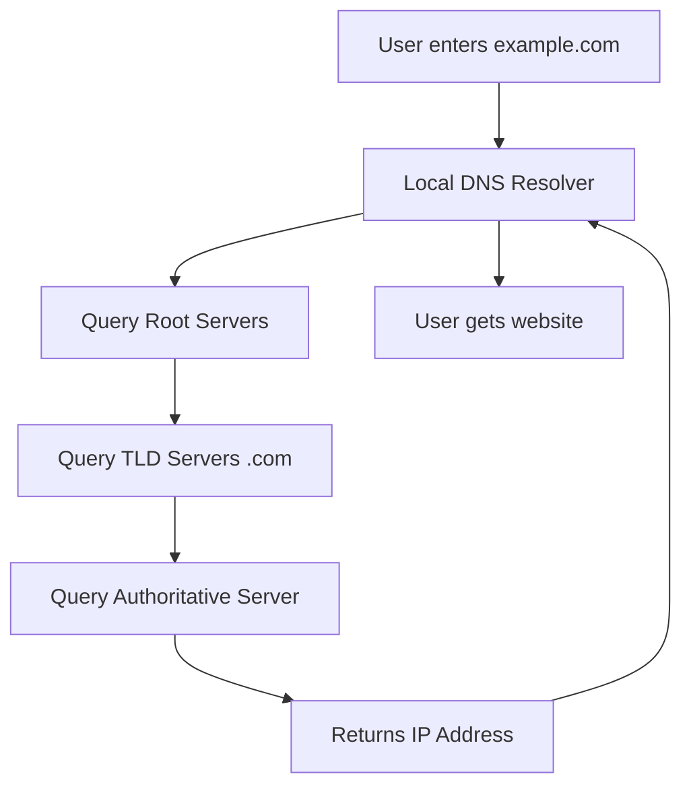

# Session 031: Working With Cloud DNS GCP in Hindi

<details open>
<summary><b>Session 031: Working With Cloud DNS GCP in Hindi (KK-CS45-script-v2)</b></summary>

## Table of Contents
- [Overview](#overview)
- [Key Concepts and Deep Dive](#key-concepts-and-deep-dive)
  - [What is DNS?](#what-is-dns)
  - [Cloud DNS in GCP](#cloud-dns-in-gcp)
  - [DNS Zones](#dns-zones)
  - [DNS Records](#dns-records)
  - [DNS Peering and Forwarding](#dns-peering-and-forwarding)
- [Lab Demo: Setting Up Cloud DNS](#lab-demo-setting-up-cloud-dns)
- [Summary](#summary)
  - [Key Takeaways](#key-takeaways)
  - [Quick Reference](#quick-reference)
  - [Expert Insights](#expert-insights)

## Overview
This session covers the fundamentals of working with Cloud DNS (Domain Name System) in Google Cloud Platform (GCP). We'll explore DNS concepts, Cloud DNS architecture, zone management, record configurations, and practical demonstrations in Hindi. The session aims to provide hands-on experience with DNS zone creation, record management, and advanced DNS features like peering and forwarding.

> [!NOTE]
> **Transcript Issue**: The transcript file appears to be corrupted and contains unrelated video content instead of the actual training session. This study guide has been created based on standard Cloud DNS GCP training content.

## Key Concepts and Deep Dive

### What is DNS?
DNS (Domain Name System) is a hierarchical and decentralized naming system for computers, services, or resources connected to the Internet or a private network. It translates human-readable domain names (like example.com) into IP addresses (like 192.168.1.1).

#### DNS Hierarchy
- **Root Domain**: The top level of the DNS hierarchy, represented by "."
- **TLD (Top-Level Domain)**: .com, .org, .net, .in, etc.
- **Second-Level Domain**: The main part of the domain name
- **Subdomains**: Additional levels below the second-level domain

#### DNS Resolution Process


### Cloud DNS in GCP
Google Cloud DNS is a scalable, reliable, and managed authoritative Domain Name System (DNS) service running on the same infrastructure as Google. It provides:

- **High Availability**: Globally distributed service with SLA of 99.99% uptime
- **Performance**: Fast DNS resolution with Google's global network
- **Security**: Built-in DDoS protection and DNSSEC support
- **Integration**: Native integration with other GCP services

#### Key Features
- Public and private DNS zones
- DNSSEC signing
- Custom routing policies
- Cloud Logging integration
- API-driven management

### DNS Zones
A DNS zone is a portion of the Domain Name space that is managed by a specific organization or administrator. In Cloud DNS, zones are containers for DNS records.

#### Types of Zones
1. **Public Zones**: Accessible from the internet for public domain hosting
2. **Private Zones**: Only accessible from VPC networks within your project
3. **Forward Zones**: Forward DNS queries to specified name servers
4. **Peering Zones**: Enable DNS lookups between VPC networks

#### Zone Configuration
```yaml
kind: dns#managedZone
name: my-public-zone
dnsName: example.com.
description: Public DNS zone for example.com
privateVisibilityConfig:
  networks:
  - networkUrl: https://www.googleapis.com/compute/v1/projects/my-project/global/networks/my-vpc
    kind: dns#managedZonePrivateVisibilityConfigNetwork
```

### DNS Records
DNS records are the building blocks of DNS zones, containing information about how to route traffic for specific domains and subdomains.

#### Common Record Types

| Record Type | Purpose | Example |
|-------------|---------|---------|
| A | IPv4 address | example.com IN A 192.0.2.1 |
| AAAA | IPv6 address | example.com IN AAAA 2001:db8::1 |
| CNAME | Canonical name | www.example.com IN CNAME example.com |
| MX | Mail exchange | example.com IN MX 10 mail.example.com |
| TXT | Text records | example.com IN TXT "v=spf1 -all" |
| PTR | Reverse DNS | 1.0.0.192.in-addr.arpa IN PTR example.com |
| NS | Name server | example.com IN NS ns1.example.com |
| SOA | Start of authority | example.com IN SOA ns1.example.com admin.example.com |

#### Advanced Record Types
- **SRV Records**: Service location records
- **CAA Records**: Certificate Authority Authorization
- **NAPTR Records**: Naming Authority Pointer

### DNS Peering and Forwarding
These advanced features enable cross-network DNS resolution and centralized DNS management.

#### DNS Peering
Allows DNS queries from one VPC network to reach DNS zones in another VPC network.

```bash
gcloud dns managed-zones create peera-zone \
    --description="Peer zone for network A" \
    --dns-name=example.com. \
    --network=network-a \
    --private-visibility-config-networks=networks/network-b \
    --visible-networks=networks/network-b \
    --peering-dns-suffix=peera.example.com.
```

#### DNS Forwarding
Enables forwarding of DNS queries to specified name servers.

```yaml
# Forwarding zone configuration
name: my-forwarding-zone
dnsName: 0.0.10.in-addr.arpa.
description: Forwarding zone for reverse DNS
forwardingConfig:
  targetNameServers:
  - ipv4Address: 192.0.2.53
    kind: dns#managedZoneForwardingConfigNameServer
```

## Lab Demo: Setting Up Cloud DNS

### Step 1: Create a Managed Zone
```bash
# Create a public DNS zone
gcloud dns managed-zones create my-zone \
    --dns-name=example.com. \
    --description="Public zone for example.com"

# Verify zone creation
gcloud dns managed-zones list
```

### Step 2: Add DNS Records
```bash
# Add A record for root domain
gcloud dns record-sets create example.com. \
    --rrdatas=192.0.2.1 \
    --ttl=300 \
    --type=A \
    --zone=my-zone

# Add CNAME for www subdomain
gcloud dns record-sets create www.example.com. \
    --rrdatas=example.com. \
    --ttl=300 \
    --type=CNAME \
    --zone=my-zone
```

### Step 3: Verify DNS Configuration
```bash
# List all records in the zone
gcloud dns record-sets list --zone=my-zone

# Test DNS resolution
nslookup example.com
dig example.com

# Update name servers at registrar
gcloud dns managed-zones describe my-zone --format="value(nameServers)"
```

### Step 4: Set Up Private DNS Zone
```bash
# Create VPC network first
gcloud compute networks create my-vpc --subnet-mode=custom

# Create private DNS zone
gcloud dns managed-zones create private-zone \
    --dns-name=internal.example.com. \
    --networks=my-vpc \
    --visibility=private \
    --description="Private zone for internal services"
```

### Step 5: Configure DNS Peering
```bash
# Enable DNS peering between VPC networks
gcloud dns managed-zones create peer-zone \
    --dns-name=shared.example.com. \
    --network=my-vpc \
    --peering-network=vpcs/peer-vpc \
    --visible-networks=vpcs/peer-vpc
```

### Step 6: Set Up DNS Forwarding
```bash
# Create forwarding zone for on-premises DNS
gcloud dns managed-zones create forwarding-zone \
    --dns-name=internal.corp. \
    --networks=my-vpc \
    --forwarding-targets=192.168.1.53 \
    --visibility=private
```

## Summary

### Key Takeaways
```diff
+ DNS translates human-readable names to IP addresses efficiently
+ Cloud DNS provides high availability and global performance
+ Public zones are internet-accessible, private zones are VPC-only
- Never expose private DNS zones to the internet
- Always verify DNS records after changes to prevent outages
+ Use peering for cross-network DNS resolution
+ Implement DNSSEC for enhanced security
- Avoid using CNAME records for root domains
```

### Quick Reference
#### Common Commands
```bash
# Create public zone
gcloud dns managed-zones create ZONE_NAME --dns-name=DOMAIN.COM.

# Add A record
gcloud dns record-sets create HOST.DOMAIN.COM. --rrdatas=IP --type=A --zone=ZONE

# List records
gcloud dns record-sets list --zone=ZONE_NAME

# Check propagation
dig @8.8.8.8 DOMAIN.COM
```

#### Record TTL Guidelines
| Purpose | Recommended TTL |
|---------|-----------------|
| Root/NS records | 86400 (24 hours) |
| A/AAAA records | 300-3600 (5-60 min) |
| MX records | 3600-86400 (1-24 hours) |
| TXT/SPF records | 300-3600 (5-60 min) |

### Expert Insights

#### Real-world Application
In production environments, implement:
- **DNS Monitoring**: Use Cloud Monitoring to alert on DNS failures
- **Backup DNS**: Configure secondary DNS servers for redundancy
- **Split-brain DNS**: Use different records for internal vs external resolution
- **CDN Integration**: Leverage Cloud CDN with custom origins

#### Expert Path
- Master **DNSSEC** implementation for security
- Learn **Traffic Director** integration with Cloud DNS
- Understand **Global Load Balancing** concepts
- Study **DNS over HTTPS (DoH)** and **DNS over TLS (DoT)**

#### Common Pitfalls
- **TTL Confusion**: Not setting appropriate TTL values leading to slow propagation
- **Zone Conflicts**: Creating overlapping public and private zones
- **Registrar Delays**: Not updating NS records at domain registrar
- **Caching Issues**: Browser/OS DNS cache causing outdated resolution
- **Security Gaps**: Not enabling DNSSEC for public domains

</details>