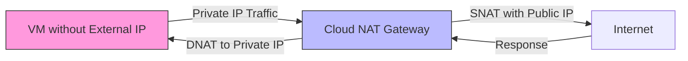

# Session 003: How to Create Cloud NAT - GCP in Hindi

<details open>
<summary><b>Session 003: How to Create Cloud NAT (Claude Opus 4)</b></summary>

## Table of Contents
- [Overview](#overview)
- [Key Concepts](#key-concepts)
- [Lab Demo: Creating a VM Without External IP](#lab-demo-creating-a-vm-without-external-ip)
- [Lab Demo: Setting Up Cloud NAT](#lab-demo-setting-up-cloud-nat)
- [Summary](#summary)

## Overview
This session covers Cloud NAT (Network Address Translation) in GCP, which allows VMs without external IP addresses to access the internet. The session demonstrates how to create VMs without external IPs, set up Cloud NAT, and verify internet connectivity through NAT.

## Key Concepts

### What is Cloud NAT?
Cloud NAT is a Google Cloud service that allows VMs without external IP addresses to connect to the internet or other Google Cloud services while preventing inbound connections from the internet. This provides enhanced security by keeping VMs private while still allowing outbound internet access.

### Key Characteristics:
- **Outbound Only**: VMs can initiate connections to the internet, but internet cannot initiate connections to VMs
- **Port-Based NAT**: Uses source network address translation (SNAT) with port allocation
- **Regional Service**: Cloud NAT is a regional resource
- **Automatic IP Management**: Can automatically allocate and manage NAT IP addresses

### Cloud NAT Components:
1. **Router**: Must be associated with a Cloud Router in the same region
2. **NAT IP Allocation**: Options include:
   - **Automatic**: Google automatically allocates NAT IPs as needed
   - **Manual**: User specifies static NAT IP addresses
3. **Subnet Configuration**: Choose which subnets use NAT (primary/secondary ranges)
4. **Port Allocation**: Configure minimum/maximum ports per VM

### NAT IP Address Management:
- **Automatic Mode**: Google Cloud automatically adds/removes NAT IPs based on demand
- **Manual Mode**: User must pre-allocate sufficient NAT IPs
- **Port Exhaustion**: Each NAT IP has a limited number of ports (default min: 64 ports per VM)

### Advanced Configuration Options:
- **Minimum Ports Per VM**: Default is 64, can be increased for high-connection scenarios
- **Maximum Ports Per VM**: Optional upper limit
- **Logging**: Enable NAT logging for troubleshooting

> [!IMPORTANT]
> When using automatic NAT IP allocation, port exhaustion can cause connection timeouts. Monitor and adjust port allocations as needed.

## Lab Demo: Creating a VM Without External IP

### Step 1: Create VM Instance
```bash
# Navigate to Compute Engine > VM instances > Create instance
# In Network Interfaces settings:
# - Disable "External IP" or set to "None"
```

### Step 2: Verify No Internet Access
- SSH into the VM
- Attempt to ping an external IP (e.g., 8.8.8.8)
- Result: No response received, confirming no external connectivity

## Lab Demo: Setting Up Cloud NAT

### Step 1: Create Cloud Router
1. Navigate to **Hybrid Connectivity > Cloud Routers > Create Router**
2. Configure:
   - Name: Choose a descriptive name
   - Network: Select the VPC network
   - Region: Must match VM's region
   - Google ASN: Auto-assigned or specify custom

### Step 2: Configure Cloud NAT
1. Navigate to **Network Services > Cloud NAT > Get Started**
2. Configure Gateway:
   - Name: Provide a name for the NAT gateway
   - Router: Select the Cloud Router created above
   - NAT IP Address:
     - **Automatic** (recommended for dynamic workloads)
     - **Manual** (for predictable IP requirements)

### Step 3: Configure Subnet and IP Range
- Select subnets that will use this NAT gateway
- Choose IP ranges:
  - Primary and secondary ranges
  - Or specific custom ranges
- Configure port allocation settings if needed

### Step 4: Apply Source Tags/Firewall Rules (Optional)
- Use network tags to control which VMs use NAT
- Configure firewall rules to restrict NAT access if needed

### Step 5: Verify NAT Functionality
1. SSH into the VM without external IP
2. Test connectivity:
   ```bash
   ping 8.8.8.8
   curl google.com
   ```
3. Successful response indicates NAT is working correctly

## NAT Traffic Flow Diagram



## Summary

### Key Takeaways
```diff
+ Cloud NAT enables internet access for VMs without external IPs
+ Provides enhanced security by preventing inbound connections
+ Automatic NAT IP allocation simplifies management for dynamic workloads
+ Port allocation must be configured based on connection requirements
+ Cloud Router must exist in the same region as the NAT gateway
- Manual NAT IP allocation requires careful capacity planning
- Port exhaustion leads to connection timeouts
```

### Quick Reference
```bash
# Check VM external IP status
gcloud compute instances describe INSTANCE_NAME --format="get(networkInterfaces[].accessConfigs[])"

# List Cloud NAT gateways
gcloud compute routers Nats list --router=ROUTER_NAME --region=REGION

# Verify NAT configuration
gcloud compute routers describe ROUTER_NAME --region=REGION
```

### Expert Insight

#### Real-world Application
- **Security Compliance**: Use Cloud NAT to meet security requirements that prohibit direct internet exposure
- **Cost Optimization**: Reduce external IP costs while maintaining internet access
- **Microservices Architecture**: Enable outbound API calls from private workloads

#### Expert Path
- Understand the relationship between Cloud Router and Cloud NAT
- Learn to troubleshoot port exhaustion issues
- Master NAT logging and monitoring for production environments
- Explore NAT with Shared VPC and cross-project scenarios

#### Common Pitfalls
- Insufficient port allocation causing intermittent connectivity issues
- Forgetting to create Cloud Router before Cloud NAT
- Not monitoring NAT IP utilization with automatic allocation
- Misconfiguring subnet ranges leading to partial NAT coverage

</details>