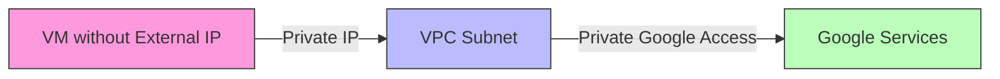

# Session 004: How to Create VPC in GCP

<details open>
<summary><b>Session 004: How to Create VPC in GCP (Claude Opus 4)</b></summary>

## Table of Contents
- [Overview](#overview)
- [Key Concepts](#key-concepts)
- [Lab Demo: Creating a Custom VPC](#lab-demo-creating-a-custom-vpc)
- [VPC Configuration Options](#vpc-configuration-options)
- [Private Google Access](#private-google-access)
- [Summary](#summary)

## Overview
This session covers creating a Virtual Private Cloud (VPC) in Google Cloud Platform, focusing on custom VPC creation with specific subnet configurations. The session demonstrates both automatic and manual subnet creation, regional vs global routing options, and Private Google Access configuration.

## Key Concepts

### Virtual Private Cloud (VPC)
A VPC is a virtual network that provides isolated networking resources in Google Cloud. It allows you to define IP address ranges, subnets, routes, and firewall rules for your cloud resources.

### VPC Creation Modes

#### Auto Mode VPC
- Automatically creates one subnet in each Google Cloud region
- Uses predefined IP ranges that cannot be modified
- Suitable for simple deployments with minimal customization needs
- Each regional subnet gets a /20 CIDR block

#### Custom Mode VPC
- Provides full control over subnet creation
- No automatic subnets are created
- Allows custom IP address ranges and regions
- Recommended for production environments requiring specific network architecture

### Subnet Configuration
- **Regional Resource**: Each subnet belongs to a specific region
- **IP Ranges**: Primary and secondary ranges can be defined
- **Private IP Allocation**: Subnets use RFC 1918 private IP ranges

### Private Google Access
Enables VMs without external IPs to access Google APIs and services using their private IP addresses, maintaining security while providing necessary service access.

## Lab Demo: Creating a Custom VPC

### Step 1: Navigate to VPC Networks
```
GCP Console → VPC Network → VPC Networks → Create VPC Network
```

### Step 2: Configure VPC Basics
```
Name: test-vpc (or your chosen name)
Description: Custom VPC for testing
```

### Step 3: Choose Creation Mode
```
Select: Custom (for full control)
Note: Auto mode creates subnets in all regions automatically
```

### Step 4: Create Subnets
```
Subnet Configuration:
- Name: subnet-1
- Region: Asia South 1 (Mumbai)
- IP Stack Type: IPv4 (single-stack)
- IP Address Range: [Custom CIDR, e.g., 10.0.0.0/24]

Additional subnets can be added for different regions as needed
```

### Step 5: Configure Routing Options
```
Dynamic Routing Mode:
- Regional: Routes only propagated within the same region
- Global: Routes propagated across all regions (requires Cloud Router)
```

## VPC Configuration Options

### DNS Configuration
- Default (Zonal): Uses Google's internal DNS with zonal scoping
- Alternative DNS servers can be specified for custom requirements

### MTU (Maximum Transmission Unit)
- Default: 1460 bytes (recommended for most workloads)
- Higher values possible with supported instance types

### Firewall Rules
- Default allow rules for internal communication
- HTTP/HTTPS traffic rules
- SSH/RDP access rules
- Custom rules can be added based on requirements

## Private Google Access

### Purpose
Allows resources without external IPs to access Google Cloud services privately.

### Configuration
```
During VM creation or VPC configuration:
- Enable Private Google Access on specific subnets
- Required for accessing services like:
  - Cloud Storage
  - BigQuery
  - Google APIs
```

### Traffic Flow with Private Google Access


## Network Communication Patterns

### Internal Communication
- Resources within the same VPC can communicate using internal IPs
- Firewall rules control allowed traffic patterns
- Lower priority numbers indicate higher priority rules

### External Access Options
1. **Direct External IP**: Assign public IPs to VMs (less secure)
2. **Cloud NAT**: Use Cloud NAT for outbound internet access (recommended)
3. **Cloud VPN/Interconnect**: For hybrid connectivity

## Summary

### Key Takeaways
```diff
+ Custom VPC mode provides full control over network architecture
+ Subnets are regional resources with custom IP ranges
+ Private Google Access enables secure service access without external IPs
+ Global routing requires Cloud Router configuration
+ Firewall rules default to allow internal traffic
- Auto mode VPCs have inflexible subnet configurations
- Regional routing limits cross-region communication without additional setup
```

### Quick Reference
```bash
# Create VPC using gcloud
gcloud compute networks create VPC_NAME \
    --subnet-mode=custom

# Create subnet
gcloud compute networks subnets create SUBNET_NAME \
    --network=VPC_NAME \
    --region=REGION \
    --range=IP_RANGE

# Enable Private Google Access
gcloud compute networks subnets update SUBNET_NAME \
    --region=REGION \
    --enable-private-ip-google-access
```

### Expert Insight

#### Real-world Application
- Design multi-tier applications with separate subnets for frontend, backend, and database
- Implement network segmentation for compliance requirements
- Use custom VPCs for complex multi-region deployments

#### Expert Path
- Master VPC peering for connecting multiple VPCs
- Understand Shared VPC for organizational resource sharing
- Learn about VPC Service Controls for additional security boundaries

#### Common Pitfalls
- Choosing auto mode for production workloads requiring specific IP schemes
- Forgetting to enable Private Google Access for private workloads
- Not planning IP address ranges for future expansion
- Misconfiguring routing modes leading to connectivity issues

</details>