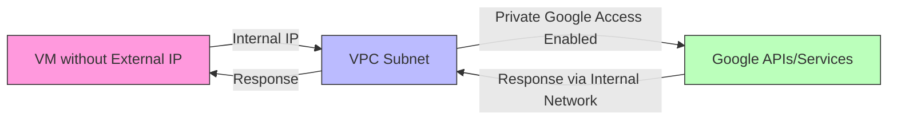

# Session 006: How To Use Private Google Access in GCP

<details open>
<summary><b>Session 006: How To Use Private Google Access in GCP (Claude Opus 4)</b></summary>

## Table of Contents
- [Overview](#overview)
- [Key Concepts](#key-concepts)
- [Lab Demo: Enabling Private Google Access](#lab-demo-enabling-private-google-access)
- [Troubleshooting Access Issues](#troubleshooting-access-issues)
- [Summary](#summary)

## Overview
This session demonstrates how to enable and use Private Google Access in Google Cloud Platform, allowing VMs without external IP addresses to access Google Cloud services and APIs securely.

## Key Concepts

### What is Private Google Access?
Private Google Access enables virtual machine instances to reach Google APIs and services using their internal IP addresses instead of requiring external IP addresses. This provides enhanced security by keeping VMs isolated from the public internet while allowing necessary access to Google services.

### Key Benefits
- **Enhanced Security**: VMs without external IPs can still access Google services
- **Cost Reduction**: Eliminates need for external IP addresses just for service access
- **Network Isolation**: Maintains private network architecture
- **Compliance**: Meets security requirements that prohibit direct internet exposure

### How Private Google Access Works


### Requirements
1. **VPC Network Configuration**: Private Google Access must be enabled on the subnet
2. **Service Account Permissions**: The VM's service account needs appropriate IAM permissions
3. **Network Connectivity**: Proper routing must exist within the VPC
4. **DNS Resolution**: Google service endpoints must resolve correctly

## Lab Demo: Enabling Private Google Access

### Step 1: Create VM Without External IP
```
GCP Console → Compute Engine → Create Instance
- Machine type: e2-micro (or appropriate)
- Boot disk: Default configuration
- Identity and API access: Default service account
- Networking:
  - Network interfaces: Default
  - External IP: None
- Create instance
```

### Step 2: Verify No External Access
SSH into the created VM and test internet connectivity:
```bash
ping 8.8.8.8
```
Expected result: No response (confirms no external IP/internet access)

### Step 3: Test Google Service Access (Before Configuration)
Attempt to access Google Cloud Storage:
```bash
gsutil ls
```
Expected result: Connection timeout or failure (Private Google Access not enabled)

### Step 4: Enable Private Google Access
Navigate to VPC Networks:
```
GCP Console → VPC Network → VPC Networks → [Your VPC] → Subnets
- Select the subnet used by your VM
- Edit subnet configuration
- Enable "Private Google Access"
- Save changes
```

### Step 5: Verify Private Google Access
After enabling (may take a few minutes to propagate):
```bash
gsutil ls gs://[your-bucket-name]
```
Expected result: Successful listing of bucket contents

## Troubleshooting Access Issues

### Common Problems and Solutions

#### 1. Permission Denied Errors
**Symptom**: Access denied when trying to list or access resources
**Cause**: Service account lacks necessary IAM permissions
**Solution**:
```
GCP Console → IAM & Admin → IAM
- Locate the VM's service account
- Add appropriate roles:
  - Storage Object Viewer (for reading buckets)
  - Storage Admin (for full bucket access)
  - Other service-specific roles as needed
```

#### 2. Connection Timeouts
**Symptom**: Requests hang or timeout
**Cause**: Private Google Access not properly enabled or propagated
**Solution**:
- Verify Private Google Access is enabled on the correct subnet
- Wait for propagation (typically 1-2 minutes)
- Check VPC routing configuration

#### 3. DNS Resolution Issues
**Symptom**: Unable to resolve Google service endpoints
**Cause**: Custom DNS configuration interfering
**Solution**:
- Verify DNS settings allow Google service resolution
- Use Google's internal DNS (169.254.169.254)

### Verification Commands
```bash
# Check if Private Google Access route exists
ip route show

# Test connectivity to Google APIs
curl -v https://storage.googleapis.com

# Check service account permissions
gcloud auth list
```

## Private Google Access vs Other Solutions

### Comparison Table

| Feature | Private Google Access | Cloud NAT | External IP |
|---------|---------------------|-----------|-------------|
| Internet Access | Google services only | Full internet | Full internet |
| Cost | Free | Hourly + data charges | Static IP charges |
| Security | High (no inbound) | Medium | Low (direct exposure) |
| Use Case | Google API access | General outbound | Full bidirectional |

## Summary

### Key Takeaways
```diff
+ Private Google Access enables VMs without external IPs to reach Google services
+ Must be enabled at the subnet level, not individual VM level
+ Service accounts require appropriate IAM permissions for service access
+ Provides cost savings by eliminating unnecessary external IPs
+ Enhances security posture by maintaining network isolation
- Only works for Google APIs and services, not general internet access
- Requires proper service account configuration
- May take time to propagate after enabling
```

### Quick Reference
```bash
# Enable Private Google Access via gcloud
gcloud compute networks subnets update SUBNET_NAME \
    --region=REGION \
    --enable-private-ip-google-access

# Disable Private Google Access
gcloud compute networks subnets update SUBNET_NAME \
    --region=REGION \
    --no-enable-private-ip-google-access

# Verify subnet configuration
gcloud compute networks subnets describe SUBNET_NAME \
    --region=REGION
```

### Expert Insight

#### Real-world Application
- Deploy secure workloads that need access to BigQuery, Cloud Storage, or other Google services
- Implement compliance-requiring architectures with no direct internet exposure
- Reduce costs by eliminating external IPs used solely for service access

#### Expert Path
- Understand the relationship between Private Google Access and VPC Service Controls
- Master service account permission management for least-privilege access
- Implement Private Google Access with Shared VPC architectures
- Monitor and audit Private Google Access usage patterns

#### Common Pitfalls
- Forgetting to grant service account permissions after enabling Private Google Access
- Enabling on the wrong subnet or VPC
- Not waiting for configuration propagation
- Assuming it provides general internet access (it doesn't)
- Overlooking DNS configuration requirements

</details>