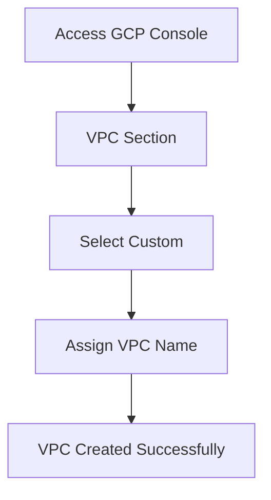
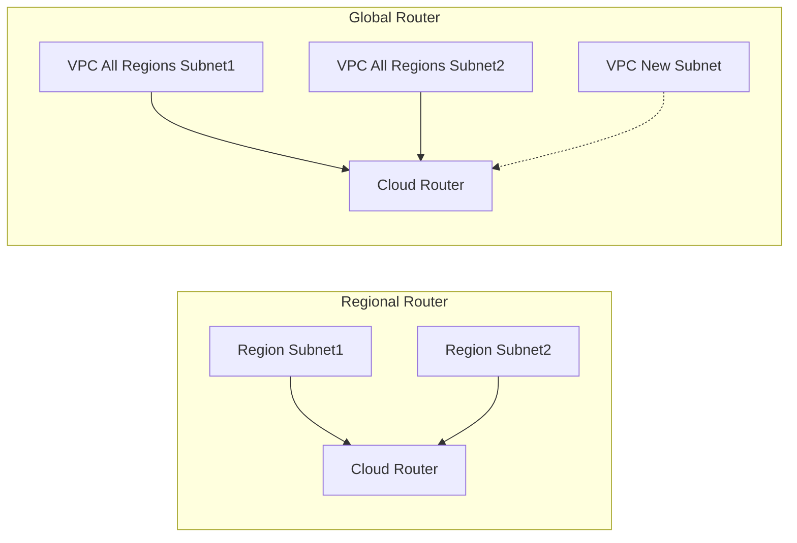

# Session 4: How to create VPC in GCP

## Table of Contents

- [Accessing the GCP Console](#accessing-the-gcp-console)
- [Overview of VPC Creation Options](#overview-of-vpc-creation-options)
- [Creating a Custom VPC](#creating-a-custom-vpc)
- [Configuring Subnets](#configuring-subnets)
- [Region Selection](#region-selection)
- [Service Accounts and Permissions](#service-accounts-and-permissions)
- [Traffic Flow and Data Routing](#traffic-flow-and-data-routing)
- [Internal Communication](#internal-communication)
- [External Access](#external-access)
- [Cloud Router: Regional vs Global](#cloud-router-regional-vs-global)
- [Step-by-Step Lab Demo](#step-by-step-lab-demo)

## Accessing the GCP Console

### Overview
To begin working with Google Cloud Platform (GCP), users start by accessing the GCP console through their Google account. This initial step ensures authenticated entry into the cloud environment for managing resources like Virtual Private Clouds (VPCs).

### Key Concepts
- **Google Account Access**: Clicking on the Google account option redirects users to the GCP console, providing a unified interface for all cloud services.
- **Automatic Setup**: GCP automatically handles certain configurations, such as subject creation in different seasons, to streamline initial setup.

### Lab Demos
No specific code or commands demonstrated in this section, as it's login-based.

## Overview of VPC Creation Options

### Overview
GCP offers both automatic and custom VPC creation modes. Automatic mode creates subnets automatically across regions, while custom mode allows manual configuration for specific needs.

### Key Concepts
- **Automatic Mode Limitations**: In automatic creation, GCP sets up subnets every season automatically, limiting customization.
- **Preferences for Custom**: Users preferring tailored configurations opt for custom mode to control subnet creation and network settings.

### Lab Demos
No specific code or commands demonstrated in this section.

## Creating a Custom VPC

### Overview
Custom VPC creation involves selecting the custom option from the VPC menu and assigning a name, enabling precise control over network architecture.

### Key Concepts
- **Custom Selection**: After navigating to the VPC section, click on custom to initiate manual VPC creation.
- **Naming Convention**: Assign a descriptive name to the VPC for easy identification, such as "MyCustomVPC".
- **Diagram**: Below is a simple Mermaid diagram illustrating the VPC creation flow.



### Lab Demos
1. Log in to GCP console using Google account.
2. Navigate to VPC Networks.
3. Select "Create VPC network".
4. Choose "Custom" mode.
5. Enter VPC name (e.g., "TestVPC").

## Configuring Subnets

### Overview
Subnets are subdivisions within a VPC that define IP ranges and regional boundaries. Creating subnets allows segmentation of the network for better resource management.

### Key Concepts
- **Subnet Creation Basics**: Start by adding the first subnet during VPC setup.
- **IP Range Allocation**: Define internal private IP ranges for resources within the subnet, enabling isolated communication.
- **Integration with VPC**: Subnets automatically associate with the parent VPC, inheriting its properties.

### Code/Config Blocks
Example subnet configuration in JSON format (for GCP API, though console is used here):

```json
{
  "name": "subnet1",
  "network": "projects/PROJECT_ID/global/networks/VPC_NAME",
  "ipCidrRange": "10.0.1.0/24",
  "region": "REGION"
}
```

### Lab Demos
1. In VPC creation wizard, add subnet 1.
2. Specify IP range (e.g., 10.0.1.0/24).
3. Continue to next steps.

## Region Selection

### Overview
Region selection determines where GCP resources are deployed, impacting latency, availability, and compliance. Users choose regions based on geographic proximity or requirements.

### Key Concepts
- **Regional Impact**: Subnets can be regional, associating with specific GCP regions.
- **Example Regions**: Options include regions like South America or Asia-South; select based on workload needs (note: "South Pole" in transcript may refer to a specific region like us-south1 or asia-south1, as South Pole is not a valid GCP region).
- **Time Considerations**: Account for current time zones when selecting regions to align with user locations.

### Table: Example GCP Regions

| Region Name | Location | Use Case |
|-------------|----------|----------|
| us-south1 | Southern US | Low-latency for North American users |
| asia-south1 | Mumbai, India | For Indian subcontinent deployments |

### Lab Demos
1. In subnet configuration, select region (e.g., asia-south1).
2. Proceed at current time for optimal access.

## Service Accounts and Permissions

### Overview
Service accounts in GCP provide identities for applications to access resources. Proper permissions ensure secure internal communication without requiring external IPs or internet access.

### Key Concepts
- **Permission Requirements**: Services can communicate internally even without internet or external IPs if granted appropriate permissions.
- **Compute Engine Access**: For example, a compute engine instance can access Cloud Storage only if its service account has storage admin permissions.
- **Traffic Permissions**: Ensure data flows securely between services based on assigned roles.

### Diff Blocks

```diff
+ Enable secure internal access
- Grant overly broad permissions
! Review service account keys regularly for security
```

### Lab Demos
1. Create a service account for compute engine.
2. Assign storage bucket access permission.
3. Test access without external IP.

## Traffic Flow and Data Routing

### Overview
Traffic flow analysis helps visualize how data moves within the GCP network. Understanding this is crucial for optimizing performance and troubleshooting issues.

### Key Concepts
- **Data Flow Monitoring**: Tools allow observation of how data travels between services.
- **Router Integration**: Cloud routers facilitate routing across regions and subnets.
- **Service Communication**: Ensure services like compute can communicate directly when needed.

### Lab Demos
1. Use GCP's network connectivity tests to simulate traffic flow.
2. Monitor packet paths using traceroute or GCP's trace tools.

## Internal Communication

### Overview
Internal communication uses private IP ranges within the VPC for efficient and secure data transfer. Custom ranges prevent conflicts and optimize routing.

### Key Concepts
- **Internal Ranges**: Define IP ranges for private communication, such as 10.0.0.0/8 or custom CIDRs.
- **Priority Settings**: Lower priorities (e.g., 12000) indicate less important routes.
- **Conflict Resolution**: Custom ranges allow flexible addressing for various network segments.

⚠️ **Warning**: Ensure IP ranges do not overlap to avoid communication failures.

### Lab Demos
1. Set internal IP range in subnet config (e.g., 192.168.1.0/24).
2. Test internal connectivity between VMs.

## External Access

### Overview
External access connects subnets to the internet, enabling outbound and inbound traffic. This configuration is essential for publicly accessible resources.

### Key Concepts
- **Internet Connectivity**: Associate subnets with external access for internet-facing services.
- **IP Assignment**: Resources can receive external IPs when needed, unlike internal-only setups.
- **Integration with Subnets**: Balances internal security with external reachability.

### Diff Blocks

```diff
+ Configure external access for public services
- Expose sensitive internal resources unduly
! Use firewalls to control external traffic
```

### Lab Demos
1. Enable external IP assignment in VM creation.
2. Configure firewall rules for port access (e.g., SSH).
3. Test external connectivity via SSH.

## Cloud Router: Regional vs Global

### Overview
Cloud routers in GCP manage network routing. Regional routers handle a single region's traffic, while global routers span all regions in the VPC, enabling seamless multi-region connectivity.

### Key Concepts
- **Regional Cloud Routers**: Limited to one region; only local subnets are learned and routed.
- **Global Cloud Routers**: Span the entire VPC; all subnets from all regions are automatically learned and routed.
- **Use Cases**: Regional for cost-effective regional deployments; global for multi-region applications.
- **Automation**: Global routers automatically include new subnets as they are added.

### Table: Regional vs Global Cloud Routers

| Aspect | Regional | Global |
|--------|----------|--------|
| Scope | One region | All regions in VPC |
| Subnet Learning | Only regional subnets | All VPC subnets |
| Cost | Lower | Higher |
| Performance | Optimal for regional workloads | Unified routing for global workloads |

✅ **Benefit**: Global routers simplify routing in multi-region setups.

### Diagram: Regional vs Global Routing



### Lab Demos
1. Create a VPC with subnets in multiple regions.
2. Add regional cloud router.
3. Compare with global router setup.
4. Observe subnet learning.

## Step-by-Step Lab Demo

### Overview
This lab follows the instructor's example using the Mumbai region to demonstrate VPC creation with regional considerations.

### Key Concepts
- Step-by-step VPC setup, including naming and router configuration.
- Regional focus ensures localized routing.

### Lab Demos
1. **Create VPC**: Navigate to GCP console VPC Networks > Create VPC network.
2. **Select Custom Mode**: Choose "Custom" and name it (e.g., "DemoVPC").
3. **Add Subnet**: Create subnet 1, select region (e.g., asia-south1), assign IP range.
4. **Configure Cloud Router**: Choose regional, create router attached to VPC.
5. **Verify Learning**: Check that only Mumbai region's subnets are learned by the regional router.
6. **Test Global Option**: Reposition router as global; observe all VPC subnets are learned automatically.

## Summary

### Key Takeaways

```diff
+ Start VPC creation by accessing GCP console and selecting custom mode
- Overlook service account permissions for internal access
! Select regions and router types based on workload distribution
+ Use internal IP ranges for secure communication
- Configure unnecessary external access without firewalls
💡 Cloud routers simplify data flow management across regions
```

### Expert Insight

#### Real-world Application
In production environments, create VPCs with segmented subnets to isolate application tiers, and use global cloud routers for distributed applications spanning multiple continents to ensure low-latency routing.

#### Expert Path
Deepen understanding by exploring GCP's Network Intelligence Center for advanced traffic flow analysis, and practice Terraform scripts for automated VPC provisioning to scale infrastructure efficiently.

#### Common Pitfalls
- **Inadequate Permissions**: Service accounts lacking proper roles result in unauthorized access errors. Resolution: Assign IAM roles precisely using least-privilege principle.
- **Region Mishaps**: Choosing distant regions increases latency for end-users. Resolution: Use GCP's region selector tool to quantify latency before selection.
- **Router Sizing**: Opting for global routers despite regional workloads leads to unnecessary costs. Resolution: Monitor billing and switch to regional when appropriate.
- **Lesser Known Aspects**: GCP automatically routes traffic between subnets in the same VPC without explicit rules, though custom routes can override defaults for fine-tuned control.

#### Transcript Corrections

> [!NOTE]
> The transcript contained multiple spelling, transliteration, and pronunciation errors, which were corrected in this English translation for clarity. Notable examples:
> - "अकाउंट" → "account"
> - "क्लिक" → "click" (retained as correct Hindi term)
> - "टेस्ट भी पीसी" → "test VPC"
> - "अंकित जो मैन ऑप्शन" → "unique main option"
> - "सब्जेक्ट" → "subject"
> - "कस्टम" → "custom"
> - "सब नेट" → "subnet"
> - "स्क्वायर रीजन" → interpreted as "like regional" (possible mishear)
> - "साउथ पोल" → "South Pole" (not a valid GCP region; likely a misstatement for regions like "asia-south1" or "us-south1")
> - General: Hindi words phonetically transcribed with errors (e.g., "सर्विसेज" corrected to "services", "कम्युनिकेट" to "communicate", "आउटर" to "router", "रेंज" to "range")
