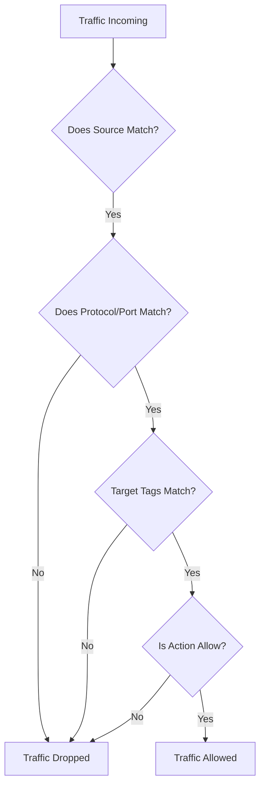

# Session 7: How to Create Firewall Rules in GCP

## Table of Contents
- [Introduction](#introduction)
- [Creating Firewall Rules](#creating-firewall-rules)
- [Demo: Allowing ICMP Ping (Ingress Rule)](#demo-allowing-icmp-ping-ingress-rule)
- [Demo: Blocking Egress to Specific IP](#demo-blocking-egress-to-specific-ip)
- [Summary](#summary)

## Introduction

### Overview
Firewall rules in Google Cloud Platform (GCP) are essential security controls that determine which traffic is allowed or denied to and from your Virtual Machines (VMs) in a Virtual Private Cloud (VPC) network. These rules operate at the network level and provide granular control over incoming (ingress) and outgoing (egress) traffic based on various criteria such as source/destination IP ranges, protocols, ports, and network tags.

GCP firewall rules are stateful, meaning they automatically allow return traffic for authorized sessions. They are applied to all instances in a VPC network unless specifically restricted through target tags or service accounts.

### Key Concepts/Deep Dive
Firewall rules consist of several key components that work together to define traffic policies:

#### Rule Priority
- **Priority Levels**: Numeric values from 0 to 65535, where lower numbers have higher priority.
- **Evaluation Order**: Rules are evaluated in ascending order of priority. Rule 0 has the highest priority (highest precedence).
- **Conflict Resolution**: If two rules have the same priority and apply to the same traffic, **deny** rules take precedence over allow rules.

#### Traffic Direction
- **Ingress**: Controls incoming traffic from external sources to the VM.
- **Egress**: Controls outgoing traffic from the VM to external destinations.

#### Actions
- **Allow**: Permits traffic that matches the rule criteria.
- **Deny**: Blocks and drops traffic that matches the rule criteria.

#### Target Scope
- **All Instances in the Network**: Applies the rule to every VM in the selected VPC network.
- **Specified Target Tags**: Applies only to VMs with matching network tags.
- **Specified Service Accounts**: Applies only to VMs that use certain service accounts (recommended by Google for better security).

#### Source/Destination Filters
- **IP Ranges**: Include IPv4 or IPv6 ranges (e.g., `0.0.0.0/0` for all IPs).
- **Source Tags**: Tags of other VMs in the same project that can initiate traffic.

#### Protocols and Ports
- Specific protocols: TCP, UDP, ICMP, etc.
- Port specifications: Single ports, ranges, or "all" (not recommended for production).

## Creating Firewall Rules

### Step-by-Step Guide
1. Navigate to the VPC Network section in GCP Console.
2. Click on "Firewall" in the left navigation.
3. Choose "Create Firewall Rule" (vs. creating a hierarchical firewall policy).

#### Basic Configuration
- **Name**: A descriptive identifier (e.g., `firewall-testing`).
- **Description**: Optional notes about the rule's purpose.
- **Logs**: Enable to capture traffic matches for monitoring (optional).

#### Network Selection
- Choose the VPC network where the rule will apply (e.g., `default` network).

#### Priority Settings
- Set a numeric priority (0-65535).
- Rules with lower numbers are evaluated first.

#### Direction and Action
- **Direction**: Select "Ingress" for incoming traffic or "Egress" for outgoing traffic.
- **Action**: Choose "Allow" to permit traffic or "Deny" to block it.

#### Target Specification
- **All Instances in Network**: Applies to all VMs in the VPC.
- **Specified Target Tags**: Specify tags (e.g., `allow-internet-traffic`) - VMs must have matching tags.
- **Specified Service Accounts**: More secure option recommended by Google - restricts based on VM service account permissions.

#### Source Filters (for Ingress Rules)
- **IP Ranges**: Define IPv4 or IPv6 ranges (e.g., `0.0.0.0/0` for all IPs).
- **Source Tags**: Reference network tags from VMs in the same project.

#### Protocols and Ports
- Select specific protocols (TCP, UDP, ICMP, etc.).
- Specify ports or use "all" (caution: this exposes all ports, not recommended for internet-facing rules).




> [!NOTE]
> Firewall rules are always permissive by default - you must explicitly create rules to restrict unwanted traffic.

## Demo: Allowing ICMP Ping (Ingress Rule)

### Setup Steps
1. Create a VM instance for testing (ensure it's in the appropriate VPC network).

2. Navigate to VPC Network > Firewall.

3. Create a new firewall rule with the following configuration:

   | Parameter | Value |
   |-----------|-------|
   | Name | firewall-testing |
   | Description | Allow ICMP ping traffic for testing |
   | Network | default |
   | Priority | 1000 |
   | Direction | Ingress |
   | Action on Match | Allow |
   | Target | Specified target tags: firewall-testing |
   | Sources | IP ranges: `0.0.0.0/0` |
   | Protocols and ports | ICMP |

   ```bash
   # GCP Console equivalent CLI command (for reference)
   gcloud compute firewall-rules create firewall-testing \
     --network default \
     --priority 1000 \
     --direction ingress \
     --action allow \
     --rules icmp \
     --source-ranges 0.0.0.0/0 \
     --target-tags firewall-testing
   ```

4. Apply the target tag to your VM:
   - Go to the VM instance details
   - Under Networking, edit network tags
   - Add the tag `firewall-testing`

5. Verify the rule is applied:
   - Return to Firewall rules
   - Check that the instance appears under the matching instances

### Testing
1. Obtain the external IP of your test VM.
2. Use an online ping tool (e.g., `ping.pe` or command-line `ping`).
3. Ping the VM's external IP - it should succeed.

> [!IMPORTANT]
> After applying network tags to a VM, changes may take a few moments to propagate.

## Demo: Blocking Egress to Specific IP

### Setup Steps
1. Create a new firewall rule for egress traffic:

   | Parameter | Value |
   |-----------|-------|
   | Name | block-google-ip |
   | Direction | Egress |
   | Action on Match | Deny |
   | Target | Specified target tags: block-google-ip |
   | Destinations | IP ranges: `8.8.8.0/24` |
   | Protocols and ports | ICMP |

   ```bash
   gcloud compute firewall-rules create block-google-ip \
     --network default \
     --priority 1000 \
     --direction egress \
     --action deny \
     --rules icmp \
     --destination-ranges 8.8.8.0/24 \
     --target-tags block-google-ip
   ```

2. Apply the target tag to your VM:
   - Edit the VM instance
   - Add `block-google-ip` to network tags

### Testing
1. Ping `8.8.8.8` from the VM - it should fail.
2. Ping other IP addresses (e.g., `8.8.4.4`) - it should work.

The egress rule will evaluate outgoing traffic and drop ICMP requests to the specified IP range while allowing other traffic through.

## Summary

### Key Takeaways
```diff
+ Firewall rules provide essential network security for GCP VMs
+ Priority determines evaluation order (lower numbers = higher priority)
+ Target tags offer granular control over which VMs the rules apply to
+ Egress rules control outbound traffic, ingress controls inbound
+ Always use specific IP ranges and protocols instead of "all" for security
+ Google recommends service accounts over target tags for better access control
+ Rules are evaluated in order: priority → direction → action → match criteria
+ Stateful rules automatically allow return traffic for authorized connections
```

### Expert Insight

#### Real-world Application
In production environments, implement defense-in-depth security using layered firewall rules:
- Use ingress rules to limit exposed ports (80/443 for HTTP/HTTPS only)
- Implement egress filtering to prevent data exfiltration
- Leverage network tags for environment segmentation (dev vs. prod)
- Combine with Cloud Armor and Identity-Aware Proxy for comprehensive protection

#### Expert Path
- **Master Tags Strategy**: Develop a consistent naming convention for network tags across projects
- **Priority Planning**: Pre-plan priority ranges (e.g., 0-999 for system rules, 1000+ for application rules)
- **Monitoring**: Always enable firewall logging for troubleshooting and compliance auditing
- **Infrastructure as Code**: Use Terraform or Deployment Manager to maintain firewall rules as code
- **Regular Audits**: Review rules quarterly to remove unnecessary access and detect permission creep

#### Common Pitfalls
```diff
- Avoid creating overly permissive rules (e.g., 0.0.0.0/0 for all ports)
- Never rely solely on default-allow rules without explicit deny configurations
- Beware of tag mismatches between rules and VM configurations
- Watch for rule conflicts when multiple projects share a VPC network
- Don't forget to update rules when instance types or service accounts change
```

#### Lesser Known Things
- Firewall rules apply across all regions within a VPC network
- Temporal caching may cause brief delays (30-90 seconds) after rule changes
- The default VPC includes implicit allow rules for common internal traffic
- ICMP rules are particularly tricky in egress scenarios due to statefulness
- Target tags can conflict between ingress and egress rules on the same VM
- Service accounts in firewall rules use IAM Compute Engine service account associations, not IAM service account permissions

> [!CAUTION]
> Misconfigured firewall rules can lead to security breaches or service disruptions. Always test rules in staging environments before production deployment.
