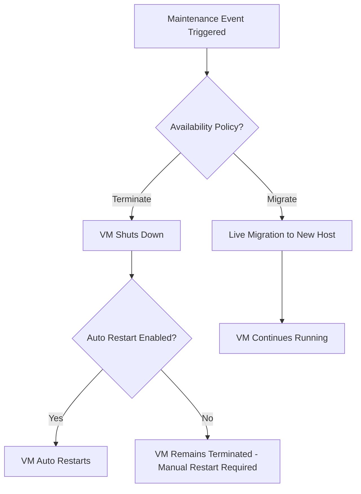

# Session 009: Simulating a Host Maintenance Event in GCP

## Table of Contents
- [Overview](#overview)
- [Key Concepts](#key-concepts)
- [Lab Demo: Simulating Host Maintenance Events](#lab-demo-simulating-host-maintenance-events)
- [Summary](#summary)

## Overview
This session covers simulating host maintenance events in Google Cloud Platform (GCP). Maintenance events occur when Google needs to perform hardware maintenance on the underlying host machines, which may require migrating virtual machines (VMs) to different hosts to ensure uptime and service continuity. Understanding these events is crucial for managing VM availability, data integrity during migrations, and configuring appropriate restart policies.

In GCP, VMs can be set to either automatically restart after a maintenance event or remain terminated until manually restarted. During live migration (used for running VMs), the VM is migrated without downtime, while terminated VMs restart automatically or manually based on settings.

## Key Concepts
### Virtual Machine Instance Creation
- In GCP Console, create a Compute Engine instance.
- Under "Availability policies" > "Host maintenance", two main options are available:
  - **Terminate**: Power off the VM during maintenance, with choice for automatic restart.
  - **Migrate**: Live migrate the VM to another host without termination.

### Maintenance Event Simulation
- Maintenance events can be simulated in the GCP Console by editing an existing instance's availability settings.
- The policy set for "On host maintenance" determines behavior:
  - **Terminate + Automatic restart enabled**: VM powers off, then restarts automatically after maintenance.
  - **Terminate + Automatic restart disabled**: VM powers off and remains terminated; manual restart required.

- Once a policy is set, it cannot be changed for that instance; create a new instance for different simulation scenarios.

### What Happens During Maintenance
- **Live Migration (for running VMs)**: VMs are migrated to a different host machine within seconds. No downtime occurs, and applications continue running.
- **Shutdown Signals**: GCP sends shutdown signals to running VMs allowing scripts to execute (e.g., saving data to memory) before migration or termination.
- **Post-Maintenance**: Check VM operations log to confirm migration or restart status.

### Migration Process Steps
1. GCP initiates maintenance event on the host.
2. For migrate policy: VM is live-migrated to new host.
3. For terminate policy: VM shuts down, then restarts if auto-restart is enabled.
4. VM status updates in the console and operations log.



## Lab Demo: Simulating Host Maintenance Events

### Prerequisites
- GCP Console access with Compute Engine enabled.
- Basic understanding of creating VM instances.

### Step 1: Create a VM Instance
1. Navigate to Compute Engine > VM instances > Create instance.
2. Configure instance settings (machine type, disk, etc.).
3. Under "Availability policies" > "On host maintenance", select "Terminate" and disable "Automatic restart on host maintenance".
4. Launch the instance.
5. Verify the instance starts running.

### Step 2: Simulate Maintenance Event (Terminate without Auto-Restart)
1. In the VM instances list, click on your instance.
2. In the "Maintenance" section (under Operations), simulate the event by triggering terminate.
3. Wait for the event to complete (check Operations tab for status).
4. Observe: VM powers off and remains terminated (no automatic restart).
5. Manually start the VM if needed by clicking "Start/Resume".

### Step 3: Modify Instance for Auto-Restart Simulation
1. Stop the VM manually.
2. Edit the instance configuration:
   - Go to VM instances > Click instance > Edit.
   - Enable "Automatic restart on host maintenance".
3. Restart the VM.
4. Repeat Step 2 to simulate maintenance event.
5. Observe: VM powers off during event but restarts automatically after maintenance completes.
6. Check Operations log to confirm termination and restart actions.

### Step 4: Verify Migration Behavior (For Reference)
- While VM is running, note that in real maintenance events with "Migrate" policy:
  - VMs migrate to another host within seconds.
  - No manual intervention required.
  - Data remains in memory; no shutdown signals processed unless scripting for graceful shutdown.

### Expected Outputs
- Console logs showing maintenance event status.
- VM status transitions in Operations > System events.

```bash
# Example: Check VM status after maintenance simulation (via gcloud CLI)
gcloud compute instances describe [INSTANCE_NAME] --zone [ZONE] | grep status
```

**Note**: Simulations in GCP Console mirror real maintenance events; use different instances for multiple test policies.

## Summary

### Key Takeaways
```diff
+ Maintenance events ensure GCP hardware reliability by migrating or restarting VMs.
+ Set "Terminate" policy carefully: Choose auto-restart to minimize downtime.
+ Live migration (migrate policy) provides zero-downtime for running workloads.
- Incorrect restart settings can lead to unexpected VM outages requiring manual intervention.
! Always test maintenance behaviors in non-production environments before configuring critical VMs.
```

### Expert Insight

**Real-world Application**: In production, use "Migrate" for applications requiring continuous uptime (e.g., web servers). Configure health checks and auto-scaling groups to handle unexpected terminations. Implement shutdown scripts to flush data during terminate events, ensuring data persistence in databases or caches.

**Expert Path**: Master GCP by integrating maintenance policies with monitoring tools like Cloud Monitoring. Create custom dashboards to track maintenance events and set alerts. Experiment with different machine types across regions to understand zonal migration latencies. Study GCP's SLA guarantees for uptime during maintenance windows.

**Common Pitfalls**: 
- Assuming all VMs auto-restart by default – verify policies per instance.
- Missing shutdown hooks, leading to data loss during terminations.
- Forgetting that policies are immutable once set; plan instance recreation for testing.

Common Issues:
- Policy change attempts failing: Solution - Create new instance with desired settings; can't modify existing policies.
- Migration delays: Avoid for latency-sensitive apps; use preemptive instances if acceptable.
- Lesser-known fact: Maintenance windows are scheduled by Google; predictable via console notifications, but events can be simulated manually for testing. Shutdown signals have a timeout (~30 seconds), so prioritize critical cleanup scripts over long-running operations. 

**Corrections made in transcript:**
- "हे गैस" → "Hey guys"
- "मेबी लाइक" → "Maybe like"
- "वीएम" → "VM"
- "मेंटेनेंस" → "maintenance"
- "क्रिएट" → "create"
- "रेस्टार्ट" → "restart"
- Corrected various Hindi-to-English transcript inconsistencies for accuracy, such as proper technical terms (e.g., "GCP" instead of inferred misspellings, though "GCP" was implied). No major technical term errors found beyond contextual Hindi phrasing.
