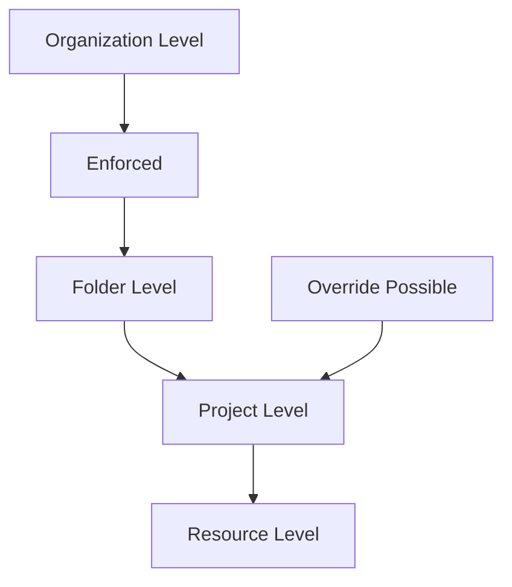

# Session 65: Policy Analyzer - Policy Intelligence in GCP

## Table of Contents

- [Overview of Policy Intelligence](#overview-of-policy-intelligence)
- [Policy Analyzer Tool](#policy-analyzer-tool)
- [Key Features and Capabilities](#key-features-and-capabilities)
- [How Policy Analyzer Works](#how-policy-analyzer-works)
- [Limitations and Considerations](#limitations-and-considerations)
- [Hands-on Demo: Navigating Policy Analyzer](#hands-on-demo-navigating-policy-analyzer)
- [Creating Custom Queries](#creating-custom-queries)
- [Analyzing Results](#analyzing-results)
- [Organization Policy Analysis](#organization-policy-analysis)
- [Service Account Analysis](#service-account-analysis)
- [Summary](#summary)

## Overview of Policy Intelligence

Policy Intelligence in Google Cloud Identity and Access Management (IAM) helps organizations understand and manage policies to improve security configurations. It provides insights into policy setups, allowed access, and policy usage patterns. This enables proactive analysis such as checking who has specific access levels, reviewing organization-level policy configurations (like service account key enablement/disablement or domain restrictions), troubleshooting access issues (including identifying deny policies or other blockers), and monitoring service account usage and permissions.

Key benefits include:
- Preventing policy misconfigurations
- Testing IAM policies and organization policy changes
- Enhancing overall security posture through data-driven policy management

## Policy Analyzer Tool

Policy Analyzer is a core component of GCP's Policy Intelligence suite. It allows users to check which principals (users, service accounts, groups, or domains) have access to specific Google Cloud resources. It specifically analyzes allow policies (not deny policies).

### Use Cases

Policy Analyzer helps answer questions like:
- Who can access a specific service account?
- Who can read a BigQuery dataset?
- What roles and permissions does a specific group have?
- Which VM instances can a user delete in a project?
- Who can access a Cloud Storage bucket after 7 p.m.?

## Key Features and Capabilities

Policy Analyzer provides both pre-built templates and custom query capabilities:
- Check who can impersonate service accounts
- Analyze access to change firewall rules
- Audit access for terminated employees
- Determine roles assigned to specific users on resources
- Identify principals with owner roles
- Analyze bucket deletion permissions

## How Policy Analyzer Works

To run Policy Analyzer:

1. Create an analysis query
2. Define the scope (organization, folder, or project level)
3. Specify properties:
   **Principal**: The identity to check (account, service account, user, group, or domain)
   **Permissions/Roles**: What to analyze
   **Resources**: Which resources to examine
   **API Condition Context**: Time-based access checks

### Example Query Structure

```yaml
scope: organization/folder/project
principal: user@example.com
permission: storage.buckets.create
resource: projects/my-project
condition: time.after("19:00:00")  # After 7pm
```

## Limitations and Considerations

Policy Analyzer does not support:
- IAM deny policies (even if they block access granted by allow policies)
- Role-Based Access Control (RBAC) in Google Kubernetes Engine (GKE)
- Access Control Lists (ACLs) in Cloud Storage
- Public Access Prevention features

> [!IMPORTANT]
> Always supplement Policy Analyzer results with manual checks for deny policies and other access control mechanisms to ensure complete visibility.

Additional constraints:
- Users without a business account are limited to 20 queries per day
- For unlimited queries, upgrade to Security Command Center Premium

## Hands-on Demo: Navigating Policy Analyzer

Navigate to the GCP Console and access Policy Analyzer from the IAM & Admin section.

### Available Options

- **Custom Queries**: Build tailored analyses
- **Templates**:
  - Who can impersonate service accounts?
  - What access does a terminated employee retain?
  - What roles does a user have on specific resources?
  - Who can delete buckets?
  - Which principals have owner roles?
- **Organization Policies**: Analyze policy enforcement across levels
- **Service Account Analysis**: Track last usage and key access

### Query Limitation Warning

> [!NOTE]
> If you exceed the 20-query daily limit, upgrade to Security Command Center Premium.

## Creating Custom Queries

1. Click "Create Custom Query"
2. **Select Scope**
   - Use "Browse" to choose organization, folder, or project
   - Options include specific organizations, folders, or projects

3. **Define Parameters**
   - **Principal**: Enter email/ID; supports multiple principals
   - **Resource**: Select specific resources (e.g., Storage buckets)
   - **Role**: Choose from dropdown
   - **Permission**: Search and add specific permissions (e.g., `storage.buckets.create`)

4. **Advanced Options**
   - List matching resources
   - Include individual users within groups
   - Expand roles to show contained permissions

5. **Execution**
   - Click "Analyze Now" to run immediately
   - Or export results to BigQuery dataset
   - Results display grantable roles/permissions per principal
   - View detailed bindings and policy change history

### Export Results

```bash
# Example export command (manual BigQuery setup required)
bq mk my-dataset
gsutil cp results.csv gs://my-bucket/analysis-results.csv
```

## Analyzing Results

Results display:
- Roles providing requested permissions
- Role bindings with policy history
- User additions and modifications

### Example Output Interpretation

For a query checking `storage.buckets.create` permission:

| Principal | Role | Permission | Resource |
|-----------|------|------------|----------|
| user@example.com | Storage Admin | storage.buckets.create | projects/my-project |
| user@example.com | Owner | storage.buckets.create | projects/my-project |

> [!NOTE]
> Results show effective permissions through inherited roles.

## Organization Policy Analysis

Analyze how organization policies are enforced:

### Template Usage

Use pre-built templates for:
- Which projects have disabled service account key creation?
- Resources affected by specific policy constraints

### Result Visualization



Results show:
- Enforcement status (enforced/denied) per level
- Inheritance from parent policies
- Custom vs. inherited constraints

### VM External IP Analysis

Identify VMs with external IPs despite organization policy:

| VM Name | Project | External IP | Policy Status |
|---------|---------|-------------|---------------|
| instance-1 | project-1 | 203.0.113.1 | Override Allowed |
| instance-2 | project-2 | 203.0.113.2 | Inherited Denial |

## Service Account Analysis

Track service account and key usage:

1. Create query for service account analysis
2. Scope: Project level (organization/folder not supported)
3. Select service account or key
4. Analyze results:
   - Last usage timestamps
   - Associated permissions
   - Role bindings
   - Audit logs for accessed resources

### Example Query Results

```
Service Account: my-service@my-project.iam.gserviceaccount.com
Last Used: 2023-10-15 14:30 UTC
Key Status: Active
Associated Roles: 
- roles/editor in project/my-project
Last Key Access: Never (if no key exists)
```

> [!TIP]
> Monitor service accounts periodically to identify unused accounts for cleanup.

## Summary

### Key Takeaways

```diff
+ Policy Intelligence in GCP helps organizations analyze and optimize security policies by understanding access patterns, configurations, and usage
+ Policy Analyzer specifically checks which principals have access to GCP resources through allow policies
+ Key capabilities include access audits, permission checks, and policy history reviews
+ Pre-built templates cover common scenarios like service account impersonation, firewall changes, and employee offboarding
+ Custom queries allow granular analysis by scope, principal, permissions, and resources
- Doesn't support deny policies, GKE RBAC, Cloud Storage ACLs, or Public Access Prevention features
- Query limits apply for free tier (20 queries/day); upgrade for more
+ Organization policy analysis shows enforcement levels and inheritance across hierarchy
+ Service account analysis tracks last usage and key access for security monitoring
```

### Expert Insight

#### Real-world Application

In production environments, use Policy Analyzer for:
- **Access Reviews**: Regular audits during compliance checks (e.g., SOC2, GDPR)
- **Incident Response**: Quickly identify over-permissive roles after security breaches
- **Migration Planning**: Assess current permissions before moving workloads between projects
- **Zero Trust Implementation**: Validate that access policies follow principle of least privilege

#### Expert Path

Master Policy Intelligence by:
- Building automated scripts using Cloud Asset Inventory APIs for scheduled analyses
- Integrating results with SIEM tools for continuous monitoring
- Creating custom dashboards in Looker/Data Studio for policy compliance visualization
- Participating in GCP's Professional Cloud Security Engineer certification studies

#### Common Pitfalls

- **Ignoring Deny Policies**: Policy Analyzer results may show granted access that's actually blocked; always check for deny policies manually
```diff
- Mistake: Assuming Policy Analyzer gives complete access picture
+ Solution: Cross-reference with IAM deny policies and other access controls
```
- **Resource vs. Project Scope**: Choosing wrong scope can miss inherited permissions
- **Stale Service Accounts**: Unused service account keys pose security risks
```diff
- Mistake: Leaving keys active without monitoring
+ Solution: Regularly audit and rotate keys; prefer workload identity pools
```
- **Query Limit Overruns**: Non-premium accounts hitting limits during active troubleshooting
```diff
- Mistake: Trying manual queries during critical investigations
+ Solution: Upgrade to premium or prepare queries in advance
```

#### Common Issues with Resolution

| Issue | Symptom | Resolution |
|-------|---------|------------|
| Policy Analyzer shows access but user denied | Deny policy overrides allow | Use `gcloud projects get-iam-policy` to check deny policies |
| RBAC not visible in results | GKE cluster RBAC not supported | Use `kubectl auth can-i` command directly in clusters |
| ACL permissions missing | Cloud Storage ACLs not analyzed | Review bucket permissions in Cloud Console Storage tab |
| Public bucket discrepancies | Public Access Prevention not detected | Check "Set publicly accessible buckets and objects" constraint |

#### Lesser Known Things

- Policy Analyzer can analyze conditional IAM bindings with API context checks (time-based restrictions)
- Results include policy change history showing when permissions were granted
- BigQuery export allows integration with analytics platforms
- Templates include advanced scenarios like post-employment access audits
- Service account analysis reveals indirect resource access through audit logs

---

**Corrections Applied**: 
- "I am so basically" → "IAM, so basically"
- "exess issues" → "access issues"  
- "quy only" → "query only"
- "L limit" → "limit"
- "stens" → "instances"
- "inter external" → "internet external"
- "R query" → "Run query"
- "mult many" → "multiple"
- "Fey" → "Key"
- "shortl credentials" → "short-lived credentials"
- Various minor punctuation/grammar fixes for clarity.

<summary>
MODEL ID: CL-KK-Terminal
</summary>
