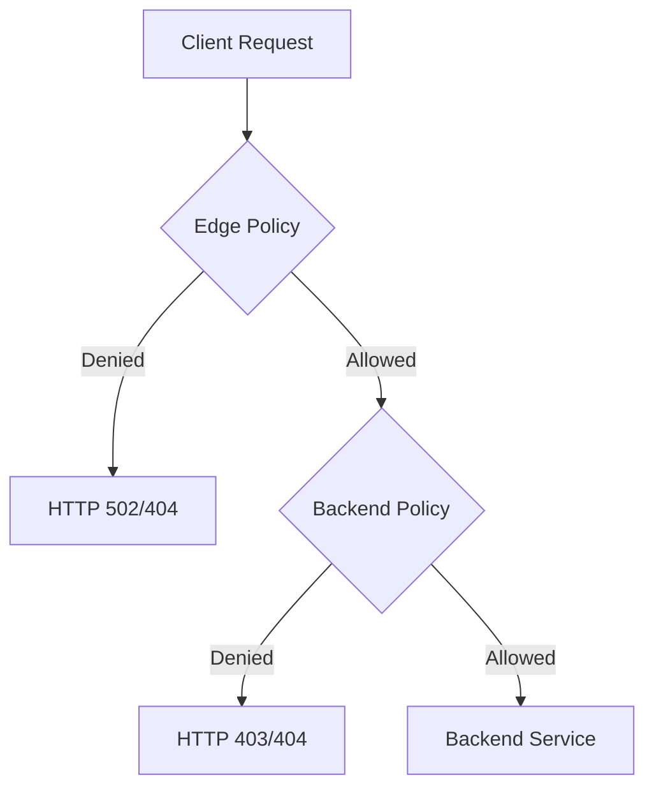

# Session 69: Cloud Armor GCP Part 2

## Table of Contents
- [Overview](#overview)
- [Edge Security Policies vs Backend Security Policies](#edge-security-policies-vs-backend-security-policies)
- [Demo: Applying Edge Policy to Backend Bucket](#demo-applying-edge-policy-to-backend-bucket)
- [Demo: Applying Edge Policy to Backend Service](#demo-applying-edge-policy-to-backend-service)
- [Layers of Protection](#layers-of-protection)
- [Demo: Two-Layer Protection](#demo-two-layer-protection)
- [Demo: Allowing in Edge, Denying in Backend](#demo-allowing-in-edge-denying-in-backend)
- [Regional Policies](#regional-policies)
- [Summary](#summary)

## Overview
This session continues the exploration of Google Cloud Armor, focusing on Edge security policies and their integration with backend security policies. Cloud Armor is a managed service that provides distributed denial-of-service (DDoS) protection, web application firewall (WAF), and security policies for Google Cloud Platform (GCP) resources. In the first part, we covered creating backend security policies and integrating them with global load balancers. This part examines Edge security policies (also known as Network policies in the context), which offer advanced protection capabilities and can be applied to both backend services and backend buckets.

Edge security policies are premium features that act at the edge of the network, before traffic reaches backend resources. Unlike backend security policies that only support backend services, Edge policies support both backend services and backend buckets. They provide an additional layer of security by filtering traffic at the network edge, protecting against threats like DDoS attacks, malicious IP addresses, and bot traffic.

## Edge Security Policies vs Backend Security Policies

### Key Concepts/Deep Dive
Edge security policies are designed for comprehensive protection at the network perimeter:

- **Scope**: Applied globally and before traffic reaches backend resources. They protect external-facing services and static content served from backend buckets.
- **Supported Targets**:
  - Backend services (Compute Engine instance groups, App Engine apps, etc.)
  - Backend buckets (Cloud Storage buckets serving static content)
- **Key Features**:
  - DDoS mitigation
  - OWASP rule-based protection
  - Rate limiting
  - Bot management
- **Deployment Location**: Operates at the Google Cloud edge, closest to end-users

Compared to backend security policies:

| Aspect | Backend Security Policies | Edge Security Policies |
| --- | --- | --- |
| Supported Targets | Backend services only | Backend services and backend buckets |
| Scope | Per-backend service | Global network-wide protection |
| Protection Layer | Backend routing logic | Network edge |
| Configuration Actions | Allow, Deny, Redirect, Rate Limit, Throttle | Allow, Deny (simpler actions) |
| Geographic Coverage | Regional | Global |

```diff
+ Advantage of Edge Policies: Protects backend buckets serving static content like images, CSS, JS files
- Limitation of Edge Policies: Currently a premium feature requiring specific licensing
! Note: Backend security policies do not protect backend buckets, creating security gaps for static content
```

> [!IMPORTANT]
> Edge policies are crucial for protecting publicly accessible static assets stored in Cloud Storage backend buckets, which backend security policies cannot secure.

### Common Concepts
Both policy types use IP-based rules, custom expressions for advanced matching, and integrate with Cloud Logging for monitoring. However, Edge policies offer more robust network-level threat mitigation.

## Demo: Applying Edge Policy to Backend Bucket

### Lab Demo Steps
1. **Environment Verification**: Confirm existing setup includes a global load balancer with a backend service (containing Compute Engine instances) and a backend bucket serving static content (e.g., city.png).

2. **Demonstrate Backend Security Policy Limitation**: Note that a backend security policy applied to the backend service blocks traffic to the backend service but allows access to the backend bucket.
   - Attempt to access the load balancer IP from a denied IP – results in 404 (denied).
   - Attempt to access static content from backend bucket – succeeds with 200 OK.

   Reason: Backend security policies only apply to backend services, not backend buckets.

3. **Create Edge Security Policy**:
   - In Google Cloud Console, navigate to Cloud Armor > Security Policies.
   - Click "Create Policy".
   - Name: "Edge Policy"
   - Type: Edge Policy (Note: Global only; Regional not available)
   - Default Action: Deny
   - Custom Response Code: 502 (Bad Gateway) instead of default 404.

4. **Target Configuration**: Skip adding custom rules for now.
   - In Targets section, apply the policy to the backend bucket.

5. **Policy Deployment**: Create the policy and wait for propagation (~2-5 minutes).

6. **Verification**:
   - Access static content from backend bucket: Now returns 502 Bad Gateway.
   - Access backend service: Still works (not affected by Edge policy).

### Key Observations
- Edge policies effectively protect backend buckets by denying traffic before it reaches Cloud Storage.
- Policy applies to all IP addresses by default when no custom rules are configured.

## Demo: Applying Edge Policy to Backend Service

### Lab Demo Steps
1. **Modify Existing Edge Policy**: Go to the previously created "Edge Policy".

2. **Add Additional Target**:
   - In Targets section, select both backend bucket and backend service.
   - Save changes.

3. **Wait for Propagation**: ~2-5 minutes.

4. **Verification**:
   - Access backend service: Now returns 502 Bad Gateway (Edge policy denies all).
   - Access backend bucket: Continues to return 502 Bad Gateway.

### Key Observations
- Single Edge policy can protect multiple resource types simultaneously.
- Edge policies take precedence over backend security policies in traffic evaluation.

> [!NOTE]
> Propagation delays are normal in distributed systems like Cloud Armor. Always wait 2-5 minutes before testing changes.

## Layers of Protection

### Deep Dive
When both Edge and backend security policies are applied to the same backend service, they create stacked defense layers:

- **Traffic Flow**: Client Request → Edge Policy Evaluation → Backend Policy Evaluation → Backend Service
- **Evaluation Logic**: If denied at Edge level, traffic is blocked immediately. If allowed at Edge, it proceeds to backend policy evaluation.



This multi-layer approach provides defense-in-depth security, similar to perimeter firewalls + host-based firewalls.

## Demo: Two-Layer Protection

### Lab Demo Steps
1. **Setup**: Edge policy with allow rule for specific IP (e.g., client VM IP), backend security policy allowing the same IP.

2. **Configure Edge Policy**:
   - Add rule: Priority 10000, Action: Allow, Match: IP address of client VM.
   - Apply to both backend service and backend bucket.

3. **Configure Backend Security Policy**: Ensure client IP is allowed (default or explicit rule).

4. **Verification**:
   - Traffic from client IP: Reaches backend service successfully (200 OK).
   - Traffic from backend: Also reaches backend bucket (200 OK).
   - Traffic from denied IPs: Blocked by Edge policy (502).

5. **Demonstrate Layering**: Create deny rule in backend security policy for the same allowed IP, higher priority than allow rules.

6. **Wait for Propagation**

7. **Final Verification**:
   - Client IP traffic: Blocked by backend policy (403 Forbidden), despite Edge allowing.

### Key Observations
- Edge is "outer layer", backend is "inner layer".
- More restrictive policy wins when conflicts occur.
- Enables fine-grained control over multi-level security enforcement.

## Demo: Allowing in Edge, Denying in Backend

### Lab Demo Steps
1. **Edge Policy**: Allow client IP via rule.

2. **Backend Security Policy**: Add deny rule for client IP, higher priority.
   - Rule: Priority 900 (higher than allow rules), Action: Deny, HTTP Code: 403 Forbidden.

3. **Update Policies**

4. **Wait for Propagation**

5. **Verification**:
   - Backend service access: 403 Forbidden (backend denies).
   - Backend bucket access: Still allowed (only Edge applies to backend bucket).

### Key Observations
- Policies operate independently on their supported targets.
- Backend buckets are only protected by Edge policies.

## Regional Policies

### Deep Dive
Regional backend security policies provide localized protection for resources in specific GCP regions:

- **Supported Types**: Only backend security policies; Edge and Network policies are global-only.
- **Use Cases**: Compliance with regional data residency requirements, reducing latency for regional resources.
- **Setup Process**:
  - Specify target region during creation.
  - Targets limited to regional backend services (e.g., regional external/internal application load balancers).
  - Rules and actions identical to global backend security policies.

Limitations: Cannot protect backend buckets or serve as perimeter defense like Edge policies.

> [!NOTE]
> Regional policies are ideal for organizations requiring geographically isolated security controls.

## Summary

### Key Takeaways
```diff
+ Cloud Armor provides multi-layer security through Edge (global) and Backend (regional/global) policies
+ Edge policies protect both backend services and backend buckets, while backend policies only support backend services
+ Traffic evaluation follows: Edge Policy → Backend Policy → Backend Resource
+ More restrictive rules take precedence when layered policies conflict
+ Propagation time (~2-5 minutes) is required for policy changes to take effect
+ Regional policies offer localized protection but limited scope compared to global Edge policies
- Edge policies are a premium feature requiring specific licensing
- Backend security policies leave backend buckets unprotected without Edge policies
! Always test policies in a controlled environment before production deployment
! Monitor Cloud Logging for unexpected blocks that may impact legitimate traffic
```

### Expert Insight

#### Real-World Application
In production environments, Cloud Armor Edge policies are essential for protecting public-facing static assets like CDN-hosted images, CSS, and JavaScript files stored in Cloud Storage. For example, a media streaming platform might use Edge policies to protect backend buckets serving video thumbnails while using backend policies for dynamic API endpoints. This layered approach ensures comprehensive DDoS protection and prevents data exfiltration from static content repositories.

#### Expert Path
To master Cloud Armor:
- Learn Common Expression Language (CEL) for advanced custom rules in Edge policies.
- Implement rate limiting based on geolocation and user agents to combat bot attacks.
- Integrate with Cloud Monitoring and Logging for automated alerting on policy violations.
- Use Preview mode (discussed in future sessions) for safe policy testing without impacting production traffic.
- Study Google Cloud's WAF rules continuously as they update to cover new threat vectors.

#### Common Pitfalls
- **Underestimating Propagation Time**: Failing to wait for changes to propagate leads to false negatie testing results.
- **Overlapping Rules**: Conflicting priorities between Edge and backend policies can create unexpected blocks – maintain clear rule hierarchies.
- **Backend Bucket Vulnerability**: Assuming backend security policies protect static content – externally hosted assets need Edge policies for comprehensive security.
- **Performance Impact**: Overly complex rules with frequent IP lookups can introduce latency; optimize using Cloud Armor logging analysis.
- **Licensing Oversights**: Attempting to use Edge policies without premium licenses results in deployment failures – verify account entitlements.
- **Monitoring Gaps**: Not setting up alerts for blocked requests can hide legitimate traffic being incorrectly denied.
- **Geographic Mismatches**: Applying regional policies to global load balancers creates ineffective protection zones.

#### Common Issues with Resolution
- **502 Errors After Policy Changes**: Wait 5-10 minutes for propagation; verify rule priorities don't conflict.
- **Backend Bucket Not Protected**: Use Edge policies for buckets; backend policies only work with services.
- **Rules Not Taking Effect**: Check target associations; ensure regional policies are applied to compatible resources.
- **False Positives**: Review Custom Rules syntax; test with Preview mode before applying globally.

#### Lesser Known Things
- Edge policies support OWASP ModSecurity Core Rule Set (CRS) integration for advanced threat detection beyond basic actions.
- Backend policies can be associated with multiple targets across regions, but Edge policies are truly global.
- Cloud Armor integrates with Cloud CDN, allowing security policies to filter cache requests at edge locations worldwide.
- Custom response codes in deny rules help distinguish between different policy actions in access logs for troubleshooting.
