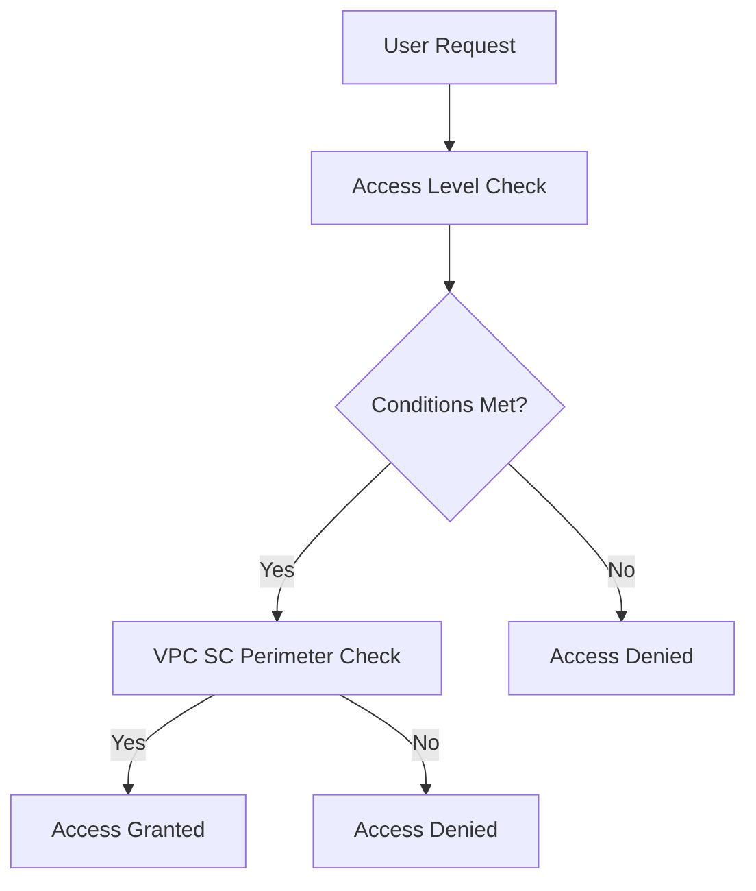
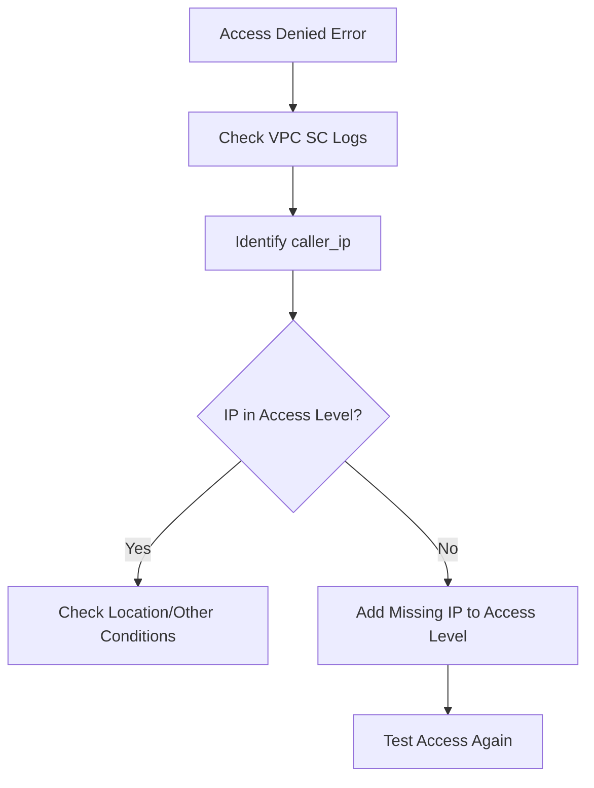

# Session 3: VPC Service Controls with Access Level GCP Part 3

## Table of Contents
- [Introduction](#introduction)
- [Access Context Manager Overview](#access-context-manager-overview)
- [Integrating Access Context Manager with VPC Service Controls](#integrating-access-context-manager-with-vpc-service-controls)
- [Creating Access Levels](#creating-access-levels)
- [Lab Demo: Implementing Basic Service Perimeter](#lab-demo-implementing-basic-service-perimeter)
- [Lab Demo: Adding Private IP Access Level](#lab-demo-adding-private-ip-access-level)
- [Lab Demo: Geographic Location Conditions](#lab-demo-geographic-location-conditions)
- [Lab Demo: Public IP Access Levels](#lab-demo-public-ip-access-levels)
- [Lab Demo: Access Level Dependencies](#lab-demo-access-level-dependencies)
- [Access Level Conditions and Logic](#access-level-conditions-and-logic)
- [Advanced Features and Limitations](#advanced-features-and-limitations)
- [Summary](#summary)

## Introduction

🎯 **Objective**: This session delves into the third part of VPC Service Controls (VPC SC) series, focusing on integrating Access Context Manager for fine-grained, attribute-based access control.

💡 **Key Focus**:  
- Understanding Access Context Manager as a separate service that works with VPC SC  
- Creating access levels based on device types, user identity, IP ranges, and geographic locations  
- Implementing access policies at organization or scoped levels  
- Demonstrating practical configurations through lab demos

## Access Context Manager Overview

### Overview
Access Context Manager is an independent Google Cloud service that enables organization administrators to define fine-grained, attribute-based access controls for projects and resources. Unlike VPC SC which creates security perimeters around services, Access Context Manager can enforce access based on request attributes such as device type, user identity, IP ranges, and geographic location.

### Key Concepts/Deep Dive

✅ **Access Policies**:  
- Organization-wide containers for all Access Context Manager resources  
- Contain access levels and service perimeters  
- Can be created at organization level (one per organization) or scoped to folders/projects  
- Required container before creating access levels or service perimeters  

✅ **Access Levels**:  
- Define specific access criteria (conditions) that must be met  
- Can be attached to VPC SC perimeters to control ingress traffic  
- Support multiple condition types combined with logical operators (AND/OR)  
- Examples: IP networks, geographic restrictions, device policies  

✅ **Supported Services**:  
- VPC Service Controls  
- Identity-Aware Proxy (IAP)  
- BeyondCorp Enterprise (for Google Workspace)  

✅ **Condition Types**:  
- **IP Networks**: Allow access from specific public/private IP ranges or VPC networks  
- **Geographic Locations**: Restrict access to specific countries/regions  
- **Device Policies**: Requires premium license for enterprise features  
- **Access Level Dependencies**: Combine multiple access levels with logical relationships  

### Supported Condition Types Table

| Condition Type | Description | Example Use Case |
|----------------|-------------|------------------|
| IP Networks | IP ranges or VPC networks | Allow corporate network access only |
| Geographic | Country/region restrictions | Restrict to US-based traffic |
| Device Policy | Device security posture | Require work devices only |
| Dependencies | Combine access levels | Multiple conditions must be met |

## Integrating Access Context Manager with VPC Service Controls

### Overview
VPC Service Controls create perimeter-based security around Google Cloud services, but don't inherently support attribute-based access. Access Context Manager fills this gap by allowing you to create access levels that define who can access resources even from within a VPC network.

### Key Concepts/Deep Dive

⚠️ **Integration Point**: Access levels work with ingress rules in VPC SC - controlling what traffic enters protected services, but not egress rules.



✅ **Workflow**:  
1. Create access policy container  
2. Define access levels with conditions  
3. Create VPC SC perimeter protecting desired services  
4. Attach access levels to the perimeter

✅ **Limitations**:  
- Only works for ingress (inbound) traffic to protected services  
- Cannot control egress traffic from perimeter to internet  
- For egress control, use standard egress policies in VPC SC

## Creating Access Levels

### Overview
Access levels define the specific conditions that determine whether a request is allowed to access resources protected by VPC Service Controls. These levels can include multiple conditions combined with boolean logic.

### Key Concepts/Deep Dive

✅ **Creation Process**:  
1. Navigate to Access Context Manager in Google Cloud Console  
2. Create access level with unique name  
3. Choose Basic or Advanced mode (Advanced requires premium)  
4. Define conditions (IP networks, geographic locations, etc.)  
5. Attach to service perimeter

✅ **Basic vs Advanced Mode**:  
- **Basic**: Simple conditions like IP ranges and geography  
- **Advanced**: Custom expressions using CEL (Common Expression Language)

### Access Level Configuration Options

| Feature | Basic Mode | Advanced Mode | Purpose |
|---------|------------|----------------|---------|
| IP Networks | ✅ | ✅ | Allow specific IP ranges |
| Geographic | ✅ | ✅ | Restrict by location |
| Device Policy | ❌ | ✅ | Device compliance |
| Custom CEL | ❌ | ✅ | Complex conditions |
| Dependencies | ✅ | ✅ | Combine levels |

## Lab Demo: Implementing Basic Service Perimeter

> [!NOTE]  
> Prerequisite: Access policy must exist at organization level

### Steps to Create Service Perimeter:

1. **Navigate to VPC Service Controls**:  
   - Go to Google Cloud Console → Security → VPC Service Controls  
   - Verify access policy exists

2. **Create New Service Perimeter**:  
   ```
   Perimeter Name: secondproject
   ```

3. **Add Protected Services**:  
   - Search and select "Cloud Storage"  
   - Search and select "BigQuery"  
   - Add any additional services as needed

4. **Implement Perimeter**:  
   - Click "Save" to create perimeter  
   - Note: No access levels attached at this stage

5. **Test Access from VM**:  
   - From a VM outside the protected project, attempt to access Cloud Storage bucket  
   - Execute: `gsutil ls -b gs://your-bucket-name`  
   - **Expected Result**: Access denied due to perimeter protection

### Key Observations:
- Traffic is now restricted to only configured protected services
- Access fails even when coming from internet or different VPC networks

## Lab Demo: Adding Private IP Access Level

### Steps to Create Private IP Access Level:

1. **Navigate to Access Context Manager**:  
   - Under your access policy, select "Access Levels"

2. **Create New Access Level**:  
   ```
   Name: test-access-level
   Mode: Basic
   ```

3. **Configure Private IP Conditions**:  
   - Select "IP Networks" condition type  
   - Choose "VPC Network" option  
   - Add specific VPC network (e.g., "default" VPC from first project)  
   - Include all subnets or select specific ones

4. **Attach to Service Perimeter**:  
   - Edit the existing service perimeter  
   - Add the created access level under "Ingress Rules"

5. **Test Access**:  
   - Attempt bucket access from VM in authorized VPC network  
   - **Expected Result**: Access succeeds  
   - Attempt access from non-authorized location  
   - **Expected Result**: Access blocked

### Configuration Details:

```yaml
Access Level: test-access-level
Conditions:
  IP Networks:
    - vpcNetworkName: projects/first-project/global/networks/default
      vpcSubnets: ALL
```

## Lab Demo: Geographic Location Conditions

### Steps to Add Geographic Restrictions:

1. **Edit Existing Access Level**:  
   - Open "test-access-level" in Access Context Manager  
   - Click "Edit"

2. **Add Geographic Condition**:  
   - Select "Geographic" condition type  
   - Choose "Specific Regions"  
   - Add desired location (e.g., "India - all regions")

3. **Set Logical Operator**:  
   ```
   Condition: AND (both VPC and geographic must match)
   ```

4. **Test Scenarios**:  
   - **VM in correct VPC but wrong location**: Access blocked ✅  
   - **VM in VPC from correct location**: Access granted ✅

### Logical Control Table

| VPC Match | Geographic Match | Operator | Result |
|----------|------------------|----------|--------|
| ✅ | ✅ | AND | ✅ Allowed |
| ✅ | ❌ | AND | ❌ Blocked |
| ❌ | ✅ | AND | ❌ Blocked |

## Lab Demo: Public IP Access Levels

### Steps to Create Public IP Access Level:

1. **Create New Access Level**:  
   ```
   Name: public-ip-access
   ```

2. **Configure Public IP**:  
   - Add both IPv4 and IPv6 addresses  
   - Find actual IP using audit logs or external services  
   - Example: Add your workstation's public IP ranges

3. **Attach to Perimeter**:  
   - Edit perimeter to include both:  
     - test-access-level (private IP)  
     - public-ip-access (public IP)

4. **Logical Combination**:  
   ```
   Logic: OR (either condition meets access requirements)
   ```

5. **Debugging with Audit Logs**:  
   - Navigate: VPC SC → Audit Logs  
   - Filter by recent DENIED attempts  
   - Check "caller_ip" field to identify actual source IP  
   - IPv6 addresses are common with modern ISPs

### Troubleshooting Flow:



## Lab Demo: Access Level Dependencies

### Steps to Add Dependencies:

1. **Create Geographic Access Level**:  
   ```
   Name: region-access
   Geographic: United States only
   ```

2. **Modify Public IP Level**:  
   - Edit "public-ip-access"  
   - Add "Access Level Dependencies"  
   - Attach "region-access" as dependency

3. **Test Dependency Logic**:  
   - **IP match + wrong region**: Access blocked ✅  
   - **IP match + correct region**: Access granted ✅

4. **Reverse Logic Example**:  
   - Edit region condition to "false"  
   - Result: Only non-US locations can access when IP condition is met

### Dependency Rules:
- Multiple levels can depend on each other
- Use boolean logic to combine conditions
- Dependencies must all resolve to true for access (AND logic)

## Access Level Conditions and Logic

### Overview
Access levels support complex boolean logic allowing multiple conditions with AND/OR operators and dependency chains.

### Key Concepts/Deep Dive

✅ **Boolean Operators**:  
- **AND**: All conditions must be true  
- **OR**: Any condition can be true  

✅ **Condition Values**:  
- true: Match specific criteria  
- false: Inverse match (exclude criteria)  

✅ **Dependency Logic**:  
```diff
+ AND Logic: Both IP and geographic must match
- OR Logic: Either IP OR geographic must match (if attached separately)
```

✅ **Condition Example Table**:

| Condition Type | True Logic | False Logic |
|----------------|------------|-------------|
| IP Range | Must be in specified range | Must NOT be in range |
| Geographic | Must be in US | Must NOT be in US |
| Device Policy | Must meet compliance | Must NOT meet compliance |

## Advanced Features and Limitations

### Key Concepts/Deep Dive

✅ **Advanced Mode Features** (Enterprise):  
- Custom expressions using CEL  
- Device policy enforcement  
- Corporate-owned device verification  

✅ **Current Limitations**:  
- Only works for ingress traffic  
- No egress control capabilities  
- Basic mode has limited condition types  

✅ **Future Topics Mentioned**:  
- Egress Policies for outbound traffic control  
- Scoped Policies for project/folder-specific access  
- Shared VPC integration with VPC SC  

✅ **Audit Capabilities**:  
- Real-time logging of access decisions  
- Caller IP identification  
- Request pattern analysis for troubleshooting

## Summary

### Key Takeaways

```diff
+ VPC Service Controls create service perimeters; Access Context Manager adds attribute-based access levels
+ Access levels control ingress traffic only - not egress rules
+ Always check audit logs for actual IP addresses (IPv4/IPv6) when debugging access issues
+ Use AND/OR logic combined with dependencies for complex access scenarios
+ Geographic restrictions can be combined with IP-based conditions for multi-factor access control
- Access levels don't work with egress policies - use standard VPC SC egress rules instead
- Basic mode has limitations; Advanced requires Enterprise license for CEL expressions
- Dependencies create hierarchical access control that must all resolve to allow access
```

### Expert Insight

**Real-world Application**: In enterprise environments, Access Context Manager with VPC SC enables "zero-trust" security models where compliance teams can enforce attribute-based access across cloud resources. For example, allowing access only from corporate networks + specific geographic regions + compliant devices for sensitive financial data.

**Expert Path**:  
✅ Master CEL expressions for Advanced mode conditions  
✅ Integrate with Identity-Aware Proxy for application-level access control  
✅ Use audit logs proactively for automated alerting on access patterns  
✅ Design hierarchical dependency trees for complex organizational policies  
✅ Implement continuous monitoring and policy updates based on threat intelligence

**Common Pitfalls**:  
⚠️ **IPv6 Overlooked**: Many ISPs route traffic via IPv6, causing access failures if only IPv4 is configured. Always add both IP versions from audit logs.  
⚠️ **Geographic Misconfiguration**: Geo restrictions might block legitimate corporate roaming users. Consider VPN connections or mobile users when implementing location-based rules.  
⚠️ **Dependency Logic Errors**: AND/OR combinations can create unexpected access patterns. Test all scenarios thoroughly before production deployment.  
⚠️ **Audit Log Monitoring Missing**: Without regular log review, troubleshooting production issues becomes debugging blind.

**Common Issues with Resolution**:  
- **Access Denied After Configuration**: Check audit logs for "caller_ip" to verify actual traffic sources. Update access levels with identified IPs.  
- **Inconsistent Access Behavior**: ISP routing might vary; always include both IPv4 and IPv6 ranges. Test from different network scenarios.  
- **Policy Propagation Delay**: Changes can take 5-10 minutes to propagate. Wait before testing access.  
- **Scoped Policy Confusion**: Ensure policies target correct organization/folder/project hierarchy.

**Lesser Known Things**:  
🎳 Nested dependencies can create complex logic trees, allowing scenarios like "access from corporate IP OR compliant device AND within business hours."  
🎳 Access levels persist independently of perimeters, enabling reuse across multiple VPC SC configurations.  
🎳 Geographic conditions support granular region selection beyond country-level controls.  
🎳 Device policies in Advanced mode can enforce security baselines like screen lock and encryption requirements.  

---

**Mistakes and Corrections**:  
- "actess context manager" → "Access Context Manager"  
- "fine grin and attribute" → "fine-grained attribute"  
- "esser" → "such as"  
- "loation" → "location"  
- "assed" → "assess"  
- "strictions" → "restrictions"  
- "depen" → "dependencies"  
- "ailed" → "detailed"  
- "reatrictions" → "restrictions"  
- "cube" (likely "kubectl" or context error) - transcript has "access level depend is" → "access level dependencies"  
- "ess policy" → "egress policy"  
- Various filler words like "uh" removed for clarity  
- "hanced" → "enhanced"  
- "roactiv" → "reactive"
