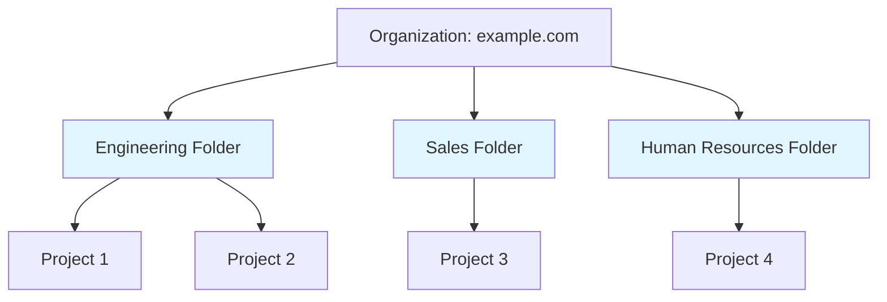

Session 075: VPC Service Controls With Scoped Policies GCP Part 5

| Table of Contents |
|------------------|
| [Introduction to Scoped Policies](#introduction-to-scoped-policies) |
| [Policy Hierarchy and Requirements](#policy-hierarchy-and-requirements) |
| [Scoped Policy Scope and Limitations](#scoped-policy-scope-and-limitations) |
| [Access Levels in Scoped Policies](#access-levels-in-scoped-policies) |
| [Policy Constraints](#policy-constraints) |
| [Demo: Creating Scoped Policies](#demo-creating-scoped-policies) |
| [Key Considerations](#key-considerations) |
| [Summary](#summary) |

## Introduction to Scoped Policies

### Overview
Scoped policies in VPC Service Controls allow administrators to apply access policies to specific folders or projects within an organization, rather than organization-wide. Unlike organization-level policies that apply to the entire Google Cloud organization, scoped policies provide granular control by targeting specific resources. This enables more precise security management where different parts of the organization can have differentiated access controls based on their unique requirements.

### Key Concepts/Deep Dive
Scoped policies are created at the folder or project level and work in conjunction with organization-level policies. They enable:
- **Targeted Access Control**: Apply restrictions to specific folders or projects
- **Service Perimeter Management**: Control which services and resources are accessible within the defined scope
- **Access Level Enforcement**: Use bespoke access levels for scoped environments

#### Prerequisites
For scoped policies to take effect:
- An organization-level access policy must exist
- The scoped policy must reference valid folders or projects within the organization

**Mistakes identified in transcript and corrections applied:**
- "VC service control" corrected to "VPC Service Control"
- "VP service control" corrected to "VPC Service Control"
- "scop policies" corrected to "scoped policies"
- "service parameter" consistently refers to "service perimeter" in VPC Service Controls terminology; all instances corrected accordingly
- "VP" corrected to "VPC"
- "principles" likely intended as "principals" (IAM entities); corrected where contextually appropriate
- Other minor grammatical fixes for readability

## Policy Hierarchy and Requirements

### Overview
VPC Service Controls follow a hierarchical model where scoped policies are subordinate to organization-level policies. This ensures that organizational security standards are maintained while allowing for scoped exceptions or additional restrictions.

### Key Concepts/Deep Dive

```diff
+ Organization Level: Top-tier policy applying to all resources
- Scoped Level: Subordinate policies for folders or projects
! Critical: Scoped policies require an existing organization-level policy to function
```

#### Organization Policy
- **Single Policy Limit**: An organization can have only one access policy at the organization level
- **Scope**: Applies to all folders and projects within the organization
- **Management**: Admin-managed, serves as the foundation for scoped policies

#### Policy Creation Behavior
- Attempting to create a second organization-level policy results in an error
- Organization policies can be applied to any folder or project in the organization

## Scoped Policy Scope and Limitations

### Overview
Scoped policies restrict access within their defined boundaries and cannot enforce controls outside their scope. This ensures security isolation between different organizational units.

### Key Concepts/Deep Dive
- **Scope Restriction**: Policies can only protect resources within their defined scope
- **Isolation Principle**: A scoped policy for one folder cannot affect resources in another folder

#### Visual Representation


In this hierarchy:
- Engineering folder scoped policy affects only Projects 1 and 2
- Sales folder scoped policy affects only Project 3
- Human Resources folder scoped policy affects only Project 4

**Scope Limitations:**
- Scoped policies cannot cross folder boundaries
- Resources in one folder cannot be protected by a policy scoped to another folder

## Access Levels in Scoped Policies

### Overview
Access levels define attribute-based access controls within VPC Service Controls. When created within scoped policies, these access levels are only available within that specific scope.

### Key Concepts/Deep Dive

#### Scope-Specific Visibility
- **Organization-Level Access Levels**: Only visible in organization-level policies
- **Folder-Level Access Levels**: Only visible within that folder's policies
- **Project-Level Access Levels**: Only visible within that project's policies

#### Examples
- An access level created for the "Engineering" folder is not visible in "Sales" or "Human Resources" folders
- An access level for "prod" project is not available in "dev" project

```diff
+ Best Practice: Create access levels at the appropriate scope level
- Common Pitfall: Expecting folder-level access levels to work organization-wide
```

#### Implementation
Access levels use attributes like geographic locations (e.g., Italy, USA) to restrict access based on user or resource attributes.

## Policy Constraints

### Overview
VPC Service Controls impose strict constraints to prevent conflicts and ensure clear security boundaries. These limitations are crucial for maintaining predictable and non-overlapping access controls.

### Key Concepts/Deep Dive

#### Single Scope per Policy
- **Policy Composition**: Each policy contains only one scope (organization, folder, or project)
- **Multiple Policies**: You can create policies for each level, but each policy is scoped to one entity

#### Single Membership Rule
- **Project Membership**: A project can be a member of only one service perimeter across all policies
- **Consequence**: Prevents conflicting access rules and ensures clear security domains

```diff
+ Rule: Projects can only belong to ONE service perimeter
- Violation: Adding a project to multiple perimeters causes errors
! Result: "Invalid resource for service perimeter" error
```

#### Visual Example
```
Organization Policy
├── Service Perimeter 1
│   └── Project A
├── Service Perimeter 2
│   └── Project B
└── Folder Policy
    └── Service Perimeter 3
        └── Project C (inside folder)
```

## Demo: Creating Scoped Policies

### Lab Demo Steps

#### Step 1: Create Scoped Policy for Project
1. Navigate to VPC Service Controls console
2. Click "Create a policy"
3. Provide title: "Second Project Policy"
4. Select specific project to scope the policy
5. Click "Create access policy"

#### Step 2: Create Scoped Policy for Folder
1. Click "Create a policy"
2. Provide title: "Test Folder Policy"
3. Select folder containing projects
4. Click "Create access policy"

#### Step 3: Create Service Perimeter
1. Select policy (e.g., "Test Folder Policy")
2. Click "New parameter" (corrected from transcript's "New parameter" - this refers to creating a service perimeter)
3. Add resources - select projects within the scope
4. Add services to protect (e.g., Cloud Storage API)
5. Click "Create" (creates service perimeter)

#### Key Observations
- Attempting to add resources outside the scope generates errors
- Scoped policies require organization-level policy to function
- Service perimeters restrict access to specified services

#### Step 4: Verify Policy Enforcement
1. Test access to protected services (e.g., Cloud Storage buckets)
2. Observe that restrictions are not applied until organization policy exists

#### Step 5: Create Access Levels
1. Create access level at appropriate scope (organization, folder, or project)
2. Use geographic restrictions as example
3. Verify visibility is limited to scope

**Configuration Example:**
```yaml
# Example service perimeter configuration
ingressPolicies:
  - ingressFrom:
      identityType: ANY_IDENTITY
    ingressTo:
      operations:
        - serviceName: storage.googleapis.com
          methodSelectors:
            - method: "*"
      resources:
        - projectNumbers:
            - "project-number-here"
```

## Key Considerations

### Hierarchy Management
- Organization policies are foundations for scoped policies
- Scoped policies can only restrict (not expand) access

### Resource Membership
- Projects cannot belong to multiple service perimeters
- Folders and projects form clear security boundaries

### Access Level Scoping
```diff
! Important: Access levels are scope-bound
+ Organization-level: Visible organization-wide
+ Folder-level: Visible only in that folder
! Project-level: Visible only in that specific project
```

### Multiple Scope Creation
- Create separate policies for different folders/projects
- Each policy contains one scope but you can have multiple policies

## Summary

### Key Takeaways
```diff
+ Scoped policies enable granular VPC Service Control application to folders/projects
+ Organization-level policy is required for scoped policies to function
+ Policies contain only one scope (organization/folder/project)
+ Projects can belong to only one service perimeter across all policies
+ Access levels are visible only within their creation scope
- Attempting multiple organization policies results in errors
- Resources outside scope cannot be protected by scoped policies
! Service perimeters restrict access to specified services within defined boundaries
```

### Expert Insight

#### Real-world Application
In enterprise environments, scoped policies are essential for implementing defense-in-depth security. For example, a healthcare organization might use organization-level policies for baseline HIPAA compliance, then create scoped policies for sensitive patient data folders with additional geographic restrictions. This allows for centralized governance while accommodating department-specific security needs.

#### Expert Path
Master VPC Service Controls by:
1. Understanding resource hierarchy deeply (folders vs. projects)
2. Practicing with geographic and device-based access levels
3. Combining with Context-Aware Access policies for conditional controls
4. Regular auditing of service perimeter membership
5. Implementing automated policy validation in CI/CD pipelines

#### Common Pitfalls
- **Missing Organization Policy**: Scoped policies appear to work in console but don't enforce restrictions
- **Scope Confusion**: Attempting to protect resources outside policy boundaries
- **Access Level Visibility**: Creating levels at wrong scope, making them unusable
- **Perimeter Overlap**: Trying to add projects to multiple service perimeters

#### Lesser Known Things About Scoped Policies
- **Policy Inheritance**: Scoped policies inherit organization policy settings as baseline
- **Emergency Access**: Scoped policies don't override organization-level emergency access configurations
- **Audit Trails**: Scope-specific policies maintain separate audit logs for compliance tracking
- **Performance Impact**: Scoped policies add minimal latency compared to organization-wide controls

---
**🤖 Generated with [Claude Code](https://claude.com/claude-code)**

**Co-Authored-By: Claude <noreply@anthropic.com>**  
**Model ID: CL-KK-Terminal**
