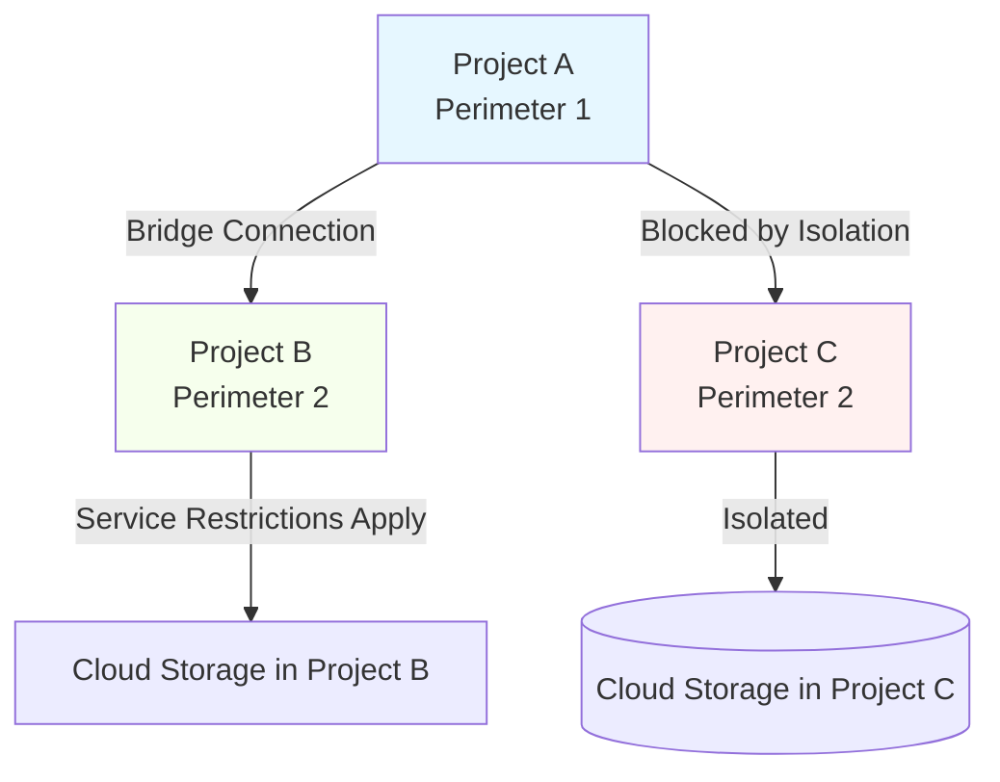

# Session 76: VPC Service Controls With Perimeter Bridge

**Note on Transcript Corrections:** The original transcript contained several spelling and terminology errors. The following corrections were made for accuracy and clarity:
- "parameter" has been corrected to "perimeter" (e.g., "service parameter" → "service perimeter", "parameter Bridge" → "Perimeter Bridge").
- "exis" → "exists".
- "of the pro controlled" → "controlled".
- "accit" → "access".
- "egress ESS" → "egress".
- "backet" → "bucket".
- "proed" → "protected".
- "fence" → "perimeter".
- "transed" → "transitive".
- "Pol policy" → "policy".
- "Or" → "our".
- "Ess" → "is" (in context).
- General grammar and flow improvements for readability.

## Table of Contents
- [Introduction to Perimeter Bridge](#introduction-to-perimeter-bridge)
- [How Perimeter Bridge Works](#how-perimeter-bridge-works)
- [Considerations for Creating Perimeter Bridge](#considerations-for-creating-perimeter-bridge)
- [Lab Demo: Creating Service Perimeters and Testing Communication](#lab-demo-creating-service-perimeters-and-testing-communication)
- [Lab Demo: Creating Perimeter Bridge](#lab-demo-creating-perimeter-bridge)
- [Lab Demo: Testing Communication After Bridge Creation](#lab-demo-testing-communication-after-bridge-creation)
- [Limitations with Scoped Policies](#limitations-with-scoped-policies)
- [Deleting Perimeters and Bridges](#deleting-perimeters-and-bridges)
- [Summary](#summary)

## Introduction to Perimeter Bridge

### Overview
Perimeter Bridge is a feature in Google Cloud's VPC Service Controls that enables secure communication between projects located in different service perimeters. Service perimeters act as security boundaries around Google Cloud resources, restricting access to services and data based on configured policies. Perimeter Bridge allows selective connectivity while maintaining the isolation enforced by individual service perimeters.

### Key Concepts/Deep Dive
Perimeter Bridge enables controlled inter-perimeter communication by creating connections between projects in different perimeters within the same organization.

**Core Principles:**
- **Equal Access Scope**: Projects from each perimeter exist with equal access within the bridge's scope.
- **Controlled by Individual Perimeters**: Access levels and service restrictions are governed solely by the service perimeter that contains the project. The bridge does not override these controls.
- **Multiple Bridges per Project**: A single project can participate in multiple perimeter bridges, connecting it to various other projects.
- **Non-Transitive Access**: Communication is limited to directly connected projects only. If Project A connects to Project B, and Project B connects to Project C, Project A cannot communicate with Project C unless explicitly bridged.

> [!NOTE]
> Perimeter Bridge ensures that service restrictions remain intact, preventing indirect access to restricted resources through bridged connections.

## How Perimeter Bridge Works

### Overview
A Perimeter Bridge acts as a secure tunnel between service perimeters, allowing authorized traffic to flow between specified projects while respecting each perimeter's access controls.

### Key Concepts/Deep Dive
When projects are connected via a Perimeter Bridge:
- **Traffic Flow**: Requests can originate from a project in one perimeter and reach services in a bridged project within another perimeter.
- **Policy Enforcement**: Each service perimeter enforces its own rules (e.g., access levels, service restrictions like restricting Cloud Storage access).
- **Isolation Maintained**: Projects not explicitly bridged remain isolated.

**Example Scenario:**
- **Before Bridge**: Project A (in Perimeter 1) and Project C (in Perimeter 2) cannot communicate directly.
- **With Bridge**: Project A can communicate with Project B (in Perimeter 2), but Project B remains isolated from other non-bridged projects.

Visual representation using Mermaid:



**Implications:**
- **Housing Projects**: Restrict access to certain GCP services (e.g., compute, storage) per project while allowing inter-project communication via the bridge.
- **Security Boundary**: The bridge does not weaken perimeter boundaries but creates controlled exceptions.

## Considerations for Creating Perimeter Bridge

### Overview
Before implementing a Perimeter Bridge, several prerequisites and limitations must be evaluated to ensure compatibility and security.

### Key Concepts/Deep Dive
**Prerequisites:**
- **Membership in Service Perimeters**: Both projects must belong to different service perimeters before bridging.
- **Same Organization**: Perimeter Bridges can only connect projects within the same organization.
- **Same Scoped Policy**: Projects must be part of service perimeters under the same scoped policy (organization-level preferred for flexibility).

**Limitations:**
- **Cross-Organization**: Projects from different organizations cannot be bridged.
- **Scoped Policies at Different Levels**: Perimeters scoped to projects or folders cannot be bridged if under disparate scoped policies. Bridges work best at organization or shared folder levels.
- **VPC Network Considerations**: After creating the bridge, VPC networks from connected projects can be added, but network isolation must be verified.

**Recommended Approach:**
- Use organization-level scoped policies for broader flexibility.
- If using folder-level, ensure folders contain all relevant projects.

> [!IMPORTANT]
> Attempting to bridge projects outside these constraints will fail, emphasizing the need for proper perimeter setup prior to bridging.

## Lab Demo: Creating Service Perimeters and Testing Communication

### Overview
This lab demonstrates creating individual service perimeters, securing projects, and verifying isolation before bridge creation.

### Lab Demo Steps
Follow these steps in the Google Cloud Console to set up and test service perimeters:

1. **Create First Service Perimeter**:
   - Navigate to VPC Service Controls in the Cloud Console.
   - Click "Create Service Perimeter".
   - Name: `first-project-perimeter`.
   - Add Resources: Select "Project" and add `first-project`.
   - Add Services: Add "Cloud Storage".
   - Click "Create".

2. **Test Communication**:
   - From VM in `first-project`, run: `gcloud storage buckets list`.
   - **Expected Outcome**: Succeeds (within perimeter).

3. **Create Second Service Perimeter**:
   - Click "New Service Perimeter".
   - Name: `second-project-perimeter`.
   - Add Resources: Select "Project" and add `second-project`.
   - Add Services: Add "Cloud Storage".
   - Click "Create".

4. **Verify Isolation**:
   - From VM in `second-project`, run: `gcloud storage buckets list`.
   - **Expected Outcome**: Fails (secure perimeter boundary blocks external access).

5. **Test Egress from First Project**:
   - From VMware in `first-project`, attempt access to `second-project` resources.
   - Command: `gcloud storage buckets list --project=second-project`.
   - **Expected Outcome**: Fails (no egress policy; perimeter blocks outbound traffic).

> [!NOTE]
> Ensure VMs are running and authenticated with appropriate roles (e.g., Storage Admin for Cloud Storage access).

## Lab Demo: Creating Perimeter Bridge

### Overview
This demo shows how to create a Perimeter Bridge to enable inter-perimeter communication.

### Lab Demo Steps
Assuming the above perimeters are created:

1. **Create Perimeter Bridge**:
   - In VPC Service Controls, click "New Service Perimeter".
   - Select "Perimeter Bridge".
   - Name: `bridge-between-perimeters`.
   - Resources to Bridge: Select `first-project` and `second-project`.
   - Click "Create".

2. **Verification**:
   - Confirm the bridge appears in the list, showing connections between both projects.

> [!CAUTION]
> The bridge cannot be created if projects are not already in separate perimeters; select from existing perimeter names.

## Lab Demo: Testing Communication After Bridge Creation

### Overview
After bridge creation, test that communication now works between bridged projects.

### Lab Demo Steps
1. **Test from First Project to Second**:
   - From VM in `first-project`, run: `gcloud storage buckets list --project=second-project`.
   - **Expected Outcome**: Succeeds after 1-2 minutes (bridge allows traffic).

2. **Test from Second Project to First**:
   - From VM in `second-project`, run: `gcloud storage buckets list --project=first-project`.
   - **Expected Outcome**: Succeeds.

3. **Test Other Services**:
   - From `first-project` VM: `gcloud compute instances list --project=second-project`.
   - **Expected Outcome**: Succeeds.

4. **Verify Policy Enforcement**:
   - Ensure service restrictions (e.g., Cloud Storage access) are still applied per perimeter.

> [!TIP]
> Communication should be seamless for bridged projects while maintaining restrictions for unbracketed services.

## Limitations with Scoped Policies

### Overview
Scoped policies at project or folder levels limit perimeter flexibility, especially for bridging.

### Key Concepts/Deep Dive
- **Project-Levelscoped Policies**: Only one project per perimeter; cannot add multiples or bridge.
  - Attempting to create a bridge shows no available options.
- **Folder-Level Workaround**: Create perimeters at folder level if multiple projects are in the same folder.
  - Example: In `test-folder`, create a perimeter including `first-project` and `second-project`.

**Comparison Table:**

| Policy Scope | Allowed Projects per Perimeter | Bridging Capability |
|--------------|-------------------------------|---------------------|
| Organization | Multiple                      | Yes                 |
| Folder       | Multiple (in same folder)     | Yes                 |
| Project      | One only                      | No                  |

> [!WARNING]
> Scoped policies at mismatched levels prevent bridging, requiring policy rearrangement.

## Deleting Perimeters and Bridges

### Overview
Perimeters and bridges must be deleted in sequence to avoid dependency issues.

### Key Concepts/Deep Dive
- **Deletion Order**: Delete the bridge before perimeters.
  - Attempting to delete a perimeter fails if bridges exist ("Failed to delete service perimeter because bridge exists").

**Steps:**
1. Delete the bridge from VPC Service Controls.
2. Then delete individual perimeters.

## Summary

### Key Takeaways
```diff
+ Perimeter Bridge enables secure inter-perimeter communication in VPC Service Controls.
+ Projects must be in separate service perimeters before bridging.
+ Access controls remain governed by individual perimeters.
+ Bridges are not transitive; direct connections only.
+ Scoped policies limit bridging flexibility.
- Avoid bridging projects across organizations or mismatched scoped policies.
! Ensure prerequisites are met before bridge creation to prevent failures.
```

### Expert Insight

**Real-world Application**:
In enterprise setups, Perimeter Bridges allow departmental projects (e.g., dev and staging) to share resources like shared datasets or logging while maintaining service-specific restrictions. For production, use bridges to connect monitoring tools across perimeters without compromising security boundaries.

**Expert Path**:
- Master Terraform/GCP Deployment Manager for automated perimeter and bridge creation.
- Deepen understanding by configuring custom access levels and testing with real GCP services like BigQuery and Cloud Pub/Sub.
- Explore integration with Identity-Aware Proxy for additional user-centric controls.

**Common Pitfalls**:
- Forgetting to enable egress policies leads to blocked traffic; always test bidirectional communication.
- Attempting bridge creation without perimeters causes errors; validate perimeter setup first.
- Not accounting for non-transitive access results in unexpected isolation; plan bridge topology carefully.
- Deleting perimeters before bridges interrupts configurations; delete bridges first.

**Common Issues and Resolutions**:
- **Issue**: Bridge not working immediately – Resolution: Wait 1-2 minutes for propagation.
- **Issue**: Service access denied post-bridge – Resolution: Verify individual perimeter service restrictions.
- **Issue**: Cannot add projects to bridge – Resolution: Ensure projects are isolated in separate perimeters.

**Lesser-Known Things**:
- Bridges can optionally include VPC networks post-creation for hybrid networking.
- Perimeter Bridges support encrypted traffic but do not alter data at rest protections.
- In large organizations, use folder-based scoped policies for scalable multi-project bridges.

🤖 Generated with [Claude Code](https://claude.com/claude-code)

Co-Authored-By: Claude <noreply@anthropic.com>
```
