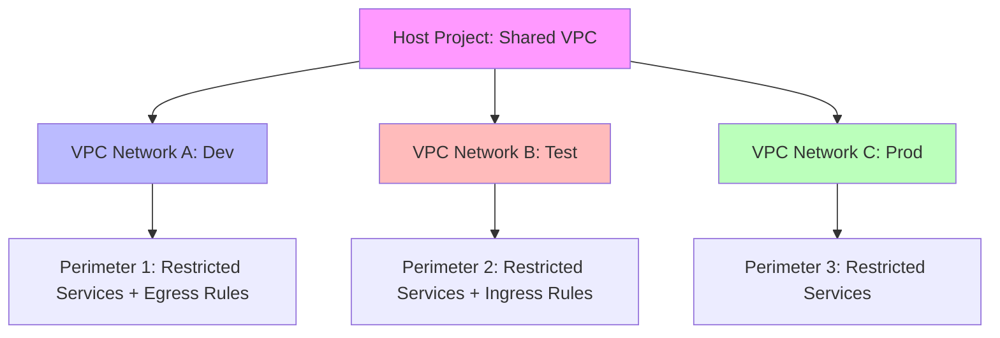

Session 077: VPC Service Controls with Shared VPC (GCP) - Part 7

**Note on Corrections:** The transcript contains several typos and misspellings that have been corrected for accuracy and clarity: "bpc" to "VPC", "parameter" to "perimeter" (the correct term in VPC Service Controls context), "SCT" to "restrict", "sh VPC" to "shared VPC", "VP" to "VPC", "ed" to "add", "resource" to "resources", "parameter bridg" to "perimeter bridge", "VP service par" to "VPC service perimeter", and other minor grammar/spelling fixes like "uh" removed and proper punctuation.

## Table of Contents

- [Using VPC Service Controls with Shared VPC](#using-vpc-service-controls-with-shared-vpc)
  - [Overview](#overview)
  - [Key Concepts and Rules](#key-concepts-and-rules)
  - [Creating Separate Perimeters for VPC Networks](#creating-separate-perimeters-for-vpc-networks)
  - [Lab Demo: Setting Up Perimeter for Test Network](#lab-demo-setting-up-perimeter-for-test-network)
  - [Lab Demo: Setting Up Perimeter for Staging Network with Egress Rule](#lab-demo-setting-up-perimeter-for-staging-network-with-egress-rule)
- [Summary](#summary)

## Using VPC Service Controls with Shared VPC

### Overview

VPC Service Controls (VPC SC) is a Google Cloud security feature that helps protect resources and services from data exfiltration by enforcing access policies at the VPC level. In the context of Shared VPC, which allows a host project to share its VPC networks with service projects, VPC SC can be configured to create granular perimeters for individual VPC networks within the host project. This enables organizations to isolate different environments (such as development, test, and production) by applying separate access controls to each network, rather than managing a single perimeter for the entire host project.

For instance, in a Shared VPC setup with multiple networks (e.g., development, test, and production), you can create individual service perimeters for each VPC network. This allows you to define specific ingress rules for allowing external access when needed and egress rules for permitting traffic to restricted services outside the perimeter. The benefits include enhanced security segmentation, controlled data flow, and compliance with regulatory requirements, ensuring that resources in one VPC network cannot access services or data in others unless explicitly allowed through perimeter configurations.

### Key Concepts and Rules

VPC Service Controls operates through service perimeters, which group projects and VPC networks under access policies. When working with Shared VPC, there are important rules to follow:

- **Separate Perimeters for VPC Networks**: Instead of one perimeter for the entire host project, create distinct perimeters for each VPC network (e.g., one for development, one for test). This provides fine-grained control.

- **Adding VPC Networks to Perimeters**: VPC networks from the host project can be added to separate perimeters, allowing VMs in each network to access only resources within their designated perimeter.

- **Ingress Rules (for External Access)**: If you need to allow access from outside the perimeter, define ingress rules in the perimeter configuration.

- **Egress Rules (for Outbound Access)**: To enable access to external services restricted by the perimeter, create egress rules specifying the services and methods allowed.

- **Rules for Perimeter Management**:
  - If the host project is not protected by a perimeter, you can still add its VPC networks to separate perimeters under the same access policy.
  - All VPC networks in the same host project must belong to the same access policy; multiple access policies are not supported.
  - A VPC network and its host project must not exist in different perimeters—they must be consistent within the same access policy.
  - A VPC network cannot be added to multiple perimeters (must be in a single perimeter only).
  - If a VPC network's parent object (e.g., the host project) is part of a perimeter bridge, the VPC network cannot be added to its own perimeter. Perimeter bridges enable communication between different perimeters, but adding a VPC network directly to a bridge is not allowed.

These rules prevent conflicts and ensure secure, non-overlapping isolation between environments.

```diff
+ Key Advantage: Separate perimeters enable environment-specific security policies.
- Limitation: Cannot assign a single VPC network to multiple perimeters.
! Rule Alert: Host projects and VPC networks must share the same access policy.
```

> [!IMPORTANT]  
> Always verify the host project's access policy before assigning VPC networks to perimeters. Mismatches can lead to enforcement failures or unintended access.

### Creating Separate Perimeters for VPC Networks

To create separate perimeters for each VPC network in a Shared VPC host project:

1. Navigate to VPC Service Controls in the Google Cloud Console.
2. For each VPC network (e.g., development VPC, test VPC, production VPC), create a dedicated service perimeter.
3. Add the host project and select the specific VPC network as resources to protect.
4. Specify the services to restrict within that perimeter (e.g., restrict access to Cloud Storage API for one network while allowing it for others).
5. Optionally, configure ingress rules if external access is required, or egress rules to allow access to restricted services.

This approach allows for tailored security controls: resources in the test VPC perimeter can only access services allowed within that perimeter, while the staging VPC has its own rules.

| Aspect | Entire Host Project Perimeter (Old) | Separate Perimeters per VPC Network (New) |
|--------|-------------------------------------|--------------------------------------------|
| Scope | One perimeter covers all networks | One perimeter per network for granularity |
| Complexity | Higher (single policy for all) | Lower (environment-specific policies) |
| Access Control | Uniform restrictions | Variable restrictions (e.g., allow BigQuery in staging, block in test) |
| Bridge Support | Limited to project level | Supports network-level bridges with caution |



> [!NOTE]  
> Perimeter bridges can connect separate perimeters for necessary inter-environment communication, but avoid adding VPC networks directly to bridges.

### Lab Demo: Setting Up Perimeter for Test Network

**Objective**: Create a service perimeter for the "test" VPC network in the host project and restrict Cloud Storage API access. Demonstrate that access is blocked and resolved with an egress rule.

**Prerequisites**:
- Shared VPC enabled host project with "test" and "staging" VPC networks.
- Service projects attached to the Shared VPC.
- VMs running in the respective VPC networks.

**Steps**:

1. In the Google Cloud Console, navigate to "Security" > "VPC Service Controls".
2. Click "Create perimeter" and name it "test-network-perimeter".
3. Under "Resources to protect", select the host project.
4. Select "Add VPC networks" and choose the "test" VPC network from the host project.
5. In "Restricted services", add "Cloud Storage API" to restrict access from within the perimeter.

   ```yaml
   perimeter:
     name: test-network-perimeter
     type: PERIMETER_TYPE_PROJECT
     spec:
       vpcAccessibleServices: {}
       restrictedServices:
         - storage.googleapis.com  # Cloud Storage API
       resources:
         - projects/YOUR_HOST_PROJECT_ID
       vpcAccessibleServices:
         vpcNetworks:
           - name: projects/YOUR_HOST_PROJECT_ID/global/networks/test
   ```

6. Click "Create" to enforce the perimeter.
7. On a VM in the test VPC network, attempt to run `gsutil ls` (Google Cloud SDK command).

   ```bash
   gsutil ls
   ```

   **Expected Result**: Access denied, as the perimeter blocks Cloud Storage access.

8. To enable access, create an egress rule in "Access levels and perimeter bridges":
   - Create a new egress policy.
   - Select identity: Service account (any).
   - Select projects: The service projects attached to Shared VPC.
   - Select services: Cloud Storage API, allow all methods.
   - Apply the egress rule to the test-network-perimeter.

   This allows outbound traffic to Cloud Storage for the specified projects.

9. Retry `gsutil ls` on the VM—it should now succeed after policy propagation (1-2 minutes).

> [!NOTE]  
> Egress rules enable controlled outbound access to restricted services, maintaining perimeter security.

### Lab Demo: Setting Up Perimeter for Staging Network with Egress Rule

**Objective**: Create a perimeter for the "staging" VPC network, restrict BigQuery access, and use an egress rule to allow Cloud Storage access for VMs in the test network.

**Pre-Demo Check**:
- From the staging VM, run `bq ls` (BigQuery list datasets) and `gsutil ls` to confirm unrestricted access.

**Steps**:

1. Create a new perimeter named "staging-vpc-perimeter".
2. Add the host project and select the "staging" VPC network.
3. In "Restricted services", add "BigQuery API".
4. Create the perimeter.

   ```yaml
   perimeter:
     name: staging-vpc-perimeter
     type: PERIMETER_TYPE_PROJECT
     spec:
       restrictedServices:
         - bigquery.googleapis.com
       resources:
         - projects/YOUR_HOST_PROJECT_ID
       vpcAccessibleServices:
         vpcNetworks:
           - name: projects/YOUR_HOST_PROJECT_ID/global/networks/staging
   ```

5. Wait for enforcement; then run `bq ls` on the staging VM—access should be denied.
6. For the test network VM (from previous demo), ensure Cloud Storage access is maintained via the egress rule created earlier. Run `gsutil ls` to verify.

This demonstrates isolated perimeters: staging blocks BigQuery, test accesses Cloud Storage via egress.

## Summary

### Key Takeaways

```diff
! VPC SC with Shared VPC allows separate perimeters per VPC network instead of one for the host project.
+ Create granular perimeters for environments like dev, test, and production.
+ Use ingress for external inbound access and egress for controlled outbound to restricted services.
- Avoid adding VPC networks to multiple perimeters or perimeter bridges.
+ Always ensure VPC networks and host projects share the same access policy.
! Pre-check rules: Host project unprotected? Parent objects in bridges? Must not violate consistency rules.
```

### Expert Insight

**Real-world Application**: In enterprise Shared VPC setups, separate perimeters enable compliance with frameworks like SOC 2 or GDPR by isolating sensitive data flows. For example, production VPC perimeters can restrict all external APIs, while dev/test perimeters allow selective egress for CI/CD tools, minimizing breach risks in multi-tenant environments.

**Expert Path**: Master VPC SC by practicing perimeter bridge configurations for inter-environment data sharing (e.g., dev-to-prod debugging). Study Google Cloud's documentation on access policies and use `gcloud access-context-manager` CLI for automated perimeter management in scripts.

**Common Pitfalls**:
- **Adding Networks to Multiple Perimeters**: Causes policy conflicts; stick to one perimeter per VPC network.
- **Ignoring Access Policies**: All resources must align to the same policy—mismatches lead to incomplete enforcement.
- **Perimeter Bridge Misuse**: Don't add VPC networks directly to bridges; use for inter-perimeter communication only.
- **Resolution**: Check perimeter status in console; use audit logs to verify enforcement. Avoid amateur mistakes like forgetting egress for required services (e.g., databases outside the perimeter).
- **Common Issue**: Slow policy propagation (up to 10 minutes); mitigate by pre-testing in dev environments before prod.
- **Lesser Known**: Perimeters integrate with Identity-Aware Proxy (IAP) for zero-trust access, and you can automate perimeter updates via Infrastructure as Code (e.g., Terraform with `google_access_context_manager_service_perimeter`). Also, perimeters support conditional access based on IP ranges or device policies beyond standard service accounts.

⚠️ Always test perimeter changes in non-production environments. 💡 Used for high-risk data isolation. ✅ Enhances Shared VPC security. 📝 Document rules for team alignment.
