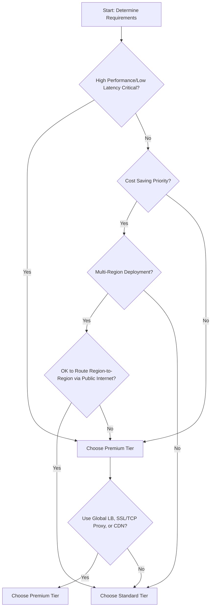

# Session 78: Network Tiers GCP

## Table of Contents
- [Introduction to Network Tiers](#introduction-to-network-tiers)
- [Premium Tier Routing](#premium-tier-routing)
- [Standard Tier Routing](#standard-tier-routing)
- [Feature Differences](#feature-differences)
- [Pricing Comparison](#pricing-comparison)
- [Use Cases and Decision Making](#use-cases-and-decision-making)
- [Traffic Flow Demonstration](#traffic-flow-demonstration)
- [Changing Network Tiers](#changing-network-tiers)
- [Summary](#summary)

## Introduction to Network Tiers

### Overview
In Google Cloud Platform (GCP), network tiers determine how traffic is routed between the internet and your applications. Two options exist: Premium Tier and Standard Tier. Previously, only the Premium Tier was available, but Google later introduced the Standard Tier for cost optimization. When creating VMs or load balancers, you'll choose one of these tiers, impacting routing, security, features, and cost.

### Key Concepts/Deep Dive
- **Premium Tier**: Routes traffic exclusively through Google's global backbone network, minimizing internet exposure for lower latency and higher reliability.
- **Standard Tier**: Utilizes peering ISPs and public internet paths, potentially increasing hops and latency compared to Premium Tier.
- **Rationale for Two Tiers**: The introduction of Standard Tier caters to cost-sensitive deployments where optimal performance is not critical.

| Aspect          | Premium Tier                  | Standard Tier                 |
|-----------------|-------------------------------|-------------------------------|
| Routing        | Google Backbone Network       | Peering ISPs & Public Internet |
| Latency        | Lower (fewer hops)            | Higher (more hops)            |
| Reliability    | High (fault-tolerant)         | Variable (depends on ISPs)    |

## Premium Tier Routing

### Overview
The Premium Tier ensures traffic from the internet to your GCP resources traverses Google's dedicated global network, avoiding public internet segments. This provides enhanced security and performance.

### Key Concepts/Deep Dive
- Traffic flow: Internet → User's ISP → Nearest Google Point of Presence (PoP) → Google Backbone Network → GCP Resource.
- Benefits: Reduced latency due to fewer network hops, built-in redundancy, and tolerance to failures.
- Security: Protected by Google's backbone; traffic remains within Google's network until the final destination.
- Compatibility: Supports all GCP networking features, including regional and global external IPs.

## Standard Tier Routing

### Overview
The Standard Tier routes traffic over the public internet using peering ISPs, which may involve multiple intermediary networks before reaching Google Cloud.

### Key Concepts/Deep Dive
- Traffic flow: Internet → User's ISP → Public Internet (multiple hops via ISPs/transit networks) → Google PoP → GCP Resource.
- Benefits: Cost-effective; includes 200 GB free egress per month per region across all projects.
- Limitations: Potentially higher latency, exposure to internet vulnerabilities like fiber cuts or ISP performance issues.
- Security: Comparable to other public clouds; adequate for most scenarios but may have more exposure than Premium Tier.
- Compatibility: Supports foundational GCP networking features, such as net regional load balancers, but not global features like global external IPs.

## Feature Differences

### Overview
Premium and Standard Tiers support different subsets of GCP networking capabilities, influencing deployment choices.

### Key Concepts/Deep Dive
- **Premium Tier**:
  - Full GCP networking feature set.
  - Regional and global external IPs.
  - Global load balancers, SSL proxies, TCP proxies, and CDN.
- **Standard Tier**:
  - Foundational features only.
  - Supports regional external IPs; no global IPs.
  - Excludes global load balancers, proxies, and CDN.
  - Passthrough and network load balancers are supported.

## Pricing Comparison

### Overview
Pricing differentiates the tiers, with Premium offering reliability at a premium cost, and Standard providing affordability.

### Key Concepts/Deep Dive
- **Premium Tier**: Parity with other public clouds; slightly higher than Standard but still competitive globally.
- **Standard Tier**: More cost-effective; includes free 200 GB egress/month/region per project. SLaS are 99.99% for Premium and 99.9% for Standard.
- **Considerations**: Choose based on performance vs. budget trade-offs. Enterprises with global workloads prefer Premium for guaranteed low latency.

| Tier       | SLA    | Pricing Notes                          |
|------------|--------|---------------------------------------|
| Premium    | 99.99% | Higher cost, full features            |
| Standard   | 99.9%  | Lower cost, free 200 GB/month         |

## Use Cases and Decision Making

### Overview
Select a tier based on application requirements, such as latency sensitivity, global reach, and budget constraints.

### Key Concepts/Deep Dive
- **Premium Tier Use Cases**:
  - Large enterprises with global workloads needing low latency and high performance.
  - Mission-critical applications where downtime means financial loss.
  - Services requiring reliability comparable to Google's backbone network.
  - Deployments across multiple regions requiring consistent performance.
- **Standard Tier Use Cases**:
  - Single-region deployments with tight budgets.
  - Applications tolerant of higher latency for cost savings.
  - Non-critical workloads prioritizing cost over optimal performance.
  - Scenarios where trading availability for lower expenses is acceptable.

### Decision Flowchart


## Traffic Flow Demonstration

### Overview
Demonstrate routing differences using VMs with Premium and Standard tiers via traceroute.

### Lab Demo
1. **Create VMs**:
   - Standard Tier VM: In GCP Console, go to VM Instances → Create Instance.
     - Name: `standard-vm`
     - Networking: Select "Standard" network tier.
     - Create the VM.
   - Premium Tier VM: In GCP Console, go to VM Instances → Create Instance.
     - Name: `premium-vm`
     - Networking: Select "Premium" (default).
     - Create the VM.

2. **Perform Traceroute**:
   - From your local machine, run traceroute commands.
     - For Standard Tier VM: `traceroute -n [standard-vm-external-ip]` (e.g., shows 13+ hops including public internet routes via Mumbai, London, New York, Chicago).
     - For Premium Tier VM: `traceroute -n [premium-vm-external-ip]` (e.g., shows ~5 hops directly via Google Backbone).

3. **Observation**: Premium Tier results in fewer hops (direct ISP to Google PoP), reducing latency. Standard Tier involves multiple intermediate hops over public internet.

## Changing Network Tiers

### Overview
Changing tiers affects external IPs and may require application updates due to IP changes and potential downtime.

### Key Concepts/Deep Dive
- **Process**: In GCP Console, VPC Network → Reserve Static External IP Address → Change Network Tier for the project or resource.
  - Premium is default; switch to Standard if needed.
  - For VMs: During creation or editing network interface.
- **Impact**: Switching tress from Standard to Premium (or vice versa) generates a new IP address. Global IPs require Premium Tier.
- **Considerations**: Update DNS records; prepare for potential downtime. IPs from Standard Tier pools differ from Premium pools; regional migration isn't possible.

## Summary

### Key Takeaways
```diff
+ Premium Tier: Lower latency via Google backbone, supports global features, higher reliability (99.99% SLA) but costs more.
+ Standard Tier: Cost-effective with 200 GB free egress/month, but may increase hops and latency; regional-only features.
! Choose based on needs: High performance/critical apps → Premium; Budget-focused/single-region → Standard.
```

### Expert Insight
#### Real-world Application
In production, use Premium Tier for e-commerce sites or real-time apps in global enterprises to ensure minimal latency and uptime. Standard Tier suits development/test environments or regional apps with cost constraints, maximizing Azure/Google budget efficiency.

#### Expert Path
Master tier selection by monitoring latency metrics via Cloud Monitoring and conducting traceroute tests. Understand GCP's PoPs and backbone architecture through official docs to predict performance. Experiment with both tiers in dev accounts to quantify cost-performative trade-offs.

#### Common Pitfalls
- **Mixing Tiers**: Avoid combining Premium (global) and Standard (regional) resources inconsistently, leading to unexpected routing and costs.
- **IP Changes on Switch**: Neglecting DNS updates after tier changes causes outages; always plan maintenance windows.
- **Overlooking Free Limits**: Exceeding Standard Tier's 200 GB free egress incurs charges; monitor usage closely.
- **Common Issues and Resolutions**: High latency in Standard Tier? Switch to Premium or optimize regional deployments. ISP routing issues? Use Premium for backbone stability.
- **Lesser Known Things**: Premium Tier leverages Google's 100+ PoPs for automatic failover; Standard Tier's public routing can vary by ISP, making it unsuitable for predictable low-latency needs.

## Transcript Corrections
- "tires" → "tiers" (multiple instances)
- "tire" → "tier" (multiple instances)
- "paing ISB internet service provider Transit" → "peering ISPs"
- "offs" → "hops"
- "eless s" → "less hops"
- "scops" → "hops"
- "hes SE has taken" → "hopes has taken"
- "Li hopes" → "less hops"
- "cht" → "chat"
- "Tracer" → "Traceroute"
- Various minor grammar/spelling fixes (e.g., "crow" → "clouds", "SL is 99.99 49" → "SLA is 99.9%"). All corrections ensure technical accuracy while preserving original intent.
