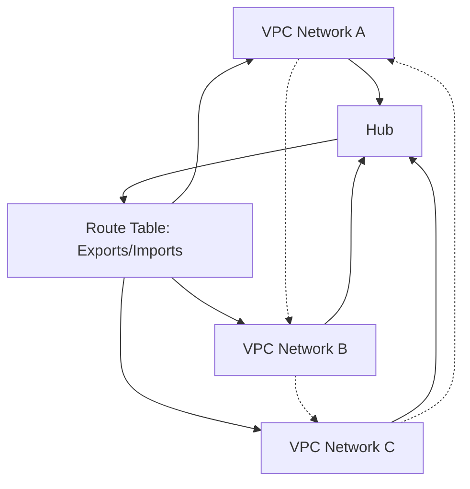

# Session 082: Network Connectivity Center GCP Part 1

## Table of Contents
- [Introduction](#introduction)
- [Hub and Spoke Model](#hub-and-spoke-model)
- [VPC Spokes](#vpc-spokes)
- [Comparison: VPC Spokes vs VPC Pairing](#comparison-vpc-spokes-vs-vpc-pairing)
- [Topologies: Mesh vs Star](#topologies-mesh-vs-star)
- [Mesh Topology Deep Dive](#mesh-topology-deep-dive)
- [Limitations](#limitations)
- [Demo: Setting Up Network Connectivity Center](#demo-setting-up-network-connectivity-center)
- [Filters: Include and Exclude](#filters-include-and-exclude)
- [Handling Overlapping Subnets](#handling-overlapping-subnets)
- [Cost Considerations](#cost-considerations)
- [Summary](#summary)

## Introduction
Network Connectivity Center is a centralized framework provided by Google Cloud Platform (GCP) that simplifies network connectivity management among resources across multiple VPCs. It operates on a hub-and-spoke model, enabling secure, scalable connectivity for VPC networks, hybrid resources, and external networks.

At its core, Network Connectivity Center allows organizations to connect multiple VPC networks—even those in different projects or organizations—while ensuring traffic remains private and within Google's network. This framework addresses complex networking needs by centralizing routing and reducing operational overhead.

Key benefits include:
- Simplifying multi-VPC connectivity
- Supporting site-to-site (S-to-S) and site-to-cloud (S-to-C) scenarios
- Integrating with hybrid spokes like Cloud VPN, Cloud Interconnect, and router appliances

> [!NOTE]
> Network Connectivity Center supports VPC spokes (focus of this session) and hybrid spokes, with dedicated support for producer VPC spokes in preview.

## Hub and Spoke Model
A **hub** is a global GCP resource acting as a central point for connectivity. It aggregates routes from attached spokes and manages a route table for routing traffic.

- **Hub Characteristics**: 
  - A single hub can attach spokes from multiple projects or organizations.
  - Required permissions must be set for cross-project attachments; review GCP documentation for IAM roles.
  - If spokes use site-to-site data transfer, associated resources must reside in the same VPC network.

- **Spokes**: Represent network resources connected to the hub. In this session, we focus on VPC spokes, which connect VPC networks. Each spoke exports its subnet routes to the hub and imports routes from other spokes.

Key points:
- One VPC network can attach to only one hub at a time.
- Auto-accept groups allow automatic spoke approval from specified projects, reducing manual oversight.

## VPC Spokes
VPC spokes connect GCP VPC networks to a hub, enabling inter-VPC communication internally. They export all subnet routes by default and support full IP range sharing unless filtered.

- **Inter-VPC Connectivity**: Traffic stays within Google's network for privacy and security.
- **Route Management**: The hub maintains a route table; VPC networks use this table for routing.
- **Topology Support**: VPC spokes work with mesh topology (covered here) and star topology (next session).

> [!IMPORTANT]
> VPC spokes reduce complexity compared to managing individual VPC network pairings. They scale for large enterprises but have limitations like no IPv6 dynamic route support.

## Comparison: VPC Spokes vs VPC Pairing
While both enable inter-VPC communication, they suit different needs:

| Feature | VPC Pairing | VPC Spokes |
|---------|-------------|------------|
| Use Case | Small setups (2-3 VPCs) with simple connectivity | Large enterprises needing scalable, managed connectivity |
| Management | Manual per-pair configuration | Centralized hub-based management |
| Cost | Often free-form but scales poorly | Charged per spoke hour (see costs below) |
| Overlapping Subnets | Requires non-overlapping ranges | Use filters to handle overlaps without full exclusion |
| Transitivity | Limited | Supported via hub routing |

```diff
- VPC Pairing: Suitable for basic connectivity in small environments.
+ VPC Spokes: Optimal for complex, cross-project connectivity at scale.
```

## Topologies: Mesh vs Star
Network Connectivity Center offers two topologies, selectable per hub and non-modifiable post-creation.

- **Mesh Topology**: Default; provides full connectivity where all spokes communicate directly. (Detailed below)
- **Star Topology**: Divides spokes into producer (hub-connected) and consumer groups, with restricted routing. (Covered in Part 2)

Both topologies support VPC and hybrid spoke types.

## Mesh Topology Deep Dive
In mesh topology, all VPC spokes export routes to a central hub, which builds a unified route table. VPC networks import this table for bidirectional communication.

- **Full Mesh Connectivity**: Every VPC can reach every other via internal Google network routing.
- **Route Exporting/Importing**: Each spoke exports all subnet routes (unless filtered); the hub aggregates them.
- **Group**: All spokes belong to a single default group.
- **Use Case**: Enabling seamless inter-VPC traffic in multi-project setups.

Example Flow:


> [!NOTE]
> Mesh topology does not support overlapping subnets without filters; transit is not possible with VPC pairing mixes.

## Limitations
Several constraints apply to ensure reliable routing:

- **Non-Transitive Connectivity**: Cannot chain NCC with VPC pairing for extended reach.
- **No Static Route Exchange**: VPC spokes do not support static routes.
- **Overlapping Subnets**: Must mask via exclude filters; cannot share identical ranges.
- **Unsupported Features**: IPv6 dynamic routes, auto-mode VPCs, subnets overlapping with NCC routes.
- **Topology Changes**: Requires hub recreation.
- **IPv6 Scope**: Limited to export/import filters; no broader dynamic support.

> [!WARNING]
> Always mask overlapping subnets and verify filters to avoid routing conflicts. Check official GCP docs for full limitations.

## Demo: Setting Up Network Connectivity Center
Follow these steps to implement mesh topology connectivity between VPCs in separate projects.

### Prerequisites
- Create two GCP projects (e.g., Project A and Project B).
- Enable Network Connectivity Center API.
- Set up IAM permissions for cross-project access.

### Step 1: Create VPC Networks
1. In Project A: Create VPC "project-a-vpc1" with subnet range 192.168.3.0/24.
2. In Project B: Create VPC "project-b-vpc1" with subnet range 192.168.21.0/24.
3. Launch test VMs in each VPC for connectivity testing (e.g., internal IPs).

### Step 2: Create a Hub
1. In Project A, navigate to Network Connectivity Center > Hub.
2. Create Hub: Name "test-hub", Topology "Mesh".
3. Optionally add auto-accept project IDs for automated approvals.

### Step 3: Attach First VPC Spoke
1. In Hub, add Spoke: Type "VPC Spok", Name "project-a-vpc1", Select VPC "project-a-vpc1".
2. Filters: Include all private subnet IPs (default).
3. The spoke activates automatically if project is auto-accepted.

### Step 4: Attach Second VPC Spoke
1. In Project B, add Spoke: Reference hub project ID and hub name "test-hub".
2. Name "project-b-vpc1", Select VPC "project-b-vpc1".
3. Await approval in Project A Hub; review and accept.

### Step 5: Verify Routes and Connectivity
1. Check Hub > Routes: Confirm routes from both VPCs (e.g., 192.168.3.0/24, 192.168.21.0/24) in the route table.
2. Test ping from VM in Project A to Project B VM internal IP. Success indicates connectivity.
3. Add firewall rules to allow ICMP (ping) between VPCs.

Common Bash commands for testing (run in Cloud Shell):
```bash
# Ping test
ping -c 4 [INTERNAL_IP]
```

## Filters: Include and Exclude
Filters control route sharing to restrict exposure.

- **Include Filters**: Specify IP ranges to export (e.g., subnets only).
- **Exclude Filters**: Block specific ranges (e.g., sensitive subnets).
- **Example**: For a VPC with ranges 10.0.0.0/16 and 10.1.0.0/16, exclude 10.1.1.0/24 to hide it.

Steps in Demo:
1. Create VPC with subnets 192.168.4.0/24 and 192.168.5.0/24.
2. Add Spoke with Exclude Filter for 192.168.5.0/24.
3. Verify route table lacks excluded range.

> [!IMPORTANT]
> Speak creations are immutable; edit requires deletion/recreation.

## Handling Overlapping Subnets
Overlapping CIDR blocks cause routing ambiguity and prevent spoke activation.

- **Issue**: Hub rejects spokes sharing identical ranges (e.g., two VPCs with 192.168.4.0/24).
- **Resolution**: Exclude overlapping ranges from both spokes.
- **Example Flow**:
  ```
  VPC A: 192.168.4.0/24 (active)
  VPC B: Attempts to add 192.168.4.0/24 → Error
  Solution: Exclude 192.168.4.0/24 from both VPCs in spoke configs.
  ```
- **Cannot Exclude Partial Subnet**: Filters must align with full subnet ranges; subset exclusions fail.

If overlaps exist, reject pending spokes and recreate after fixing ranges.

## Cost Considerations
- **Hub**: Free.
- **VPC Spokes**: ~$0.10 USD per spoke per hour (as of 2023 pricing; check docs for updates).
- **Data Transfer**: Additional egress costs apply.
- **Optimization Tips**: Use filters to minimize exposed subnets and avoid unnecessary spokes.

```diff
+ Cost-Benefit: Savings in operational time for large-scale connectivity justify VPC spoke fees.
- Watch Billing: Monitor active spokes to control costs in GCP Pricing Calculator.
```

## Summary

### Key Takeaways
```diff
+ Network Connectivity Center simplifies multi-VPC connectivity via a hub-and-spoke model, using mesh topology for full mesh access.
+ VPC spokes scale inter-VPC traffic securely within GCP's network, with hub-managed route tables.
+ Filters (include/exclude) control route sharing; handle overlaps by symmetry excluding ranges.
+ Limitations include no overlapping subnets, no IPv6 dynamic support, and hub topology immutability.
+ Demo highlights hub creation, spoke attachment, route verification, and connectivity testing.
+ Costs are low (~$0.10/spoke/hr) but monitor for large deployments.
```

### Expert Insight
- **Real-world Application**: Enterprises use Network Connectivity Center for global VPC meshes, connecting development/staging/production environments securely without VPNs. For hybrid setups, combine with Cloud Interconnect for on-premises extension.
- **Expert Path**: Master by experimenting with filters and multi-project setups. Advance to star topology and hybrid spokes. Certify in Google Cloud Networking for deeper knowledge.
- **Common Pitfalls**: Unhandled overlapping subnets cause rejection—always plan IP scopes. Ignoring IAM leads to access failures; auto-accept groups help but require trust. Forgetting costs results in surprises; use cloud monitoring. Transitivity assumptions break with VPC pairing mixes—test thoroughly. Firewall bypass myths persist; rules still apply. Also, common issues: Subnet creation fails with NCC ranges due to overlaps (error "IP range overlaps with active NCC route"); resolution: Replan subnets or exclude conflicts. Route confusion in VMs from multiple paths—exclude at both ends. Long activation times (3-4 mins)—monitor in console. Not deleting test resources leads to unintended bills.
