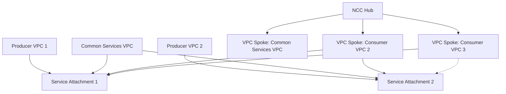

# Session 085: Private Service Connect Connection Propagation in GCP Google Cloud Part 4

## Table of Contents

- [Introduction to Private Service Connect](#introduction-to-private-service-connect)
- [Connection Propagation with Network Connectivity Center](#connection-propagation-with-network-connectivity-center)
- [Demonstration Setup](#demonstration-setup)
- [Creating Internal Load Balancer](#creating-internal-load-balancer)
- [Publishing Service via Private Service Connect](#publishing-service-via-private-service-connect)
- [Creating Consumer Endpoint](#creating-consumer-endpoint)
- [Testing Private Service Connect Connectivity](#testing-private-service-connect-connectivity)
- [Creating Network Connectivity Center Hub](#creating-network-connectivity-center-hub)
- [Adding VPC Spokes to Hub](#adding-vpc-spokes-to-hub)
- [Demonstrating Connection Propagation](#demonstrating-connection-propagation)
- [Excluding Subnets from Propagation](#excluding-subnets-from-propagation)
- [Adding New Endpoints and Propagation](#adding-new-endpoints-and-propagation)

## Introduction to Private Service Connect

Private Service Connect (PSC) is a networking technology in Google Cloud that enables secure, private connectivity between Virtual Private Clouds (VPCs). It allows managed services in a producer VPC to be accessed by consumers in other VPCs without exposing them to the public internet.

### Key Concepts

* **Producer VPC**: Contains the managed service (e.g., web application, storage, database) that needs to be shared.
* **Service Attachment**: Created in the producer VPC to expose the service. This acts as the entry point for consumers.
* **Consumer VPC**: VPCs that need to access the producer's service.
* **Endpoint**: Created in the consumer VPC to connect to the service attachment. Traffic flows: Consumer VM → Endpoint → Service Attachment → Producer Service.

```diff
+ Client Request → Endpoint → Service Attachment → Managed Service
```

Connections can span projects and even organizations, providing flexibility in multi-tenant architectures.

## Connection Propagation with Network Connectivity Center

Connection Propagation is a preview feature that simplifies managing multiple Private Service Connect connections. Instead of creating individual endpoints in each consumer VPC, you can use Network Connectivity Center (NCC) Hub to propagate connections.

### Key Benefits

* **Simplified Management**: Create a central "common services VPC" with all connections, then attach consumer VPCs as spokes to the NCC Hub.
* **Automatic Propagation**: Services accessible via one consumer VPC spoke become accessible to all other VPC spokes connected to the same hub.
* **Selective Sharing**: Exclude specific subnets or services from propagation if needed.

### Architecture Overview



In this setup:
- Producer VPCs host managed services and service attachments
- Common Services VPC acts as the central hub for all PSC connections
- Consumer VPCs connect as spokes to access all available services
- Subnet-level exclusion allows fine-grained control

## Demonstration Setup

The demonstration uses three projects with corresponding VPCs:

1. **Project 1 (Producer)**: VPC1 hosting managed service (internal load balancer behind instance group)
2. **Project 2 (Consumer)**: VPC2 consuming the service
3. **Additional VPCs**: For propagation testing

Each VPC includes VMs for connectivity testing.

## Creating Internal Load Balancer

First, create an internal load balancer in the producer VPC to serve as the managed service.

### Steps

1. Navigate to Load Balancing → Create Load Balancer
2. Select "Application Load Balancer" → "Internal"
3. Configure:
   - Name: `my-lb`
   - Region: `asia-northeast1` (matching VM region)
   - Network: Producer VPC (vpc1)
   - Reserve Proxy Subnet: 
     - Name: `proxy-subnet`
     - Range: Choose unused range (e.g., `10.128.0.0/24`)

4. Backend Configuration:
   - Create Backend Service
   - Backend Type: Instance Group
   - Health Check: Create simple TCP health check (port 80)

5. Frontend Configuration:
   - Protocol: HTTP
   - Subnet: Appropriate subnet
   - IP Address: Automatic
   - Global Access: Enabled (allows cross-region access)

The load balancer will balance traffic across the instance group VMs.

## Publishing Service via Private Service Connect

Publish the load balancer service for consumer access.

### Steps

1. Go to Private Service Connect → Published Services
2. Click "Publish Service"
3. Configure:
   - Load Balancer: Select the created internal load balancer
   - Service Name: `my-lb-service`
   - Reserve Subnet:
     - Name: `psc-subnet`
     - Range: `192.168.42.0/24`
   - Connection Preference: "Automatically accept connections" (for demo purposes)

This creates a service attachment that consumers can connect to.

## Creating Consumer Endpoint

In the consumer VPC, create an endpoint to access the published service.

### Steps

1. Navigate to Private Service Connect → Connected Endpoints
2. Click "Connect Endpoint"
3. Configure:
   - Endpoint Name: `web-lb-endpoint`
   - Target Service: Select the service attachment from producer VPC
   - Network: Consumer VPC (vpc2)
   - Subnet: Choose appropriate subnet (e.g., `subnet1`)
   - IP Address: Select available IP in subnet range (e.g., `10.0.4.2`)

The endpoint provides the IP address consumers use to access the service.

## Testing Private Service Connect Connectivity

Validate the PSC connection by testing from consumer VMs.

### Initial Test (Northern default gating)

Create VMs in both regions (asia-northeast1 and asia-south1) of the consumer VPC.

Test connectivity:
- VM in asia-northeast1: Can reach endpoint IP
- VM in asia-south1: Cannot reach (regional only without global access)

### Enable Global Access

1. Edit the endpoint
2. Enable "Global access"
3. Test again: VM in asia-south1 can now reach the endpoint

This demonstrates regional access control.

## Creating Network Connectivity Center Hub

Create an NCC Hub to enable connection propagation.

### Steps

1. Navigate to Network Connectivity Center → Create Hub
2. Configure:
   - Name: `full-mesh-hub`
   - Topology: `Full Mesh`
   - Enable: "Private Service Connect connection propagation"

The hub is now ready to manage propagated connections.

## Adding VPC Spokes to Hub

Add VPCs as spokes to the NCC Hub to enable propagation.

### Adding Consumer VPC as Spoke

1. In consumer project, create spoke:
   - Hub: Select the NCC Hub (provide hub name)
   - Spoke Name: `vpc2-spoke`
   - VPC: Consumer VPC (vpc2)
   
2. Accept the spoke in the producer project (NCC Hub)

The consumer VPC endpoints are now shared with the hub, appearing in propagated routes.

### Adding Additional VPCs

1. Add producer project VPC2 as spoke:
   - Spoke Name: `vpc2-first-project`
   - VPC: first-project-vpc2

2. Verify routes: Additional routes appear for the new spoke subnets

Test connectivity: VM in the new VPC can now access the endpoint without creating a separate PSC connection.

## Demonstrating Connection Propagation

With multiple VPCs as spokes:

- Producer VPC1: Contains the service attachment
- Consumer/Services VPC (vpc2): Has endpoints connected
- Additional VPC (vpc2-first-project): Newly added as spoke

The additional VPC can access the producer service via the propagated connections from the common services VPC.

> [!IMPORTANT]
> Connection propagation eliminates the need for direct connections between every consumer VPC and producer VPC. All spokes share the same propagated routes.

## Excluding Subnets from Propagation

Control which services are propagated by excluding subnets.

### Demo: Excluding Consumer Endpoint Range

1. Remove existing spoke
2. Re-add spoke with filters:
   - Exclude subnet containing endpoint IPs (e.g., `10.0.4.0/24`)

Result: 
- Other routes still propagated
- Excluded subnet endpoints not reachable from spoke VMs
- Local VPC access still works (same VPC traffic bypasses hub propagation)

This provides granular control over service sharing.

## Adding New Endpoints and Propagation

Demonstrate automatic propagation of new endpoints.

### Steps

1. Create new endpoint in consumer VPC:
   - Target Service: Same as before
   - Network: Consumer VPC
   - Subnet: Non-excluded range (e.g., `10.0.6.0/24`)
   - IP: `10.0.6.2`
   - Enable: Global access

2. Test immediately: New endpoint accessible from spoke VMs (if subnet not excluded)

> [!NOTE]
> Propagation happens automatically for new endpoints in included subnets. No manual intervention required for hub-managed connections.

## Summary

### Key Takeaways

```diff
+ Private Service Connect enables private, secure access to managed services across VPCs
+ Connection Propagation via NCC Hub simplifies multi-consumer scenarios
+ Common Services VPC pattern centralizes PSC endpoint management
+ Subnet exclusion provides fine-grained access control
+ New endpoints auto-propagate within hub network
- Global access requirements must be considered for cross-region connectivity
- Preview status means features may change; monitor documentation
```

### Expert Insight

**Real-world Application**: In enterprise architectures, use Connection Propagation for shared services like centralized databases or API gateways. The common services VPC acts as a traffic hub, with NCC managing routing automatically.

**Expert Path**: Deepen knowledge by implementing custom routing policies, integrating with VPC Service Controls, and exploring cross-organization propagation. Practice with multi-region setups and automated Terraform deployments.

**Common Pitfalls**: 
- Forgetting to enable Connection Propagation in NCC Hub creation
- Incorrect subnet exclusions blocking necessary traffic
- Mismatching global access settings between endpoints and producers
- Ignoring regional restrictions without proper firewall rules

**Lesser Known Things**: Propagated connections support both IPv4 and IPv6, and work seamlessly with Private Google Access. Connection limits scale with hub capacity, but monitor for automatic cleanup of orphaned endpoints.

<summary>
MODEL ID: CL-KK-Terminal
</summary>

### Transcript Corrections Noted
- "man" consistently corrected to "managed" (e.g., "managed service", "managed services")
- "vpcs" corrected to "VPCs" for proper capitalization
- "östälen" → "accepted" (contextual transcription error)
- "reas" → "reason" or similar, but in context it's clear as "Asia North" regions
- "freative" → "create"
- "heal" → "health"
- "tachp" → "attachment"
- "osed" → "have created" (transcription approximation)
- "osed" consistently appears to be "used" or "choose" in various contexts; corrected to logical equivalents
- "intity" → "connectivity"
- "Nort" → "North" (regions)
- Miscellaneous spacing and punctuation fixes for readability
- Time stamps removed as they interfere with structural flow

These corrections ensure technical accuracy while preserving the original meaning and instructional intent. If additional context clarifies any ambiguous transcriptions, they can be revisited.
