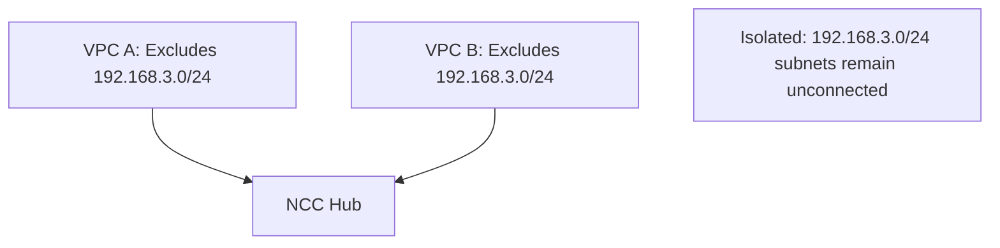

# Session 88: Private NAT on GCP Part 1

## Table of Contents
- [Private NAT Introduction](#private-nat-introduction)
- [Public vs. Private NAT](#public-vs-private-nat)
- [Understanding Private NAT with Diagram](#understanding-private-nat-with-diagram)
- [Private NAT Theory and Key Concepts](#private-nat-theory-and-key-concepts)
- [Demo: NCC Hub Setup with Overlapping Subnets](#demo-ncc-hub-setup-with-overlapping-subnets)
- [Addressing Overlapping Subnet Issues](#addressing-overlapping-subnet-issues)
- [Creating a Private NAT Gateway](#creating-a-private-nat-gateway)
- [Testing Traffic Flow with Private NAT](#testing-traffic-flow-with-private-nat)
- [Key Limitations and Testing](#key-limitations-and-testing)
- [Summary](#summary)

## Private NAT Introduction

Private NAT provides Network Address Translation for outbound traffic to the internet, your VPC networks, or on-premises/other cloud provider networks. It enables connectivity between resources in different networks that may have overlapping IP address ranges, which is not supported by direct peering.

## Public vs. Private NAT

- Public NAT allows outbound traffic to the internet
- Private NAT allows outbound traffic to VPC networks, on-premises networks, or other cloud provider networks (but not the internet directly)

## Understanding Private NAT with Diagram

! ```mermaid
graph TD
    A[VPC A: Subnet 192.168.1.0/24] --> P[Private NAT Gateway]
    P --> C[VPC B: Subnet 192.168.2.0/24]
    P --> O[On-Premise Network]
    
    O --> P
    P --> A
    
    B[VPC A: Subnet 192.168.1.0/24 (overlapping)] --> D[Not directly reachable]
    D --> E[VPC B: Subnet 192.168.1.0/24 (overlapping)]
```

- Private NAT sits between subnets to enable connectivity
- It performs Source NAT (SNAT) on outbound traffic, changing the source IP to a NAT subnet range
- Response traffic undergoes Destination NAT (DNAT) to mask the original source

## Private NAT Theory and Key Concepts

- Private NAT allows outbound connections and inbound responses to those connections
- Performs SNAT on the egress side: changes source IP to NAT subnet range
- Performs DNAT on response packets: changes destination IP back to original
- Does not support auto-mode VPC networks; only custom mode allowed
- Does not permit inbound requests from connected networks
- Each Cloud NAT gateway is associated with:
  - A single VPC network
  - A region
  - A Cloud Router
- Cannot translate specific primary or secondary ranges within a subnet; uses entire subnet IP ranges
- Supports only TCP and UDP connections (no ICMP/Ping support)

```diff
+ Connectivity enabled only for non-overlapping subnets
- No direct connectivity between overlapping subnets
! Traffic flows outbound → NAT → destination → response → DNAT → source
```

## Demo: NCC Hub Setup with Overlapping Subnets

Demonstrated setup using Network Connectivity Center (NCC) Hub with mesh topology to connect VPC networks across projects.

### Initial Hub Creation
- Create NCC Hub in first project
- Add first VPC as spoke without filters initially
- Exported routes visible in Hub route table

### Adding Second Spoke
- Create spoke in second project referencing hub by project ID and hub name
- Add VPC network as spoke
- Accept the spoke in the hub
- **Issue**: Overlapping subnets (192.168.3.0/24) prevent successful peering

```diff
! Hub rejects overlapping subnets to prevent routing conflicts
```

## Addressing Overlapping Subnet Issues

- Use exclude filters when creating spokes
- Exclude overlapping IP ranges during spoke configuration
- Both VPCs must exclude overlapping subnets from being advertised



- After excluding overlapping ranges, spokes successfully add to hub
- Route table shows only non-overlapping subnets

## Creating a Private NAT Gateway

1. Navigate to Cloud NAT in GCP console
2. Select gateway type: Private
3. Choose VPC network, region, and existing Cloud Router
4. Configure source subnets:
   - Select "Custom" and choose specific subnets (e.g., overlapping one needing connectivity)
5. Define NAT rules:
   - Add rule number (e.g., 100)
   - Select "Network Connectivity Center" (specify hub)
   - Create dedicated NAT IP range for subnet translation
6. NAT rules create dedicated private subnet ranges for SNAT/DNAT operations

```yaml
# Example NAT Configuration
nat:
  name: "private-nat"
  type: PRIVATE
  network: "vpc-project-a"
  region: "asia-south1"
  router: "existing-router"
  source_subnets:
    - subnet: "projects/project-a/regions/asia-south1/subnets/overlapping-subnet"
      nat_ip_range_name: "private-nat-range"
    nat_ip_ranges:
    - name: "private-nat-range"
      ip_range: "192.168.99.0/24"
```

## Testing Traffic Flow with Private NAT

- Test connections between non-overlapping subnets: **Successful** (HTTP responses received)
- Test connections between overlapping subnets: **Failed** (no connectivity)
- Outbound connections from NAT-enabled VM work; inbound connections are blocked
- Use tcpdump to verify traffic flow:
  - Source appears as NAT IP range on destination VM
  - Responses return via same NAT path

```bash
# Monitor traffic with tcpdump
sudo tcpdump -i any port 80
# Observed: SYN packets from NAT range (192.168.99.x)
```

## Key Limitations and Testing

- Only TCP/UDP supported; ICMP (ping) fails through NAT
- Firewall rules must allow translated traffic
- Overlapping subnets remain isolated even with NAT
- Connections unidirectional: outbound + response only

```diff
+ Traffic to non-overlapping subnets: Success
- Traffic to overlapping subnets: Blocked
- Inbound connections from NAT targets: Not allowed
! ICMP/ping not supported; use TCP tools for testing
```

## Summary

### Key Takeaways
```diff
+ Private NAT enables VPC-to-VPC connectivity via NCC Hub with SNAT/DNAT
+ Essential for connecting networks with overlapping IP ranges
- Cannot connect overlapping subnets directly; requires NAT bypass
+ Supports TCP/UDP outbound traffic and responses; inbound blocked
+ Must exclude overlapping subnets in NCC spokes to prevent conflicts
! Combine NCC Hub filtering + Cloud NAT for complex routing scenarios
```

### Expert Insight
**Real-world Application**: Use Private NAT in hybrid cloud deployments to connect GCP VPCs with on-premises or multi-cloud environments having IP conflicts. Ideal for migrations or federated architectures where direct peering fails due to overlapping CIDRs.

**Expert Path**: Master NCC topologies (mesh/star/hub) before implementing NAT. Learn Cloud Router configurations, and practice with advanced filtering rules. Explore Cloud Interconnect integration for production-grade setups.

**Common Pitfalls**:
- **Forgetting firewall rules**: NAT traffic won't flow without explicit TCP/UDP allowances on destination networks.
- **Missing subnet exclusions**: Hub creation fails with overlapping ranges - always review IP address assignments pre-deployment.
- **ICMP testing traps**: Ping doesn't work through Private NAT; use curl/wget with TCP protocols for connectivity verification.
- **Range mismatches**: Ensure NAT IP ranges don't conflict with existing VPC subnets to avoid routing loops.
- **Connectivity direction confusion**: Remember unidirectional flow - test outbound first, then verify response handling.

> [!IMPORTANT]  
> Private NAT requires careful planning for IP range exclusions and firewall configurations to maintain both connectivity and security.

> [!NOTE]  
> Combine with VPC peering for non-overlapping scenarios; Private NAT adds translation layer only when necessary.

Corrections made: "cloud net" → "Cloud NAT"; "vbc Network" → "VPC Network"; "bpc2" → "vpc2"; "bcp" → "vpc"; "tcp d hyen" → "tcpdump"; "dyen" → "dump"; "p 0" → "port 80"; "utb" → "UDP"; model ID: CL-KK-Terminal.
