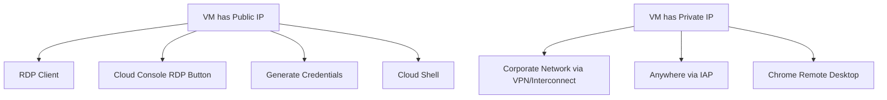

# Session 089: RDP in GCP

## Table of Contents
- [Introduction to RDP](#introduction-to-rdp)
- [Key Features of RDP](#key-features-of-rdp)
- [How RDP Works](#how-rdp-works)
- [Methods to Login into Windows VM in GCP](#methods-to-login-into-windows-vm-in-gcp)
- [Demo: Creating a Windows VM](#demo-creating-a-windows-vm)
- [Logging in with RDP using Public IP](#logging-in-with-rdp-using-public-ip)
- [Changing Windows Password](#changing-windows-password)
- [Firewall Rules for RDP](#firewall-rules-for-rdp)
- [Accessing VM with Private IP](#accessing-vm-with-private-ip)
- [Using IAP Desktop](#using-iap-desktop)
- [Installing Chrome Remote Desktop](#installing-chrome-remote-desktop)
- [Security Considerations](#security-considerations)

## Introduction to RDP

RDP stands for Remote Desktop Protocol, developed by Microsoft. It allows users to remotely access and control Windows computers and servers over a network, similar to how SSH provides access to Linux systems. RDP enables a graphical interface, allowing interaction with remote systems as if physically present.

## Key Features of RDP

RDP offers several critical features for remote system management:

- **Remote Access**: Enables controlling a Windows machine from anywhere with proper credentials.
- **Secure Connection**: Uses encryption to protect data during transmission.
- **Multi-user Support**: Allows multiple remote users on Windows editions with appropriate licensing.
- **File and Clipboard Sharing**: Transfer files or copy-paste between local and remote systems via shared clipboard functionality.

## How RDP Works

When a user initiates an RDP session:

1. The user employs an RDP client (e.g., in Windows, run `MSTSC` or "Remote Desktop Connection" from the Start menu).
2. Specify the target system's IP address and provide username/password credentials.
3. The RDP server on the target Windows machine processes the request and authenticates the user.
4. Upon successful authentication, a secure connection establishes, granting graphical remote control of the Windows desktop.

## Methods to Login into Windows VM in GCP

Google Cloud supports multiple methods for RDP access to Windows VMs, depending on network configuration and access location:

- **Public IP with RDP Enabled**: Use with public IP and RDP exposed.
  - Necessary firewall rules allow port 3389 (default RDP port) from the client's IP.
  
- **Private IP within Corporate Network**: Via VPN or interconnect.
  - RDP client access possible if connectivity exists between Google Cloud and on-premises via VPN/interconnect, and ports are allowed.

- **Private IP from Anywhere**:
  - Use Identity-Aware Proxy (IAP) with appropriate IAM roles.
  - Install Chrome Remote Desktop on the VM (requires installation by someone with access).



## Demo: Creating a Windows VM

To demonstrate, create a Windows VM in Google Cloud Console:

1. Navigate to Compute Engine > VM instances > Create instance.
2. Provide instance name (e.g., "WindowsVM").
3. Under "Machine configuration", select appropriate machine type.
4. In "Boot disk", select "Operating system" > "Windows Server" > "Windows Server 2022 Datacenter".
5. Allocate sufficient disk space (e.g., 50 GB).
6. Note: Windows images incur licensing fees.
7. In "Networking", assign a public IP initially for demo.
8. Click "Create" to provision the VM.
9. Instance creates with internal and external (public) IP.

## Logging in with RDP using Public IP

With a public IP assigned:

1. In Cloud Console, click "RDP" next to the VM instance.
2. Optional: Download RDP file and open, or use local RDP client (e.g., Windows Remote Desktop).
3. Enter VM's public IP address.
4. Provide credentials: Set Windows password in console or use Reset Windows password option.
5. For new VMs, console creates a username and generates a secure password.
6. Copy credentials for login.
7. RDP client connects, prompting for username/password.
8. Accept any certificate warnings and establish connection.

## Changing Windows Password

Upon initial login:

1. Settings > Accounts > Sign-in options > Password > Change.
2. Enter current password (generated or extracted).
3. Set new simpler password for convenience (e.g., "password123").
4. Login successful with new credentials.

## Firewall Rules for RDP

Default VPC firewall includes "default-allow-rdp" rule:

- Allows port 3389 from `0.0.0.0/0` (all IPs) by default – highly insecure.
- Strongly recommended: Limit to specific IP ranges for clients.
- Edit rule: Specify allowed source IP ranges (e.g., CIDR blocks for trusted networks).
- Without proper rules, RDP connection fails.

## Accessing VM with Private IP

Remove public IP to simulate private-only access:

1. VM instances > Edit instance > Networking > External IP > None > Save.
2. RDP button greys out; direct RDP impossible.
3. Corporate networks: Use RDP client if VPN/interconnect provides connectivity and firewall allows port 3389.
4. Alternative: IAP or Chrome Remote Desktop.

## Using IAP Desktop

For private IPs from restricted access:

1. Download and install IAP Desktop from Google (search "iap desktop gcp").
2. Open IAP Desktop; sign in with Google account (e.g., via browser guest mode).
3. Grant necessary permissions (e.g., "IAP Desktop can access").
4. Select project and VM.
5. Click "Connect"; provide credentials manually if not stored.
6. Establish connection via secure tunnel.
7. Note: Requires IAM roles like "IAP tunnel user".

For Mac/Linux, use G Cloud CLI + RDP client.

## Installing Chrome Remote Desktop

For alternative private IP access:

1. With temporary public IP, access VM and open PowerShell.
2. Copy installation commands from Chrome Remote Desktop setup page.
3. Paste/run in PowerShell: Installs Chrome Remote Desktop software.
4. Complete setup wizard: Provide PIN (6+ digits) for authentication.
5. Remove public IP afterward.
6. Enable Cloud NAT for outbound internet access to Google servers.
   - Create or use existing NAT gateway in VPC > Cloud NAT > Create.
   - Select network, region, router; apply to instances via tags.
7. Wait for connection to restore ("Online" status).
8. Access via Chrome Remote Desktop website/app; enter setup PIN.
9. Full functionality including VM restart via interface.

```bash
# Example PowerShell commands for Chrome Remote Desktop setup:
# (Executed in VM after copying from setup page)
Invoke-WebRequest -Uri "https://dl.google.com/dl/chrome-remote-desktop/remotely.exe" -OutFile remotely.exe
remotely.exe
# Follow setup prompts, set PIN via command-line output.
```

## Security Considerations

Key security practices:

- Avoid broad firewall rules; restrict RDP to known IPs.
- Change default Windows passwords immediately.
- Use IAP or secure protocols like Chrome Remote Desktop over public internet.
- Monitor and disable public IPs when possible; enable Cloud NAT for necessary outbound communications.
- Organizations often use golden images with pre-installed tools instead of allowing arbitrary software installation.
- Risk of compromise: Personal devices using IAP may expose VMs if not patched/secured.

## Summary

### Key Takeaways
```diff
+ RDP enables secure graphical remote access to Windows systems in GCP via multiple methods like public/private IPs, IAP, and Chrome Remote Desktop.
- Always restrict firewall rules to prevent unauthorized access and avoid exposing VMs to broad internet ranges.
+ Use generated credentials initially, but change default passwords immediately to prevent data loss.
- Private IP access requires additional infrastructure like VPN/interconnect, IAP roles, or Cloud NAT for outbound connections.
! Implement multi-layered security: Firewall rules, IAM permissions, and regular monitoring to mitigate risks.
```

### Expert Insight
**Real-world Application**: RDP is essential for managing Windows workloads in cloud environments, enabling administrators to perform tasks like software installation, configuration, and troubleshooting without physical access. In production, integrate with automated pipelines for VM provisioning with secure baselines.

**Expert Path**: Master GCP's Identity-Aware Proxy ecosystem, including roles and tunnels, to enable secure access patterns. Study hardening Windows Server instances against RDP attacks via Group Policy and endpoint protection.

**Common Pitfalls**: Overly permissive firewall rules lead to brute-force attacks; failure to enable Cloud NAT blocks Chrome Remote Desktop connections; neglecting credential rotation after resets causes security gaps. Lesser-known fact: RDP supports high-quality audio redirection, but enable it only in controlled environments due to potential bandwidth overhead. Issues include connection drops due to network instability—implement keepalive settings—and authentication failures requiring IAM role verification. Avoid configurational drift by using Infrastructure as Code tools like Terraform for consistent VM setups.
