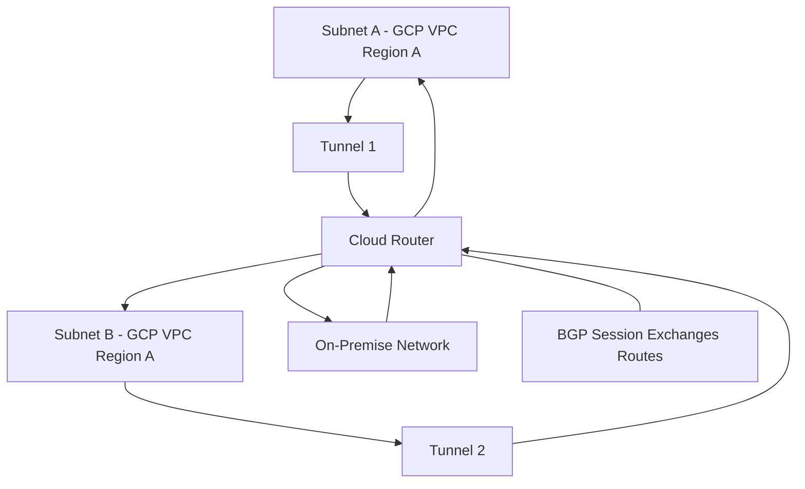

# Session 1: Cloud Router in GCP

## Table of Contents
- [Overview and Introduction](#overview-and-introduction)
- [How Cloud Router Works](#how-cloud-router-works)
- [Dynamic Routing Options](#dynamic-routing-options)
- [Route Advertisement Options](#route-advertisement-options)
- [BGP (Border Gateway Protocol) Deep Dive](#bgp-border-gateway-protocol-deep-dive)
- [Autonomous Systems and ASN](#autonomous-systems-and-asn)
- [BGP Timers](#bgp-timers)
- [Demo: Setting Up Cloud Router](#demo-setting-up-cloud-router)
- [VPC Dynamic Routing Modes: Regional vs Global](#vpc-dynamic-routing-modes-regional-vs-global)
- [Summary](#summary)

## Overview and Introduction
Cloud Router is a fully managed, distributed service in Google Cloud Platform (GCP) that provides BGP-like gateway capabilities. It coordinates with Cloud Interconnect, Cloud VPN, and router appliances to dynamically share routing information between networks. This enables seamless connectivity between on-premises networks, GCP VPCs, and other cloud environments.

Key focus: Establishing secure, efficient routing for hybrid cloud setups using VPN tunnels and dynamic route learning.

## How Cloud Router Works
Cloud Router acts as the "control plane" by managing BGP sessions, exchanging routes, and determining optimal paths. It works with Andromeda, GCP's network virtualization stack, as the "data plane" to execute routing decisions at lightning speed.

> [!IMPORTANT]
> Without Cloud Router, VPN tunnels provide encryption but lack routing information, making networks unable to reach specific destinations.

- Multiple networks (e.g., GCP VPC, on-premises).
- Bridge via VPN tunnels or Interconnect.
- BGP sessions share routes dynamically.
- Example flow: Subnet A wants to reach Subnet B via tunnel, BGP provides the path.



## Dynamic Routing Options
Two modes: Regional and Global.

| Routing Mode | Scope | Use Case |
|-------------|--------|----------|
| Regional | Routes within the same region where Cloud Router is deployed. | Smaller deployments, region-specific isolation. |
| Global | Routes across all subnets in the VPC, regardless of region. | Multi-region setups requiring full connectivity. |

- Regional: Only shares local region routes.
- Global: Shares all VPC routes, but subject to subnet limits (risk of hitting quotas >250 subnets).

## Route Advertisement Options
How routes are shared via BGP.

- **Default**: Advertises subnets according to the selected routing option (regional vs. global).
- **Custom**: Advertises specific subnets or IP ranges, allowing selective sharing.

Example: Advertise only specific subnets via certain tunnels for security/priority.

## BGP (Border Gateway Protocol) Deep Dive
BGP is the routing protocol of the internet, used by autonomous systems to exchange reachability information.

- **Role**: Shares IP address routes dynamically, enabling path selection.
- **Benefits**: Automatic route discovery, faster convergence than static routes.
- **Dynamic Updates**: New subnets auto-advertised; removed routes auto-withdrawn.

```diff
+ Dynamic Learning: Routes added/removed automatically without manual intervention.
- Static Routing: Requires manual configuration, prone to errors and downtime.
! Critical: BGP sessions down cause route withdrawals, with traffic redirecting to active paths.
```

## Autonomous Systems and ASN
Unique identifiers for networks.

- **ASN Types**:

| Type | Range | Notes |
|------|--------|-------|
| Public | 1-64511 | Internet-routable, assigned by authorities like AS numbers for major providers. |
| Private | 64512-65534 | For internal use, not routable on public internet. |

- Cloud Router uses private ASNs.
- Identities announced during BGP session establishment.

## BGP Timers
Manage link health and failover.

- **Keep Alive Timer**: Sends health checks (default: 20 seconds). Multiple failures trigger hold down.
- **Hold Timer**: Waits for keep alive messages before declaring dead (3x keep alive, default: 60 seconds).
- **BFD (Bidirectional Forwarding Detection)**: Advanced detection in 3-4 seconds (topic for future sessions).
- **Graceful Restart Timer**: Allows router restarts without interrupting traffic (default: 120 seconds).
- **Stale Route Timer**: For on-premises routers during restarts (recommended: 300 seconds to match Cloud Router).

> [!NOTE]
> Set timers symmetrically between GCP and on-premises for optimal performance.

## Demo: Setting Up Cloud Router
Follow these steps to create Cloud Router with VPN for VPC connectivity.

### Prerequisites
- Two VPCs: "gcp-vpc" (global) and "onprem-vpc" (initially regional).
- Regions: Use Asia South 1 for this example.

### Step 1: Create HA VPN Gateways
```bash
# In GCP VPC project
gcloud compute vpn-gateways create gcp-vpc-gateway \
  --network=gcp-vpc \
  --region=asia-south1

# In onprem VPC project  
gcloud compute vpn-gateways create onprem-gateway \
  --network=onprem-vpc \
  --region=asia-south1
```

### Step 2: Create Cloud Router
```bash
# GCP VPC side
gcloud compute routers create gcp-vpc-cloud-router \
  --network=gcp-vpc \
  --region=asia-south1 \
  --asn=64512 \
  --bgp-identifier-range=169.254.0.0/30 \
  --advertise-mode=default

# Onprem VPC side
gcloud compute routers create onprem-router \
  --network=onprem-vpc \
  --region=asia-south1 \
  --asn=64513 \
  --bgp-identifier-range=169.254.2.0/30 \
  --advertise-mode=default
```

### Step 3: Create VPN Tunnels with BGP Sessions
For each VPN gateway, create two tunnels (HA VPN).

**GCP VPC Side:**
```yaml
# VPN Gateway IPs (auto-assigned)
tunnels:
  - name: gcp-vpc-first-tunnel
    peer-gcp-gateway: onprem-gateway
    shared-secret: "gcp123!"
    router: gcp-vpc-cloud-router
  - name: gcp-vpc-second-tunnel
    peer-gcp-gateway: onprem-gateway
    shared-secret: "gcp123!"
    router: gcp-vpc-cloud-router
bgp_sessions:
  - name: gcp-vpc-first-bgp
    router: gcp-vpc-cloud-router
    peer-asn: 64513
    bgp-ip-address: 169.254.2.1
    peer-ip-address: 169.254.2.2
  - name: gcp-vpc-second-bgp
    router: gcp-vpc-cloud-router
    peer-asn: 64513
    bgp-ip-address: 169.254.2.3
    peer-ip-address: 169.254.2.4
```

**Onprem VPC Side:**
```yaml
tunnels:
  - name: onprem-first-tunnel
    peer-gcp-gateway: gcp-vpc-gateway
    shared-secret: "gcp123!"
    router: onprem-router
  - name: onprem-second-tunnel
    peer-gcp-gateway: gcp-vpc-gateway
    shared-secret: "gcp123!"
    router: onprem-router
bgp_sessions:
  - name: onprem-first-bgp
    router: onprem-router
    peer-asn: 64512
    bgp-ip-address: 169.254.2.2
    peer-ip-address: 169.254.2.1
  - name: onprem-second-bgp
    router: onprem-router
    peer-asn: 64512
    bgp-ip-address: 169.254.2.4
    peer-ip-address: 169.254.2.3
```

### Step 4: Verify Connectivity
- Check tunnel status: Should show "Established."
- Advertise/Learn routes: View in Cloud Router UI.
- Test ping between VMs in connected subnets.

### Step 5: Change VPC to Global Routing (Example)
```bash
# Edit VPC dynamic routing mode
gcloud compute networks update gcp-vpc --enable-global-dynamic-routing
gcloud compute networks update onprem-vpc --enable-global-dynamic-routing
```

## VPC Dynamic Routing Modes: Regional vs Global
- **Regional**: Limits to router's region (e.g., Asia South 1 only).
- **Global**: Shares across all VPC regions, requiring careful quota management.

```diff
+ Global Mode: Enables multi-region connectivity without additional VPNs.
- Regional Mode: Simpler, but isolates inter-region traffic.
```

## Summary

### Key Takeaways
```diff
+ Cloud Router automates BGP route exchange for hybrid cloud setups.
+ Choose regional/global routing based on architecture needs.
+ Always verify ASNs, timers, and subnets to avoid connection failures.
+ Custom advertisements allow fine-grained traffic control.
- Switching to global post-setup can break large deployments (>250 subnets).
! Test tunnels thoroughly before production to ensure redundancy.
```

### Expert Insight

#### Real-world Application
In production, use Cloud Router for secure on-premises-to-GCP connectivity in banking or healthcare, where dynamic routing ensures zero-downtime migrations and multi-region disaster recovery. Pair with Cloud Interconnect for high-bandwidth scenarios to avoid VPN latency.

#### Expert Path
Master BGP by implementing multi-protocol (IPv6) support, Med/MD5 authentication, and route summarization. Progress to complex topologies like hub-and-spoke with custom advertisements.

#### Common Pitfalls
- **Mismatched ASNs**: Leads to failed BGP sessions. Resolution: Double-check during setup; use Cloud Router logs for debugging.
- **Timer Mismatches**: Asymmetric hold times cause intermittent disconnects. Avoidance: Always set symmetric 20s keep alive on both ends.
- **Quota Exceedance in Global Mode**: >250 routes overload router. Resolution: Use summarization or custom routes; monitor via GCP metrics. Avoidance: Audit subnets before switching modes.
- **Wrong IP Ranges for BGP**: /30 blocks vary by tunnel. Resolution: Log configuration discrepancies early.
- **Post-Mode Change Outages**: Global switch cores routes forcibly. Avoidance: Stage changes during maintenance windows and test incrementally.

#### Lesser Known Things
- Cloud Router supports BGP communities for advanced traffic engineering, enabling route tagging for preferential treatment.
- The `best path selection` mode (legacy vs. standard) affects route prioritization; standard adds cost optimizations for large networks.
- BFD timers default to 20s but can be tuned via API for sub-second failure detection, crucial in financial trading systems.
