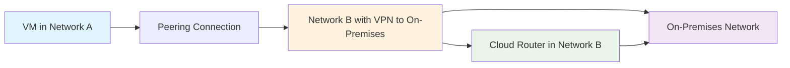
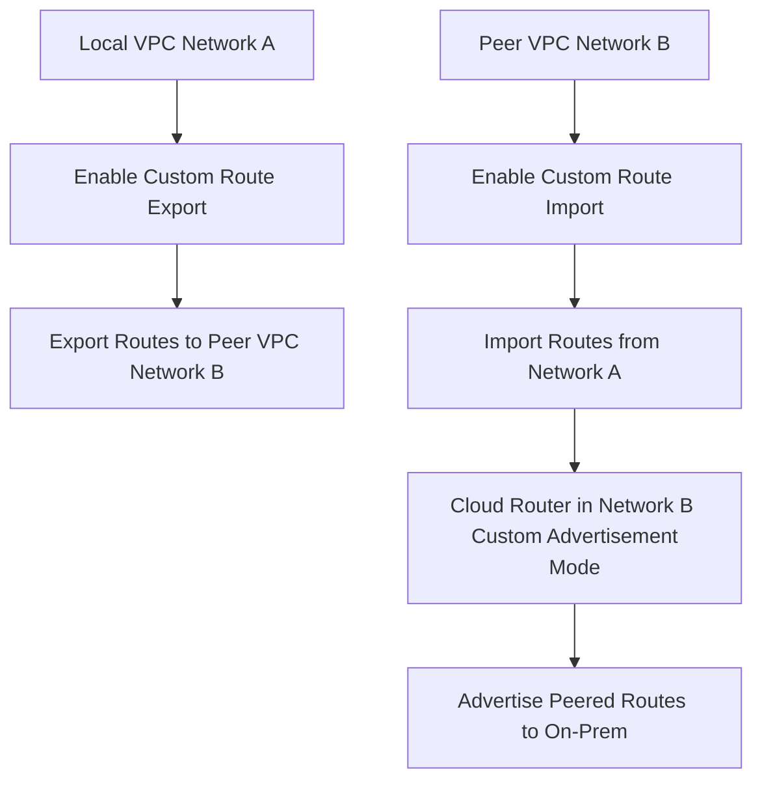

# Session 9: Cloud Router with VPC Peering in GCP - Part 2

## Table of Contents

- [Introduction and Diagram](#introduction-and-diagram)
- [Theory of VPC Peering](#theory-of-vpc-peering)
- [Configuring VPC Peering](#configuring-vpc-peering)
- [Enabling Custom Route Export and Import](#enabling-custom-route-export-and-import)
- [Custom Route Advertisement in Cloud Router](#custom-route-advertisement-in-cloud-router)
- [Troubleshooting Traffic Issues](#troubleshooting-traffic-issues)
- [Regional vs. Global Routing Behavior](#regional-vs-global-routing-behavior)
- [Additional BGP Session Options](#additional-bgp-session-options)
- [Summary](#summary)

## Introduction and Diagram

### Overview

This session explores how Cloud Router integrates with VPC Peering in Google Cloud Platform (GCP) to enable advanced networking capabilities. It builds on previous knowledge by demonstrating how peered VPC networks can share access to on-premises networks via VPN tunnels, without requiring separate VPN connections for each VPC. This setup reduces costs and simplifies network management while maintaining secure, efficient routing.

### Key Concepts/Deep Dive

VPC Peering in GCP allows private connectivity between two VPC networks, sharing routes across projects or regions. When combined with Cloud Router, it enables route exchange for external networks like on-premises infrastructure connected via VPN.

- **Scenario Description**: Two projects (Project 1 and Project 2) contain VPC networks (Network A and Network B). Network B connects to on-premises (on-prem) via a VPN tunnel.
- **Challenge**: Network A needs to reach on-prem without creating a new VPN, which would incur additional costs.
- **Solution**: Establish VPC Peering between Network A and Network B, allowing Network A to leverage Network B's VPN connection.

> [!NOTE]
> The diagram illustrates the traffic flow: Project1 (Network A) ↔ Peering Connection ↔ Project2 (Network B) ↔ VPN ↔ On-Premises.



### Lab Demos

- **Demo Setup**: In the console, visualize two VPC networks:
  - **GCP VPC C**: Contains 1 subnet.
  - **Second VPC for Testing**: Contains 2 subnets (e.g., Asia South 1 - Mumbai, US Central 1).
  - **VPN**: Established tunnel between VPC C and the second VPC (refer to previous session for setup).

## Theory of VPC Peering

### Overview

VPC Peering enables route sharing between networks, but Cloud Router adds the layer for advertising routes to external destinations like on-prem networks. This section explains the technical requirements for proper route exchange.

### Key Concepts/Deep Dive

- **Route Export/Import**: When creating a peering connection, enable "Exchange custom routes" to allow sharing of learned routes.
  - **Export**: Network A exports custom routes (e.g., received via VPN) to Network B.
  - **Import**: Network B imports those routes to forward traffic.
- **Cloud Router Role**: Manages BGP sessions and advertises routes. By default, it does not advertise peered routes.
- **Custom Advertisement Mode**: Required to share specific subnets from peered networks to on-prem via BGP.

> [!IMPORTANT]
> Enabling custom route export/import during peering is crucial for route propagation.



- **BGP Advertisement**: Cloud Router advertises routes to the VPN tunnel's BGP peer. Without custom advertisement, peered routes remain unshared.

## Configuring VPC Peering

### Overview

This hands-on section demonstrates creating bidirectional VPC Peering connections in the GCP console, focusing on enabling custom route exchange.

### Key Concepts/Deep Dive

- Peering connections are bidirectional; create them from both VPC networks.
- "Exchange custom routes" must be selected to import/export routes.
- Peering allows private IP routing without NAT.

### Lab Demos

1. **Navigate to VPC Network > VPC network peering**.
2. **Create First Connection**:
   - Click "Create connection".
   - Name: `GCP-VPC-to-Second-VPC`.
   - Local Network: `gcp-vpc` (assumed Network A).
   - Peer Network: `second-vpc-for-testing` (assumed Network B).
   - ✅ Check "Exchange custom routes" for Export.
   - Click "Create".
3. **Create Second Connection (Reverse)**:
   - Click "Create connection".
   - Name: `Second-VPC-to-GCP-VPC`.
   - Local Network: `second-vpc-for-testing`.
   - Peer Network: `gcp-vpc`.
   - ✅ Check "Exchange custom routes" for Import.
   - Click "Create".

After creation, peering status shows "Active". Verify in **VPC networks > Routes** (filter by destination IP, e.g., `192.168.1.0/24`).

## Enabling Custom Route Export and Import

### Overview

Building on peering configuration, this step ensures routes are properly exported and imported, allowing traffic to flow through the peered connection.

### Key Concepts/Deep Dive

- **Export**: Shares custom routes from the local VPC to the peer.
- **Import**: Receives and incorporates custom routes from the peer into the local routing table.
- Without this, peered networks cannot share external routes.

### Lab Demos

1. **Verify Routes**: In VPC networks > Routes, filter and check imported routes from VPN tunnels.
2. **Test Connectivity**: 
   - SSH into a VM in the peer VPC (e.g., `india-vm` in Mumbai region).
   - Ping a VM in the VPN-connected network.
   - ⚠ **Expected Issue**: Pings fail due to missing return routes (explained next).

## Custom Route Advertisement in Cloud Router

### Overview

Cloud Router's default advertisement mode only shares local VPN/Interconnect routes. Custom mode is needed to include peered subnet ranges, enabling return traffic.

### Key Concepts/Deep Dive

- Cloud Router does not advertise received peering routes by default.
- Custom advertisement propagates specific IP ranges to the BGP peer (e.g., on-prem).
- Manually specify peered subnet CIDRs.

### Lab Demos

1. **Edit Cloud Router** (in the VPN-connected VPC, e.g., second VPC):
   - Go to Network services > Cloud routers.
   - Select the router.
   - Click "Edit".
2. **Enable Custom Advertisement**:
   - Under "Advertised routes", select "Create custom advertisement".
   - Add routes:
     - ✅ "Advertise all subnets visible to the Cloud Router".
     - ➕ Add custom ranges: `10.60.160.0/20` (Mumbai subnet), `10.128.0.0/20` (US Central subnet).
   - Click "Save".
3. **Verify**: Refresh "Learned routes" and "Advertised routes" – peered subnets now appear.

> [!NOTE]
> This step fixes dropped traffic by providing return paths.

```diff
+ Before: Traffic from on-prem reaches peered VPC, but no return route (drops packets)
- After: Custom advertisement adds peered ranges to BGP, enabling bidirectional flow
```

## Troubleshooting Traffic Issues

### Overview

Common issues include failed pings despite visible routes. This section addresses diagnostics and fixes.

### Key Concepts/Deep Dive

- **Symptom**: Routes visible in table, but connectivity fails.
- **Cause**: Peered routes not advertised via Cloud Router.
- **Fix**: Enable custom advertisement as above.

### Lab Demos

- **Test After Fix**: Ping succeeds immediately after enabling custom routes (as shown in console demo).
- **Cross-Region Test**: VMs in different regions (e.g., Mumbai ↔ US Central) may still fail (see next section).

## Regional vs. Global Routing Behavior

### Overview

Cloud Routers are regional, so custom advertisement only shares regional hops, not global peering routes.

### Key Concepts/Deep Dive

- Regional routing limits advertisement to subnets in the same region as the router.
- For global connectivity via peering, ensure VPCs are global or use additional configurations (beyond this part).
- Lesser-Known: Peering shares routes regardless of region, but Cloud Router enforces regional advertisement.

> [!TIP]
> Check VPC type (regional/global) in VPC network settings.

### Lab Demos

- **Demo Issue**: Ping from US Central VM fails to Mumbai subnet due to regional limits.
- **Resolution**: Not addressed here; reserve for global VPC setup in future sessions.

```diff
+ Regional: Advertises only same-region peered subnets
- Global: Full connectivity, but requires global VPC
```

## Additional BGP Session Options

### Overview

Beyond router-level custom advertisement, BGP sessions can be individually customized for finer control.

### Key Concepts/Deep Dive

- Override default advertisement at the BGP session level.
- Useful for session-specific route filters or custom ranges.

### Lab Demos

1. **Edit BGP Session**: In Cloud Router, select BGP session > "Edit".
2. **Enable Override**: Click "Override advertised routes to this session".
3. **Configure**: Similar to router-level – add custom ranges or select options like "Advertise all subnets visible to the Cloud Router".

(Not fully demonstrated; example for next session).

> [!NOTE]
> Session overrides take precedence over router defaults.

## Summary

### Key Takeaways

```diff
+ VPC Peering with Cloud Router enables shared VPN access to on-prem without per-VPC tunnels, reducing costs and complexity.
! Enable "Exchange custom routes" during peering to import/export routes.
! Cloud Router requires custom advertisement mode to share peered subnets via BGP.
+ Default mode does not advertise peered routes; always verify in "Advertised routes".
! Troubleshoot step-by-step: Check peering import/export → Custom advertisement → Routing tables → Regional limits.
+ Regional Cloud Routers limit advertisement to same-region subnets; use global VPCs for full coverage.
- Avoid assuming peered routes auto-advertise; they require explicit configuration.
```

### Expert Insight

#### Real-world Application
In enterprise GCP setups, this configuration supports hybrid cloud architectures where multiple development environments (e.g., dev/staging VPCs) share secure access to on-prem data centers via a centralized production VPC's VPN. It's ideal for cost-optimized multi-region deployments, ensuring traffic remains private and efficient through GCP's backbone.

#### Expert Path
Master BGP fundamentals and GCP Cloud Networking certifications. Practice labs with cross-regional peering and integrations with Cloud Interconnect. Study route exchange protocols (like Azure's VNet peering) for multi-cloud expertise. Monitor costs with custom routes to avoid unintended advertisement.

#### Common Pitfalls
- Forgetting to enable custom route exchange during peering leads to silent route drops.
- Regional Cloud Router restrictions cause failures in global setups; switch to global VPCs or use Dedicated Interconnect.
- Resolution: Use `gcloud compute routers describe` to check configurations; enable VPC Flow Logs for traffic debugging.
- Lesser-Known: Peering doesn't support transitive routing; if VPC A peers with VPC B, and VPC B with VPC C, VPC A can't reach VPC C without direct peering (mesh topology required). Avoid relying on defaults; always use custom advertisement for external connectivity. Performance impact: Large route tables (>100 entries) can cause BGP convergence delays; monitor with Cloud Monitoring. Security: Peering inherits IAM policies; ensure least-privilege to prevent unauthorized cross-VPC access.
