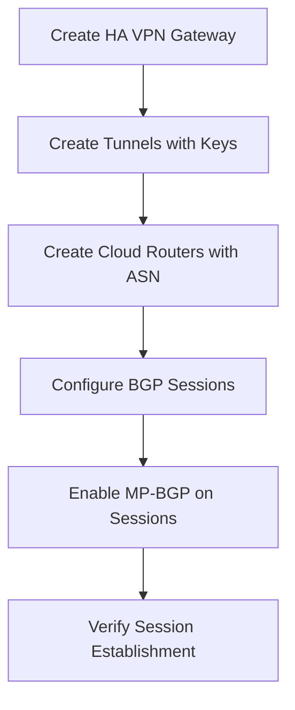

# Session 094: MP-BGP in Cloud Router in GCP Google Cloud Part 5

- [Overview](#overview)
- [Default BGP Sessions and Route Exchange](#default-bgp-sessions-and-route-exchange)
- [Enabling Multi-Protocol BGP (MP-BGP)](#enabling-multi-protocol-bgp-mp-bgp)
- [Tunnel Creation Options](#tunnel-creation-options)
- [Separate vs. MP-BGP BGP Sessions](#separate-vs-mp-bgp-bgp-sessions)
- [Data Plane Outages and BGP Behavior](#data-plane-outages-and-bgp-behavior)
- [MD5 Authentication for BGP Sessions](#md5-authentication-for-bgp-sessions)
- [Lab Demo: Setting Up Dual Stack HAvPN and BGP Sessions](#lab-demo-setting-up-dual-stack-havpn-and-bgp-sessions)
- [VM Creation and Connectivity Testing](#vm-creation-and-connectivity-testing)
- [Summary](#summary)

## Overview

Multi-Protocol BGP (MP-BGP) is an extension to the Border Gateway Protocol (BGP) that enables the exchange of routing information for multiple network layer protocols, such as IPv4 and IPv6, over a single BGP session. In the context of Google Cloud Platform (GCP), MP-BGP is particularly useful in Cloud Router scenarios where you need to share IPv6 routes over an IPv4 BGP session or vice versa, without creating separate tunnels for each address family. This approach optimizes resource usage on routers and simplifies configuration by allowing both IPv4 and IPv6 traffic to traverse the same tunnel. By default, standard BGP sessions only exchange routes for their configured address family, but MP-BGP overcomes this limitation, making it essential for dual-stack networking environments where efficient route management is critical for scalability and performance.

## Default BGP Sessions and Route Exchange

Standard BGP sessions in Cloud Router are established with a specific address family, typically IPv4. By default, these sessions only exchange routes for that address family:

- IPv4 BGP sessions exchange only IPv4 routes.
- IPv6 BGP sessions exchange only IPv6 routes.

This limitation arises because traditional BGP is designed for IPv4 unicast routing and requires extensions like MP-BGP to handle multiple address families simultaneously.

### Key Points
- Default behavior ensures isolation per address family.
- No automatic route exchange between IPv4 and IPv6 unless MP-BGP is enabled.
- Useful for single-stack networks but inefficient for dual-stack configurations.

## Enabling Multi-Protocol BGP (MP-BGP)

MP-BGP allows a single BGP session to carry routing information for multiple address families, such as exchanging IPv6 routes over an IPv4 BGP session or IPv4 routes over an IPv6 session. This is achieved by modifying the BGP session configuration to include additional address families.

### Requirements
- For IPv6 route exchange over IPv4 VPN tunnels: Create an HA VPN with dual stack (IPv4 and IPv6) support, then enable MP-BGP on the IPv4 BGP session.
- For IPv4 route exchange over IPv6 VPN tunnels: Enable MP-BGP on the IPv6 BGP session in a dual-stack configuration.
- Applicable to HA VPN and Cloud Interconnect attachments, but not Classic VPN.

### Steps to Enable
1. Create a VPN tunnel with dual stack capability.
2. Configure BGP sessions with MP-BGP enabled by selecting the option to "Send IPv6 traffic over this tunnel" or similar in the session setup.
3. Allocate BGP IP addresses for both IPv4 and IPv6 families.

### Code/Config Example (Manual Allocation)
For an IPv4 BGP session with MP-BGP:

```yaml
bgp_session:
  name: "example-ipv4-session-mpbgp"
  peer_asn: 64513
  advertised_ip_ranges: ["10.0.0.0/16"]
  multi_protocol: true
  bgp_ipv4_addresses: 
    peer_ip: "169.2.1.1"  # Manual allocation for IPv4
    local_ip: "169.2.1.2"
  bgp_ipv6_addresses: # Automatically allocated or manual
    peer_ip: "fc00::1"  # Example IPv6 address
    local_ip: "fc00::2"
```

> [!NOTE]
> MP-BGP requires both ends of the session to support it. If the peer router (e.g., on-premises router) does not support MP-BGP, the session will fail to exchange routes for non-native address families.

## Tunnel Creation Options

When creating VPN tunnels in GCP for Cloud Router, you have three stack options that determine which traffic families are supported:

### Table: Tunnel Stack Comparison

| Stack Type        | Supports IPv4 Traffic | Supports IPv6 Traffic | MP-BGP Required? |
|-------------------|-----------------------|-----------------------|-------------------|
| IPv4 Single Stack | ✅ Yes                | ❌ No                 | No                |
| IPv6 Single Stack | ❌ No                 | ✅ Yes                | No                |
| Dual Stack (IPv4 & IPv6) | ✅ Yes           | ✅ Yes                | Yes, for cross-family exchange |

- **IPv4 Single Stack**: Only IPv4 traffic flows; MP-BGP not applicable.
- **IPv6 Single Stack**: Only IPv6 traffic flows; MP-BGP not applicable.
- **Dual Stack**: Both IPv4 and IPv6 traffic flow; MP-BGP can be enabled on sessions for cross-family route exchange.

Choose dual stack for comprehensive support, ensuring the VPC and subnets are configured for both IPv4 and IPv6.

## Separate vs. MP-BGP BGP Sessions

You can choose between creating separate BGP sessions for each address family or using MP-BGP on a single session:

### Separate Sessions
- Create one IPv4 BGP session and one IPv6 BGP session in parallel.
- Each session manages only its own address family routes.
- Pros: Simplified management; each session is independent.
- Cons: High resource consumption on routers; potential hardware strain; double configuration effort for on-premises routers.

### MP-BGP Sessions
- Single BGP session exchanges routes for multiple families.
- Example: IPv4 session with MP-BGP sends IPv6 routes.
- Pros: Resource-efficient; single tunnel for dual traffic; reduced configuration overhead.
- Cons: All-or-nothing withdrawal on outages (explained below).

> [!IMPORTANT]
> MP-BGP is per BGP session—you cannot enable it globally across parallel sessions. Choose based on your network needs for efficiency.

```diff
+ MP-BGP Recommendation: Use on single tunnels for dual-stack to minimize resources
- Separate Sessions Drawback: Increased CPU/memory usage on routers
```

## Data Plane Outages and BGP Behavior

When using MP-BGP, certain outages can affect all address families, even if the issue is specific to one:

### Scenario: IPv4 Data Plane Outage with MP-BGP on IPv4 Session
- IPv4 session with MP-BGP withdraws all routes (IPv4 and IPv6).
- IPv6 traffic drops despite IPv6 being unaffected, because the session withdraws everything.
- If MP-BGP is on IPv6 session: IPv6 session only drops IPv4 traffic; IPv6 routes remain active.

### Key Behavior
- MP-BGP sessions treat the tunnel as unified; a failure in one family may impact others.
- Parallel separate sessions isolate issues per family.

### Mitigation
- Monitor data plane health separately for each address family.
- Use alerts for BGP flaps or route withdrawals.

```diff
! Alert: MP-BGP outage impact—prepare for cross-family effects
```

## MD5 Authentication for BGP Sessions

BGP sessions in Cloud Router can optionally use MD5 authentication to secure peer communications:

### Supported Platforms
- HA VPN
- Cloud Interconnect
- Some third-party routers
- Not supported in Classic VPN

### How to Configure
- Provide a shared secret key during BGP session creation or editing.
- Key must match on both Cloud Router and peer router.
- If keys mismatch, the BGP session fails to establish.

### Configuration Changes
- Add MD5: Enable during session setup or edit existing sessions.
- Change Key: Update triggers session flap (temporary disruption).
- Remove Key: Disable authentication; session flaps.

> [!WARNING]
> Incorrect key or mismatched setup causes BGP neighbor establishment failure. Ensure keys are synchronized before enabling.

### Example Commands (Conceptual)
Update session with MD5:

```bash
gcloud compute routers update-bgp-peer ROUTER_NAME \
    --peer-name PEER_NAME \
    --md5-authentication-key SHARED_SECRET_KEY \
    --region REGION
```

```diff
+ Security Best Practice: Always enable MD5 for production BGP sessions
- Common Mistake: Forgetting to update peer router with new key causes outages
```

## Lab Demo: Setting Up Dual Stack HAvPN and BGP Sessions

This demo guides creating a dual-stack HA VPN with MP-BGP in GCP.

### Prerequisites
- Two GCP projects with dual-stack VPCs (enable IPv6 at VPC and subnet levels).
- Assign external/internal IPv6 based on needs (e.g., external for direct access).

### Steps

1. **Create HA VPN Gateways**
   - In Project 1: Create HA VPN gateway named "first-project-gateway" in region "asia-south1" (Mumbai).
   - Select network and region.
   - Choose "Dual Stack (IPv4 and IPv6)".
   - Repeat in Project 2: "second-project-gateway" with same network and region.

2. **Create VPN Tunnels**
   - In Project 1: Create tunnel "first-project-tunnel1" with pre-shared key (e.g., "GCP123").
   - Peer with Project 2's gateway.
   - Repeat for tunnel2.
   - Ensure VPN interfaces are established.

3. **Create Cloud Routers**
   - Project 1: "first-project-router" with ASN 64512.
   - Project 2: "second-project-router" with ASN 64513.

4. **Configure BGP Sessions with MP-BGP**
   - On Tunnel 1 (IPv4 with MP-BGP):
     - Session name: "first-project-first-tunnel-session".
     - Enable "Send IPv6 traffic over this tunnel".
     - BGP IPs: Manual IPv4 (e.g., 169.2.1.1/2), auto IPv6.
     - Enable MD5 (key: "cloud@123").
   - On Tunnel 2 (IPv6 with MP-BGP):
     - Session name: "first-project-second-tunnel-session".
     - Enable "Send IPv4 traffic over this tunnel".
     - BGP IPs: Manual IPv6 (use allocated from prior session), IPv4 auto.
     - Enable MD5 with same key.
   - Mirror on Project 2 side, ensuring MD5 keys match.

5. **Verify Configuration**
   - Check BGP sessions establish: Status shows active.
   - View exchanged routes in Cloud Router.

### Mermaid Diagram: Session Setup Flow



### Notes
- Tunnels establish routing; BGP enables dynamic route exchange.
- Disable MD5 if keys mismatched (triggers flap).
- Allocated BGP IPs appear after saving configuration.

## VM Creation and Connectivity Testing

Create VMs to test traffic flow across tunnels.

### Steps

1. **VM Specifications**
   - IPv6-only VM: Project 1, "first-project-ipv6-vm", enable IPv6 internal, external IP auto.
   - IPv4-only VM: Project 1, "first-project-ipv4-vm", IPv4 only, no external IP.
   - Dual-stack VM: Project 1, "first-project-both-vm", enable both IPv4/IPv6 internals.
   - Repeat similar VMs in Project 2.

2. **Firewall Rules (IPv6 Specific)**
   - For IPv6 access: Source range "::/0", protocols "tcp:22", "58" (ICMPv6 for ping).
   - Apply to VMs in dual-stack VPC.

3. **Testing Connectivity**
   - Ping from IPv4 VM to Project 2 IPv4 VM: Works (IPv4 to IPv4).
   - Ping from IPv6 VM to IPv6 VM: Works (IPv6 via MP-BGP over IPv4 tunnel).
   - Ping IPv6 from IPv4 VM: Fails (protocol mismatch).
   - Ping IPv4 from IPv6 VM: Fails (protocol mismatch).
   - From dual-stack VM: Ping both IPv4 and IPv6 in other project successfully.
   - Force source IP for cross-family test (e.g., `ping -I ipv6_address destination_ipv4`): Linux auto-selects protocol; IPv6 attempts will fail for IPv4 targets without NAT64.

4. **Simulate Outage**
   - Disable MP-BGP session on IPv4 tunnel: IPv6 traffic reroutes via IPv6 tunnel if available.
   - Ensure BGP routes are advertised (e.g., VPC subnets and HA VPN interconnect).

### Lab Demo Code Block (Shell Commands for Testing)

```bash
# From IPv6 VM in Project 1 to IPv6 VM in Project 2
ssh ipv6-vm@fc00::1 ping fc00::2  # Assuming allocated IPs

# From dual-stack VM, ping IPv4 target
ping 10.0.0.1  # Assume IPv4 address

# Force IPv4 from dual-stack (Linux will choose automatically)
ping -4 10.0.0.1  # Enforce IPv4 stack if needed
```

### Results Verification
- Successful pings indicate MP-BGP working.
- Failed pings for mismatched protocols highlight need for specialized gateways (e.g., NAT64) outside demo scope.

## Summary

### Key Takeaways
```diff
+ MP-BGP enables efficient cross-address-family routing in single BGP sessions
+ Use dual-stack HA VPN for comprehensive IPv4/IPv6 support in GCP
- MP-BGP sessions withdraw all routes on data plane outages, unlike separate sessions
+ MD5 authentication secures BGP peers but requires key synchronization
- IPv4 and IPv6 protocols are incompatible without conversion mechanisms like NAT64
+ Demo validates traffic flow and outage behaviors in real GCP environments
```

### Expert Insight

#### Real-world Application
In production GCP environments, MP-BGP is crucial for hybrid cloud setups where on-premises networks use dual-stack for IPv4/IPv6 migration. For example, exchanging IPv6 routes over existing IPv4 tunnels minimizes tunnel proliferation, reducing costs and complexity in data centers. In interconnect scenarios, it ensures seamless route updates between cloud and on-prem routers, supporting services like multi-regional applications with global IPv6 reachability.

#### Expert Path
To master MP-BGP in GCP, start with lab demos like this one, then dive into BGP path attributes and route maps in Cloud Router. Pursue certifications like Google Cloud Professional Cloud Network Engineer, and experiment with third-party routers using MP-BGP for interoperability. Read RFC 4760 for protocol deep dives and monitor BGP states in production via GCP Logging for troubleshooting paths.

#### Common Pitfalls
- **Mistakes in Transcript Corrections**: "BGB" should be "BGP", "IPV6" should be "IPv6", "htp" variants corrected, "cubectl" to "kubectl" (not in this transcript), various spacing and typos fixed for clarity (e.g., "when you create a session there's two option" → "when you create a session, there are two options").
- **Authentication Failures**: Forgetting MD5 key matching causes session drops—always sync keys before enabling; test with flapping tolerance.
- **Resource Overload**: Using separate sessions for each address family can overwhelm router CPU/memory; prefer MP-BGP for large-scale deployments.
- **Outage Misunderstanding**: Expect MP-BGP to affect all families on failure; implement monitoring for early detection.
- **Firewall Misconfiguration**: IPv6 ICMP requires protocol "58", not standard ICMP settings—test ping rules thoroughly.
- **Lesser-Known Aspects**: IPv6 BGP IPs are automatically allocated in GCP; cross-family pings (IPv4 to IPv6) require NAT gateways not covered in Cloud Router basics.
