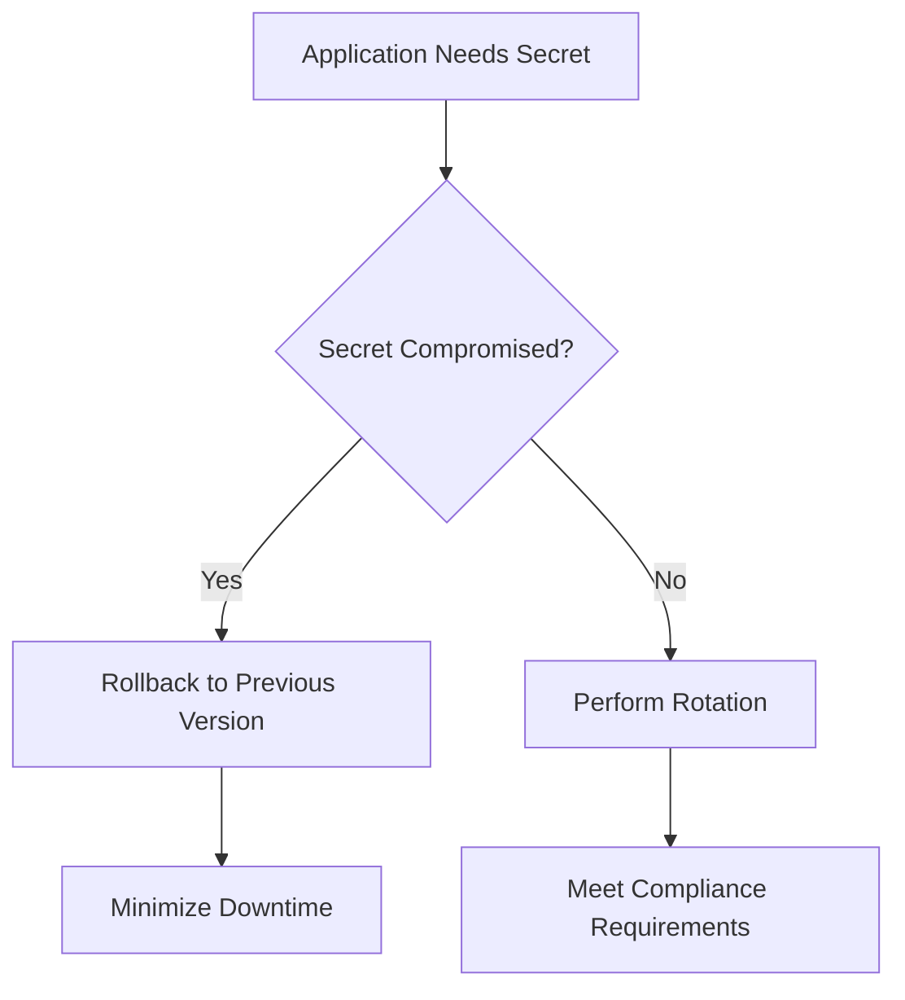

# Session 103: Secret Manager GCP Part 1

**Table of Contents**
- [Introduction to Secret Manager](#introduction-to-secret-manager)
- [Use Cases](#use-cases)
- [Secret Structure](#secret-structure)
- [Encryption and Security](#encryption-and-security)
- [Replication Policies](#replication-policies)
- [Global vs Regional Secrets](#global-vs-regional-secrets)
- [Annotations and Labels](#annotations-and-labels)
- [Expiration Dates](#expiration-dates)
- [Console Walkthrough](#console-walkthrough)
- [Accessing Secrets](#accessing-secrets)
- [Permissions and Access Control](#permissions-and-access-control)

## Introduction to Secret Manager

### Overview
Secret Manager in Google Cloud Platform (GCP) is a fully managed secrets and credential management service designed to store, manage, and access sensitive data including API keys, usernames/passwords, certificates, and other credentials. It provides a secure way to handle secrets across your GCP environment.

### Key Concepts/Deep Dive
- **Core Purpose**: A Google-managed service for centralized secret management
- **Secret Definition**: A global resource containing metadata and secret versions
- **Metadata Components**: Includes labels, annotations, and permissions
- **Version Management**: Each secret can have multiple versions, with each version containing the actual secret data
- **Unique Identification**: Versions are identified by unique IDs and timestamps
- **Automatic Creation**: First secret version creates automatically when secret is created
- **Update Mechanism**: Each secret update creates a new version
- **Version Control**: Support for enabling/disabling versions

```bash
# Example secret structure concept
Secret Name: database-credentials
├── Version 1 (v1): Initial password
├── Version 2 (v2): Updated password  
├── Version 3 (v3): Current password (latest)
└── Metadata: labels, annotations, annotations, permissions
```

### Lab Demos
The console walkthrough demonstrates creating secrets for MySQL username ("root") and password ("testing123") using existing Cloud SQL instance credentials.

## Use Cases

### Overview
Secret Manager enables secure secret lifecycle management with rollback, recovery, and auditing capabilities through version control.

### Key Concepts/Deep Dive
- **Managed Rollback/Recovery**: Use versions for gradual rollouts and emergency rollback
- **Security Incident Response**: Rollback to previous non-compromised versions to minimize downtime and security breaches
- **Encryption Capabilities**: 
  - Transport encryption using TLS
  - Rest encryption using AES-256 encryption keys
  - Same encryption keys used for other GCP services like Cloud Storage
- **Optional Enhanced Encryption**: Customer-managed encryption keys (CMEK) for additional control and compliance
- **Regional Support**: Multi-region replication for high availability and disaster recovery
- **Fine-grained Access**: IAM roles and conditions for specific secret management permissions
- **Responsibilities Segregation**: Separate permissions for viewing, managing, accessing, and rotating secrets



## Secret Structure

### Overview
A secret in GCP Secret Manager represents a logical container holding sensitive data, with multiple versions and rich metadata support.

### Key Concepts/Deep Dive
- **Global Resource Nature**: Secrets are global resources by default
- **Composition**: Collection of metadata and secret versions
- **Version Characteristics**: 
  - Each update creates new version
  - Unique ID generation
  - Timestamp-based identification
  - Enable/disable capability per version

**Secret Version States:**
- **Enabled**: Active and accessible
- **Disabled**: Blocked from access (can be re-enabled)  
- **Destroyed**: Permanently deleted (irreversible)

```bash
# Sample secret version workflow
Secret: my-api-key
Version 1: abc123 (Active)
Version 2: def456 (Active - Latest)  
Version 3: ghi789 (Disabled)
```

## Encryption and Security

### Overview
Secret Manager provides comprehensive encryption both in transit and at rest, with options for enhanced security through customer-managed keys.

### Key Concepts/Deep Dive
- **Default Encryption**:
  - TLS 1.2+ for data in transit
  - AES-256 for data at rest
  - Same key material as other GCP services
- **Enhanced Encryption Options**:
  - Customer-managed encryption keys (CMEK)
  - Generate/import custom encryption keys
  - Meet organization-specific requirements
- **Access Control**: Fine-grained IAM roles and conditions for secret management

## Replication Policies

### Overview
Secret Manager supports two replication strategies: automatic replication (Google-managed) and user-managed replication for custom requirements.

### Key Concepts/Deep Dive
- **Automatic Replication**:
  - Simplest configuration
  - Google chooses optimal regions based on availability and latency
  - Single billing location
  - Recommended for most users
- **User-Managed Replication**:
  - Custom region selection
  - Choose specific regions (e.g., India-only, America-only)
  - Each region billed separately
  - Useful for compliance/data residency requirements
- **Global Accessibility**: Secrets remain globally accessible regardless of replication policy
- **Latency Considerations**: Geographic distance affects access speed

## Global vs Regional Secrets

### Overview
GCP Secret Manager offers two types of secret storage: global secrets with flexible replication options and regional secrets for strict data residency requirements.

### Key Concepts/Deep Dive

### Global Secrets
- **Replication Options**:
  - Automatic replication (Google-managed regions)
  - User-managed replication (custom region selection)
- **Access Pattern**: Global endpoints
- **Latency**: Low due to multi-region presence
- **Use Cases**:
  - General secret management
  - Data not requiring specific regional storage
  - Focus on availability and latency over regulatory requirements

### Regional Secrets
- **Replication**: Single-region storage
- **Compliance**: Strict data residency (e.g., India-only, US-only)
- **Endpoints**: Regional endpoints
- **Access**: Cross-region access allowed but restricted to designated region
- **Global Availability**: Accessible from anywhere but data remains regional

**Comparison Table:**

| Feature | Global Secrets | Regional Secrets |
|---------|---------------|------------------|
| Endpoint Type | Global | Regional |
| Data Residency | Flexible | Strict (single region) |
| Replication | Automatic or User-managed | Single region |
| Latency | Low (multi-region) | Higher (single-region access) |
| Use Cases | Broad availability | Compliance/regulatory |

**Cross-Region Access Examples:**
```bash
# Global Secret Access (fast)
curl https://secretmanager.googleapis.com/v1/projects/my-project/secrets/my-secret/versions/latest:access

# Regional Secret Access (requires regional endpoint)
curl https://asia-south1-secretmanager.googleapis.com/v1/projects/my-project/locations/asia-south1/secrets/my-secret/versions/latest:access
```

## Annotations and Labels

### Overview
Both annotations and labels provide metadata capabilities, but serve different purposes with annotations offering more flexibility for non-identifying information.

### Key Concepts/Deep Dive
- **Labels**:
  - Purpose: Sorting, filtering, grouping resources
  - Structure: Key-value pairs with naming restrictions
  - Key restrictions: Start/end with letters/numbers, may contain underscores, numbers, periods, hyphens
- **Annotations**:
  - Purpose: Arbitrary non-identifying metadata storage
  - Examples: Secret path, environment specifics, usage context, handling considerations
  - Structure: More flexible (can include hyphens, underscores, special characters)
  - No structural restrictions like labels

**Example Usage:**
```yaml
# Label (restricted)
environment: production

# Annotation (flexible metadata)
secret-path: /var/app/config/database.conf
usage: "Mount at /secrets/db-password, environment: database-connection"
handling: "Treat as sensitive, backup required"
```

> [!NOTE]
> Annotations can be structured or unstructured, and can contain characters not permitted in labels, making them ideal for detailed secret management information.

## Expiration Dates

### Overview
Secret Manager supports automatic secret deletion through configurable expiration dates, with options for warning mechanisms to prevent accidental access loss.

### Key Concepts/Deep Dive
- **Default Behavior**: Secrets never expire by default
- **Configuration**: Set expiration from 60 seconds to 100 years
- **Irreversible Action**: Once expired, secrets are permanently deleted
- **Prevention Best Practice**: Use IAM conditions to revoke access before expiration
- **Workflow Example**:
  1. Set 60-day expiration
  2. Configure IAM condition for 55-day warning  
  3. Users contacted when access revoked
  4. Option to extend expiration if still needed

```bash
# IAM Policy with expiration condition
{
  "bindings": [
    {
      "role": "roles/secretmanager.secretAccessor",
      "members": ["user:example@example.com"],
      "condition": {
        "title": "Secret expiry warning",
        "expression": "request.time < timestamp('2024-12-25T00:00:00Z')"
      }
    }
  ]
}
```

> [!WARNING]
> Once a secret expires, it cannot be recovered. Always use IAM conditions to warn users before expiration occurs.

## Console Walkthrough

### Overview
The GCP console provides an intuitive interface for creating, managing, and configuring secrets with all replication, encryption, and metadata options.

### Key Concepts/Deep Dive
- **Secret Creation Process**:
  1. Enter secret name (e.g., mysql-username)
  2. Provide secret value or upload file
  3. Configure replication policy (automatic vs user-managed)
  4. Set encryption (Google-managed vs CMEK)
  5. Optional rotation configuration
  6. Add expiration date
  7. Attach labels and annotations

**Key Configuration Points:**
- **Replication Policy**: Cannot be changed after creation
- **Global Accessibility**: Maintained regardless of replication settings
- **Billing Impact**: User-managed replication bills per location
- **Encryption**: CMEK available for enhanced security

```bash
# Secret creation example configuration
Name: mysql-password
Value: testing123
Replication: User-managed (asia-east1, asia-south1, us-central1)
Encryption: Google-managed keys
Expiration: Never
Labels: environment=development
```

## Accessing Secrets

### Overview
Secrets can be accessed programmatically using GCP client libraries, with different endpoints and service accounts required for different scenarios.

### Key Concepts/Deep Dive
- **Access Methods**:
  - Google APIs for global secrets
  - Regional endpoints for regional secrets
- **Authentication**: Service account with appropriate IAM roles
- **Version Specification**: 
  - Default: latest version
  - Specific: version number (e.g., v1)
  - Alias: custom version names
- **Latency Considerations**: Geographic distance affects access speed

```python
# Example Python code for accessing secrets
from google.cloud import secretmanager

def get_secret(secret_name, version_id="latest", region=None):
    client = secretmanager.SecretManagerServiceClient()
    
    if region:
        # Regional secret access
        name = f"projects/{project}/locations/{region}/secrets/{secret_name}/versions/{version_id}"
    else:
        # Global secret access
        name = f"projects/{project}/secrets/{secret_name}/versions/{version_id}"
    
    response = client.access_secret_version(request={"name": name})
    return response.payload.data.decode("UTF-8")
```

### Lab Demos
- **Global Secret Access**: Created MySQL connection script accessing global secrets from US-central1 VM to Cloud SQL
- **Regional Secret Access**: Configured Mumbai-region secret accessed from both US and Asia-region VMs, demonstrating latency differences
- **Version Management**: Created new password versions, disabled old versions, tested connection failures/recovery
- **Performance Comparison**: Global secrets showed faster access (seconds) vs regional secrets (longer latency due to geographic distance)

## Permissions and Access Control

### Overview
Proper IAM permissions and service account configuration are critical for secure secret access across GCP services.

### Key Concepts/Deep Dive
- **Permission Levels**:
  - Secret Manager Admin: Full control
  - Secret Manager Secret Admin: Create/manage secrets (cannot access data)
  - Secret Manager Secret Accessor: Read secret values
  - Secret Manager Secret Version Manager: Manage versions
- **Access Control Best Practices**:
  - Grant permissions at secret level (not project/folder/org)
  - Use principle of least privilege
  - Audit logs track all access attempts

**Essential Service Account Configurations:**
- **Cloud Run**: Global secrets only, service account needs Secret Manager Accessor role
- **GCE VMs**: Enable "Cloud Platform" scope or allow full API access
- **GKE**: Service account with appropriate permissions
- **Compute Engine Scopes**: Must include Cloud Platform for secret access

> [!IMPORTANT]
> Always enable Cloud Platform scope on service accounts when accessing secrets via GCP services. Missing this configuration results in permission denied errors even with correct IAM roles.

```bash
# Sample IAM policy for restricted secret access
{
  "bindings": [
    {
      "role": "roles/secretmanager.secretAccessor", 
      "members": ["serviceAccount:vm-service-account@project.iam.gserviceaccount.com"],
      "condition": {
        "title": "Restrict to specific secret",
        "expression": "resource.name.startsWith('projects/project/secrets/mysql-credentials')"
      }
    }
  ]
}
```

## Summary

### Key Takeaways
```diff
+ Secret Manager provides centralized, version-controlled secret management with encryption at rest and in transit
+ Global secrets offer flexibility and low latency through multi-region replication  
+ Regional secrets enforce strict data residency requirements for compliance
+ Version management enables secure rollbacks and gradual rollouts
+ Fine-grained IAM permissions allow segregation of duties
+ Annotations provide flexible metadata storage beyond label restrictions
+ Expiration dates enforce secret lifecycle with IAM condition warnings
+ Console provides intuitive configuration with irreversible replication choices
+ Service accounts require Cloud Platform scope for secret access
+ Cross-region access varies by secret type with performance implications
```

### Expert Insight

#### Real-world Application
In production environments, implement daily secret rotation with Cloud Functions and Cloud Scheduler for automated credential refresh. Use regional secrets for healthcare/Pharma deployments meeting GDPR/HIPAA data residency requirements while leveraging global secrets for multi-region applications requiring minimal latency. Combine with Cloud Audit Logs for comprehensive security monitoring and incident response.

#### Expert Path
Master advanced scenarios including CMEK integration with Cloud KMS, automated rotation policies using Cloud Pub/Sub notifications, and complex IAM conditions for time-based access. Learn integration patterns with Cloud Build for CI/CD secrets, Cloud Run environment variables, and workload identity federation for Kubernetes service accounts.

#### Common Pitfalls
- Forgetting to enable Cloud Platform scope on service accounts causing silent failures
- Creating user-managed replication for global secrets, leading to unnecessary cross-region billing
- Not using IAM conditions with expiration dates, causing production outages
- Granting permissions at project level instead of secret level, compromising security
- Attempting to update secret values instead of creating new versions (immutable values)

Lesser known things about Secret Manager include automatic encryption key rotation for Google-managed keys, support for binary data storage (not just text), and integration with VPC Service Controls for zero-trust architectures. Version aliases can be created for referencing secret versions by meaningful names rather than numeric IDs.
