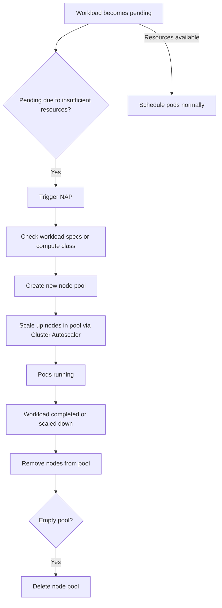

# Session 107: Node Auto Provisioning in GKE GCP

## Table of Contents

- [Overview](#overview)
- [How Node Auto Provisioning Works](#how-node-auto-provisioning-works)
- [Workload Level vs Cluster Level NAP](#workload-level-vs-cluster-level-nap)
- [Requirements and Versions](#requirements-and-versions)
- [Resource Limits](#resource-limits)
- [Limitations](#limitations)
- [Demo: Using Compute Classes for Auto-Creation](#demo-using-compute-classes-for-auto-creation)
- [Demo: Enabling Cluster Level NAP](#demo-enabling-cluster-level-nap)
- [Demo: Resource Limits and Scaling](#demo-resource-limits-and-scaling)
- [Advanced Configurations](#advanced-configurations)
- [Command Line Management](#command-line-management)
- [Disabling NAP](#disabling-nap)

## Overview

Node Auto Provisioning (NAP), also known as Node Pool Autocreation, is an infrastructure autoscaling mechanism in Google Kubernetes Engine (GKE) that automatically creates new node pools to meet the resource requirements of workloads. It serves as an extension of the GKE Cluster Autoscaler, which scales nodes within individual node pools, but NAP goes further by scaling the number of node pools themselves.

### Key Concepts

- **Purpose**: NAP allows GKE to automatically create node pools based on workload specifications, such as machine types or compute classes, and removes them when no longer needed to optimize costs.
- **Benefits**: Eliminates the need for manual node pool creation, ensures workloads have appropriate resources, and reduces overhead by deleting unused node pools.
- **Integration**: Works seamlessly with existing GKE autoscaling features but focuses on dynamic node pool management.

> [!NOTE]
> NAP is designed to prevent the persistence of empty node pools, unlike Cluster Autoscaler which can maintain minimum node counts.

### Key Concepts/Deep Dive

NAP operates by monitoring pending workloads and triggering the creation of new node pools if existing resources cannot satisfy the demands. It integrates with GKE's Cluster Autoscaler to handle both node count scaling within pools and pool creation/deletion.

```
diff
+ Extension of Cluster Autoscaler
+ Creates new node pools for unmet workload requirements
+ Deletes unused node pools automatically
- Does not set minimum nodes per auto-created pool
- Requires resource limits for cluster-level NAP
```

GKE automatically handles node pool updates, metadata creation, and resource allocation for auto-created pools. However, it cannot delete pools if they would violate minimum node settings, as this defeats the cost-saving purpose.

Mermaid diagram illustrating the process:



### Code/Config Blocks

While NAP is primarily configured via GKE APIs or console, here's an example of a basic deployment that might trigger NAP (note: trigger depends on resource availability):

```yaml
apiVersion: apps/v1
kind: Deployment
metadata:
  name: nginx-deployment
spec:
  replicas: 3
  selector:
    matchLabels:
      app: nginx
  template:
    metadata:
      labels:
        app: nginx
    spec:
      containers:
      - name: nginx
        image: nginx:1.21
        ports:
        - containerPort: 80
      nodeSelector:
        cloud.google.com/gce-instance-accelerator: nvidia-tesla-k80
        failure-domain.beta.kubernetes.io/region: us-central1
```

> [!CAUTION]
> Node selectors can conflict with NAP; use compute classes for better integration.

## How Node Auto Provisioning Works

NAP monitors for pending pods (workloads) that cannot be scheduled due to resource constraints. When detected, it creates new node pools matching the specified requirements, such as machine types or compute classes, and scales them in using the Cluster Autoscaler.

### Key Concepts/Deep Dive

- **Trigger Conditions**: Only pending workloads trigger pool creation; no resource limits are required for workload-level NAP, but they are mandatory for cluster-level.
- **Pool Management**: GKE creates pools in specified locations, using the defined machine families (e.g., N4, then N2 if unavailable). Pools are deleted when empty and no longer needed, freeing up resources.
- **User Controlled**: You define hardware requirements via compute classes or node selectors; GKE handles the rest.

```
diff
+ Monitors pending pods as triggers
+ Creates pools based on compute class specs
+ Integrates with Cluster Autoscaler for node scaling
- Cannot delete pools if min nodes > 0 is set
- Resource limits apply to the entire cluster
```

The process follows a linear sequence: Pending workload → Evaluate specs → Create pool → Scale nodes → Delete pool when empty.

### Code/Config Blocks

Example compute class specification:

```yaml
apiVersion: container.googleapis.com/v1
kind: ComputeClass
metadata:
  name: n4-compute-class
  namespace: default
spec:
  nodeType: n4
  location: us-central1-b
  machineFamily: n4
  fallbackMachineFamilies:
  - n2
  imageType: COS_CONTAINERD
  minCpuPlatform: Intel Broadwell
  secureBoot: ENABLED
  nodePoolAutoCreation:
    enabled: true
    nodeSelectorProfiles:
    - selectors:
        nodeSelector:
          cloud.google.com/compute-class: n4
  resourceLimits:
    maxCpu: 20
    maxMemory: "40Gi"
```

This configuration enables NAP for the compute class, allowing automatic pool creation.

## Workload Level vs Cluster Level NAP

There are two primary methods for enabling NAP: workload-level (recommended) and cluster-level (legacy).

### Key Concepts/Deep Dive

- **Workload Level**: Uses compute classes to define node requirements. Automatic scaling occurs for specific workloads without cluster-wide resource limits. Recommended for modern GKE versions (1.33.3+).
- **Cluster Level**: Enables NAP cluster-wide; resource limits are required. Applies to all workloads, not just those using compute classes. Suitable for older clusters or when broad control is needed.

| Aspect | Workload Level | Cluster Level |
|--------|----------------|---------------|
| **Trigger** | Workloads using compute classes | Any pending workload |
| **Resource Limits** | Not required | Mandatory (CPU, memory, etc.) |
| **Scope** | Selective (compute class-based) | Cluster-wide |
| **Recommended For** | New implementations | Legacy systems |
| **Version Requirements** | 1.33.3+ for no cluster enablement | Lower versions |

Workload-level is more granular and aligned with GKE best practices, while cluster-level provides broader, less precise control.

```
diff
+ Workload Level: Precise, modern approach
+ Cluster Level: Broad, legacy compatibility
- Cluster Level: Requires limits on all resources
- Workload Level: Limited to compute class workloads in older versions
```

> [!TIP]
> Migrate to workload-level as it's the future of NAP and simplifies management.

## Requirements and Versions

NAP behavior varies by GKE version, especially for workload-level implementation.

### Key Concepts/Deep Dive

- **Workload Level**: For versions 1.33.3+, compute classes enable NAP without cluster-wide enablement.
- **Cluster Level**: Required for versions <1.33.3 or when enabling NAP across the entire cluster.
- **Compute Classes**: Available in 1.33.3+ but previously required cluster-level NAP.

Version-specific requirements:

- **1.33.3+**: Workload-level NAP with compute classes; no cluster enablement needed.
- **<1.33.3**: Cluster-level NAP mandatory for any auto-provisioning.

GKE recommends upgrading to support workload-level NAP.

### Code/Config Blocks

Enabling NAP in approaches to a cluster via CLI:

```bash
gcloud container clusters update my-cluster \
  --enable-autoprovisioning \
  --autoprovisioning-config-file=config.yaml \
  --zone=us-central1-a
```

For compute classes:

```yaml
apiVersion: container.googleapis.com/v1
kind: ComputeClass
metadata:
  name: example-class
spec:
  nodePoolAutoCreation:
    enabled: true  # Requires GKE 1.33.3+
```

## Resource Limits

Cluster-level NAP mandates resource limits to prevent over-provisioning; these apply to all node pools' capacity.

### Key Concepts/Deep Dive

- **Purpose**: Ensures cluster resources don't exceed limits, integrating manual and auto-created pools.
- **Scope**: Covers CPU, memory, GPU, DPU for the entire cluster.
- **Behavior**: NAP won't create new pools if limits would be violated (e.g., adding a pool that uses CPU beyond max).
- **Workload Level**: Not required; limits are implicit via compute classes.

Example: Max CPU: 20, max memory: 40GB. If the cluster uses 20 CPU, no new pools are created unless capacity is freed.

```
diff
+ Prevents resource over-allocation
+ Applies to all node pools
+ Mandatory for cluster-level NAP
- Can block scaling if limits are restrictive
! Check current usage before setting limits
```

Configuring limits via console or YAML.

### Code/Config Blocks

Resource limits configuration (for cluster update):

```yaml
resourceLimits:
- resourceType: cpu
  minimum: 2
  maximum: 10
- resourceType: memory
  minimum: "2Gi"
  maximum: "16Gi"
```

## Limitations

NAP shares limitations with Cluster Autoscaler and has specific constraints.

### Key Concepts/Deep Dive

- **Shared Limitations**: Latency during scaling (especially >200 node pools), restrictions on spot VM pools, and incompatibility with certain upgrades (e.g., surge upgrades, secure boot via compute classes).
- **NAP-Specific**: Cannot delete pools with min nodes >0; resource limits block over-provisioning; no support for node affinity or pod anti-affinity in auto-created pools.
- **Performance**: Scaling can be slower with many node pools; extensive delay in deletion (10-15 minutes).

Table of key limitations:

| Limitation | Description | Impact |
|------------|-------------|--------|
| Node Pool Count | >200 pools cause latency | Slower autoscaling |
| Upgrades | Surge/blue-green not supported | Use rolling upgrades |
| Deletes | Min nodes >0 prevents shutdowns | Higher costs |
| Compatibility | Spot VMs, certain boot options limited | Restricted configurations |

> [!WARNING]
> Avoid setting min nodes to enable pool deletion and cost savings.

## Demo: Using Compute Classes for Auto-Creation

Create a cluster without NAP enabled, deploy workloads with compute classes, and observe auto-creation.

### Key Concepts/Deep Dive

1. **Create Cluster**: Use GKE 1.33.3+ for auto-provisioning without cluster enablement.
2. **Define Compute Class**: Specify machine types, locations, and auto-creation settings.
3. **Deploy Workload**: Use node selectors matching the compute class.
4. **Observe**: GKE creates node pools automatically (e.g., N4 standard-2).

Process: Deploy → Pending → NAP Trigger → Pool Creation.

### Code/Config Blocks

Compute class:

```yaml
apiVersion: container.googleapis.com/v1
kind: ComputeClass
metadata:
  name: n4-class
spec:
  location: us-central1-b
  nodeType:
    machineType: n4-standard-2
  nodePoolAutoCreation:
    enabled: true
  priorityAndFallback:
    ranking:
    - machineFamily: n4
    - machineFamily: n2
  whenUnsatisfiable: DoNotScaleUp
```

Deployment:

```yaml
apiVersion: apps/v1
kind: Deployment
metadata:
  name: hello-web
spec:
  replicas: 1
  selector:
    matchLabels:
      app: hello-web
  template:
    metadata:
      labels:
        app: hello-web
    spec:
      containers:
      - name: nginx
        image: nginx
      nodeSelector:
        cloud.google.com/compute-class: n4
```

Execution:

```bash
kubectl apply -f compute-class.yaml
kubectl apply -f deployment.yaml
kubectl get pods  # Initially pending, then running after pool creation
```

Monitor via console for new node pools.

> [!NOTE]
> This demonstrates NAP triggering from compute class usage without cluster-level enablement.

## Demo: Enabling Cluster Level NAP

Demonstrate enabling NAP at cluster level, allowing auto-creation for any pending workload.

### Key Concepts/Deep Dive

1. **Create Cluster**: Use older version (<1.33.3) or enable explicitly.
2. **Enable NAP**: Via console or CLI with resource limits.
3. **Deploy Workload**: Pending pods trigger pool creation.
4. **Observe Scaling**: New pools added, CPU/memory limits enforced.

### Code/Config Blocks

Enable via CLI:

```bash
gcloud container clusters update my-cluster \
  --enable-autoprovisioning \
  --min-cpu 2 --max-cpu 10 \
  --min-memory 2 --max-memory 16 \
  --zone us-central1-a
```

Deployment example (triggers NAP if resources insufficient):

```yaml
apiVersion: apps/v1
kind: Deployment
metadata:
  name: nginx-deploy
  replicas: 8  # Scale to trigger pending state
spec:
  template:
    spec:
      containers:
      - name: nginx
        image: nginx
```

Commands to scale and monitor:

```bash
kubectl scale deployment nginx-deploy --replicas=8
kubectl get pods  # Some pending
# GKE auto-creates pools
kubectl get nodes  # New nodes appear
```

> [!TIP]
> Use optimize utilization profile for faster scaling (5-6 minutes vs. 15 minutes with balance).

## Demo: Resource Limits and Scaling

Show how resource limits prevent over-scaling and trigger deletion.

### Key Concepts/Deep Dive

1. **Set Limits**: Max memory 16GB, current usage at limit.
2. **Deploy Workload**: Requires more resources → NAP blocked.
3. **Free Resources**: Delete old deployment → Pool deleted → NAP proceeds.

Linear flow: Limits exceeded → Scale-up blocked → Resource freed → New pool created.

### Code/Config Blocks

Example limits scenario:

- Current cluster: 16GB max memory, 16GB used.

Command to delete deployment:

```bash
kubectl delete deployment nginx-deploy
```

Monitor:

```bash
kubectl get nodepools  # Old pool deleting, new one creating
gcloud compute instances list  # Instances reflect changes
```

> [!CAUTION]
> Ensure limits don't block necessary scaling; adjust as needed.

## Advanced Configurations

Node selectors, machine types, and manual node pools.

### Key Concepts/Deep Dive

- **Node Selectors**: Direct specs in pods for machine types or taints.
- **Compute Classes**: Advanced specs with fallbacks, priorities.
- **Manual Node Pools**: Add to NAP management via CLI.

Comparison:

```diff
+ Compute Classes: Centralized, recommended
- Node Selectors: Prone to conflicts, less flexible
! Use compute classes for production
```

### Code/Config Blocks

Example with node selector and tolerations:

```yaml
apiVersion: apps/v1
kind: Deployment
spec:
  template:
    spec:
      containers:
      - name: nginx
        image: nginx
      nodeSelector:
        cloud.google.com/gce-instance-accelerator: nvidia-tesla-k80
      tolerations:
      - key: cloud.google.com/gce-spot
        operator: Equal
        value: "true"
        effect: NoSchedule
```

Update manual node pool for NAP:

```bash
gcloud container node-pools update my-pool \
  --cluster my-cluster \
  --enable-autoprovisioning \
  --zone us-central1-a
```

## Command Line Management

CLI alternatives for console actions.

### Key Concepts/Deep Dive

- **Cluster Update**: Enable NAP with limits, locations, strategies.
- **Node Pool Update**: Add manual pools to NAP.

### Code/Config Blocks

Full cluster update:

```bash
gcloud container clusters update my-cluster \
  --enable-autoprovisioning \
  --autoprovisioning-config-file=config.yaml \
  --autoscaling-profile optimize-utilization
```

Config file (resource.yaml):

```yaml
resourceLimits:
- resourceType: cpu
  minimum: 2
  maximum: 10
- resourceType: memory
  minimum: "2Gi"
  maximum: "18Gi"
autoprovisioningLocations:
- us-central1-b
```

> [!NOTE]
> CLI changes are fast; console updates may take 10-15 minutes.

## Disabling NAP

Remove NAP for manual control.

### Key Concepts/Deep Dive

- **Cluster Level**: Disable via console/CLI; auto-created pools become unmanaged.
- **Re-Enabling**: Manually re-add pools.
- **Impact**: Stops auto-scaling; existing pools remain but unmanaged.

```diff
+ Disables auto-creation and deletion
- Auto-created pools no longer managed
! Manually handle scaling after disable
```

### Code/Config Blocks

Disable via CLI:

```bash
gcloud container clusters update my-cluster \
  --disable-autoprovisioning
```

## Summary

### Key Takeaways

```diff
+ NAP extends Cluster Autoscaler for node pool management, optimizing costs by deleting unused pools.
+ Workload-level (compute classes) is recommended over cluster-level for granularity and modernity.
+ Resource limits are critical for cluster-level NAP to prevent over-provisioning.
+ Use GKE 1.33.3+ for seamless compute class-based auto-provisioning.
- Avoid setting min nodes >0 to enable pool deletion.
- Older versions require cluster enablement for any NAP functionality.
```

### Expert Insight

**Real-world Application**: In production, NAP ensures high availability for variable workloads like ML training or web apps, scaling node pools for specific GPU requirements while keeping costs down by removing idle resources.

**Expert Path**: Master compute classes by defining organization-wide machine type policies and fallbacks. Experiment with resource limits in staging clusters, monitor with GKE metrics, and integrate with CI/CD for automated deployments triggering NAP.

**Common Pitfalls**: 
- Setting overly restrictive resource limits blocks scaling, causing prolonged pending states—monitor usage and adjust proactively.
- Misusing node selectors instead of compute classes leads to scheduling conflicts and inefficiencies—always prefer compute classes for consistency.
- Forgetting to re-enable NAP on manual pools after cluster re-enable leaves them unmanaged, potentially causing resource waste or failures—regular audits prevent this.

*Lesser Known Things*: NAP can interact unexpectedly with spot VMs or preemptible instances, where pool deletion might occur during price surges; use "whenUnsatisfiable: DoNotScaleUp" in compute classes to wait for preferred machines instead of falling back immediately, ensuring workload quality over speed. Additionally, NAP's deletion delays (often 10-15 minutes) can be mitigated by using custom alerts for prolonged empty pools, allowing manual intervention if needed.
