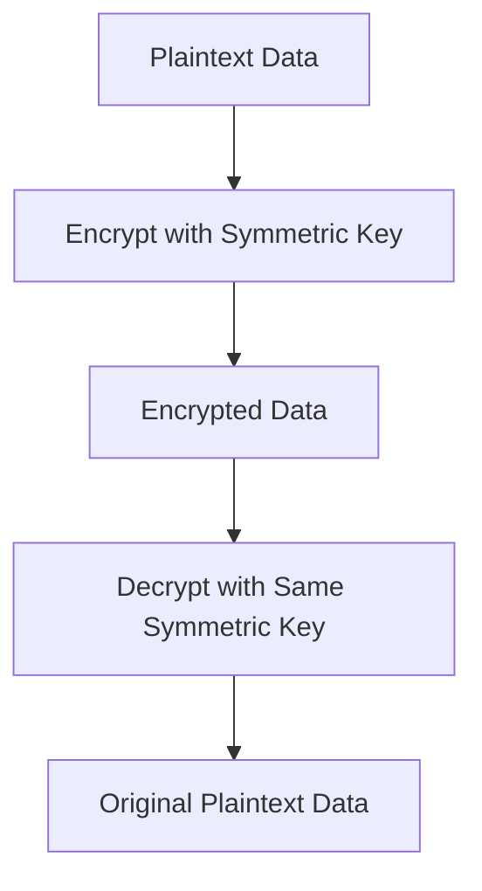

# Session 1: Cloud KMS Symmetric Encryption in Google Cloud (Part 1)

## Table of Contents
- [Introduction to Cloud Key Management Service (KMS)](#introduction-to-cloud-key-management-service-kms)
- [Types of Encryption in Google Cloud](#types-of-encryption-in-google-cloud)
- [Customer Managed Encryption Keys (CMEK)](#customer-managed-encryption-keys-cmek)
- [Key Purposes](#key-purposes)
- [Symmetric Encryption Explained](#symmetric-encryption-explained)
- [Cloud KMS Resources](#cloud-kms-resources)
- [Demo: Creating and Using a Symmetric Key](#demo-creating-and-using-a-symmetric-key)
- [Key Rotation and Management](#key-rotation-and-management)
- [Using KMS with Cloud Storage](#using-kms-with-cloud-storage)

## Introduction to Cloud Key Management Service (KMS)

### Overview
Cloud Key Management Service (KMS) is a Google Cloud service that helps you create and manage encryption keys. You can use these keys to encrypt data in Google Cloud services or in your own applications. KMS supports generating keys through software or hardware (HSM), importing existing keys from on-premises environments, and integrating with external key management systems.

### Key Concepts/Deep Dive
- **Generate keys**: You can create software keys or hardware-backed keys (HSM) for enhanced security.
- **Import keys**: Bring in your own keys from on-premises systems.
- **External integration**: Attach GCP to external key management vendors.
- **Supported services**: Use KMS with Google products like Cloud Storage, BigQuery, Compute Engine.
- **Additional features**: Create or verify signatures, message authentication codes (MAC).

## Types of Encryption in Google Cloud

### Overview
Google Cloud provides two main types of encryption: Google-managed default encryption and customer-managed encryption keys (CMEK). These ensure data protection with varying levels of control.

### Key Concepts/Deep Dive
- **Default encryption**:
  - Automatically encrypts stored data in Google Cloud services.
  - No configuration required by users.
  - Uses FIPS 140-2 Level 1 compliant cryptography modules.
  - Suitable when no specific higher-level protection requirements exist.
  - Meets basic encryption needs at rest.

- **Customer Managed Encryption Keys (CMEK)**:
  - Allows full control over encryption keys.
  - Keys are managed by the user.
  - Provides additional protection compared to default encryption.

### Common Encryption Levels
| Level | Description | Compliance |
|-------|-------------|------------|
| 1 | Basic software cryptography | FIPS 140-2 Level 1 |
| 2 | Enhanced software cryptography | FIPS 140-2 Level 2 |
| 3 | Hardware-based (HSM) | FIPS 140-2 Level 3 |
| 4 | Advanced hardware security | FIPS 140-2 Level 4 |

```diff
+ Google default encryption: Automatic, cost-effective for basic needs.
- Google default encryption: Limited control over key management.
! Important: Choose HSM for high-security environments (higher cost).
```

## Customer Managed Encryption Keys (CMEK)

### Overview
CMEK offers four options for key management, each with different security levels and costs. This gives organizations flexibility based on their compliance and security requirements.

### Key Concepts/Deep Dive
1. **Software keys** (GOOGLE_SYMMETRIC_ENCRYPTION):
   - Generated in Cloud KMS.
   - Usable across all Google Cloud regions.
   - Supports symmetric and asymmetric keys.
   - Optional automatic rotation (e.g., every 10-90 days).
   - FIPS 140-2 Level 1 validated cryptography.

2. **Imported software keys**:
   - Import existing software keys from on-premises systems.
   - Provides continuity for existing key infrastructure.

3. **Hardware Security Module (HSM) keys** (Cloud HSM):
   - Keys generated in dedicated HSM hardware at Google Cloud locations.
   - FIPS 140-2 Level 3 compliant.
   - Physical security for high-value data.
   - Significantly more expensive than software keys.

4. **External keys** (Cloud EKM):
   - Connect to external key management services.
   - Supports integration with third-party vendors.
   - Options: Internet-based (public traffic) or VPC-based (private network).
   - Enables hybrid key management strategies.

> [!IMPORTANT]
> Consider costs when choosing key types. Software keys are inexpensive, while HSM keys can be costly. Evaluate based on your security requirements and budget.

## Key Purposes

### Overview
When creating keys in Cloud KMS, you must specify a purpose that defines how the key can be used. This ensures keys are created with the appropriate algorithms and permissions.

### Key Concepts/Deep Dive
- **Symmetric encrypt/decrypt**: Use the same key for both encryption and decryption.
- **Raw symmetric**: Advanced symmetric operations.
- **Asymmetric signing**: Uses public/private key pairs for signature creation and verification.
- **Asymmetric decrypt**: Uses asymmetric keys for encryption/decryption processes.
- **MAC signing/verification**: For message authentication codes.

### Supported Algorithms by Purpose
| Purpose | Supported Algorithms |
|---------|---------------------|
| Symmetric encrypt/decrypt | GOOGLE_SYMMETRIC_ENCRYPTION (fixed) |
| Raw symmetric | Multiple AES-based algorithms available |
| Asymmetric signing | Multiple RSA/ECDSA algorithms |
| Asymmetric decrypt | Multiple RSA/EC algorithms |
| MAC signing/verification | Multiple HMAC algorithms |

> [!NOTE]
> Purpose cannot be changed after key creation. Choose carefully based on your use case.

## Symmetric Encryption Explained

### Overview
Symmetric encryption uses a single key for both encrypting and decrypting data. This key must be shared securely between sender and recipient, making it ideal for scenarios where both parties need access to the same secret.

### Key Concepts/Deep Dive
- **Same key principle**: One key handles both encryption and decryption.
- **Use cases**: Data storage in Cloud Storage, communication between trusted parties.
- **Process flow**:
  1. Plaintext data is encrypted using the symmetric key.
  2. The recipient uses the same key to decrypt back to plaintext.



> [!TIP]
> Ensure the secret key remains confidential. Both sender and recipient must securely share and protect the key.

## Cloud KMS Resources

### Overview
Cloud KMS organizes keys in a hierarchical structure for better management and security. Understanding these resources is crucial for proper key administration.

### Key Concepts/Deep Dive
1. **Key Rings**:
   - Container for organizing keys.
   - Similar to a keyholder in your home.
   - Can contain multiple keys for different purposes/services.

2. **Keys**:
   - Individual encryption keys within a keyring.
   - Each key has one or more versions.
   - Supports rotation for security.

3. **Versions**:
   - Specific instances of a key.
   - Symmetric keys support multiple versions (for rotation).
   - Primary version is active; others can be used for decrypting old data.

4. **Algorithm**:
   - Defines the cryptographic algorithm (e.g., AES-256).
   - Chosen during key creation.

5. **Purpose**:
   - Defines how the key can be used (as discussed above).

6. **Primary Version**:
   - Active version for encryption/decryption.
   - Updated during rotation.

7. **State**:
   - Enabled: Key is usable.
   - Disabled: Temporarily unusable.
   - Scheduled for destruction: Waiting for deletion.
   - Destroyed: Permanently unusable.

### Key Management Workflow
```diff
+ Key Creation: Define purpose, algorithm, and protection level
+ Key Usage: Encrypt/decrypt data based on purpose
- Key Rotation: Plan for regular key updates to maintain security
! Warning: Destroying keys can lead to permanent data loss
```

> [!IMPORTANT]
> Key resources are region-specific (except global). Choose locations based on your data residency and latency requirements.

## Demo: Creating and Using a Symmetric Key

### Overview
This lab demonstrates creating a symmetric key in Cloud KMS and using it to encrypt/decrypt data via CLI. Follow these steps to practice hands-on.

### Lab Demos

#### Step 1: Create a Key Ring
1. Navigate to the Google Cloud Console > Cloud KMS.
2. Click "Create Key Ring".
3. Enter keyring name: `my-demo-ring`.
4. Select location: `asia-south1` (or your preferred region for lower latency).
5. Click "Create".

#### Step 2: Create a Symmetric Key
1. In the keyring, click "Create Key".
2. Enter key name: `my-symmetric-key`.
3. Select protection level: **Software** (for cost-effectiveness).
4. Choose purpose: **Symmetric encrypt/decrypt**.
5. Set rotation: Never (or choose automatic every 30 days).
6. Leave destruction settings as default (1-30 days).
7. Add optional labels if needed.
8. Click "Create".

#### Step 3: Encrypt Data via CLI
Prepare a plaintext file (e.g., `test.txt` with sample content).

```bash
gcloud kms encrypt \
  --key my-symmetric-key \
  --keyring my-demo-ring \
  --location asia-south1 \
  --plaintext-file test.txt \
  --ciphertext-file encrypt.txt
```

This creates an encrypted file `encrypt.txt`.

#### Step 4: Decrypt Data via CLI
To decrypt the data back to plaintext:

```bash
gcloud kms decrypt \
  --key my-symmetric-key \
  --keyring my-demo-ring \
  --location asia-south1 \
  --ciphertext-file encrypt.txt \
  --plaintext-file decrypt.txt
```

Verify `decrypt.txt` matches the original `test.txt`.

#### Step 5: Key Rotation
1. In the key details, click "Rotate Key".
2. A new version becomes primary.
3. Old versions can still decrypt existing data.
4. Test by encrypting/decrypting with new version.

#### Step 6: Key State Management
- **Disable**: Click "Disable" (takes ~3 hours to complete).
- **Destroy**: Click "Schedule destruction" (wait 1-30 days).
- **Restore**: If needed, restore within the destruction period.
- **Re-enable**: Enable disabled keys for use.

> [!WARNING]
> Destroyscheduled keys will permanently lose data access. Always test decryption before destroying.

## Key Rotation and Management

### Overview
Key rotation enhances security by creating new key versions periodically. This limits the impact of potential key compromises while maintaining data accessibility.

### Key Concepts/Deep Dive
- **Automatic rotation**: Set intervals (e.g., 30 days).
- **Manual rotation**: Rotate immediately via console/CLI.
- **Version management**:
  - New version becomes primary.
  - Old versions used for decrypting existing data.
  - Encrypted data with old versions remains accessible until re-encryption.

- **Destruction process**:
  1. Scheduled for destruction: Wait 1-30 days (current default: 1 day).
  2. Check for any dependency issues.
  3. Final deletion: Permanent and irreversible.

- **Best practices**:
  - Disable keys before destruction to monitor impact.
  - Regularly rotate keys (e.g., every 90 days per policy).
  - Use multiple keys for segmented data protection.

```diff
+ Benefits: Reduces exposure from compromised keys
- Risks: Improper destruction leads to data loss
! Rule: Never delete keys without verifying data accessibility
```

> [!NOTE]
> Symmetric keys support rotation; asymmetric keys require explicit version specification for operations.

## Using KMS with Cloud Storage

### Overview
Integrate Cloud KMS with Cloud Storage to use CMEK for bucket encryption. This provides controlled data protection in storage.

### Lab Demos

#### Step 1: Create Cloud Storage Bucket with CMEK
1. Go to Cloud Storage > Buckets > Create.
2. Enter bucket name.
3. In "Data encryption", select "Customer-managed key".
4. Choose existing key (e.g., `my-symmetric-key`).
5. Grant required permissions if prompted.
6. Click "Create".

#### Step 2: Upload Encrypted File
1. Upload a file (e.g., `kms.txt`) to the bucket.
2. Upload succeeds if key is enabled.

#### Step 3: Test Key Impact
1. Disable or schedule destruction of the key.
2. Try to download the file: Access denied if key unusable.
3. Restore/enable the key to regain access.

## Summary

### Key Takeaways
```diff
+ Cloud KMS enables centralized key management for encryption
+ Symmetric keys use one key for encrypt/decrypt operations
+ Key rotation improves security without data loss
+ HSM keys offer higher security but at greater cost
+ Always test key changes before production deployment

- Destroying keys leads to permanent data loss
- Poor key sharing practices compromise encryption
- Overlooks costs can escalate budgets significantly

! Critical: Plan key lifecycles carefully to avoid data access issues
```

### Expert Insights
#### Real-world Application
In production, use Cloud KMS for:
- Encrypting sensitive data in BigQuery datasets
- Protecting VM disks in Compute Engine instances
- Securing Cloud Storage buckets with CMEK
- Integrating with external key managers for compliance

#### Expert Path
- Master FIPS 140-2 compliance requirements for your industry
- Implement automated key rotation workflows using Cloud Scheduler
- Design multi-region key architectures for high availability
- Study AWS KMS equivalents for cross-cloud strategies

#### Common Pitfalls
- **Premature key destruction**: Always decrypt and re-encrypt data with new keys before destroying old ones.
- **Unencrypted key sharing**: Never transmit keys over insecure channels; use Cloud IAM for access control.
- **Over-relying on default encryption**: Implement CMEK for sensitive workloads to maintain SOC 2 compliance.
- **Neglecting key versions**: Failing to manage versions can result in data decryption failures after rotation.

#### Common Issues with Resolution
- **"Key is disabled" error**: Enable the key via console or CLI to resume operations.
- **"Key in destruction state"**: Use `gcloud kms versions restore` if within the grace period (1-30 days).
- **Permission denied with CMEK**: Ensure service account has `roles/cloudkms.cryptoKeyEncrypterDecrypter`.
- **Latency issues**: Choose region-specific keyrings instead of global for lower latency.

### Corrections Made in Transcript
Several typos and misspellings were corrected for accuracy:
- "sematic" → "symmetric" (multiple instances)
- "rece print" → "recipient"
- "secrete" → "secret"
- "heapring" → "keyring"
- "regon" → "region"
- "cyer" → "cipher"
- "encrypted by this person" → "version"
- "decription" → "decryption"
- "duration of scheduled detection" → "destruction"
- "softward" → "software"
- "as of now we have five purpose symetric encrypt decrypt raw symmetric asymmetric sign asymmetric decrypt Max signning verification" → corrected to clear list
- "IMS am roles" → "IAM roles"
- Various timing and flow clarifications for better readability.
