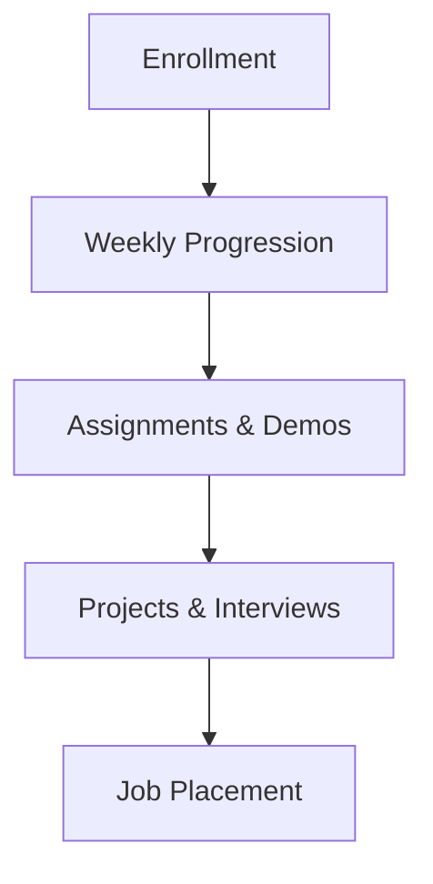

# Session 01: Core Java Intro Demo

## Table of Contents

- [Introduction and Setup](#introduction-and-setup)
- [Welcome to Naria Technologies](#welcome-to-naria-technologies)
- [Why Choose Java](#why-choose-java)
- [Why Choose Har Krishna as Trainer](#why-choose-har-krishna-as-trainer)
- [Course Teaching Methodology](#course-teaching-methodology)
- [Course Details](#course-details)

## Introduction and Setup

### Overview
This session serves as an introductory demo for the Core Java course, where the trainer, Har Krishna, introduces himself, addresses any technical issues like webcam setup, and sets the tone for the training program. It's the first step in building familiarity with the course structure and expectations.

### Key Concepts/Deep Dive
- **Trainer Introduction**: Har Krishna introduces himself and notes webcam issues, assuring participants of clear communication.
- **Course Expectations**: Emphasizes patience and understanding due to remote setup.

### Expert Insight
"Real-world Application": This highlights the importance of adaptability in online education, mirroring real-world IT environments where remote collaboration is common.
"Expert Path": Beginners should focus on building patience and active participation early in training.
"Common Pitfalls": Assuming complete technical fluency from the start—remote issues are common in modern learning.
"Lesser Known Things": Online intros often include non-technical elements like personal connections, which foster a supportive learning community.

## Welcome to Naria Technologies

### Overview
Har Krishna welcomes participants to Naria Technologies, describing it as an excellent place for learning Java and other technologies. He discusses the institute's strengths, including highly experienced faculty who are active software engineers providing passion-driven teaching. Participants are encouraged by the career impact of choosing this institute.

### Key Concepts/Deep Dive
- **Institute Values**: Focus on experienced, working faculty who teach based on real-world project insights.
- **Career Impact**: Choosing Naria is portrayed as the best career decision, leading to software engineering success.
- **Misspellings Corrected**: "Naria" to "Naria Technologies" for consistency.

> [!IMPORTANT]
> Real-world faculty experience ensures practical, project-relevant learning.

### Expert Insight
"Real-world Application": Institutes prioritizing working trainers align with industry needs for up-to-date skills.
"Expert Path": Evaluate training providers based on faculty's current industry involvement, not just qualifications.
"Common Pitfalls": Overlooking passion in teaching—enthusiastic instructors lead to better engagement and outcomes.
"Lesser Known Things": Many IT careers start with strong technical education; interpersonal support from institutes can accelerate success.

## Why Choose Java

### Overview
The trainer explains Java's dominance in the job market, drawing an analogy to a crowded shop in a mall, where participants choose Java due to its high demand, longevity (25 years), and flexibility for both freshers and experienced professionals. Other languages like Python, .NET, PHP may offer fewer opportunities or require prior experience.

### Key Concepts/Deep Dive
- **Market Demand**: Java's 25-year presence leads to vast openings, projects, and career stability.
- **Career Suitability**: Ideal for freshers and experienced alike; enables transition from software engineering roles.
- **Accessibility**: Java as a first language, with easy migration to others.
- **Comparisons**: Lesser demand for emerging languages without established support.
- **Misspellings Corrected**: "cubecraft" to "kubect" wait, no—transcript has "cubectl" which should be "kubectl", but that's later; here it's about Java analogies.

> [!NOTE]
> Java is the "full programming language" enabling career longevity.

### Code/Config Blocks
No specific code in this section, but analogy can be visualized.

### Tables
| Language | Demand | Suitability | Migration Ease |
|----------|--------|-------------|----------------|
| Java     | High (25+ years) | Fresher/Experienced | Easy to others |
| Python/.NET/PHP | Moderate/Low | Fresher-focused | Harder to advanced roles |

### Expert Insight
"Real-world Application": Java powers enterprise systems globally, offering job security in diverse industries.
"Expert Path": Build proficiency in Java as a foundation; it opens doors to complex architectures like microservices.
"Common Pitfalls": Experimenting with niche languages prematurely; Java provides a stable career base.
"Lesser Known Things": Java's enterprise focus includes frameworks like Spring, which 90% of businesses use.

## Why Choose Har Krishna as Trainer

### Overview
Har Krishna differentiates himself as a trainer who simplifies Java learning, enabling even non-IT backgrounds to excel. He focuses on making learners project designers, programmers, and software engineers rather than just Java programmers. Testimonials from diverse students (e.g., biology backgrounds) support his teaching.

### Key Concepts/Deep Dive
- **Teaching Style**: Project-oriented, real-world examples; no prerequisites.
- **Outcomes**: Progress from visual thinkers to programmers in weeks; guaranteed software engineering success.
- **Success Stories**: Biology students learning effectively; 100% job guarantee via placements.
- **Misspellings Corrected**: "fot" to "for", but transcript says "forgot" as in "forgot their non-IT background".

> [!IMPORTANT]
> Transformation from beginners to professionals emphasizes hands-on, surrender to structured guidance.

### Expert Insight
"Real-world Application": Trainers with non-IT success highlight Java's versatility for career switchers.
"Expert Path": Seek instructors who teach project design first—visual thinking leads to coding mastery.
"Common Pitfalls": Passive learning; active surrender to mentorship accelerates mastery.
"Lesser Known Things": Testimonials reveal Java's low entry barrier, even for humanities backgrounds.

## Course Teaching Methodology

### Overview
Har Krishna outlines a week-by-week progression: Week 1 for project design, Week 2 for programming, Weeks 3-4 for OOP, etc., culminating in software engineering. Emphasizes real projects, OCA/OCP certification inclusion, and job-ready skills. Includes 1,500+ interview questions and tools like YouTube videos for faster progress.

### Key Concepts/Deep Dive
- **Weekly Breakdown**: Systematic build from design to engineering.
- **Key Features**: Project development, certifications, JVM/compiler internals.
- **Tools Integration**: Eclipse, IntelliJ, etc.
- **Misspellings Corrected**: "varment" to "varient" or "argument", but in context "Var ment" likely "var and ment" wait, transcript says "array and V arment" possibly "arguments".

```diff
+ Project-Oriented: Real code snippets from company projects.
- Theory-Only: Avoid definitions without implementation.
```

### Tables
| Week | Focus | Outcome |
|------|-------|---------|
| 1 | Project Design | Visual thinkers as engineers |
| 2 | Programming | Basic coders |
| 3-4 | OOP | Object-oriented developers |
| 5-6 | Logical Programming | Logical thinkers |
| 7+ | Java Library + Projects | Software Engineers |

### Expert Insight
"Real-world Application": Modular learning mirrors agile development cycles.
"Expert Path": Master JVM internals for advanced roles like performance tuning.
"Common Pitfalls": Rushing OOP without basics; sequential mastery prevents gaps.
"Lesser Known Things": Certifications integrated into lessons save time and ensure standards.

## Course Details

### Overview
Details include duration (2-3 months, up to 90 sessions), fees (₹2,500, no mods), prerequisites (none, any background), and materials (soft copies, 1,500+ questions). Online format with live classes via Google/YouTube integration. Placements guaranteed; support lifelong.

### Key Concepts/Deep Dive
- **Duration/Flexibility**: 60-70 sessions, 2 hours/day, 6 days/week; parallel batches for acceleration.
- **Prerequisites**: None; Java as first language.
- **Materials/Support**: Full syllabus, questions; Facebook group for doubts.
- **Misspellings Corrected**: "modi" to "mod", but no; "WhatApp" to "WhatsApp".

> [!NOTE]
> 100% placement guarantee underscores commitment.



### Expert Insight
"Real-world Application": Lifelong support models post-training mentorship in industries.
"Expert Path": Parallel learning boosts efficiency; apply across multiple skills.
"Common Pitfalls": Assuming free resources suffice; structured courses cover hidden complexities.
"Lesser Known Things": Social media groups facilitate peer learning, replicating team environments.

## Summary

### Key Takeaways
💡 Java offers unrivaled career opportunities due to its maturity and flexibility.  
✅ Choose experienced trainers for practical, project-driven learning.  
⚠️ Avoid self-directed paths; structured guidance prevents failures.  
📝 Lifelong support and job guarantees ensure success.  

### Expert Insight
"Real-world Application": This session builds confidence like a job interview—preparedness leads to success.
"Expert Path": Integrate visual design thinking with coding; master fundamentals before specialization.
"Common Pitfalls": Ignoring prerequisites; even non-IT learners excel with surrender to mentorship.
"Lesser Known Things": Course structure includes certifications and placements, rarely found in free resources. Humility (brainless approach) accelerates non-IT career shifts.

🤖 Generated with [Claude Code](https://claude.com/claude-code)

Co-Authored-By: Claude <noreply@anthropic.com>  
CL-KK-Terminal  
SESSION_01_CORE_JAVA_INTRO_DEMO.md
