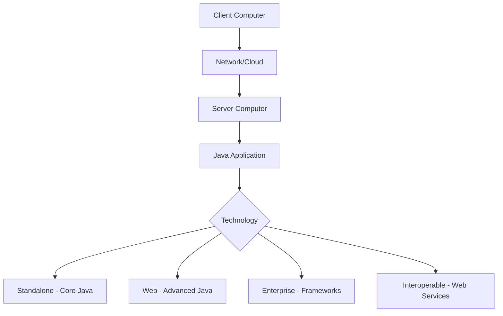

# Session 03: Core Java Intro Demo

## Table of Contents

- [Demo Session Overview](#demo-session-overview)
- [Payment and Enrollment Details](#payment-and-enrollment-details)
- [Course Syllabus and Objectives](#course-syllabus-and-objectives)
- [Course Structure and Prerequisites](#course-structure-and-prerequisites)
- [Different Types of Applications in Java](#different-types-of-applications-in-java)
- [Summary](#summary)

## Demo Session Overview

### Overview
This introductory session provides a high-level overview of the Core Java course, emphasizing its practical application in software engineering. The instructor starts with logistics, then builds a foundational understanding of Java's role in developing various application types, while setting up the student mindset for thinking like a developer, compiler, and project manager.

### Key Concepts/Deep Dive
The session covers the course's philosophy of making students think "like a JVM" for written tests, "like a programmer" for technical rounds, and "like a project developer" for project manager rounds. It introduces the concept of guaranteed job readiness through structured learning paths.

Key points include:
- Guarantee of first interview being the last interview through comprehensive training.
- Emphasis on real-world application development over theoretical knowledge.
- Overview of prerequisite courses: CRT, Core Java, HTML, Advanced Java, Oracle, JavaScript, Advanced Java, Frameworks, Spring, Angular, XML, Web Services, Tools, Design Patterns, Realtime Project.

### Tables
| Concept | Description |
|---------|-------------|
| Demo Class Purpose | Attend without payment to assess teaching quality; payment unlocks materials and full features. |
| Course Duration | 3 months (July 6 - October 6, 2020) |
| Class Timing | 9:00 AM - 11:00 AM (2 hours daily, live, not recorded) |
| Mindset Targets | Day 1: Software Engineer Mindset; Day 2: Career Setup; Day 3: Application Types |

### Code/Config Blocks
```bash
# Example of accessing the course website
go to nar.com
# Click on "New Batches Hyderabad"
# Find Core Java batch details
```

> [!NOTE]
> Materials include 2000+ pages of soft copy notes and interview questions, provided after payment.

## Payment and Enrollment Details

### Overview
The session details enrollment logistics, payment methods, and contact information for the administrator. Emphasis is placed on timely payment and proper documentation for tracking.

### Key Concepts/Deep Dive
Students must contact administrator Mr. Nagababu for payment-related queries. Provide payment screenshots with names in remarks via WhatsApp (9537893593) or email. Bank details are:
- Bank: HDFC
- Account Number: [Redacted for security]
- Branch: Current Account

Accepted payment methods include online banking, UPI (Google Pay/Phone Pay), or direct bank transfer. No demo sessions beyond the initial ones—link changes to exclude non-payers.

After payment, materials access is granted; without payment, services are limited. The course targets fresh graduates (4 months to job-ready) or experienced candidates (up to 8 months).

> [!IMPORTANT]
> Payment must be completed today to access materials. Mention name in remarks for verification.

### Alerts
> [!WARNING]
> Course link changes soon; non-payers will lose access after this session.

## Course Syllabus and Objectives

### Overview
The course focuses on Core Java with project development, covering JDK 14 features, real code snippets, and practical outcomes. It aims to build skills in problem-solving, logical programming, OOP, and project development.

### Key Concepts/Deep Dive
Syllabus includes:
- Java Language Fundamentals
- OOP using Java
- Logical Programming
- Java API/Libraries
- Project Development

Objectives:
- Develop standalone applications initially
- Progress to web, enterprise, and interoperable applications
- Cover 1500+ interview questions (OCA/OCP style)
- Provide chapter-wise project-based case studies
- Enable thinking like compiler, JVM, and project developer
- Integrate with full-stack development (HTML, JS, Angular, Oracle, etc.)

Teaching methodology:
- Project-oriented training
- Real code snippets
- Daily small projects leading to combined ones
- Algorithm-based explanations
- Private YouTube videos for advanced content

### Tables
| Syllabus Component | Focus |
|-------------------|-------|
| Core Java | OOP, APIs, Fundamentals |
| Advanced Java | Web Applications |
| Frameworks (Spring) | Enterprise/Distributed Apps (fast development) |
| XML Web Services | Interoperable Apps |
| Interview Prep | 1500+ coded questions |

### Code/Config Blocks
```java
// Example simple Java program (Addition Demo)
class Addition {
    public static void main(String[] args) {
        int a = 5; // First number
        int b = 3; // Second number
        int sum = a + b; // Result
        System.out.println("Sum: " + sum);
    }
}
```

## Course Structure and Prerequisites

### Overview
The session outlines the learning order and batch options for accelerated completion. Prerequisites are minimal, but parallel learning of related technologies is recommended to save time.

### Key Concepts/Deep Dive
Courses can start in parallel with no prerequisites:
- Core Java + HTML + CRT (start simultaneously)
- Add Advanced Java midway through OOP
- Tools, Design Patterns midway through Advanced Java
- Hibernate, Spring midway through respective courses
- XML Web Services at end
- Realtime Project Development (final phase: 2h content + 6h practice)

Batch options for speed:
- 3 months: One batch (9 AM)
- 2 months: Two batches (9 AM + 6 PM seniors batch)

Daily commitment: Minimum 8 hours across courses.

Freshers: 4 months to job-ready
Experienced: 7-8 months depending on background

### Tables
| Course | Start Time | No Prerequisite? |
|--------|------------|------------------|
| Core Java | Immediate | Yes |
| HTML | Immediate | Yes |
| CRT | Immediate | Yes |
| Oracle | After basics | No (needs basic programming) |
| Advanced Java | Midway Core Java | Partially |

> [!NOTE]
> Parallel learning optimizes time; seniors batch (6 PM) starts for acceleration.

## Different Types of Applications in Java

### Overview
The core of the session explains Java's versatility in application development, using practical examples to differentiate standalone, web, enterprise, and interoperable applications.

### Key Concepts/Deep Dive
- **Standalone Applications**: Run on one computer (e.g., Calculator). Developed using Core Java. Accessible only locally.
- **Web Applications**: Run via internet/browser (e.g., Gmail, bank.net banking). Require Advanced Java. Accessible remotely via URL.
- **Enterprise Applications**: Accessible as standalone, web, or via devices (e.g., ATM, bank with integrations). Require Frameworks (Spring). Perform huge operations across branches/clients.
- **Interoperable Applications**: Connect different language apps (e.g., PHP Facebook accessing Java bank via web services). Use XML/RESTful web services for communication.

Examples:
- PTM (PayTM): Web/Enterprise (integrates with banks via web services).
- Facebook: Web app with integrations (advertisements paid via bank).
- Mobile Apps: Android/Java background using web services for backend integration.
- E-commerce (Flipkart): Enterprise with integrations (payments, shipping).

Architecture layers:
- Frontend: HTML/JS/Angular/React (client-side)
- Middleware: Frameworks/Spring (server-side logic)
- Backend: Java/.NET/PHP/Python (server-side)
- Database: Oracle

### Tables
| Application Type | Access Method | Technology | Example |
|------------------|---------------|------------|---------|
| Standalone | Local machine only | Core Java | Calculator, MS Office |
| Web | Browser/Internet | Advanced Java | nar.com, IRCTC |
| Enterprise | Browser/Device/Integrations | Frameworks (Spring) | Bank apps, Flipkart |
| Interoperable | Language-agnostic via web services | XML/REST Web Services | Facebook-bank integration |

### Code/Config Blocks
```diff
+ Client Request → Node → Kube Proxy → [Routing Logic] → Correct Pod
- Simple app: Local execution only
! Enterprise: Internet + Device access + Integrations
```

### Diagram


## Summary

### Key Takeaways
```diff
+ Core Java enables standalone applications run on single machines
- Web/Enterprise applications require Advanced Java and Frameworks for broader access and integrations
! Guarantee: First interview is last interview through compiler/JVM/project thinker mindset
+ Parallel learning of Core Java/HTML/CRT saves time; no prerequisites needed
- Payment unlocks materials; timely enrollment essential for job readiness (4-8 months)
+ Applications: Standalone (local), Web (internet), Enterprise (multi-access + integrations), Interoperable (cross-language via web services)
```

### Expert Insight

**Real-world Application**: In production environments like banking or e-commerce, Java applications use layered architecture (frontend Angular/React, middleware Spring, backend Java/NodeJS, database Oracle). This enables scalability—e.g., a web banking app handles millions of users via web services, integrating with payment gateways for real-time transactions.

**Expert Path**: Master thinking patterns (compiler for exams, programmer for code, project manager for design). Practice 1500+ interview questions weekly; build small daily projects starting standalone, evolving to web/enterprise. Always prioritize algorithms and real code over theory.

**Common Pitfalls**: Avoid rushing into frameworks without Core Java foundation (leads to poor understanding); prevent feature creep by following learning order; address beginners' confusion between web and enterprise by testing access methods (browser vs. device).

**Lesser Known Things**: Java 14 (latest taught) enhances pattern matching and records; web services enable legacy system integrations (e.g., old COBOL systems via REST); enterprise apps often use RMI/EJB for distributed computing, though rarer now due to Spring dominance.

🤖 Generated with [Claude Code](https://claude.com/claude-code)

Co-Authored-By: Claude <noreply@anthropic.com>
