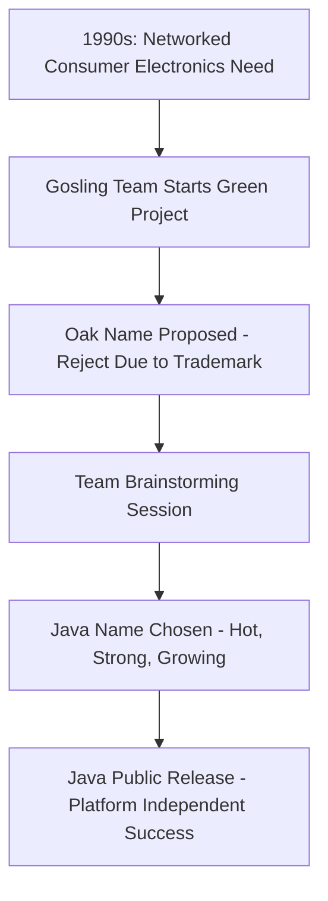

# Session 04: Core Java Introduction

## Table of Contents
- [Target: Becoming a Software Engineer](#becoming-a-software-engineer)
- [Prerequisites for Learning Java](#prerequisites-for-learning-java)
- [What is Java?](#what-is-java)
- [Java History](#java-history)
- [Java Versions and Syllabus](#java-versions-and-syllabus)
- [Enrollment and Course Details](#enrollment-and-course-details)

## Becoming a Software Engineer

### Overview
This session begins by reinforcing the overall learning target set in previous classes: to become a software engineer capable of developing complete projects, not just learning a programming language in isolation. The instructor emphasizes that understanding programming languages alone is insufficient; students must focus on practical project development skills applicable across technologies.

### Key Concepts

#### Mindset Revision
- **Learning Purpose**: Distinguish between learning Java for certification versus developing project skills.
- **Target Skills**: 
  - Problem-solving skills
  - Logical programming skills  
  - Object-oriented programming skills
  - Database programming skills
  - UI programming skills
  - Client-side validation scripts
  - Server-side programming skills

#### Industry Requirements
- **Fresher Requirements**: Learn core Java, advanced Java, CRT (Certification Required Tests), Oracle SQL, HTML, JavaScript (5 foundational courses)
- **Experienced Requirements**: Include frameworks and project development
- **Project Development Focus**: Emphasis on real-world application development rather than just theoretical knowledge

#### Comparison with Other Languages
- **Java vs. C/C++**: C/C++ focuses on platform-dependent, standalone applications; Java enables platform-independent, internet-based applications.
- **Java vs. Python**: Java is syntax-complete and object-oriented; Python is scripting-style with no syntax requirements, making it easier to learn initially but Java's structured approach is necessary for full software engineering.

### Code/Config Blocks

```diff
- Just learning Java: Insufficient for industry (cannot develop projects)
+ Full course completion: Software engineer capable of end-to-end project development
```

## Prerequisites for Learning Java

### Overview  
Java is designed as a first programming language with no prior programming knowledge required. The instructor highlights that even non-IT backgrounds can succeed, with prerequisites limited to basic computer literacy and simple mathematical operations.

### Deep Dive into Prerequisites

#### No Technical Prerequisites
- **Previous Experience**: No need for C, C++, or any other programming language knowledge
- **Basic Requirements**:
  - Internet usage familiarity (social media, email, online banking)
  - Basic business applications understanding (money transactions like deposits/withdrawals)
  - Simple mathematical operations (+, -, ×, ÷)

#### Commonly Asked Questions Addressed
- **C/C++ Required?**: No, learning Java as first language is fully supported
- **Java Version**: Learning Java 14 with full feature coverage
- **Course Structure**: Nine-section comprehensive syllabus including core/advance Java, frameworks, and projects

#### Recommended Complementary Courses
While not mandatory, adding logical thinking through C and data structures is advised for interview success.

#### Practical Examples
"If you know how to use Facebook, Gmail, and perform basic banking operations (like transferring money), plus elementary arithmetic, I can turn you into a Java expert capable of building large-scale projects."

### Tables

| Prerequisite Area | Examples | Purpose |
|-------------------|----------|---------|
| Internet Usage | Facebook posting, Gmail communication | Understanding client-server interactions |
| Business Logic | Bank transactions (deposit/withdraw) | Practical application development mindset |
| Mathematics | Basic arithmetic operations | Foundation for programming calculations |

## What is Java?

### Overview
Java is defined as a platform-independent object-oriented programming language specifically invented for secure, internet-based business application development. Unlike platform-dependent languages like C/C++, Java enables code to run on any operating system through its virtual machine architecture.

### Why Java Was Invented
Java addresses limitations of existing languages for internet applications:
- **Platform Dependency Issue**: C/C++ programs work only on specific operating systems
- **Internet Application Need**: Growing demand for web-based, networked applications in the 1990s
- **Security Requirements**: Need for secure code execution across distributed environments

### Key Concepts
- **Platform Independence**: "Write once, run anywhere" capability
- **Object-Oriented**: Based on classes, objects, and inheritance
- **Internet-Focused**: Designed specifically for distributed, networked applications
- **Security**: Built-in security features for safe execution

### Applications Supported
- **Standalone Applications**: Desktop software, games, utilities
- **Web Applications**: Internet-based business systems
- **Enterprise Applications**: Large-scale business solutions
- **Distributed Applications**: Interoperable systems across platforms

### Code/Config Blocks

```java
// Example: Basic Java "Hello World" (conceptual representation)
// Platform-independent - runs on Windows, Linux, macOS
public class HelloWorld {
    public static void main(String[] args) {
        System.out.println("Hello World!");
    }
}
```

### Comparisons

#### Java vs. Python for Different Use Cases
| Language | Syntax Complexity | Learning Curve | Industry Usage | Project Type Suitability |
|----------|-------------------|----------------|----------------|-------------------------|
| Java | High (strict rules) | Steeper initially | Enterprise/web/apps | All project types (Standalone, Web, Enterprise) |
| Python | Low (scripting-style) | Easier initially | AI, data science, web scripting | Web scripting, data processing |

> [!NOTE]
> While Python may seem easier, Java provides complete software engineering foundation necessary for career development.

## Java History

### Overview  
Created by James Gosling and team at Sun Microsystems in 1991, Java evolved from a project focused on networked consumer electronics to become the foundational language for internet applications. The journey involved renaming from "Oak" (inspired by a tree outside Gosling's office) to "Java" due to trademark conflicts, with the final name chosen for its strength and association with coffee (a hot, popular item).

### Detailed Timeline

#### 1990s Origins
- **Initial Project**: Named "Green Project" for networked consumer electronic devices
- **Target Devices**: TV set-top boxes, remote controls - required network connectivity
- **Limitation Identified**: C/C++ only supported platform-dependent standalone applications
- **Solution Needed**: Platform-independent language for internet-based systems

#### Name Evolution
1. **Oak**: First internal name, inspired by tree outside James Gosling's office
   - Represented strength, longevity, growth
   - Communication metaphor (Gosling would "consult" the tree for ideas when stuck)
2. **Green Project**: Official development codename
3. **Trademark Issue**: "Oak" already taken by Oak Technologies
4. **Java**: Final name chosen by team member, representing:
   - Very popular coffee at the time
   - Strong, growing, short name (matching target criteria)
   - Multiple associations (Java Island, Java coffee beans)

#### Key Dates and Versions
- **1991**: Project initiated by James Gosling, Mike Sheridan, Patrick Naughton
- **1995**: Public release as Java 1.0
- **Current Usage**: Java 14 (as taught in course)

#### Industry Impact
- **Adoption**: Became essential for internet applications
- **Business Focus**: Enabled secure, platform-independent business software delivery
- **Success Factor**: Solved the critical problem of running code across different computer architectures

### Code/Config Blocks (Historical Context)
```diff
- C/C++ Limitation: Platform-dependent, standalone only
+ Java Innovation: Platform-independent, internet-enabled business applications
```

### Diagrams



### Expert Insight: Real-World Application
Java's history demonstrates the importance of addressing real industry pain points. Platform independence solved the emerging internet application's distribution challenges, enabling businesses to deploy software across diverse operating systems without rewriting code.

## Java Versions and Syllabus

### Overview
The course covers Java 14 with a comprehensive syllabus divided into systems: Java Language Concepts, Object-Oriented Programming, Logical Programming, Java API, and Projects. Emphasis on OCA/OCP certification preparation and JVM architecture understanding.

### Complete Syllabus Structure

1. **Java Language Fundamentals** (60+ days typical completion)
   - Data types, variables, operators
   - Control structures, arrays
   - Methods, exceptions

2. **Object-Oriented Programming** 
   - Classes, objects, inheritance
   - Polymorphism, encapsulation
   - Abstract classes, interfaces

3. **Advanced Concepts**
   - Collections framework
   - Multi-threading
   - File I/O operations

4. **Projects**
   - Standalone applications
   - Database-integrated systems

### Certification Preparation
- **OCA (Oracle Certified Associate)**: Fundamentals certification
- **OCP (Oracle Certified Professional)**: Advanced certification
- **JVM Architecture**: Deep understanding of Java Virtual Machine

### Modern Features Covered
- Lambda expressions
- Stream API
- Modules system
- Concurrent programming

> [!IMPORTANT]
> Just learning "Java basics" is insufficient; complete syllabus with projects and certification preparation is essential for industry readiness.

## Enrollment and Course Details

### Overview
Students enroll through direct bank transfer or mobile payments with material access provided by the administrator after fee payment.

### Key Information
- **Duration**: 50-60 days (90 max) at 2 hours/day
- **Faculty**: Specializes in project-based learning approach
- **Fee**: ₹2500
- **Payment Options**: 
  - Direct bank transfer
  - PhonePe/Google Pay (same account)
  - Contact administrator for assistance

### Bank Details
```
Account Holder: [Institution Name]
Account Number: [Provided in transcript]
Bank: [Bank Name]
IFSC: [IFSC Code]
PhonePe/Google Pay: Same account number
```

### Material Access
- Contact administrator (WhatsApp preferred) after payment
- Google Drive link provided with complete course materials
- Includes 129 pages core Java material + additional volumes

## Summary

### Key Takeaways
```diff
+ Java is platform-independent object-oriented language for internet applications
+ No programming prerequisites needed - start Java as first language  
+ Focus on complete software engineering skills, not just Java syntax
+ Learn Java before Python for better career foundation
- Platform-dependent languages limited to standalone applications
- Learning only Java basics insufficient for industry projects
! Mindset: Become software engineer, not just Java student
```

### Expert Insight

#### Real-World Application
Java's platform independence enables deployment of applications across enterprise environments - from banking systems running on mainframes to mobile apps. Its security features make it ideal for financial services, e-commerce platforms, and governmental systems where reliability and security are critical.

#### Expert Path
**Sequential Progression**: Master Java fundamentals → Object-oriented design → Advanced frameworks (Spring/Hibernate) → Microservices architecture → Cloud deployment (AWS/Azure). Pursue OCA → OCP → specialized certifications (Spring, Cloud). Contribute to open-source projects and participate in hackathons to build practical experience.

#### Common Pitfalls
**Learning Only Java Basics**: Many developers stop at syntax, missing object-oriented design patterns and frameworks. *Resolution*: Complete full-stack Java curriculum including projects.

**Starting with Python First**: While Python is easier initially, lack of Java's strict object-oriented structure leads to poor software engineering habits. *Resolution*: Learn Java comprehensively first, then add Python for specific use cases.

**Neglecting JVM Architecture**: Without understanding JVM internals, debugging performance issues becomes impossible. *Resolution*: Study JVM memory management, garbage collection, and optimization techniques.

**Incomplete Course**: Joining partial courses leads to knowledge gaps. *Resolution*: Follow complete 9-section syllabus covering core → advanced → frameworks → projects.

**Relatives/Colleagues False Advice**: Non-technical people often suggest convenient alternatives. *Resolution*: Consult industry professionals and review actual job requirements before choosing learning path.

**Mindset Issue**: Treating Programming as Hobby**: Learning solely for certification without project mindset leads to interview failures. *Resolution*: Focus on building complete applications rather than just passing tests.
