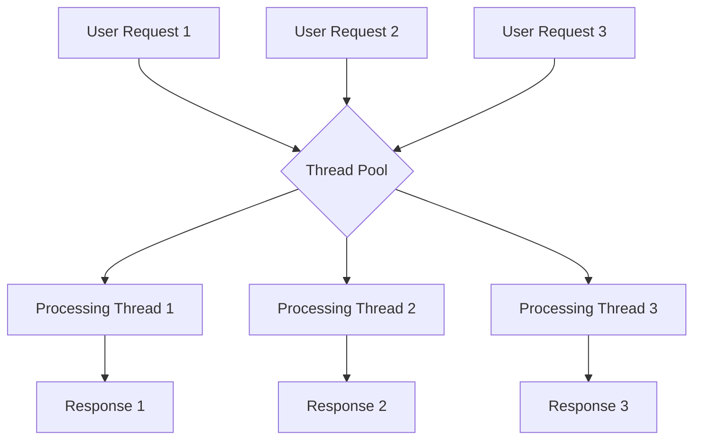
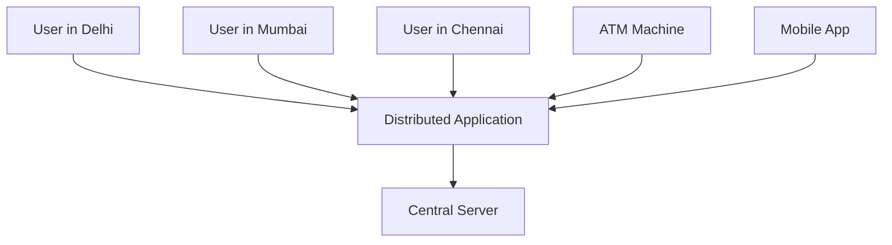
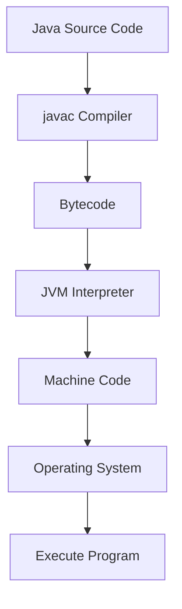

# Session 5: Core Java Introduction

## Table of Contents
- [Java Abbreviation](#java-abbreviation)
- [Java Release Date](#java-release-date)
- [Java Versions History](#java-versions-history)
- [Java Versions and Long-Term Support](#java-versions-and-long-term-support)
- [Java Programming Language Features](#java-programming-language-features)

## Java Abbreviation

### Overview
The instructor clarifies that there is no abbreviation for Java. The name was specifically chosen by the development team and refers to hot aromatic coffee, reflecting the coffee cup icon used for Java products.

### Key Concepts
- Java has no abbreviation - it was simply chosen as the name
- The name is derived from coffee cups
- Java products are identified by coffee cup icons
- This represents the programming language symbolically

## Java Release Date

### Overview
Java's release dates include both beta and public implementation phases. The beta version was released first for testing purposes, followed by the public implementation for commercial use.

### Key Concepts
- First beta version released: May 23, 1995
- This was not for developing projects, only for testing
- First public implementation (Java 1.0): January 23, 1996
- This version was meant for actual project development

## Java Versions History

### Overview
Java versions have evolved through different numbering schemes. The versioning changed multiple times due to various factors including acquisitions and community requirements.

### Key Concepts

> [!IMPORTANT]
> Sun Microsystems released Java initially, and the language was acquired by Oracle Corporation, who took over development responsibilities.

- Java 1.0 through Java 1.4: Sequential numbering (1.0, 1.1, 1.2, 1.3, 1.4)
- Java 5.0: Numbering change from 1.5 (internally) to 5.0 (public)
- Java 6: Changed from Java 1.6 to Java 6
- Java 7-8: Continued sequential but without "1." prefix
- Java 9 onwards: Major overhaul with quarterly releases
- Post Java 9: Oracle introduced 6-month release cadence due to market competition

### Java Version Release Timeline
| Version | Release Year | Key Changes |
|---------|-------------|-------------|
| Java 1.0 | 1996 | First public implementation |
| Java 1.1 | 1997 | Sequential versioning |
| Java 1.2 | 1998 | |
| Java 1.3 | 2000 | |
| Java 1.4 | 2002 | |
| Java 5.0 | 2006 | Major version change |
| Java 6 | 2006 | Simplified versioning |
| Java 7 | 2011 | |
| Java 8 | 2014 | Long-term support version |
| Java 9 | 2017 | 6-month cadence begins |
| Java 10 | 2018 | March release |
| Java 11 | 2018 | September release, long-term support |

## Java Versions and Long-Term Support

### Overview
Oracle Corporation introduced a 6-month release cadence starting from Java 9 to keep up with market demands. Not all versions receive long-term support - only select versions are maintained for extended periods.

### Key Concepts

### Long-Term Support vs Non-Long-Term Support
- **Long-Term Support**: Updates, patches, and bug fixes provided for years (e.g., Java 8, Java 11, Java 17)
- **Non-Long-Term Support**: Available only until next release (removed from download after next version)

### Version Support Details
> [!NOTE]
> Java 8 and Java 11 are the primary versions currently used in production environments. Java 8 remains the most widely used version across industries.

| Version | Support Type | Current Status |
|---------|-------------|----------------|
| Java 8 | Long-term support | Widely used in production |
| Java 11 | Long-term support | Migrating to production |
| Java 9-10, 12-14 | Non-long-term support | Can download, but no updates |
| Java 17 (upcoming) | Long-term support | Next LTS version |

### Version Numbering System
```diff
+ Java Language Version: Marketing version (Java 8, Java 11)
+ JDK Internal Version: Technical version (JDK 1.8, JDK 11)
+ Minor Versions: Bug fixes and security updates (JDK 1.8.0_121)
```

## Java Programming Language Features

### Overview
Java is designed with 14 key features that make it suitable for developing complex, scalable applications. These features were developed to overcome limitations of predecessor languages like C and C++ while enabling modern software development requirements.

### Key Concepts

Java provides 14 main features that distinguish it from other programming languages:

1. **Simple**
2. **Secure**
3. **Robust**
4. **Portable and Platform Independent**
5. **Architectural Neutral**
6. **Object Oriented**
7. **Multi-threaded**
8. **High Performance**
9. **Distributed**
10. **Dynamic**
11. **Bytecode**
12. **Interpreted**
13. **Automatic Memory Management (Garbage Collection)**
14. **Open Source**

### Detailed Feature Explanations

#### Simple Programming Language
- **`simple`**: Designed like English, hides complexity from developers
- **`diff
+ Eliminates complex concepts from C/C++
- Removes pointer arithmetic, manual memory management, preprocessor directives
- Syntax resembles English language patterns
```

#### Secure Programming Environment
- **`secure`**: Multiple security layers for distributed applications
- Bytecode verification before execution
- Sandbox environment for untrusted code
- No direct memory access to prevent malicious operations

#### Robust Application Development
- **`robust`**: Guarantees correct program execution and results
- Strong error handling and type checking at compile time
- Exception handling for runtime errors
- Eliminates common programming errors that could crash applications

#### Portable and Platform Independent
- **`portable`**: Write once, run anywhere principle
- Programs can move between systems via pendrive, email, etc.
- No platform-specific code dependencies
- JVM handles platform-specific adaptations

#### Architectural Neutral
- **`architectural neutral`**: Works across different hardware architectures
- Supports various processor types (16-bit, 32-bit, 64-bit)
- Hardware specifications are abstracted by JVM
- Same program runs on different embedded devices

#### Object Oriented Programming
- **`object oriented`**: Class-based programming paradigm
- Everything modeled as objects with data and behavior
- Key concepts: Encapsulation, Inheritance, Polymorphism, Abstraction
- Supports code reusability and modularity

#### Multi-threaded Execution
- **`multi-threaded`**: Concurrent task execution
- Multiple execution paths run simultaneously
- Example: Web servers handling multiple requests
- Prevents blocking operations from affecting entire application



#### High Performance Applications
- **`high performance`**: Optimized execution through multiple threads
- JVM optimizations provide efficient performance
- Competitive with compiled languages like C++

#### Distributed Architecture Support
- **`distributed`**: Applications accessible from anywhere
- Supports web applications, enterprise systems
- Internet-based application development
- Enables global system access (banking, e-commerce)



#### Dynamic Code Enhancement
- **`dynamic`**: Runtime modifications without architecture changes
- Add new features without recompiling entire application
- Flexible code evolution
- Plugin systems and modular updates

#### Bytecode Compilation
- **`bytecode`**: Intermediate code format
- Java compiler (javac) produces bytecode (.class files)
- Platform-independent intermediate representation
- Not directly executable by operating system

#### Interpreted Execution
- **`interpreted`**: JVM converts bytecode to machine code at runtime
- Interpreter component in JVM translates bytecode
- Enables platform independence
- Allows dynamic class loading



#### Automatic Memory Management
- **`garbage collected`**: Automatic object cleanup
- Programmer creates objects, JVM destroys when no longer needed
- Eliminates memory leaks and dangling pointer issues
- Garbage collector runs as background thread

```diff
+ Programmer creates objects
+ JVM automatically destroys unused objects
- No manual memory management like C/C++
- Prevents memory-related crashes
```

#### Open Source Development
- **`open source`**: Freely available source code
- Supports community contributions
- Dual JDK options:
  - OpenJDK: Complete open source
  - Oracle JDK: Free for development, licensed for production

## Summary

### Key Takeaways
`diff
+ Java has no abbreviation - named after coffee cups
+ Released publicly as Java 1.0 on January 23, 1996
+ Versions evolved from 1.x to current numbering with 6-month releases
+ Java 8 and Java 11 are primary production versions
+ 14 core features make Java suitable for enterprise applications
+ Platform independence through bytecode compilation
+ Automatic memory management prevents common programming errors
+ Multi-threaded execution enables concurrent processing
+ Open source nature supports community development
`

### Expert Insight

#### Real-world Application
Java powers critical infrastructure worldwide - banking systems process transactions securely, telecom networks manage billions of subscribers concurrently, cloud platforms like AWS scale dynamically. Financial institutions rely on Java's distributed architecture for secure, robust transaction processing that must work 24/7. The garbage collection feature ensures that long-running systems don't accumulate memory leaks, while multi-threading handles massive concurrent user loads in e-commerce platforms.

#### Expert Path
Start with Java 8 fundamentals focusing on object-oriented principles, then master collections framework and thread synchronization. Graduate to Java 11 features and eventually explore non-LTS versions for cutting-edge capabilities. Focus on JVM tuning and bytecode analysis for performance optimization. Learn Docker containerization for Java applications and practice with enterprise patterns like MVC architecture that will be covered in upcoming sessions.

#### Common Pitfalls
Beware of mixing version confusion - Java 11 programs may have compatibility issues with Java 8. Memory leaks still occur despite garbage collection if objects aren't properly dereferenced (infinite loops holding references). Multi-threading novices often forget synchronization, causing race conditions. Performance issues arise from not understanding JVM's interpreted execution - avoid excessive object creation. Platform independence assumptions may fail if native libraries are used improperly.

#### Lesser-known Things About Java
The coffee cup icon represents Java's Indonesian origins rather than just being symbolic. Java version numbers underwent major changes because Oracle found the "1." prefix decreased perceived progress - investors preferred "Java 9" over "Java 1.9". The language was almost called "Oak" after a tree outside James Gosling's office, but was renamed Java during development. Quantum computing poses future challenges to Java's platform independence as quantum systems may require different architectural approaches.

🤖 Generated with [Claude Code](https://claude.com/claude-code)

Co-Authored-By: Claude <noreply@anthropic.com>
