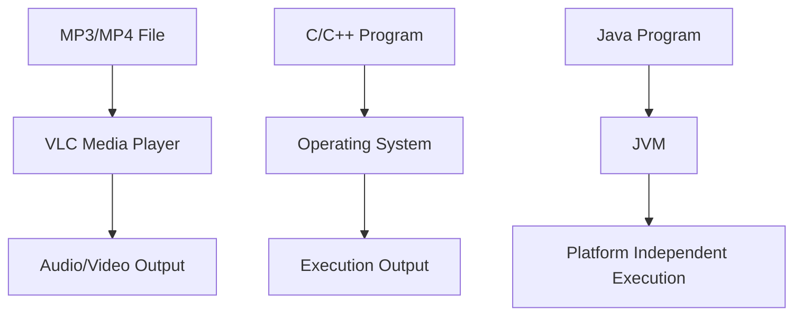
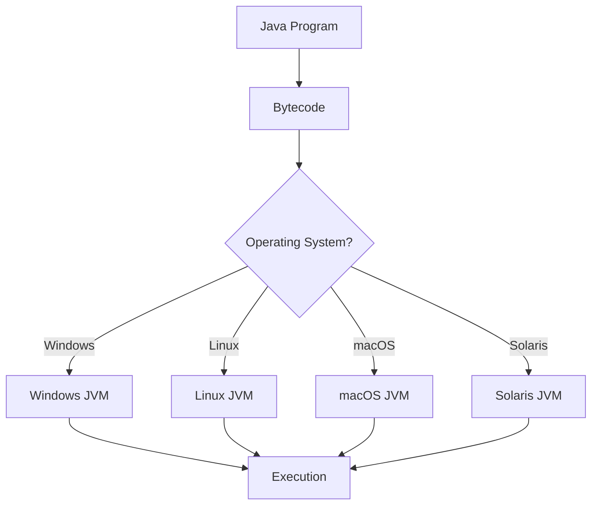

# Session 07: Core Java Concepts - Basics 2

## Table of Contents
- [Common Terminology Used in All Languages](#common-terminology-used-in-all-languages)
- [Platform](#platform)
- [Platform Dependency](#platform-dependency)
- [Platform Independency](#platform-independency)
- [Summary](#summary)

## Common Terminology Used in All Languages

### Overview
In computer programming, several common terminologies are used across different programming languages. Understanding these fundamental concepts is crucial before learning any specific programming language like Java. This section covers the basic workflow from writing code to running programs, including the key concepts of compilers, interpreters, and different types of programming languages.

### Key Concepts

#### Source Code
- **Definition**: Code written by developers that is human-readable
- **Examples**:
  - `abc.c` (C program)
  - `abc.cpp` (C++ program)
  - `abc.java` (Java program)

#### Compiled Code
- **Definition**: Translated code generated by a compiler
- **Examples**:
  - `abc.obj` (C/C++ programs)
  - `abc.class` (Java programs - bytecode)

#### Executable Code
- **Definition**: Code that is ready for execution on a computer
- **Example**: `abc.exe`

#### Compilation
- **Definition**: Process of converting source code to compiled code
  - **Purpose**: Translate human-readable code to machine-readable format
  - **Language-specific outputs**:
    - C/C++: Object code (machine language)
    - Java: Bytecode

#### Execution
- **Definition**: Running the compiled code to get output

#### Compiler vs Interpreter

| Feature | Compiler | Interpreter |
|---------|----------|-------------|
| **Input Processing** | Reads entire program at once | Reads line-by-line |
| **Translation Approach** | Converts complete code to another language | Converts and executes line-by-line |
| **Best Use Case** | Compilation phase (complete translation needed) | Execution phase (line-by-line processing needed) |
| **Example Languages** | C, C++ | Some scripting languages |

#### Programming Language Types
- **Compiled Programming Languages**: Use compiler for compilation and may use interpreter for execution
- **Interpreted Programming Languages**: Primarily use interpreters
- **Both Compiled and Interpreted Languages**: Java uses compiler for bytecode generation and interpreter for execution

## Platform

### Overview
A platform is the environment where programs are loaded, executed, and produce output. It represents the runtime environment that supports program execution. Platforms can be software-only, hardware-only, or a combination of both.

### Key Concepts

#### Platform Definition
- **Runtime Environment**: Place where programs are loaded and executed
- **Components**: Can include software (like operating systems, JVM, browsers), hardware (processor, RAM, hard disk), or both

#### Platform Types

##### Software-Only Platforms
- **Examples**:
  - VLC Media Player (for MP3/MP4 files)
  - Operating System (for C/C++ programs)
  - JVM (Java Virtual Machine for Java programs)
  - CLR (Common Language Runtime for .NET programs)
  - Web Browser (for HTML pages)
  - PVM (Python Virtual Machine for Python programs)

##### Hardware-Only Platforms
- **Examples**: Processor, hard disk, RAM

##### Both Software and Hardware Platforms
- **Example**: Computer platform
  - **Software**: Operating System
  - **Hardware**: Processor, hard disk, RAM, motherboard

#### Platform Examples



## Platform Dependency

### Overview
Platform dependency refers to programs that are developed and compiled for one specific platform and cannot be directly executed on different platforms. These programs are tied to the operating system they were built for.

### Key Concepts

#### Definition
A program that is developed and compiled in one operating system and cannot run on different operating systems is called a **platform-dependent program**. The languages used to develop such programs are called **platform-dependent programming languages**.

#### Characteristics
- **Development**: Created targeting specific OS
- **Execution**: Only runs on the target platform
- **Example Languages**: C, C++

#### Why Programs Become Platform Dependent
- **Direct OS Interaction**: Programs interact directly with OS-specific libraries and system calls
- **Native Compilation**: Code compiles to machine code specific to the target platform

```diff
- Program developed on Windows targeting Windows OS
- Cannot execute on Linux or other operating systems
- Requires recompilation for each target platform
```

## Platform Independency

### Overview
Platform independence means programs can be developed on one platform and executed on multiple different platforms without modification. Java achieves this through an intermediate software layer that abstracts platform differences.

### Key Concepts

#### Definition
A program that is developed on one operating system and can execute on multiple different operating systems is called a **platform-independent program**. The languages used to develop such programs are called **platform-independent programming languages**.

#### Characteristics
- **Development**: Targets intermediate software, not direct OS
- **Execution**: Runs on any platform with the intermediate software installed
- **Example Languages**: Java, Python, .NET

#### Intermediate Software Layer


#### Why Java is Platform Independent
- **Two-Stage Translation**: Source code → Bytecode (platform-independent) → Machine code (platform-specific)
- **JVM Abstraction**: Each platform has its own JVM that handles platform-specific execution
- **Bytecode Universality**: Java bytecode can run on any JVM regardless of underlying OS

> **Important Note**: The intermediate software (JVM) itself is platform-dependent, but user programs become platform-independent because they target the JVM, not the OS directly.

#### Real-World Analogy
```diff
- Person = Program
- Passport/Visa = JVM
- Country = Operating System
- Platform independence: With valid passport/visa, you can travel to different countries
- Platform dependence: Without proper documentation, you can only stay in one country
```

## Summary

### Key Takeaways
```diff
+ Platform is a runtime environment where programs are loaded and executed
+ Compiler translates complete code; Interpreter processes line-by-line
+ Platform-dependent programs (C/C++) target specific OS and cannot run elsewhere
+ Platform-independent programs (Java) use intermediate software (JVM) for cross-platform execution
+ Java achieves platform independence through bytecode abstraction via JVM
+ Understanding platform concepts is essential for Java development and deployment
```

### Expert Insight

#### Real-world Application
Platform independence enables seamless deployment across diverse environments:
- **Enterprise Applications**: Java applications run consistently across Windows/Linux/cloud servers
- **Web Services**: APIs developed once, deployed to AWS, Azure, or on-premises infrastructure
- **Cross-Platform GUI Applications**: JavaFX applications run on desktop platforms (Windows, macOS, Linux)
- **Android Development**: Java/Kotlin code works across all Android devices regardless of hardware manufacturers
- **Big Data Processing**: Apache Hadoop/Spark ecosystems leverage JVM for cross-platform data analytics

#### Expert Path
- **Advanced JVM Tuning**: Master JVM parameters, garbage collection algorithms, and memory management
- **Container Orchestration**: Use Docker and Kubernetes for enhanced platform abstraction
- **Cloud Architecture**: Design serverless functions and microservices that are truly platform-independent
- **Multi-Platform Development**: Learn tools like Apache Cordova for true cross-platform mobile apps
- **Performance Optimization**: Understand JIT compilation, bytecode optimization, and platform-specific JVM optimizations

#### Common Pitfalls
- **File System Assumptions**: Using platform-specific file path separators (`\` vs `/`) without proper handling
- **Character Encoding Issues**: Assuming UTF-8 default when different platforms may use different encodings
- **JVM Version Inconsistencies**: Code working on one JVM version failing on another due to API changes
- **Native Library Dependencies**: JNI calls breaking platform independence when native libraries aren't ported
- **Resource Path Resolution**: Hard-coded paths that work on development platform but fail in deployment environments
- **Time Zone Handling**: Incorrect time zone assumptions affecting application behavior across geographical deployments

#### Lesser Known Aspects
- **JVM HotSpot Optimizations**: Just-In-Time compiler performs platform-specific runtime optimizations
- **Garbage Collection Variations**: Different JVM implementations have unique GC algorithms and behaviors
- **Platform-Specific Bytecode**: Some JVM implementations include platform-specific bytecode optimizations
- **Security Manager Differences**: Security policies and sandboxing vary across JVM implementations
- **Classpath Delimiters**: Windows uses semicolon (`;`) while Unix-like systems use colon (`:`) in classpath definitions
- **Thread Scheduling Variations**: Thread priority and scheduling behavior differs between operating systems

<small>🤖 Generated with [Claude Code](https://claude.com/claude-code)<br>Co-Authored-By: Claude &lt;noreply@anthropic.com&gt;</small>
