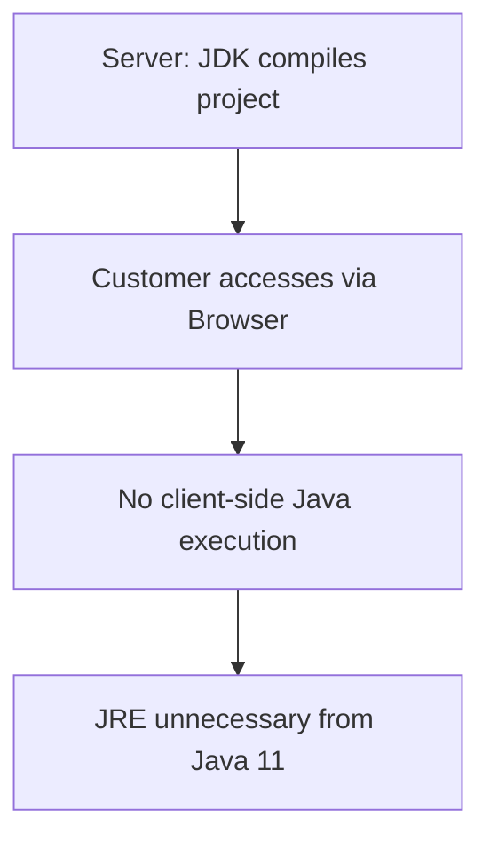

# Session 10: Core Java Different Java Software

## Table of Contents
- [Introduction and Resources](#introduction-and-resources)
- [Why JRE is Removed from Java 11](#why-jre-is-removed-from-java-11)
- [Understanding JDK Versions](#understanding-jdk-versions)
- [Long-Term Support (LTS) vs Non-Long-Term Support](#long-term-support-lts-vs-non-long-term-support)
- [OpenJDK vs Oracle JDK](#openjdk-vs-oracle-jdk)
- [JDK Installation Process](#jdk-installation-process)
- [JDK Folder Structure](#jdk-folder-structure)

## Introduction and Resources

### Overview
This session begins with guidance on utilizing Facebook pages, groups, YouTube channels, and websites for resolving doubts and staying updated in programming. The instructor emphasizes community-driven learning through interactive platforms.

### Key Concepts/Deep Dive
- **Facebook Resources**:
  - Follow the instructor's Facebook page for posts on motivational content, English videos, and subject-related material.
  - Join the group (with 26k members) for senior-junior interactions, asking questions, sharing code snippets, and resolving errors raised by peers.
  - Used for discussing network issues, class queries (e.g., string handling), and sharing motivational videos.

- **YouTube Channel**:
  - Subscribe to "Nar vit YouTube" for clear educational videos on Python, Java, C programming, data structures, and more.
  - Content includes motivational videos and over 70+ Java videos, with detailed series on C programs.

- **Website**:
  - Visit "Nar it.com" for new batch announcements, real-time projects, and courses on Python, DevOps, core Java, etc.

- **Weekly Workshops**:
  - Upcoming free workshops on Python (PyQt5) on 25th-26th July 2020.

> [!IMPORTANT]
> Join all platforms (Facebook page, group, YouTube, website) for daily interaction and doubt resolution.

### Code/Config Blocks
No code or config examples in this section.

### Tables
| Platform | Purpose | Key Features |
|----------|---------|--------------|
| Facebook Page | Motivational & subject posts | Like button for access; photos, videos, Gail/contact details |
| Facebook Group | Doubt resolution | 26k members; senior answers questions |
| YouTube Channel | Video tutorials | 71+ C programs; motivational videos |
| Website (nar vit.com) | Course info | New batches; workshops |

## Why JRE is Removed from Java 11

### Overview
From Java 11 onwards, JRE (Java Runtime Environment) is no longer included as part of JDK, emphasizing client-side development shifts from applets to HTML-based applications.

### Key Concepts/Deep Dive
- **Server-Based Applications**: Projects run on servers using JDK for compilation and execution. Customers access via browsers on their systems, requiring only the browser—no special software like JRE for client-side programs.
- **Client-Side Shift**: Applet programs (client-side executing code) are outdated. Modern GUI applications use HTML, JavaScript, Angular, or React, running solely in browsers without JRE.
- **JRE Removal**: Since client systems do not execute Java programs, JRE maintenance is unnecessary. Sun Microsystems officially declared Java applets redundant, removing JRE from Java 11+ to streamline usage.

> [!NOTE]
> Up to Java 10, both JDK and JRE were present; from Java 11, only JDK exists, including all runtime components internally.

### Diagram


## Understanding JDK Versions

### Overview
JDK versions are categorized into latest, stable, major, and minor, guiding selection for development or learning based on reliability and features.

### Key Concepts/Deep Dive
- **Latest Version**: Newly released JDK (e.g., JDK 14 in 2020; JDK 15 releasing September 17, 2020).
- **Stable Version**: Version without bugs, all issues fixed (e.g., JDK 8, JDK 11).
- **Major Version**: Main version number (e.g., in JDK 1.8.0, "1.8" is major).
- **Minor Version**: Sub-version updates for bug fixes and enhancements (e.g., 1.8.261, where 261 is minor).
- **For Projects**: Use stable versions (e.g., 99% projects use JDK 8; some migrating to JDK 11). Avoid latest for production due to potential bugs.
- **For Learning**: Learn latest versions to stay updated (e.g., JDK 14 features include switch expressions; JDK 15 upcoming).
- **Version Number Usage**: Unique identifier for features (e.g., JDK 8 implies Lambda expressions; JDK 9 implies modules/JShell; JDK 14 implies switch as expression).

> [!TIP] Syntaxes remain consistent across versions; new features only add simplifications and reduce code lines.

### Tables
| Version | Category | Example | Usage |
|---------|----------|---------|-------|
| Latest | New release | JDK 14 | Learning |
| Stable | Bug-free | JDK 8, JDK 11 | Production |
| Major | Main number | 1.8 in JDK 1.8.0 | Core identifier |
| Minor | Sub-versions | 261 in JDK 8u261 | Bug fixes |

## Long-Term Support (LTS) vs Non-Long-Term Support

### Overview
LTS versions offer extended download and bug-fixing support, while non-LTS versions stop updates upon new releases, suitable based on needs.

### Key Concepts/Deep Dive
- **Non-LTS**: When a new version releases, old non-LTS versions stop downloads and bug fixes (e.g., JDK 9, 10, 12-14). Declared "end of life," forcing migration.
- **LTS Examples**: JDK 8 (until December 2030), JDK 11 (until September 2026). Available for download and support longer.
- **Download Availability**: LTS versions remain accessible; non-LTS go to Java archive with warnings (e.g., JDK 9 requires Oracle account for development/emergency use only).
- **Current Status (2020)**: JDK 14 is latest non-LTS; JDK 17 upcoming LTS.

> [!IMPORTANT]
> LTS prevents production risks; non-LTS suits early adopters of new features.

### Tables
| Version | LTS? | Support Until | Status |
|---------|------|---------------|--------|
| JDK 8 | Yes | Dec 2030 | Active |
| JDK 9-10 | No | End of life | Archive |
| JDK 11 | Yes | Sep 2026 | Active |
| JDK 12-14 | No | End of life post-next release | Available until next |

## OpenJDK vs Oracle JDK

### Overview
From Java 11, two JDK flavors exist: OpenJDK (free, open-source) and Oracle JDK (commercial, with support for production).

### Key Concepts/Deep Dive
- **OpenJDK**: Open-source, freely downloadable from openjdk.java.net. No security patches; unsuitable for production/commercial apps. Use for testing/learning.
- **Oracle JDK**: Commercial; free for learners/testers but paid for production. Includes security patches and support for commercial applications.
- **Differences**: Oracle JDK provides security guarantees and suitability for customer-facing projects.
- **Download Sites**: OpenJDK at openjdk.java.net; Oracle JDK at oracle.com/jdk.

> [!CAUTION]
> Avoid OpenJDK for production to prevent security vulnerabilities without Oracle support.

### Tables
| Feature | OpenJDK | Oracle JDK |
|---------|---------|------------|
| License | Open-source, free | Commercial (free for learning) |
| Security Patches | No | Yes |
| Production Suitability | ❌ No | ✅ Yes |
| Download Site | openjdk.java.net | oracle.com/jdk |

### Code/Config Blocks
No code examples; websites are key links:
- OpenJDK Features (e.g., JDK 14): openjdk.java.net/projects/jdk/14/
- Oracle JDK Download: oracle.com/jdk/downloads

## JDK Installation Process

### Overview
Download and install JDK 14 (or latest) via Oracle site, choosing exe or zip format, following path conventions for smooth operation.

### Key Concepts/Deep Dive
- **Download Steps**:
  1. Go to oracle.com/jdk (search "JDK 14 download").
  2. Accept license agreement.
  3. Choose version (e.g., JDK 14.0.2 for Windows exe/zip).
  4. Download and run exe (or extract zip if using WinRAR).
- **Installation Path**: Avoid spaces (e.g., change from "Program Files\Java\" to "C:\jdk-14.0.2").
- **Post-Installation**: Verify in C:\ drive; previous versions can coexist.
- **Common Practice**: Students install latest (JDK 14); uninstall via Control Panel if needed.

> [!NOTE]
> Platform-dependent; select OS-specific download.

### Lab Demos
**Demo: Installing JDK 14 on Windows**
1. Visit oracle.com/jdk → JDK Downloads → JDK 14.
2. Accept agreement → Download jdk-14.0.2_windows-x64_bin.exe.
3. Run exe → Click "Next" → Change path to C:\jdk-14.0.2 → Install.
4. Verify folder creation in C:\ drive.
5. Alternative: Download zip, extract to C:\jdk-14.0.2.

**Expected Output**: Installation completes; no spaces in path to avoid issues.

## JDK Folder Structure

### Overview
JDK folder includes development tools, compiler, JVM, JRE (from Java 11 onwards), and version-specific changes explained in upcoming classes.

### Key Concepts/Deep Dive
- **Contents**: Binaries, compiler, JVM, Class Library (API).
- **Structure Differences**: Up to Java 7 (shown in textbook); similar for JDK 14.
- **Installation Path Note**: Use simple paths (e.g., C:\jdk-14.0.2) to prevent complications.

No detailed folder hierarchy in transcript; refer to textbook Page 27-31.

---

## Summary

### Key Takeaways
```diff
+ LTS versions (e.g., JDK 8, 11) ensure long-term stability for production projects.
+ Non-LTS versions (e.g., JDK 9-10, 12-14) offer latest features but limited support.
+ Install latest JDK (JDK 14) for learning; use stable LTS for projects.
+ Oracle JDK preferred over OpenJDK for commercial applications and security.
+ JRE removal reflects shift to browser-based client-side development.
- Avoid latest versions in production due to potential bugs.
! Join community platforms (Facebook, YouTube) for persistent doubt resolution.
💡 Version numbers indicate major/minor releases and feature sets.
```

### Expert Insight

**Real-world Application**: In enterprise projects, developers use LTS JDKs (e.g., 8 or 11) on servers for reliability, even if learning latest. Client applications rely on HTML/JavaScript, eliminating JRE needs. Open-source projects often use OpenJDK for cost savings, while commercial software leverages Oracle JDK for legal/security assurance.

**Expert Path**: Master version management by tracking Oracle's release schedule (every 6 months post-Java 9). Experiment with latest features via IDEs like Eclipse/IntelliJ. Contribute to OpenJDK projects for deep collaboration experience. Aim for certifications recognizing LTS usage.

**Common Pitfalls**:
- **Installing JDK in paths with spaces**: Issue - Runtime errors or path resolution failures (e.g., in Windows, "Program Files\Java" causes issues). Resolution: Always install in root (e.g., C:\jdk-14.0.2) as demonstrated.
- **Using OpenJDK for production**: Issue - Lack of security updates leads to vulnerabilities (e.g., unpatched exploits exposed). Resolution: Switch to Oracle JDK for production; use OpenJDK only for development/testing.
- **Ignoring LTS in projects**: Issue - Bugs in non-LTS versions cause downtime (e.g., ATM software FAQs mirror this). Resolution: Audit and migrate to LTS; plan upgrades strategically.
- **Confusing version categories**: Issue - Learners install stable for training, missing new syntax (e.g., JDK 14 switch expressions). Resolution: Balanced approach—learn latest, develop on stable.
