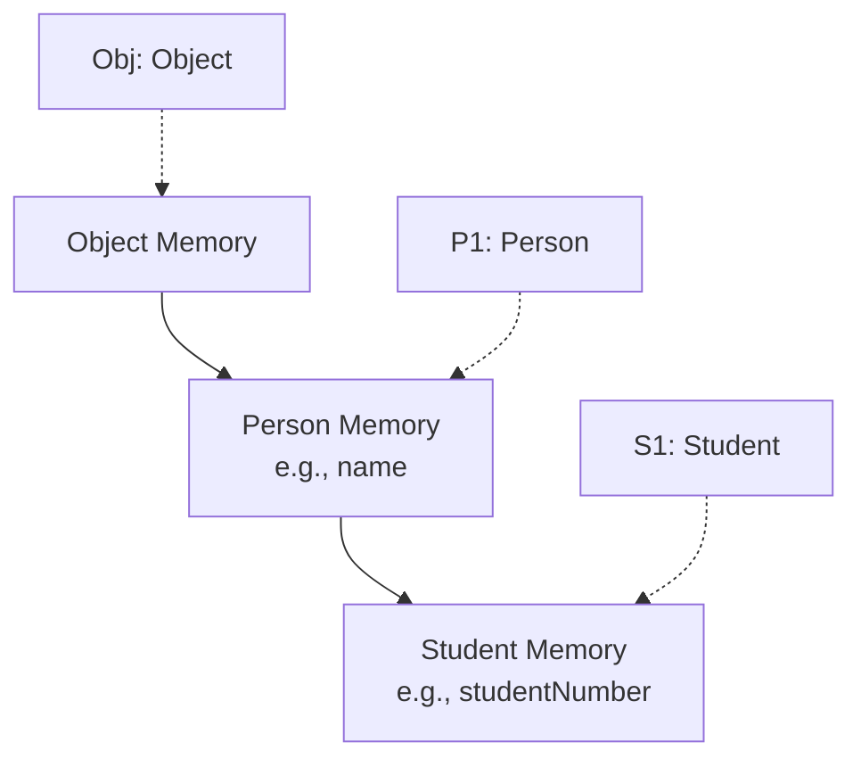

# Session 100: OOP Principles - Subclass Object, Reference, and Inheritance

## Table of Contents

- [Overview: Subclass Object Structure with Parent Class and Child Class Reference](#overview-subclass-object-structure-with-parent-class-and-child-class-reference)
- [Key Concepts: Storing Subclass Object in Subclass Reference Variable](#key-concepts-storing-subclass-object-in-subclass-reference-variable)
- [Key Concepts: Storing Subclass Object in Superclass Reference Variable](#key-concepts-storing-subclass-object-in-superclass-reference-variable)
- [Advantages and Problems of Each Approach](#advantages-and-problems-of-each-approach)
- [Memory Diagram and Reference Pointing](#memory-diagram-and-reference-pointing)
- [Accessing Members via References](#accessing-members-via-references)
- [Runtime Polymorphism and Type Casting](#runtime-polymorphism-and-type-casting)
- [Comparison Table](#comparison-table)
- [Summary](#summary)

## Overview: Subclass Object Structure with Parent Class and Child Class Reference

In object-oriented programming, inheritance allows a subclass to inherit properties and behaviors from a superclass. A subclass object consists of memory regions for the subclass members, superclass members, and even further ancestors like the `Object` class. This session explores how to store and reference these subclass objects using different reference variable types, including the advantages, problems, and solutions like upcasting and downcasting.

The key focus is understanding where reference variables point in memory when storing a subclass object in a subclass reference versus a superclass reference. This affects which members (properties and methods) can be accessed and enables concepts like loose coupling and runtime polymorphism.

## Key Concepts: Storing Subclass Object in Subclass Reference Variable

When you create a subclass object and store its reference in a variable of the subclass type, the reference points to the subclass's memory region. This allows full access to both subclass-specific and inherited members.

```java
Student S1 = new Student();  // Equivalent to: Student S1 = new Student();
```

In this case:
- A `Student` object is created, allocating memory for `Student` class members (e.g., `studentNumber` or SN), `Person` class members (e.g., `name`), and `Object` class members.
- The reference `10` (or similar hypothetical reference) is stored in `S1`.
- `S1` points to the entire `Student` object's memory, enabling access to all layers.

```diff
+ Advantage: Can access all members (subclass, superclass, and ancestors) freely.
- Problem: Tight coupling - limits flexibility to other subclasses at runtime.
! Security/Efficiency Note: Prefer this only for specific subclass requirements.
```

## Key Concepts: Storing Subclass Object in Superclass Reference Variable

Storing a subclass object in a superclass-typed variable restricts access to only superclass and ancestor members, but enables loose coupling and runtime polymorphism.

```java
Person P1 = new Student();  // Creates a Student object but references via Person type
```

In this setup:
- The same `Student` object is created with all memory regions.
- The reference is stored in `P1`.
- `P1` points only to the `Person` (superclass) memory region within the object, not the subclass `Student` region.
- You cannot access subclass members directly via `P1` (e.g., `P1.studentNumber` would cause a compile-time error).

```diff
+ Advantage: Enables loose coupling and runtime polymorphism - can assign different subclass objects to the same reference at runtime.
- Problem: Cannot access subclass-specific members directly.
! Alert: Common pitfall - forgetting type casting when needed later.
```

## Advantages and Problems of Each Approach

### Subclass Reference Variable
- **Advantage**: Full access to subclass and inherited members. Suitable when operations are specific to the subclass.
- **Problem**: Tight coupling hinders scalability. For example, if you later need to handle different subclasses, you'd need separate variables.

### Superclass Reference Variable
- **Advantage**: Loose coupling allows dynamic object changes, supporting runtime polymorphism. Ideal for general superclass operations.
- **Problem**: Limited access - superclass members only. Attempting to access subclass members results in compilation errors.

A key memory diagram illustrates this:



## Memory Diagram and Reference Pointing

A single subclass object has multiple memory layers. Reference variables point to different layers based on their type, not the object type.

Example with `Student S1 = new Student();`, `Person P1 = new Student();`, `Object obj = S1;`:

- `S1` points to `Student` memory.
- `P1` points to `Person` memory within the same object.
- `obj` points to `Object` memory within the same object.

This means multiple references can point to the same object simultaneously, each accessing different scopes.

```diff
! Client Request → Node → Proxy → \[Routing Logic] → Correct Pod
+ References can coexist, but access scopes differ.
- Avoid mixing access attempts - use casting if needed.
```

## Accessing Members via References

Direct access rules:
- `S1.name` and `S1.studentNumber` work (complete access).
- `P1.name` works, but `P1.studentNumber` fails (compile error).
- `obj.name` and `obj.studentNumber` fail (only `Object` members accessible).

```java
System.out.println(S1.name);     // Works: Person member
System.out.println(S1.studentNumber); // Works: Subclass member
System.out.println(P1.name);     // Works: Person member
System.out.println(P1.studentNumber); // Error: Subclass member inaccessible
System.out.println(obj.toString());   // Works: Object method
```

Solution for restricted access: Use downcasting.

## Runtime Polymorphism and Type Casting

To access subclass members via a superclass reference, perform downcasting (explicit type casting). This changes the reference point without creating a new object.

```java
Student castedStudent = (Student) P1;  // Downcasts P1 to Student reference
System.out.println(castedStudent.studentNumber); // Now accessible
```

Upcasting occurs implicitly in `Person P1 = new Student();` (subclass object ← superclass variable). Downcasting is explicit and fixes access issues.

This enables scenarios where you must use superclass references for polymorphism but occasionally need subclass access.

```diff
+ Key Takeaway: Upcasting (loose coupling) is default; downcasting solves access problems.
- Common Pitfall: Invalid casting at runtime throws ClassCastException if object types mismatch.
! Expert Tip: Always check instance with instanceof before casting.
```

## Comparison Table

| Approach | Reference Variable Type | Access Scope | Advantage | Problem | Solution |
|----------|-------------------------|--------------|-----------|---------|----------|
| Tight Coupling | Subclass | All ( subclasses and inherited) | Full member access | Fixed to one subclass type | None needed - choose only for fixed subclass use |
| Loose Coupling | Superclass | Superclass only | Scalable, runtime polymorphism | No subclass member access | Downcasting |

## Summary

**Key Takeaways**

```diff
+ Inherit type, store references flexibly for polymorphism.
- Subclass references: tight coupling, full access.
+ Superclass references: loose coupling, limited access initially.
- Use downcasting to restore subclass access when needed.
+ Choose based on project needs: specific (subclass) vs. dynamic (superclass).
```

**Expert Insight**

- **Real-world Application**: Use superclass references in collections (e.g., `List<Person>` holding `Student`, `Faculty`) for scalable frameworks. Frameworks like Spring use this for dependency injection.
- **Expert Path**: Master type casting with `instanceof` checks. Explore generics and wildcards (`? extends Person`) to balance type safety and flexibility.
- **Common Pitfalls**: Skipping `instanceof` leads to runtime `ClassCastException`. Overusing subclass references breaks modularity.
  - Issue: Storing superclass objects in subclass variables is invalid (compile error).
  - Resolution: Understand inheritance hierarchy - a `Person` isn't always a `Student`, preventing invalid assignments.
  - Lesser known: Multiple references to one object share the same underlying data; changes via one reference affect all. Always favor composition over deep inheritance trees to avoid memory bloat.üman
