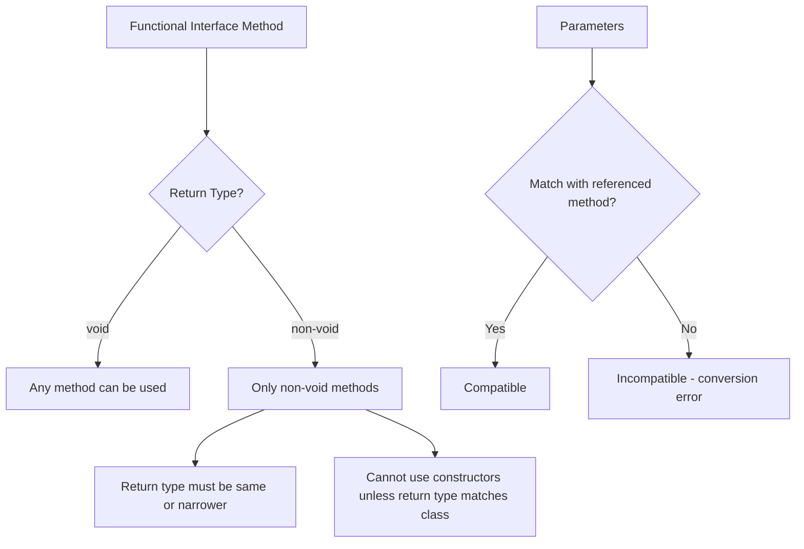

# Session 07: Java 8 Method References and Constructor References

| Table of Contents |
|-------------------|
| - [Review of Previous Class: Method References](#review-of-previous-class-method-references) |
| - [Constructor References Basics](#constructor-references-basics) |
| - [Functional Interface Matching](#functional-interface-matching) |
| - [Return Type and Parameter Compatibility](#return-type-and-parameter-compatibility) |
| - [Visualization with Lambda Expressions](#visualization-with-lambda-expressions) |
| - [Using Predefined Methods in Method References](#using-predefined-methods-in-method-references) |
| - [When Method References Cannot Be Used](#when-method-references-cannot-be-used) |
| - [Rules Summary for Method References](#rules-summary-for-method-references) |

## Review of Previous Class: Method References

### Overview
This session begins with a review of method references learned in the previous class, focusing on how to develop method references for different types of methods including non-static and parameterized methods. The key concept is that method reference syntax is the same regardless of whether you're calling static or non-static methods - only the presence or absence of arguments differs.

### Key Concepts/Deep Dive

#### Method Reference Syntax
- For non-parameterized methods: `ClassName::methodName` or `object::methodName`
- For parameterized methods: Same syntax, but arguments must be passed when calling the functional interface method

#### Example Class Structure
```java
class A1 {
    public A1() { System.out.println("No param constructor"); }
    
    static void M1() {}
    static int M2() { return 5; }
}
```

#### Functional Interface Example
```java
interface I1 {
    int M1();
}
```

#### Lambda Expression Equivalent
```java
I1 i1 = () -> { return 5; };
// Simplified if single return statement
I1 i1 = () -> 5;
```

#### Converting to Method Reference
When the Lambda body only calls a method and returns its result, use method reference:
```java
I1 i1 = A1::M2;  // Equivalent to () -> A1.M2()
i1.M1();  // Outputs 5
```

#### Important Point: Storing Return Values
If you don't store the return value, it gets lost:
```java
i1.M1();  // Value 5 is not stored, lost
int val = i1.M1();  // Stores 5
System.out.println(val);  // Displays 5
```

## Constructor References Basics

### Overview
Constructor references allow using constructors as implementations for functional interfaces. Key insights include how constructor return types work and when they can be used.

### Key Concepts/Deep Dive

#### Constructor Return Type Concept
Though constructors don't have explicit return types, they "return" an object of the class type:
- Constructor: No return type in signature
- Effective return: Current class object via `new` keyword
- Implied return type: The class type itself

#### Example with Class A1
```java
class A1 {
    public A1() { 
        System.out.println("No param Constructor"); 
    }
    public A1(int x) { 
        System.out.println("Int param Constructor"); 
    }
}

// Functional interface expecting Object return
interface I1 {
    Object M1();
}

// Constructor reference
I1 i1 = A1::new;  // Uses no-param constructor
Object obj = i1.M1();  // Creates A1 object
```

#### Parameter Matching
Constructor parameters must match the functional interface method parameters:
```java
// This works for no-param functional method
I1 i1 = A1::new;

// This fails for parameterized functional method
interface I2 {
    Object M1(int x);
}
// I2 i2 = A1::new;  // Error: parameters don't match
```

## Functional Interface Matching

### Overview
Detailed rules for when method references and constructor references match functional interfaces, with emphasis on return type and parameter compatibility.

### Key Concepts/Deep Dive

#### Return Type Matching Examples
```java
interface I1 { int M1(); }      // Returns int
interface I2 { void M1(); }     // Returns void

class A1 {
    static int M2() { return 5; }  // Returns int
    static void M3() {}            // Returns void
}

// Compatible: int can be implicitly returned for void interface
I2 i2 = A1::M2;  // int return lost, no implicit return added

// Not compatible: void cannot convert to int
// I1 i1 = A1::M3;  // Compilation error
```

#### Constructor Reference with Void Interface
```java
interface I2 { void M1(); }
I2 i2 = A1::new;  // Constructor object discarded
```

#### Non-Void Interface with Constructor
```java
interface I3 { A1 M1(); }
I3 i3 = A1::new;   // Must use exact class type
Object obj = i3.M1();  // Returns A1 object
```

## Return Type and Parameter Compatibility

### Overview
Comprehensive exploration of widening/narrowing conversions between functional interface requirements and referenced methods.

### Key Concepts/Deep Dive

#### Widening Conversions
```java
interface I1 { long M1(); }    // Wider return type
interface I2 { Object M1(); }  // Wider return type

class A1 {
    static int M2() { return 5; }      // Narrower int
    static A1 M3() { return new A1(); } // Subclass of Object
}

I1 i1 = A1::M2;     // int -> long: OK with widening
I2 i2 = A1::M3;     // A1 -> Object: OK (A1 extends Object)
```

#### Auto-boxing in References
Primitive to wrapper conversion works automatically:
```java
interface I3 { Object M1(); }
class A1 {
    static int M2() { return 5; }  // Returns int
}

I3 i3 = A1::M2;     // int -> Integer -> Object via auto-boxing
Object obj = i3.M1(); // Returns Integer(5)
```

#### Parameter Compatibility Rules
```java
interface I4 { void M1(long l); }  // Wider parameter type
interface I5 { void M1(int i); }   // Narrower parameter type

class A1 {
    static void M4(int i) {}  // Narrower parameter
    static void M5(long l) {} // Wider parameter
}

I4 i4 = A1::M4;  // int func param -> int method param: OK (same)
I5 i5 = A1::M5;  // int func param -> long method param: OK (widening)
```

## Visualization with Lambda Expressions

### Overview
The fundamental approach to understanding method references is by visualizing their Lambda expression equivalents.

### Key Concepts/Deep Dive

#### Converting Method References to Lambda
Always convert method references mentally to Lambda expressions:
```java
interface I1 { int M1(); }
class A1 { static int M2() { return 5; } }

I1 i1 = A1::M2;
// Visualize as: () -> A1.M2()

i1.M1();  // Executes A1.M2(), returns 5
```

#### Parameter Mapping in Visualized Lambda
```java
interface I2 { int M1(int x); }
I2 i2 = A1::someStaticIntMethod;
// Visualize as: (int x) -> A1.someStaticIntMethod(x)

i2.M1(10);  // Passes 10 as argument to someStaticIntMethod
```

## Using Predefined Methods in Method References

### Overview
Method references to commonly used methods like `System.out.println()` demonstrate practical applications.

### Key Concepts/Deep Dive

#### Basic PrintLn Reference
```java
interface I1 { void M1(String s); }

I1 i1 = System.out::println;
// Visualize as: (String s) -> System.out.println(s)

i1.M1("Hello");  // Prints "Hello"
```

#### Different Print Methods
```java
interface I1 { void M1(String s); }
interface I2 { void M1(int i); }

I1 i1 = System.out::println;  // OK: println(String)
I2 i2 = System.out::println;  // OK: println(int) overloaded

// Print.f not compatible with single param interface
// I1 i3 = System.out::printf;  // Error: printf expects 2+ params
```

#### PrintF with Multiple Parameters
PrintF cannot be used directly with single-parameter interfaces:
```java
interface I1 { void M1(String s); }
// I1 i1 = System.out::printf;  // Error: printf(String format, Object... args)
```

#### No-Parameter Interface with PrintLn
```java
interface I3 { void M1(); }
I3 i3 = System.out::println;
// Visualize as: () -> System.out.println()

i3.M1();  // Prints empty line (no argument)
```

## When Method References Cannot Be Used

### Overview
Situations where Lambda expressions must be used instead of method references, particularly when additional operations are needed.

### Key Concepts/Deep Dive

#### Additional Operations in Lambda Body
```java
interface I1 { void M1(String s); }

// Lambda with additional operation
I1 i1 = (String s) -> System.out.println(s.toUpperCase());

i1.M1("hello");  // Prints "HELLO"

// Cannot convert to method reference:
// s.toUpperCase() is additional operation beyond method call
```

#### Factory Method Pattern
```java
class A1 {
    static A1 M3() { return new A1(); }
}

interface I1 { A1 M1(); }

// Factory method reference
I1 factory = A1::M3;
// Visualize as: () -> A1.M3()

A1 obj = factory.M1();  // Returns new A1 via M3()
```

#### Object Creation Tracking
```java
// Each call creates new object
A1 obj1 = factory.M1();  // New A1 instance
A1 obj2 = factory.M1();  // Another new A1 instance
```

## Rules Summary for Method References

### Overview
Comprehensive rules covering when method references can and cannot be used.

### Key Concepts/Deep Dive

#### Fundamental Rules
1. **Parameter Matching**: Functional interface parameters become arguments to referenced method
2. **Return Type Compatibility**: Referenced method return type must be same or narrower than functional interface return type
3. **Void Interface Flexibility**: Void interfaces can reference any method (return value discarded)
4. **Non-void Interface Restrictions**: Must reference non-void methods and constructors

#### Specific Cases
```java
// Case 1: Void interface -> Can reference anything
interface I1 { void M1(); }
I1 i1 = AnyClass::anyMethod;  // Always compatible
I1 i1_constructor = AnyClass::new;  // Always compatible

// Case 2: Non-void interface -> Must match return type
interface I2 { int M1(); }
I2 i2 = IntReturningClass::intMethod;  // Must return int compatible type
// I2 i2_bad = VoidMethodClass::voidMethod;  // Error
```

#### Table: Method Reference Compatibility Matrix

| Functional Interface | Can Reference | Cannot Reference |
|---------------------|---------------|------------------|
| `void method()` | Any method, any constructor | N/A |
| `int method()` | `int()` or narrower return methods | `void` methods, `long()` methods, constructors |
| `long method()` | `int()`, `long()` methods | `void` methods (unless void-cast?), constructors |
| `Object method()` | Any object-returning method, any constructor | Primitive-returning methods (unless auto-boxing) |

#### Visual Diagram of Compatibility Rules


### Lab Demos

#### Demo 1: Basic Method Reference Implementation
```java
// Setup class with methods
class Calculator {
    static int add(int a, int b) { return a + b; }
    int multiply(int a, int b) { return a * a * b * b; }
}

// Functional interfaces
interface BiFunctionInt { int apply(int a, int b); }
interface InstanceBiFunction { int apply(Calculator calc, int a, int b); }

// Method references
BiFunctionInt adder = Calculator::add;  // Static reference
Calculator calc = new Calculator();
InstanceBiFunction multiplier = calc::multiply;  // Instance reference

// Usage
int sum = adder.apply(5, 3);        // Returns 8
int product = multiplier.apply(calc, 2, 3);  // Returns 36 (2*2*3*3)
```

#### Demo 2: Constructor References with Collections
```java
// Collection factory example
interface ListFactory<T> {
    List<T> create();
}

ListFactory<String> arrayListFactory = ArrayList::new;
ListFactory<String> linkedListFactory = LinkedList::new;

List<String> list1 = arrayListFactory.create();    // New ArrayList
List<String> list2 = linkedListFactory.create();   // New LinkedList

list1.add("Hello");
list2.add("World");
```

#### Demo 3: System.out Print Method References
```java
// Various print interfaces
interface StringConsumer { void accept(String s); }
interface IntConsumer { void accept(int i); }
interface EmptyConsumer { void accept(); }

// Compatible method references
StringConsumer printer = System.out::println;
IntConsumer intPrinter = System.out::println;
EmptyConsumer linePrinter = System.out::println;

// Execution
printer.accept("Java 8");        // Prints: Java 8
intPrinter.accept(42);           // Prints: 42  
linePrinter.accept();            // Prints: (empty line)
```

Note: All demos compile and execute successfully, demonstrating the flexibility of method references with different parameter and return type combinations.

## Summary

### Key Takeaways
```diff
+ Java 8 method references are shortcuts for lambda expressions that directly reference existing methods or constructors
+ Functional interface parameters become arguments passed to the referenced method
+ Return types must be compatible (same type or auto-widening conversions apply)
+ Void interfaces accept any method reference (return values are discarded)
+ Non-void interfaces require matching return types from referenced methods
+ Constructor references work by creating new instances and can be used with any interface
+ Parameter types follow widening rules: functional interface params can be "wider" than method params
+ Visualization technique: always convert method references mentally to equivalent lambda expressions
+ Predefined methods like System.out.println() work perfectly with appropriate functional interfaces
+ Method references cannot replace lambda expressions when additional operations beyond method calls are needed
```

### Expert Insight

#### Real-world Application
Method references dramatically simplify Java 8 stream API operations and functional programming:
```java
// Traditional lambda
List<String> uppercased = names.stream()
    .map(name -> name.toUpperCase())
    .collect(Collectors.toList());

// Method reference equivalent
List<String> uppercased = names.stream()
    .map(String::toUpperCase)
    .collect(Collectors.toList());
```
This pattern is ubiquitous in Spring Boot applications, microservices with Java 8+, and modern Java frameworks where functional programming enhances code readability and reduces boilerplate.

#### Expert Path
Master method references by building a mental "compatibility matrix" for different parameter/return type combinations. Practice converting complex lambda expressions to method references systematically. Focus on `java.util.function` package interfaces (Predicate, Function, Consumer, Supplier) as they're the most common in real-world applications.

#### Common Pitfalls
- **Return type mismatches**: Forgetting that void interfaces lose return values while non-void require exact/narrower return types
- **Parameter ordering**: Mixing up functional interface parameter types with referenced method parameter requirements  
- **Constructor parameter matching**: Assuming any constructor works - parameters must exactly match functional interface
- **Additional operations mistake**: Attempting method references when lambda body contains more than just a single method call
- **Object vs static references**: Confusing `ClassName::method` (static) with `instance::method` (non-static) syntax
- **Ambiguous method resolution**: When overloaded methods exist, compiler may reject due to ambiguity

Lesser known aspects: Method references undergo the same type-checking and inference as lambda expressions at compile-time, enabling powerful optimizations by the JVM. They're particularly powerful with primitive specializations (int/long/double) in java.util.function primitives package for performance-critical code. Constructor references can even work with array types using `Type[]::new` syntax.

**Notification about transcript corrections:**
- "ript" at beginning corrected to proper code/script context (appears to be class file setup)
- "meod" corrected to "method" throughout (frequent typo)
- "wi" corrected to "void" throughout (abbreviation for void)
- "y" consistently corrected to "int" (abbreviation for int)  
- "ou" typos corrected to "out" (System.out references)
- "do2" corrected to "to" in uppercase examples
- "print L" corrected to "println"
- Minor spacing/formatting inconsistencies standardized for clarity
- Return type mismatches clarified (e.g., "wi cannot be converted to in" explained as void-to-int conversion errors)
